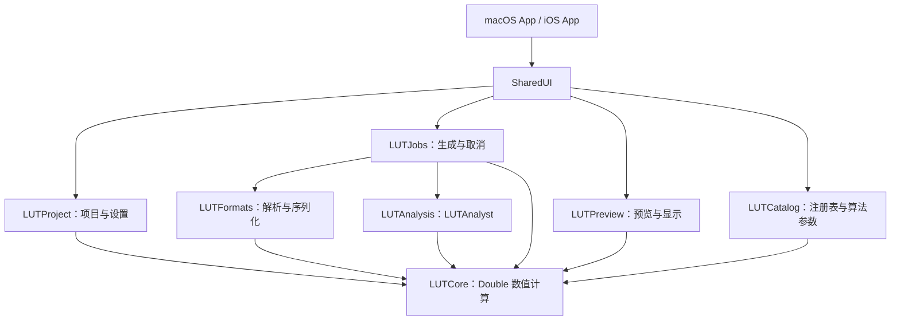

# LUTCalc 全 Swift 原生应用设计

日期：2026-09-23。状态：设计基线；尚未开始原生应用实现。

本文落实已确认的方向：使用 Swift 实现 macOS、iOS 原生应用，生成 LUT 的精度必须不低于现有版本，有独立证据时进一步提高准确度。配套文件：[精度与验收规范](native-swift-precision.md)、[实施任务清单](native-swift-roadmap.md)。

实现交接已细化：[交接入口与工作包](native-swift-handoff.md)、[数值内核契约](native-swift-numeric-contracts.md)、[运行与文件契约](native-swift-runtime-contracts.md)。具体实现按这些契约执行，不能由后续实现者重新猜测范围、矩阵方向、处理顺序或失败语义。

## 1. 已确定的目标与范围

1. 应用界面、计算、格式解析、任务调度和项目存储均使用 Swift 编写。原生应用不包含 WebView 界面、JavaScriptCore 计算引擎或自有 C/C++ 计算内核。
2. 通过 Swift 调用 SwiftUI、Foundation、ImageIO、Core Graphics、Core Image、Accelerate 等系统框架属于本方案；这些框架内部实现语言不属于项目的语言约束。
3. macOS 与 iOS/iPadOS 共用计算实现、注册表、文件格式实现和测试夹具。为桌面、手机、平板分别组织布局与交互。
4. 最终迁移范围覆盖现有有效功能；早期里程碑允许只开放已经通过验收的子集，不能把子集版本标记为完整迁移。
5. 数据处理和 LUT 生成离线完成。首版不引入账户、服务器、云端计算或付费系统。
6. 不通过降低计算精度、缩小导出 LUT 尺寸或改变插值方式来换取速度。设备内存不足时说明原因或调整任务并发，不静默降低质量。
7. 内置色彩变换全部采用 Swift 算法；禁止捆绑原始/加工后的 LUT，也禁止将采样节点内嵌为数组、贴图或其他等价载体。官方 LUT 只在研发验证目录使用。详见[纯算法约束](algorithm-only-audit.md)。
8. 色彩转换、厂商风格、显示映射各自保留明确语义。实现 Log 解码和 Rec.709 编码不等于复现厂商官方 Rec.709 风格或完整 ACES 输出流程。

本次交付包括设计、待办文档、注册表快照与首批官方研究资料。原生工程、完整数值对照工具和发布检查脚本仍需按任务清单实现。

## 2. 当前代码事实与迁移边界

根目录不存在 `codex.md`，遵循根目录 [AGENTS.md](../AGENTS.md)。当前网页无 npm 构建流程；三个手工镜像 bundle 与散装源文件并存。原生工程迁入独立目录，不继承这套镜像机制。

| 现有内容 | 代码位置 | 原生对应模块 |
| --- | --- | --- |
| 曲线及注册、编码解码、范围与曝光处理 | `js/gamma.js` | `LUTCore`、`LUTCatalog` |
| 色域、矩阵、白点适应、色彩调节 | `js/colourspace.js` | `LUTCore`、`LUTCatalog` |
| LUT 插值、反求、样条 | `js/lut.js`、`js/ring.js`、`js/brent.js`、`js/bounding.js` | `LUTCore` |
| 相机、ISO/EI、默认曲线色域 | `js/lutcamerabox.js` | `LUTCatalog`、共享设置界面 |
| 格式预设与文件读写 | `js/lutformats.js`、`js/lut-*.js`、`js/lutfile.js` | `LUTFormats`、应用文件服务 |
| 批量生成与 Worker 调度 | `js/lutgeneratebox.js`、`js/lutmessage.js`、Worker 文件 | `LUTJobs` |
| 调节控件 | `js/luttweaksbox.js`、`js/twk-*.js` | `LUTCore` 中的参数模型与共享控件 |
| 图像、取样、示波器、色度图 | `js/lutpreview.js`、`js/lutinfobox.js` | `LUTPreview`、共享分析界面 |
| LUTAnalyst | `js/lutanalyst.js`、`js/twk-la.js` 及上述数值辅助代码 | `LUTAnalysis` |
| 设置保存、移动版布局 | `js/lutmessage.js`、各面板 `getSettings/setSettings`、`js/lutmobile.js` | `LUTProject`、平台 App |
| 内置 `.labin` 与代码采样表 | 根目录资源、`js/gamma.js` | 改为有来源的算法；旧数据只保留作研发参照 |
| 预览 MSB/LSB 图像 | 根目录资源 | 核对位深与色彩语义后的普通图像资源 |

[2026-09-23 运行快照](../research/colour/2026-09-23/current-inventory.json)得到 114 个曲线注册、43 个矩阵色域、66 个相机预设，包含别名/重复项和 Generic；特殊变换另计。旧静态调查的 118/67 已更正。已确认 9 个内置 `.labin` 及 45 个直接查表曲线注册项，详见[依赖审计](algorithm-only-audit.md)；其余条目仍需完整纯算法审计。

现有 `Number`/`Float64Array` 已经使用双精度。`js/lutmessage.js` 默认文本精度为小数点后 8 位，`.cube` 写出使用 `toFixed`。`.labin` 当前读写实现使用有缩放比例的 `Int32` 保存部分数据，内存中再转为 Float64；不能仅依据旧 README 将其当作直接保存 Float64 的文件。

2026-09-23 在本地执行 `node --test tests/*.test.js`：9 项测试全部通过。它们主要覆盖 D-Log2/D-Gamut2、相关 RGB 管线和 bundle 同步；不代表全部曲线、格式和调节功能已有精度证明。

## 3. 工程结构与依赖

建议目录如下；标注的是计划结构，并非已创建工程。

```text
Native/
  LUTCalc.xcodeproj
  Apps/
    macOS/
    iOS/
  SharedUI/
  Packages/
    LUTKit/
      Package.swift
      Sources/
        LUTCore/
        LUTCatalog/
        LUTFormats/
        LUTAnalysis/
        LUTProject/
        LUTJobs/
        LUTPreview/
      Tests/
  Tests/
    macOSUITests/
    iOSUITests/
  Tools/
    ReferenceCLI/
tools/native-validation/
tests/native-reference/
```



- `LUTCore` 包含数学类型、曲线、色域转换、调节算子、插值及 LUT 数据结构；不依赖 SwiftUI、Core Image、文件对话框或应用全局状态。
- `LUTCatalog` 保存稳定标识符、曲线参数、色域原色/白点、相机、预设及算法来源。数据只维护一份；不复制出各平台专用列表。
- `LUTFormats` 处理格式语义和内存/流式数据，不自行弹窗，也不读取 UI 控件。
- `LUTAnalysis` 实现分析、反求及收敛诊断，依赖共享数值内核。
- `LUTProject` 负责当前原生项目 schema 校验、参数序列化和显式资源引用；未知 schema 直接拒绝，不读取旧 App 设置或推断旧资源角色；不保存计算服务实例。
- `LUTJobs` 管理不可变计算请求、并发、进度、取消和结果提交。持久化/访问授权由应用文件服务协作完成。
- `LUTPreview` 负责图像解码后的色彩流程、预览缓存、CPU 参考预览和系统框架加速预览。

最低部署版本暂定 macOS 14、iOS/iPadOS 17，以使用 Observation。该版本范围是工程默认建议，尚非用户另行确认的发行承诺。首个工程任务记录实际 Xcode、Swift、SDK 版本并固定开发与 CI 工具链，采用 Swift 6 语言模式与严格并发检查。Apple 的 [Observation 文档](https://developer.apple.com/documentation/swiftui/managing-model-data-in-your-app)列出了这些系统的支持起点。

首个必测 Mac 架构为 Apple Silicon。Intel Mac 是否进入发布支持矩阵在工程建立阶段决定；未验证的架构不能标记支持。

## 4. 数值模型与计算请求

建议使用以下概念类型，具体接口在工程实现时完善：

| 类型 | 职责 |
| --- | --- |
| `RGB64`、`Matrix3x3` | Double 通道及明确行列约定的矩阵 |
| `TransferFunctionID`、`ColorSpaceID`、`CameraID` | 不随列表排序改变的稳定标识符 |
| `SignalRange`、`LUTDomain` | 分开表达信号码值范围和 LUT 采样域 |
| `LinearReference` | 显式区分旧版内部线性、场景反射率和绝对亮度 |
| `TransformSettings` | 可序列化、可撤销的变换参数值 |
| `TransformPlan` | 按确定顺序编译、可诊断的不可变算子列表 |
| `LUTGenerationRequest` | 设置快照、尺寸、域、格式预设、数值策略、引擎版本 |
| `LUTData` | 样本及维度、域、通道布局、插值与来源元数据 |
| `GenerationReport` | 请求摘要、有效设置、警告、裁剪统计及输出信息 |

Swift `Double` 是 64 位浮点类型。[Apple Double 文档](https://developer.apple.com/documentation/swift/double)。所有参与最终 LUT 生成的参数、常量、缓冲区、矩阵、插值系数和中间值均保持 Double；布局尺寸可以使用 SwiftUI 自身的类型。

变换计划概念上包含输入范围解释、曲线解码、线性标度、曝光/色彩处理、输出编码、范围映射和格式约束。但现有调节跨越不同阶段，不能直接依据这个概念顺序重排。迁移时从 `inCalcRGB`、`colourspace.calc`、`outCalcRGB`、`oneDCalc` 提取每个算子的实际位置，并建立阶段输出对照。

旧引擎的内部中灰为 0.2，D-Log2 参考场景中灰为 0.18。第一版兼容计算明确保留相应标度和 0.9 转换，不将所有线性数据混称为场景线性；未来调整内部基准属于有版本的算法变更。

设置改变后建立新请求快照；一个正在导出的请求不受界面后续修改影响。导出成功时报告其实际设置，避免用户看到新设置却拿到旧任务结果。

## 5. 精度策略与可证明的改进

精度硬要求以[精度规范](native-swift-precision.md)为准，实施必须满足：

- 使用 CPU Double 作为导出与数值取样的权威实现；预览缓存不得反向用于生成导出 LUT。
- 先建立现有版本行为基线，再用独立公式/参考数据验证准确性。旧版结果是兼容性基准，不自动等同于物理或标准真值。
- 保留负值、超白、HDR 值和域外策略，只有用户选择或目标格式明确要求时才进行裁剪。
- 默认高保真文本导出采用可往返恢复 Double 的十进制表示；目标设备格式有约束时用经过验证的专用写出策略。
- 向量化、并行化、矩阵合并、数值稳定公式替换均需经过相同精度门槛；禁止未经验证的快速近似数学路径。
- 不能把更多小数位、更多 LUT 节点或更高阶插值单独宣传为准确度提升；必须用同一输入、语义和独立参考提供测量结果。

建议优先争取的改进是：减少文本序列化损失、降低接近零和分段边界的数值消减误差、使用有来源的完整精度常量，以及按用途评估采样密度。每项改善单独记录旧误差、新误差和适用范围。

## 6. 注册表、资源和功能覆盖

每个注册项保存：稳定 ID、显示名、别名、厂商/类别、可用方向、默认范围、默认匹配色域、参数版本、数学定义域、延拓/裁剪语义、参考资料和验证状态。相机额外记录 ISO/EI 行为与裁剪参数来源。

厂商资料推导参数与实测相机能力分开管理。不能从曲线数学上限推断传感器动态范围，也不能为缺乏证据的相机预设补造 ISO 或裁剪点。

内置变换的 `.labin` 与代码采样表必须被可追溯算法替代，不允许转换格式后继续打包。研究归档、旧基线和夹具不进入 App。预览照片另行核对位深与色彩语义，不能通过 8-bit 中间图或截图转换，也不能作为隐藏 LUT 载体。

每个条目增加 `implementationKind`、`referenceVersion`、`formulaStatus` 与 `validationStatus`。研究资料存在不等于公式可用；采样 LUT 拟合不自动视为精确算法。没有公开算法的厂商风格保留“待研究”状态，不能冒充等价支持、降低门槛或静默删除后宣称完整迁移。

本轮补充的[覆盖调查](colour-research-2026-09-23.md)按新增曲线/色域、厂商风格和设备预设分组。新增项目按独立任务验收；OPPO 白皮书与参考代码等已知冲突必须先解决。

完整版本必须覆盖：

- 当前有效的输入/输出曲线、色域及自定义原色/白点。
- 相机、Generic、ISO/EI 和曝光设置。
- 白平衡、ASC-CDL、PSST-CDL、Multitone、Highlight Gamut、Knee、Black Level / Highlight Level、Black Gamma、SDR Saturation、Display Colourspace Converter、Gamut Limiter、False Colour、RGB Sampler。
- 1D/3D LUT、单次生成和曝光组批量生成。
- LUTAnalyst 及 `.lacube` / `.labin` 持久化。
- 曲线、曝光表、波形、矢量示波器、RGB Parade 和色度图中实际存在的功能。
- 原生项目保存、导入图像与用户 LUT；旧 App 设置和旧项目 schema 不在输入范围内。

新增曲线或色域列为独立后续事项。已有覆盖清单中的缺口建议需要重新核验来源，不能作为已证实的标准资料直接写入新引擎。

## 7. 文件格式与项目文件

### 7.1 LUT 格式

格式采用能力描述模型，分别记录读、写、1D/3D、尺寸、位深、范围、域、插值元数据和设备约束。当前有三个 `.cube` 方言、三个 `.3dl` 方言，以及 `.vlt`、`.ilut`、`.olut`、`.lut`、`.spi1d`、`.spi3d`、`.ncp` 和 LUTAnalyst 格式。不能仅按扩展名合并行为；例如 `.ncp` 当前主要提供写出。

第一条端到端路径完成 `.cube` 的 1D/3D 读写及 17³/33³/65³；其余尺寸和格式按现有能力清单逐项补齐。129³ 等新尺寸可在目标软件和内存验证后加入，不属于现有功能迁移的替代项。

解析器对文件长度、维度乘法溢出、样本数、非有限值、缺失字段、截断和无效域返回明确错误。不得把损坏值自动替换成 0；不得先分配不受限制的大数组再验证输入。

### 7.2 原生项目

建议使用扩展名 `.lutcalc` 的项目包，内含版本化 JSON 清单和可选的用户导入 LUT/预览资源。内置曲线只保存稳定 ID 与算法参数。包清单保存：

- `schemaVersion`、`engineVersion`、注册表版本及算法配置版本。
- 完整变换设置、稳定 ID、格式预设和文本精度策略。
- 自定义曲线/色域、用户资源的内容哈希和导入语义。
- 项目可携带资源或需要重新定位的外部引用。

数值字段采用可往返的 Double 编码。项目保存不经过 UI 显示精度格式化。未来版本未知字段不得静默丢失后覆盖原文件；遇到不支持的项目版本提供明确错误或只读流程。

`DocumentGroup`/`FileDocument` 用于项目打开、保存与多文档场景；LUT 是导入/导出资源，通过系统文件界面处理。Apple 的 [DocumentGroup](https://developer.apple.com/documentation/swiftui/documentgroup)和[文件类型声明](https://developer.apple.com/documentation/uniformtypeidentifiers/defining-file-and-data-types-for-your-app)提供相应基础。自有项目类型声明为 exported，外部 LUT 类型按系统现有类型或 imported 类型处理。

外部资源用系统授权 URL 访问，访问期成对管理；跨设备项目不依赖本机 bookmark 可移植。导出使用受控暂存和原子提交，失败/取消时保留已有目标文件，只有完整结果才报告成功。

## 8. 界面与状态

### macOS

- 左侧切换输入/输出、调节、分析和导出；中央显示图像或图表；检查器展示相关参数。
- 支持独立项目窗口、键盘输入、快捷键、撤销/重做、拖放、批量导出位置和进度。
- 数值框允许直接输入精确值；滑块与显示格式不改变底层参数精度。

### iPhone 与 iPad

- iPhone 用导航页面组织输入/输出、调节、预览、导出，保留跨页面项目状态。
- iPad 利用分栏和检查器；紧凑尺寸自动转入逐页操作。
- 通过 Files 和系统分享导入/导出；处理切换后台、文件授权失效和内存警告。
- 精简的是同时可见的控件数量，完整版本的计算功能和精度与 Mac 一致。

### 状态与可访问性

项目设置使用值类型；窗口持有 `@MainActor @Observable` 编辑会话，局部展示状态放在 `@State`，可编辑子视图通过 `@Binding`/明确依赖注入连接。计算服务不在视图 `body` 中创建，也不依赖全局可变参数。

保留非法数值输入的编辑状态，只有解析成功且符合该参数定义域时才提交设置；不要在用户输入负号或小数点途中重算。实现 VoiceOver 标签、动态字体、键盘焦点和非颜色唯一的错误提示。UI 字符串集中管理，首版提供中文和英文资源。

## 9. 预览、取样与色彩管理

预览提供两条路径：

1. **参考路径**：Swift CPU Double 在指定源数据与变换上求值，用于数值取样、诊断和精度测试。显示时最后才进入屏幕渲染格式。
2. **交互路径**：通过 Swift 调用 Core Image 进行加速显示，使用独立缓存和质量设置；必须标记其对应的设置版本和插值策略。

Core Image 的 [CIColorCube](https://developer.apple.com/documentation/coreimage/cifilter-swift.class/colorcube())接受浮点 RGBA 色表，但它不能直接替代所有旧版插值、范围或扩展域语义。对于不等价的功能使用 CPU 参考路径，不能静默切换算法。若需要自定义 Metal 着色器，应作为后续语言范围变更另行提出，当前方案不依赖它。

每条路径显式记录源曲线/色域、LUT 前后的数值域、工作色彩空间、输出屏幕色彩空间、alpha 与预乘语义。禁止将 Log 数值误标成 sRGB 后自动线性化；显示匹配只在指定阶段发生。Core Image 会进行源/工作/目标色彩空间转换，因此必须控制其 [workingColorSpace](https://developer.apple.com/documentation/coreimage/cicontext/workingcolorspace) 和输出空间。

图像导入保留可用位深和嵌入色彩信息，分别验证 JPEG、8/16-bit PNG/TIFF 等实际计划支持的输入。RGB 取样明确显示采样阶段、坐标和单位；数值不得从最终 8-bit 屏幕截图反推。波形等分析应说明是变换前、变换后还是显示后数据。

PQ/HLG LUT 的数值生成可以在 SDR 设备上验证；HDR/EDR 屏幕预览需要独立设备测试。未通过 HDR 显示测试时，不能宣称已验证 HDR 显示准确性。

## 10. 并发、取消与性能

- `LUTGenerationRequest`、块结果及跨任务数据满足 `Sendable`，工作单元只读共享设置，独占输出片段。
- 明确把 CPU 循环调度到非 MainActor 的执行环境；仅添加 `async` 或在 UI 内创建 `Task` 不构成离开主线程的保证。
- 以切片/块并行生成，按固定坐标顺序合并，保持采样顺序与分块数量无关。统计归约也采用确定顺序。
- 滑块更新合并请求、取消旧任务，并用请求版本拒绝过期结果；导出任务由项目/任务服务持有，不依赖某个页面是否可见。
- 每个有限工作块检查取消；取消、出错和资源释放共用明确生命周期。iOS 后台任务可能被系统终止，不承诺无限时后台生成；重新进入时正确恢复设置和任务状态。
- 65³ RGB Double 样本约 6.3 MiB，129³ 约 49.1 MiB，这只是原始样本体积。峰值内存还包含块副本、文本、图像及缓存，必须测量。
- 流式写出避免拼接巨大字符串；缓存按字节预算管理，内存压力时先回收预览，不能改变导出尺寸。
- 先实现清晰的 Double 标量基准，再按性能剖析结果引入 double 版本 SIMD/Accelerate。Apple 文档指出部分 [快速 SIMD 数学变体](https://developer.apple.com/documentation/accelerate/double-precision-floating-point-vectors)会降低准确度，不能以类型是 Double 为由跳过验证。

速度、峰值内存、预览延迟和取消响应的硬指标，在实机基线建立后按设备、工作负载确定。发布前不得保留未定指标；精度门槛始终优先。

## 11. 发布定义与待定事项

完整原生版本的完成条件：覆盖清单中现有功能逐项完成；内置变换通过纯算法来源审计且安装包不含厂商 LUT 或等价采样表；所有适用精度门槛通过；Mac 和 iOS 构建、真机功能、文件往返、取消与失败路径、目标软件兼容验证完成；无未解释的数值偏差。

下面事项在相应阶段决策，不阻塞文档或参考数据建设：

| 事项 | 当前默认 | 最晚决定时点 |
| --- | --- | --- |
| 最低系统与 Mac 架构 | macOS 14 / iOS 17；Apple Silicon 必测 | 工程建立阶段 |
| 应用名称、Bundle ID、签名团队 | 开发配置使用可替换值，不占用发行标识 | 首次签名设备构建前 |
| 发行方式与许可 | 延续现有来源记录；发行许可另核验 | 对外分发前 |
| 129³、视频预览、相机实时输入 | 后续功能，不纳入现有能力迁移 | 完整迁移后单独评估 |
| iCloud 同步 | 首版使用可携带项目文件与系统文件访问 | 后续版本 |

仓库采用 GPLv2。直接移植原代码并分发时要评估相应许可及源码提供义务；替换编程语言不自动改变许可。发布渠道和内置资源的授权需按实际方案核验，参见[本仓库 LICENSE](../LICENSE)及 [GPLv2 原文](https://www.gnu.org/licenses/old-licenses/gpl-2.0.en.html)。

本文外部 API 资料核对日期为 2026-09-23；实现时以固定工具链中实际可用且满足最低系统要求的 API 为准。
