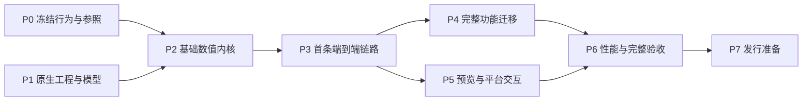

# 全 Swift 原生迁移实施任务清单

### 2026-10-06 RED Log 计划色域身份

- 已为 RED LogFilm 与 RED Log3G10 增加先红后绿的身份契约，计划版本同时绑定输入、输出色域。
- 定向 Release 8/8、整包 Release 通过，`git diff --check` 通过；公式与 legacy 冻结参照未改变。
- 该项只闭合计划身份，不代表 `.labin`、直接查表、tricubic 全根、完整 ICC/HDR/OOTF、平台或发布验收完成。

### 2026-10-06 HLG 计划色域身份

- 为 BT.2100 HLG 计划补充输入/输出色域身份，避免 HLG 与线性场景之间不同色域方向共享同一计划版本。
- 公式、HLG OETF/逆函数和已有 OOTF 参数路径未改变；定向 Release `HLGPlanIdentityContractsTests` 2/2、整包 `swift test --package-path Native/Packages/LUTKit -c release --quiet` 通过，`git diff --check` 通过。详情见[HLG 计划色域身份验收](native-validation/2026-10-06-hlg-plan-color-space-identity.md)。

### 2026-10-06 sRGB 计划色域身份

- W3C sRGB 与 LUTCalc legacy sRGB 的计划版本现包含输入/输出 transfer 方向和两端色域；修改前分别在两种身份上复现仅输入色域、仅输出色域变化仍发生身份冲突。
- 数值公式保持不变；定向 Release 4/4、整包 Release 测试套件全部通过，LUTAnalysis 93/93，`git diff --check` 通过。详情见[sRGB 计划色域身份验收](native-validation/2026-10-06-srgb-plan-color-space-identity.md)。

### 2026-10-06 Rec.2020 12-bit 计划色域身份

- Rec.2020 12-bit legacy 计划现在包含输入/输出 transfer 和两端色域；历史分段公式与量化规则未修改。
- 定向 Release 4/4、整包 Release 测试套件全部通过，LUTAnalysis 93/93，`git diff --check` 通过。详情见[Rec.2020 12-bit 计划色域身份验收](native-validation/2026-10-06-rec2020-12bit-plan-color-space-identity.md)。

### 2026-10-06 Nikon N-Log/Cineon 计划色域身份

- Nikon N-Log、N-Log legacy、Cineon 与 Cineon legacy 共享计划版本现在包含输入/输出 transfer 和两端色域；既有 90 位 Decimal、legacy JavaScript 冻结参照和线性缩放契约未修改。
- 定向 Release 4/4、整包 Release 测试套件全部通过，LUTAnalysis 93/93，`git diff --check` 通过。详情见[N-Log/Cineon 计划色域身份验收](native-validation/2026-10-06-camera-transfer-plan-color-space-identity.md)。

### 2026-10-06 Canon C-Log legacy 计划色域身份

- Canon C-Log legacy 计划版本现在包含输入/输出 transfer 和两端色域；legacy 公式、目录和 JavaScript 冻结参照未修改。
- 定向 Release 4/4、整包 Release 测试套件全部通过，LUTAnalysis 93/93，`git diff --check` 通过。详情见[Canon C-Log legacy 计划色域身份验收](native-validation/2026-10-06-canon-clog-plan-color-space-identity.md)。

### 2026-10-06 Blackmagic legacy Film 计划色域身份

- Blackmagic Pocket Film、Film、Film4k、Film4.6k legacy 计划现在包含输入/输出 transfer 和两端色域；既有冻结公式、边界和量化分类未修改。
- 定向 Release 9/9、整包 Release 测试套件全部通过，LUTAnalysis 93/93，`git diff --check` 通过。详情见[Blackmagic legacy Film 计划色域身份验收](native-validation/2026-10-06-bmd-legacy-plan-color-space-identity.md)。

### 2026-10-06 Blackmagic Gen5 与 Canon C-Log2/C-Log3 计划色域身份

- Gen5、Canon C-Log2、Canon C-Log3 计划版本现包含输入/输出 transfer、两端色域及既有固定 gamut 身份；公开曲线和矩阵未修改。
- 定向 Release 共 17/17、整包 Release 测试套件全部通过，LUTAnalysis 93/93，`git diff --check` 通过。BMD Gen5 曲线最大尺度化误差 `1.4077780908170443e-14`，矩阵最大误差 `9.910082886630748e-16`。详情见[Gen5/C-Log 计划色域身份验收](native-validation/2026-10-06-bmd-canon-plan-color-space-identity.md)。

### 2026-10-06 DaVinci Intermediate 与 DJI X3 DLog legacy 计划色域身份

- 两个已有 legacy 连续公式分支的计划版本现在包含输入/输出 transfer 和两端色域；公式和 JavaScript 冻结参照未修改。
- 定向 Release 8/8、整包 Release 测试套件全部通过，LUTAnalysis 93/93，`git diff --check` 通过。详情见[DaVinci/DJI X3 计划色域身份验收](native-validation/2026-10-06-davinci-dji-plan-color-space-identity.md)。

### 2026-10-06 Legacy Registered Log 计划色域身份

- Bolex Log、Panalog、DJI X5/X7/X9 DLog、GoPro Protune 四个 legacy 连续公式计划现在包含输入/输出 transfer 和两端色域；冻结公式和目录身份未修改。
- 定向 Release 4/4、整包 Release 测试套件全部通过，LUTAnalysis 93/93，`git diff --check` 通过。详情见[Legacy Registered Log 计划色域身份验收](native-validation/2026-10-06-legacy-registered-log-plan-color-space-identity.md)。

### 2026-10-06 Fujifilm F-Log legacy 计划色域身份

- Fujifilm F-Log legacy 计划现在包含输入/输出 transfer 和两端色域；F-Log legacy 公式、冻结 JavaScript 参照和相机路由未修改。
- 定向、整包 Release 与差异检查结果见[F-Log legacy 计划色域身份验收](native-validation/2026-10-06-flog-legacy-plan-color-space-identity.md)。

### 2026-10-06 `.labin` 与直接查表替代边界复核

- 复核 9 个 `.labin` 与 45 个直接查表注册；没有同时具备公开连续公式、适用版本/机型、非灰轴语义和独立参照的可安全闭合项。
- 定向 `RegistryContractsTests/testBlockedLookupRegistrationsHaveNoNativeCatalogIdentity` 1/1 通过；`.labin` 仍 `0/9`，直接查表仍 `0/45`。
- 旧资源 SHA-256 与最小复现见[`.labin` 与直接查表替代边界复核](native-validation/2026-10-06-labin-direct-lookup-boundary-followup.md)。本项保持研究阻塞，不新增等价采样数据。

### 2026-10-06 `.labin` 研发夹具逐项 Release 复核

- 根目录九个旧 `.labin` 均以 `LUTCALC_LABIN_SAMPLE` 逐项运行现有 Swift `LABinParser` 兼容契约，Release 每项通过；汇总日志 `/tmp/labin-fixtures-release-20261006.log`，SHA-256 为 `e1df906341d0813a6f5966ac138c88657d397f2b363027157c466c7cffb705c4`。
- 该证据只证明 little-endian Int32 解码、旧缩放、元数据读取及有损哨兵拒绝；没有获得任何资源的公开连续定义、版本化设备范围、非灰轴语义和独立全域参照。
- 因此 `.labin` 算法替代仍为 `0/9`，不新增目录身份、不改变默认路由、不携带资源；详见[`.labin` 研发夹具逐项复核](native-validation/2026-10-06-labin-fixture-reaudit.md)。

### 2026-10-06 `.labin` 算法缺口复核

- 九个旧 `.labin` 研发夹具再次逐项通过同一 Swift Release 解析契约；本轮日志 `/tmp/labin-gap-recheck-20261006.log`，SHA-256 为 `f8a74d2e2b94cc274d45e8f2ec4d2df887c15e1fe3fa0f2441c0737ddaa8e864`。
- 复核旧 JavaScript 调用关系和现有资料后，仍未取得任何条目同时具备公开连续公式、版本化设备范围、非灰轴语义与独立全域参照；`.labin` 算法替代保持 `0/9`。
- 本轮不新增 Swift 算法、目录身份、默认路由或等价采样数据。详见[`.labin` 算法替代缺口复核](native-validation/2026-10-06-labin-algorithm-gap-recheck.md)。

## 2026-10-06 Mi-Log、Leica L-Log、KineLOG3 计划身份

- 三个固定版本 transfer 分支的 `planVersion` 加入输入/输出 `TransferID` 与输入/输出 `ColorSpaceID`，避免编码/解码方向及两端色域被误认为同一计划。
- 三份现有 transfer 契约测试先覆盖反方向、仅改变输入色域、仅改变输出色域。修改前 Release 测试复现 9 个身份断言失败；生产改动后的定向 Release 测试为 5/5，通过；整包 Release 退出码 0，LUTAnalysis 93/93，通过；`git diff --check` 退出码 0。数值公式和执行路径未改。
- 身份边界仅针对这三个 transfer 分支；它不是所有 `TransformSettings` 数值参数的完整缓存键/内容指纹，也不代表其余 `planVersion` 分支已审计。详情见[Mi-Log、Leica L-Log、KineLOG3 计划身份验收](native-validation/2026-10-06-camera-log-plan-identity.md)。

## 2026-10-06 Rec.709/Rec.2020 10-bit/PQ 计划身份

- 修复三个 `basePlanVersion` 分支未区分输入/输出方向和两端色域的问题；身份现包含输入/输出 `TransferID` 与 `ColorSpaceID`，计算公式、矩阵、Double 路径和阈值不变。
- 失败契约先行，Release 定向 `Rec709Rec2020PQPlanIdentityContractsTests` 3 项通过。验收见[计划身份验收](native-validation/2026-10-06-plan-identity-rec709-rec2020-pq.md)。
- 受影响的 Rec.2020 10-bit／12-bit 契约组合共 9 项通过；完整 `swift test --package-path Native/Packages/LUTKit -c release` 退出码 `0`，`git diff --check` 通过。
- 该项只关闭三个计划身份的缓存/预览别名，不代表全局计划身份审计、完整 HDR/ICC、格式、设备或 Goal 完成。

## 2026-10-06 ICC MPE `samf` 末段采样曲线修复

- 修正 `ICCMPETransform` 对合法末段 `samf` 的错误拒绝：首段仍拒绝，末段以
  前一段末值为隐含起点并延伸到归一化域终点 `1.0`；中间段保持下一个
  breakpoint 上界和 Double 线性插值。
- 契约先行覆盖末段端点和中点结果，并覆盖多样本末段端点及区间插值；Release
  `ICCMPEContractsTests` 30 项通过。
  详情见[ICC MPE `samf` 末段采样曲线修复验收](native-validation/2026-10-06-icc-mpe-samf-final.md)。
- 本项只修复公开 ICC.1 采样段边界，不代表完整 ICC、真实第三方 profile 逐码
  参照、BPC、gamut mapping、ColorSync 或 Goal 完成；Goal 继续 `active`。

## 2026-10-06 BT.601 transfer 阻塞复验

- 在现有研究记录基础上重新执行 `swift test --package-path Native/Packages/LUTKit -c release --filter BT601TransferAuditContractsTests`；Apple SwiftPM Release 工具链构建成功，`BT601TransferAuditContractsTests` 执行 2 项、0 失败，退出码 `0`。结果覆盖目录不注册 BT.601 525/625 别名、Rec.709 候选 Decimal 锚点和通用 8-bit 视频范围边界。
- 复验没有新增生产 transfer：BT.601 525/625 的 OETF、量化范围、矩阵和项目 legacy 包装仍缺少同一标准版本的联合来源与独立逐码参照，不能把 Rec.709 候选式当作身份闭合。BT.601 transfer 继续研究阻塞，Goal 保持 `active`。

## 2026-10-06 BT.601 transfer 复审证据

- 重新运行 `swift test --package-path Native/Packages/LUTKit -c release --filter BT601TransferAuditContractsTests`，2 项通过、0 失败；日志 SHA-256：`116eb09722042ee35e151953fded7d5a42644b76b6385fbaa95de0c30157e3c1`。
- 本轮仍不新增 BT.601 525／625 transfer：现有公开资料只闭合 SMPTE-C 与 EBU 原色矩阵，尚未把 OETF、代码范围、采样矩阵和 LUTCalc legacy 包装在同一版本来源及独立逐码参照中闭合。详见[BT.601 传递函数复审](native-validation/2026-10-06-bt601-transfer-reaudit.md)。
- 本轮未覆盖 PQ OOTF、厂商查表替代、`.labin`、完整 ICC 或任意三维 LUT 全局反求；没有扩大算法范围。

## 2026-10-06 LUTAnalyst 三线性严格仿射单元完备性

- `Trilinear3DInverseReport` 新增空间单元枚举数、候选单元数和 `isGloballyComplete`。对混合项严格为零的单元使用矩阵反解，完整区分唯一解、单元外无解和奇异未决；含混合项的单元仍保守返回 `unresolved`。
- 先行契约修正“全局无候选时仍需枚举全部空间单元”的计数边界；Release `TrilinearInverseContractsTests` 14 项通过。详情见[LUTAnalyst 三线性严格仿射单元完备性验收](native-validation/2026-10-06-lutanalyst-trilinear-affine-completeness.md)。
- 该项只关闭严格仿射单元子集，不代表三线性含混合项、tricubic 或任意 3D LUT 全局全根证明、自动 transfer/colour 分离和完整重建；Goal 继续 `active`。
- 完备性收紧：含混合项单元即使有有限 Newton 根也强制保持 `unresolved`；仅分段仿射单元允许报告可证明的 `multiple` 或 `unique`。

## 2026-10-06 LUTAnalyst tricubic 全局完备性研究阻塞

- 以三次张量积最小模型复核：单通道三次多项式可在同一单元产生多个根，有限 Newton 初值和迭代上限只能证明已回放根，不能证明没有遗漏根；Jacobian 奇异、共享面和 ghost-node 边界还需要区间根隔离与去重证明。
- 当前 `Tricubic3DInverse` 保持生产 sampler、解析 Jacobian、Bernstein 输出包围盒和 `unresolved` 保守状态；未新增猜测性全局求解器。详情见[tricubic 全局完备性研究阻塞](native-validation/2026-10-06-lutanalyst-tricubic-global-research-block.md)。Goal 继续 `active`。
- 完备性收紧：`Tricubic3DInverseReport` 新增 `isGloballyComplete`；任何候选 tricubic 单元即使已回放根也保持 `unresolved`，仅无候选单元允许报告全局完备。Release `TricubicInverseContractsTests` 12 项通过。
- 组合 shaper 诊断同步传播该状态：identity/folded tricubic 的已回放根仍保留，但组合报告不再把它们标记为 `unique`/`multiple` 全局结论；`CombinedShaperColourInverseContractsTests` 已按该契约复验。
- `CombinedShaperColourInverseReport` 新增 `isGloballyComplete`，仅在颜色单元和 shaper 通道都无未决项时为真；Release 组合 shaper 契约通过。
- 组合 shaper 完备性低并行原生数值门禁退出码 `0`，66 项检查通过；记录见[组合 shaper 完备性门禁验收](native-validation/2026-10-06-combined-shaper-completeness-gate.md)。

## 2026-10-06 LUTAnalyst tricubic 严格仿射子集边界

- 复核旧 `LegacyTricubicVolume3D` 是否存在可安全认证的 cell 级严格仿射子集。现有生产 sampler 只暴露取样、解析 Jacobian 和 Bernstein 输出包围盒，没有完整 cell 多项式高阶系数证书；ghost-node 分段规则也必须纳入证明。有限 Newton 根、单点 Jacobian 或近似零系数均不能推出 cell 内高阶项严格为零。
- 未新增近似仿射判定或生产 API。Release `TricubicInverseContractsTests` 执行 12 项、0 失败；结果与未覆盖范围见[tricubic 严格仿射子集边界](native-validation/2026-10-06-lutanalyst-tricubic-affine-subset-boundary.md)。
- 只有补充独立 cell 多项式系数提取、ghost-node 边界覆盖、逐项精确零证明、矩阵反解和生产回放契约后，才可讨论关闭该子集；当前 tricubic 全局完备性、任意 3D LUT 全根证明以及 Goal 继续 `active`。

## 2026-10-06 LUTAnalyst 四面体分区全根枚举边界

- 现有 `tetrahedral` 3D LUT 反求报告新增完整分区枚举计数、输出包围盒候选计数和 `isGloballyComplete`。在有限的 `(size - 1)^3 * 6` 片段仿射模型内，只有全部候选完成矩阵反解、生产采样器回放和 `2e-12` 残差认证时，才报告全根枚举完成；奇异候选保持 `unresolved`。
- 先行契约覆盖 4^3 恒等网格 162 个四面体、折叠双根、域外无解、单纯形外无解和奇异映射；Release 定向 12 项通过。详情见[LUTAnalyst 四面体分区全根枚举边界验收](native-validation/2026-10-06-lutanalyst-tetrahedral-global-completeness.md)。
- 该项只闭合有限四面体分区的枚举证据，不代表三线性／tricubic 任意 3D 全局反求、自动 transfer/colour 分离、完整重建、`.labin`、直接查表或 Goal 完成；Goal 继续 `active`。

## 2026-10-06 ICC intent 剩余边界复核

- 复核当前 `ICCLUTProfileLink`、`ICCRGBProfileLink` 与 `ICCMatrixTRCProfileLink` 的四种 rendering intent 路由：定向 Release `LUTPreviewTests` 实际执行 74 项、0 失败，覆盖 `A2B0`...`A2B3`、`B2A0`...`B2A3`、传统 Lab/XYZ、MPE 与系统 sRGB/Display P3 夹具。
- 没有安全的生产代码扩展：perceptual/saturation 的 profile-specific 色域压缩、BPC 与 gamut mapping，以及第三方 profile 逐码 CMM 参照仍缺公开唯一公式和独立结果；不添加猜测性 fallback、通用 BPC 或 ColorSync 等价实现。详情见 [ICC intent 剩余边界复核](native-validation/2026-10-06-icc-intent-boundary-next.md)。完整 ICC、H13、FULL-03 和 Goal 继续 `active`。

## 2026-10-06 ICC profile class 路由边界

- `ICCRGBProfileLink` 现在仅接受 input/display/output device class；device-link 继续由独立 `ICCDeviceLinkTransform` 处理，abstract、namedColor、colorSpace profile 在路由选择前返回 `.unsupportedProfileKind`。
- 新增 `ICCRGBProfileLinkContractsTests.testNonDeviceProfileClassesAreRejectedBeforeRouteSelection`；Release 定向 39 项通过。详情见[ICC profile class 路由边界验收](native-validation/2026-10-06-icc-profile-class-route-boundary.md)。
- 该项只闭合 profile class 防误接边界，不关闭完整 ICC profile class/intent、BPC、gamut mapping、ColorSync、第三方逐码参照、HDR/EDR 或 Goal；Goal 继续 `active`。

## 2026-10-06 PQ OOTF 标准路径隔离契约

- 新增 `RegistryContractsTests.testRec2100PQReferenceRemainsSeparateFromLegacyOOTF`，Release 定向执行 1 项、0 失败。契约确认标准 `rec2100.pq-reference.v1` 继续使用 ST 2084 绝对 PQ 路径，历史 `LegacyPQOOTF` 没有目录身份或计划隐式接线。
- 该项只关闭标准 PQ 与历史兼容 OOTF 的身份隔离边界，不关闭完整 PQ OOTF、自动峰值、HDR/EDR、真实显示参照或 Goal。旧公式的 `Lw`／`scale`／输入单位／knee 冲突和不连续性继续按研究阻塞处理。详见[PQ OOTF 标准路径隔离契约验收](native-validation/2026-10-06-pq-ootf-isolation-contract.md)。

## 2026-10-06 GoPro GP-Log2 base-600 标量子集

- 按归档参考代码的 `LOGBASE=600`、`invLog` 和 `logEnc` 公式新增 `GPLog2Transfer`，定义域严格限制 `[0,1]`，负值扩展和设备语义明确拒绝。
- 新增独立 Decimal 锚点、`TransferPlan`／目录／输出编码接线；`GPLog2TransferContractsTests` Debug／Release 各 3 项通过。详情见[GP-Log2 base-600 验收](native-validation/2026-10-06-gplog2-base600.md)。
- 该项不接 Rec.2020 矩阵、曝光风格、相机预设或旧 Protune 身份，不关闭完整 GP-Log2、查表台账或 Goal；Goal 继续 `active`。
- 追加独立 `Decimal(80)` 参照脚本 `tools/native-validation/probe-gplog2.py`：`0.18` 编码为 `0.7331165721407825605965489544`，`0.5` 编码为 `0.8919040948532175844901100017`，反向精确回到输入；Python 编译检查通过。该证据强化数值参照，不扩大 GP-Log2 语义范围。

## 2026-10-06 BT.601 525／625 传递函数研究阻塞

- 审计确认现有 Rec.709 候选分段式与 BT.601 常见 OETF 形状相同，但 `rec709LUTCalcLegacy` 具有独立历史包装；通用 `CodeRange` 不能表达 BT.601 525／625 的完整制式、矩阵与范围语义。
- 新增独立 80 位 Decimal 探针和 `BT601TransferAuditContractsTests`，在没有完整联合来源时保持目录不注册 BT.601 transfer 别名。待定向 Debug／Release 测试通过后，详情见[BT.601 传递函数研究阻塞记录](native-validation/2026-10-06-bt601-transfer-research-block.md)。
- 在同一标准版本的 OETF、量化范围、矩阵及项目 legacy 包装联合来源闭合前，BT.601 525／625 transfer 保持研究阻塞；不影响已完成的 BT.601 两套色域矩阵子集，Goal 继续 `active`。

## 2026-10-06 ICC MPE/device-link 公开边界审计（本轮）

- 复审 `cvst`、`samf`、`matf`、`clut`、ACS 元素链、共享 offset 及 device-link `A2B0` `mpet` 路由；现有公开边界保持通过，Release `ICCMPEContractsTests` 29 项通过，`git diff --check` 通过。
- `samf` 隐含起点与末段终点、动态矩阵通道变化、CLUT 维度顺序、元素范围校验和真实 LittleCMS device-link 参照均已有记录。本轮未发现同时具备公开规范、失败契约和独立逐码参照的安全新增项。
- 完整 ICC MPE 元素集合、全部 profile class/intent、BPC、gamut mapping、ColorSync 及全局 3D 反求继续保持研究阻塞；不作猜测性扩展。详情见[ICC MPE 与 device-link 公开边界审计](native-validation/2026-10-06-icc-mpe-public-boundary-audit.md)。Goal 继续 `active`。

## 2026-10-06 LittleCMS device-link 真实参照复核

- 使用系统 LittleCMS 2.19 `linkicc` 生成真实 RGB/RGB device-link profile，并由 Swift `ICCDeviceLinkTransform` 解析其合法 `A2B0` MPE 路由；Release `ICCDeviceLinkContractsTests` 7 项通过，日志 SHA-256 为 `3592d1a445d235532b76dfe8246dd4e270b1d26c7f89153df2b2c937b9bedc39`。
- 本项只增加一个外部真实 profile 的结构与路由证据，没有扩大兼容范围；完整 ICC、BPC、gamut mapping、ColorSync、`.labin`、直接查表和 LUTAnalyst 全局反求仍未完成。详情见[LittleCMS device-link 真实参照验收](native-validation/2026-10-06-icc-device-link-lcms.md)。Goal 继续 `active`。

## 2026-10-06 ICC MPE 资源与元素范围审计

- 复审 `mpet` 元素表的数量、offset/size、共享与交叠范围，`curf`/`samf`
  采样曲线，`matf` 动态矩阵，`clut` 网格和资源算术；现有公开边界保持
  通过，未发现可安全新增的生产修复。
- Debug `ICCMPEContractsTests` 28 项、Release `ICCMPEContractsTests` 28 项、
  Release `ICCDeviceLinkContractsTests` 7 项及 `git diff --check` 均通过。
- 动态矩阵厂商扩展、MPE 末端额外填充语义和完整真实 profile 逐码参照缺少
  足够公开证据，记录为研究阻塞，未猜测实现。详情见[ICC MPE 资源与元素范围审计](native-validation/2026-10-06-icc-mpe-resource-boundary-audit.md)。Goal 继续 `active`。

## 2026-10-06 ICC MPE 与 device-link 边界复审

- 复审 `ICCMPETransform` 的元素通道数、CLUT/曲线/矩阵组合和末段 `samf`；现有公开边界与 Release 定向契约保持通过，共 34 项（含 `ICCDeviceLinkContractsTests`），`git diff --check` 通过。
- 真实 Little CMS device-link 夹具的 `colorSpace=RGB `、输出字段 `RGB ` 证明 device-link 颜色空间语义不能套用普通 profile 的 PCS `XYZ `/`Lab ` 限制；未增加错误拒绝。MPE tag 末端额外字节的填充语义缺少独立参照，保留研究阻塞。详情见[ICC MPE 与 device-link 边界复审](native-validation/2026-10-06-icc-mpe-device-link-followup.md)。Goal 继续 `active`。

## 2026-10-06 ICC MPE 末段采样曲线

- `ICCMPETransform` 依据 `curf` 采样段的隐含首样本规则，仅拒绝首段 `samf`；末段 `samf` 允许使用前一段末值作为隐含起点，并将归一化域终点 `1.0` 作为分段上界。先行失败契约已复现旧实现误拒绝末段，修复后 Debug／Release `ICCMPEContractsTests` 各 28 项通过，`git diff --check` 通过。
- 详情见[ICC MPE 末段采样曲线验收](native-validation/2026-10-06-icc-mpet-final-sampled.md)。本项只关闭 MPE `samf` 末段边界，不代表完整 ICC、真实 profile 逐码参照、BPC、gamut mapping、ColorSync 或 Goal 完成；Goal 继续 `active`。

## 2026-10-06 ICC MPE 处理元素零通道边界

- `ICCMPETransform` 解析 `mpet` 元素时拒绝零输入或零输出通道，避免空向量元素绕过通道链约束；先行失败契约覆盖 `matf` 零输入和零输出，修复后 Debug／Release `ICCMPEContractsTests` 各 28 项通过，`git diff --check` 通过。
- 详情见[ICC MPE 通道数边界验收](native-validation/2026-10-06-icc-mpet-channel-count.md)。本项只关闭结构边界，不代表完整 ICC、真实 profile 逐码参照、BPC、gamut mapping、ColorSync 或 Goal 完成；Goal 继续 `active`。

## 2026-10-06 ICC BPC 与 gamut mapping 公开子集审计

- 审计 `ICCMatrixTRCProfileLink`、`ICCLUTProfileLink` 与 `ICCDeviceLinkTransform` 的黑点补偿和色域映射边界；本轮没有生产代码改动。
- Matrix/TRC 只实现 relative/absolute colorimetric 并显式拒绝 perceptual/saturation；LUT linking 只执行 profile 已提供的 A2B/B2A 变换；device-link 不插入额外 BPC 或 gamut mapping。
- Debug/Release `ICCLUTProfileLinkContractsTests` 10 项、`ICCMatrixTRCContractsTests` 25 项通过，`git diff --check` 通过。没有发现可由公开公式和独立逐码参照安全实现的 BPC 或通用 gamut mapping 子集。详见[ICC BPC 与 gamut mapping 公开子集审计](native-validation/2026-10-06-icc-bpc-gamut-mapping-audit.md)。
- 缺少唯一公开 BPC 算法和脱离具体 A2B/B2A 的通用 gamut mapping 算法，继续标记研究阻塞；完整 ICC、ColorSync 与 Goal 保持 `active`。

## 2026-10-06 直接查表算法替代研究阻塞复核

- 逐项复核 45 个直接查表注册（DJI DLog-M、`LUTGammaIOLUT`、`LUTGammaLUTSL3`、`LUTGammaLUTSimple`）后，仍没有同时满足公开连续定义、适用范围、非灰轴语义和独立参照的项目；不能从通用 S-Log3、SimpleLog、SMPTE 240M 或已实现的 DJI D-Log2 推断厂商显示变换。
- `RegistryContractsTests/testBlockedLookupRegistrationsHaveNoNativeCatalogIdentity` 的 Release 定向测试执行 1 项、0 失败；不修改生产算法、不新增目录身份，直接查表替代保持 `0/45`。详见[直接查表算法替代研究阻塞复核](native-validation/2026-10-06-direct-lookup-algorithm-research-block.md)。
- 只有取得公开连续定义、版本化适用范围、非灰轴语义和独立 17³／33³／65³ 参照后，才进入失败契约、Swift `Double` 实现和台账更新；Goal 保持 `active`。

# 2026-10-06 ICC BPC 非唯一性最小复现

- 固定 source/target 黑点、白点和输入值，使用一族同样满足黑白端点的幂函数压缩模型，实际得到三个不同的中间结果；复现命令和输出见[ICC BPC 非唯一性最小复现](native-validation/2026-10-06-icc-bpc-nonunique-minimal-repro.md)。
- 该证据确认仅凭 `bkpt`/`wtpt` 不能选择唯一 BPC 中间曲线；没有新增生产代码、BPC 开关或通用 gamut mapping。完整 ICC、ColorSync 与 Goal 继续保持 `active`。

# 2026-10-06 ICC Display P3 para type 3 真实 profile

- 修正 ICC parametricCurveType function 3 的参数数量和分段语义：按规范使用五参数 `g、a、b、c、d`，低段为零；原实现错误使用六参数并拒绝合法 Display P3 profile。
- 新增 macOS `/System/Library/ColorSync/Profiles/Display P3.icc` 的 Matrix/TRC 解析、真实 profile 往返和同 profile linking 契约。Release 定向 `ICCMatrixTRCContractsTests|ICCRGBProfileLinkContractsTests` 共 58 项、0 失败。
- 该项只关闭真实 Display P3 matrix/TRC 与 `para` type 3 子集，不关闭真实第三方逐码参照、其他 ICC profile class/intent、BPC、gamut mapping、ColorSync、MPE 扩展或 Goal。详见[ICC Display P3 与 para type 3 验收](native-validation/2026-10-06-icc-display-p3-para3.md)。

# 2026-10-06 ICC 系统 RGB profile 复验

- 在同一修复基础上复验 macOS sRGB、Display P3、AdobeRGB1998 和 ITU-2020 四个系统 RGB profile；Matrix/TRC Release 契约 24 项通过。
- 该项只增加真实系统 profile 的解析和往返证据，不关闭完整 ICC、全部 rendering intent、BPC、gamut mapping、ColorSync、第三方逐码参照或 Goal。详见[ICC 系统 RGB profile 复验](native-validation/2026-10-06-icc-system-rgb-profiles.md)。

# 2026-10-06 ICC 系统 profile 跨 profile 白点边界

- 新增 Display P3 到 sRGB 的真实 relative-colorimetric linking 契约；因 PCS media white point 不一致，路径明确拒绝并返回 `mismatchedPCSWhitePoint`，不猜测适应矩阵。Release `ICCRGBProfileLinkContractsTests` 37 项通过。
- 该项只验证真实 profile 的拒绝边界，不关闭 absolute-colorimetric 真实跨白点逐码参照、ColorSync、BPC、gamut mapping 或完整 ICC。详见[ICC 系统 profile 跨 profile 白点边界](native-validation/2026-10-06-icc-system-cross-profile-boundary.md)。

# 2026-10-06 ICC 系统 profile absolute linking

- 新增 Display P3 与 sRGB 系统 profile 的 absolute-colorimetric matrix/TRC 契约；不同 media white point 按现有比例路径执行，输出有限。Release `ICCRGBProfileLinkContractsTests` 38 项通过。
- 该项只关闭真实系统 profile 的 absolute 路由有限性边界，不关闭 ColorSync/第三方逐码参照、BPC、gamut mapping 或完整 ICC。详见[ICC 系统 profile absolute linking](native-validation/2026-10-06-icc-system-absolute-link.md)。

# 2026-10-06 ICC 真实显示器 profile 结构验收

- 新增 macOS 实际显示器 profile 的结构契约，覆盖非零 profile ID 的 MD5 校验、RGB/XYZ 头部和 tag 目录；Release Preview 定向合计 45 项通过。
- 该项只增加真实 profile 结构证据，不关闭 ColorSync 逐码转换、BPC、gamut mapping、第三方 profile 参照或完整 ICC。详见[ICC 真实显示器 profile 结构验收](native-validation/2026-10-06-icc-real-display-profile.md)。

# 2026-10-06 ICC para type 3 Release 回归

- `para` type 3 修复后的完整 LUTKit SwiftPM Release 回归退出码 0；先行 `PreviewContractsTests` 44 项和 ICC 定向测试均通过。
- 该回归只证明当前 Swift 包没有回归，不关闭完整 ICC、HDR/OOTF、查表替代或平台发布验收。详见[ICC para type 3 Release 回归](native-validation/2026-10-06-icc-para3-release-regression.md)。

# 2026-10-06 原生数值门禁低并行复验

- 默认并行度运行时 Swift 子进程曾被系统以 `SIGKILL (137)` 终止，未将其误报为契约失败；降低为 2 个 CPU、2 个 Swift job、单测试/验证/批次 worker 后重跑退出码 0。
- 低并行结果覆盖 66 项原生数值检查，确认当前子集通过；该证据不关闭双端 App、完整 ICC/HDR、真机和发布清单。详见[原生数值门禁低并行复验](native-validation/2026-10-06-native-numerics-low-parallel-rerun.md)。

## 2026-10-06 ICC MPE/device-link 剩余公开边界复核

- 复核 `mpet` 元素表、`cvst`、`samf`、`matf`、`clut`、ACS、共享资源范围、通道链、有限 Float32 值及 device-link `A2B0` `mpet` 路由；本轮没有生产代码改动。
- 定向 Debug／Release `ICCMPEContractsTests` 各 29 项、`ICCDeviceLinkContractsTests` 各 7 项通过，`git diff --check` 通过；日志和 SHA 位于 `native-validation/artifacts/2026-10-06-icc-mpe-next10/`。
- 完整 MPE 元素集合、厂商扩展、全部 profile class/intent、BPC、gamut mapping、ColorSync、MPE 末端填充兼容语义、动态矩阵扩展和真实第三方 profile 逐码参照仍缺少充分公开证据，继续标记研究阻塞；Goal 保持 `active`。详见[ICC MPE/device-link 剩余公开边界复核](native-validation/2026-10-06-icc-mpe-next10.md)。

## 2026-10-06 ICC device-link `mpet` 路由

- `ICCDeviceLinkTransform` 现支持 `A2B0` 的 `mpet` 处理元素，并复用 `ICCMPETransform` 的 `matf`、`clut`、曲线和 ACS 执行链；device-link 输出通道数按 profile 声明校验。先行失败契约复现旧实现的 `unsupportedTagType("mpet")`，修复后 Debug 单项与 Release ICCDeviceLink/ICCMPE 组合共 35 项通过。
- 本项只关闭 device-link `mpet` 路由子集，不关闭真实第三方逐码参照、完整 ICC、BPC、gamut mapping、ColorSync、mBA 反向执行或 Goal。详见[ICC MPE device-link `mpet` 验收](native-validation/2026-10-06-icc-mpet-device-link.md)。

## 2026-10-06 ICC MPE CLUT 维度顺序

- `ICCMPETransform` 按 ICC.1:2022-05 §10.16.2.4 修正 `clut` 展平索引：第一输入维度最慢、最后输入维度最快；此前实现方向相反，但全 2 网格夹具无法暴露该问题。
- 新增非均匀 `[2,3,2]` 网格失败契约，修复后 Debug／Release 定向测试均通过，`git diff --check` 通过。详情见[ICC MPE CLUT 维度顺序验收](native-validation/2026-10-06-icc-mpet-clut-order.md)。
- 本项只关闭 MPE CLUT 存储顺序边界，不代表完整 ICC、真实 profile 逐码参照、BPC、gamut mapping、ColorSync 或 Goal 完成；Goal 继续 `active`。

## 2026-10-06 ICC mAB/mBA section offset 顺序研究阻塞

- 审计 `mAB `/`mBA ` 的 B、Matrix、M、CLUT、A section offset：当前已拒绝越界、未对齐、部分重叠，并按更高 offset 限定 section；但没有足够公开证据证明 section 必须按语义顺序物理递增。
- 未增加猜测性顺序约束，以免拒绝合法用户 profile。详情见[ICC mAB/mBA section offset 顺序审计](native-validation/2026-10-06-icc-mab-mpet-offset-order-audit.md)。
- 本项是研究阻塞，不代表完整 ICC/MPE 已完成；Goal 继续 `active`。

## 2026-10-06 LUTAnalyst 三线性近似仿射认证边界

- 三线性反求不再把容差以内的非零混合项当作严格仿射单元；只有逐项精确为零时才允许用仿射逆证明 `noSolution`。新增边界根契约，Debug／Release `TrilinearInverseContractsTests` 各 13 项通过，`git diff --check` 通过。详情见[三线性近似仿射认证边界验收](native-validation/2026-10-06-trilinear-near-affine-certification.md)。
- 本项只关闭近似仿射无解误证边界，不代表任意三维 LUT 全局反求、全根完备性、多解证明、`.labin`、直接查表或 Goal 完成；Goal 继续 `active`。

## 2026-10-06 LUTAnalyst 反求结果去重与排序语义

- 三线性与旧三次反求对相同输入的重复候选改为按生产采样器重放残差择优，再按输入 `r/g/b` 稳定排序；非有限目标继续在入口分类为 `.nonFinite`，不让非有限根进入结果。Debug／Release 两个测试组共 22 项通过，`git diff --check` 通过。详情见[反求结果语义验收](native-validation/2026-10-06-inverse-result-semantics.md)。
- 本项只关闭重复根结果选择的确定性边界，不代表任意三维 LUT 全局反求、全根完备性、多解证明、`.labin`、直接查表或 Goal 完成；Goal 继续 `active`。

## 2026-10-06 LUTAnalyst 三线性与四面体反求取消语义

- 先失败契约证明已取消任务仍会返回报告；随后在 `Trilinear3DInverse` 与 `Tetrahedral3DInverse` 入口及网格扫描边界传播标准 Swift `CancellationError`。Debug 取消定向 2 项通过，Release 三线性／四面体组合 23 项通过。详情见[三线性与四面体反求取消语义验收](native-validation/2026-10-06-linear-tetrahedral-inverse-cancellation.md)。
- 本项只关闭取消传播边界，不代表任意三维 LUT 全局反求、全根完备性、多解证明、`.labin`、直接查表或 Goal 完成；Goal 继续 `active`。

## 2026-10-06 LUTAnalyst tricubic 取消语义

- `Tricubic3DInverse` 现在在入口、cell／seed 扫描及 Newton 迭代中传播标准 Swift `CancellationError`；先失败契约证明原实现会在取消后错误返回结果，修复后 Debug 定向测试 1 项通过。详情见[Tricubic 三维反求取消语义验收](native-validation/2026-10-06-tricubic-inverse-cancellation.md)。
- Release 定向复验尚未取得，需在无 SwiftPM 并发时补充；本项只关闭任务取消边界，不代表任意三维 LUT 全局反求、全根完备性、多解证明、`.labin`、直接查表或 Goal 完成，Goal 继续 `active`。

## 2026-10-06 ICC 头部 platform 与 creator 字段边界

- `ICCProfileValidator` 现在按公开四字节签名规则校验 header offset 40 的 platform 与 offset 80 的 creator；全零保持未知兼容，非零非法字节分别拒绝为 `invalidPlatformSignature` 与 `invalidCreatorSignature`，合法值作为可选元数据返回，不参与颜色计算。
- 先失败契约后实现；Debug `PreviewContractsTests` filter 共 31 项通过，`git diff --check` 通过。Release 本轮因共享 SwiftPM 并发未取得完整退出结果，须由主代理在无并发后复验并保存证据。详情见[ICC platform 与 creator 字段边界验收](native-validation/2026-10-06-icc-platform-creator.md)。
- 该项只关闭两个 header 字段的结构边界，不代表 manufacturer/model 语义、完整 ICC、第三方逐码参照、BPC、gamut mapping、ColorSync、HDR/EDR/OOTF 或 Goal 完成；Goal 继续 `active`。

## 2026-10-06 LUTAnalyst tricubic 迭代耗尽保守边界

- 旧 tricubic 局部反求对所有未收敛候选统一报告 `unresolved`；认证输出包围盒只能证明“可能存在”，有限 Newton 预算耗尽不能推断无解。新增失败契约后，Debug／Release `TricubicInverseContractsTests` 各 9 项通过。详情见[LUTAnalyst tricubic 迭代耗尽边界验收](native-validation/2026-10-06-lutanalyst-tricubic-exhaustion.md)。
- 本包只关闭局部诊断的误报无解边界，不关闭任意三维 LUT 全局反求、全根完备性、多解证明、组合 shaper 全局完备性、`.labin`、直接查表或 Goal；Goal 继续 `active`。

## 2026-10-06 ICC 头部 flags 与 device attributes 保留位

- `ICCProfileValidator` 现在按 ICC.1 头部结构限制 offset 44 的 profile flags（仅 bit 0/1）和 offset 56 的八字节 device attributes（仅低四位），并把已验证值作为元数据返回；未知高位 fail closed，不参与颜色计算。先失败契约后实现，Debug／Release `PreviewContractsTests` 各 37 项通过。详情见[ICC 头部 flags 与 device attributes 结构验收](native-validation/2026-10-06-icc-header-flags-attributes.md)。
- 该项只关闭两个头部保留位边界，不代表完整 ICC 或 Goal 完成；platform、creator、manufacturer/model 语义、第三方逐码参照、BPC、gamut mapping、ColorSync、HDR/EDR/OOTF、查表替代及平台发布验收仍保持 active。

## 2026-10-06 ICC profile ID 完整性边界

- `ICCProfileValidator` 现在允许全零 profile ID，并严格校验非零 ID 是否等于将 header ID 字段清零后的完整 profile MD5；错误 ID 拒绝为 `.invalidProfileID`。
- 失败契约先行，Debug／Release 各 2 项通过。详情见 [ICC profile ID 校验验收](native-validation/2026-10-06-icc-profile-id.md)。
- 该项只关闭 header 完整性结构边界，不代表完整 ICC 或 Goal 完成；第三方逐码参照、BPC、gamut mapping、ColorSync、HDR/EDR/OOTF 及其他未完成范围保持 active。

## 2026-10-06 ICC profile header reserved 区域

- `ICCProfileValidator` 按 ICC header 结构拒绝 bytes 100...127 非零保留字段；失败契约先行，Debug／Release `PreviewContractsTests` 各 33 项通过。验收见[ICC profile header reserved 字段验收](native-validation/2026-10-06-icc-header-reserved.md)。
- 该项只关闭 header 结构边界，不代表完整 ICC 或 Goal 完成；Goal 继续 `active`。

## 2026-10-06 LUT 格式解析器结构边界审计

- 复核 CUBE、SPI1D、SPI3D、VLT、ILUT、OLUT、3DL、Assimilate LUT 与 NCP 0100 的版本／签名、维度、行数、索引、有限值、代码范围和资源上限拒绝边界；未发现可安全新增且不扩大格式兼容承诺的结构缺口。
- Release 定向组合执行 51 项、跳过 1 项外部 NCP 实样、0 失败。详情见[LUT 格式解析器结构边界审计](native-validation/2026-10-06-parser-boundary-audit.md)。NCP 0100 仍只读，缺少公开厂商 writer 规范时不实现写出。
- 该审计不关闭目标软件往返、完整格式矩阵、`.labin`、直接查表、LUTAnalyst、ICC/HDR、平台和发布验收，Goal 保持 `active`。

## 2026-10-06 ICC tag reserved 字段

- `ICCProfileValidator` 现在按 ICC tag type 固定头约束拒绝非零 4 字节 reserved 字段；新增失败契约后修复，Debug／Release `PreviewContractsTests` 各 32 项通过。验收见[ICC tag reserved 字段边界验收](native-validation/2026-10-06-icc-tag-reserved.md)。
- 该项只关闭 tag payload 固定头结构边界，不代表完整 ICC、第三方逐码参照、BPC、gamut mapping、ColorSync 或 Goal 完成；Goal 继续 `active`。

## 2026-10-06 Transfer 与 HDR/OOTF 缺口审计

- 复核现有公开 transfer、色域矩阵、HLG/PQ/BT.1886 与 OOTF 路径；未发现同时具备公开公式、明确单位语义和独立参照、且可在不扩大范围下安全新增的算法缺口。
- `RootContractsTests` Release 执行 8 项、0 失败，覆盖 Legacy cubic 判别式溢出下的有限临界根保留。PQ OOTF 的历史 `Lw`／`scale`／输入单位冲突继续作为研究阻塞，不猜测或接入标准路由。详见[Transfer 与 HDR/OOTF 算法缺口审计](native-validation/2026-10-06-transfer-hdr-gap-audit.md)。
- `.labin`、直接查表、任意三维全局反求、完整 ICC/HDR/EDR/OOTF、平台与发布验收仍未完成，Goal 保持 `active`。

## 2026-10-06 PQ OOTF 标准边界最小复现

- 依据 BT.2100 与 SMPTE ST 2084 的绝对 PQ 语义，补充了标准边界证据：PQ EOTF/OETF 只定义绝对亮度编码，不能从 PQ 码值推导场景参考白、系统 gamma、黑位或显示峰值。`s=0.18` 的标准绝对 PQ 路径为 `1800 cd/m²`，旧 `LegacyPQOOTF` 在相同数值输入下为 `5.704834098099198 nits`，差异来自单位和物理语义而非数值误差；旧 knee 跳变仍为约 `1.7751367975487e-3 nits`。
- 新增独立 80 位 `Decimal` 探针 `tools/native-validation/probe-pq-ootf-boundary.py`，复核标准绝对 PQ 与历史 PQ OOTF 的单位差异及 knee 跳变；`py_compile` 通过。详见[PQ OOTF 标准边界与最小复现](native-validation/2026-10-06-pq-ootf-standard-boundary.md)。该记录只强化标准／兼容身份隔离，不新增生产公式或采样表；完整 PQ OOTF、自动峰值、HDR/EDR 设备语义继续未完成，Goal 保持 `active`。

## 2026-10-06 ICC tag offset 四字节对齐

- `ICCProfileValidator` 现在拒绝未按 4 字节对齐的 tag offset；多 tag 测试 helper 保持 tag size 为原 payload 长度，并在 payload 之间补齐到下一个 4 字节边界。
- `PreviewContractsTests` Debug／Release 各 30 项、`ICCLUTProfileLinkContractsTests` 各 10 项、`ICCMPEContractsTests` 各 26 项及 `ICCMatrixTRCContractsTests` Release 21 项通过。详情见[ICC tag offset 对齐验收](native-validation/2026-10-06-icc-tag-alignment.md)。
- 该项只关闭 profile 目录结构边界，不代表完整 ICC、第三方逐码参照、BPC、gamut mapping、ColorSync 或 Goal 完成。

## 2026-10-06 BT.2020 连续 OETF

- 新增 BT.2020-2 精确连续 OETF／逆变换，独立于已有实用 10-bit 常数；Swift `Double` 运行时接入 transfer、计划、输出编码和连续预设。
- `Rec2020ContinuousContractsTests` Debug／Release 各 2 项通过，Release 目录检查同步为 82 条曲线、23 个色域、76 个预设。证据见[BT.2020 连续 OETF 原生算法验收](native-validation/2026-10-06-rec2020-continuous.md)。
- 该项只关闭 S03 的连续数学子集；完整 BT.2020 显示/HDR/EDR/OOTF、`.labin`、直接查表、任意三维全局反求和发布验收仍未完成，Goal 继续 `active`。

## 2026-10-06 ICC MPE `curf` breakpoint 域边界

- 按 ICC.1:2022-05 规范，`curf` 分段曲线 breakpoint 现在要求为有限的归一化 `0...1` 值并严格递增；域外值和重复值均拒绝，避免零宽区间进入 `samf` 插值执行。合法 breakpoint 命中前一段的行为保留。
- 先行契约覆盖域外与重复 breakpoint；实现后 `ICCMPEContractsTests` Debug／Release 各 26 项通过，Debug／Release SwiftPM 构建和 `git diff --check` 通过。详情见[ICC MPE 曲线 breakpoint 域边界验收](native-validation/2026-10-06-icc-mpet-breakpoint-domain.md)。
- 该项只关闭 MPE `curf` 结构边界，不代表完整 ICC、全部 MPE 元素、真实 profile 逐码参照、BPC、gamut mapping、ColorSync、HDR/EDR 或 Goal 完成。

## 2026-10-06 SMPTE 240M 公开公式闭合

- 新增 SMPTE 240M 独立传递函数与 D65 原色：使用公开分段 OETF、逆变换及运行时 `Double` 色度矩阵；不把 Sony STD4 历史查表名标成已实现。
- `SMPTE240MContractsTests` Debug／Release 各 2 项通过，日志与 SHA-256 见[SMPTE 240M 原生算法验收](native-validation/2026-10-06-smpte240m.md)。
- 该项仅关闭 S06 的公开解析数学子集；模拟分量范围、历史设备语义、`.labin` `0/9`、直接查表 `0/45`、任意三维全局反求、完整 ICC/HDR/OOTF 和发布验收仍未完成，Goal 继续 `active`。

## 2026-10-06 research G03/G04 公式闭合核验

- 核对 research G03 Leica L-Log 与 G04 KineLOG3：两项已有公开公式的 Swift `Double` 标量实现、TransferID、AlgorithmCatalog、TransformPlan 和 NativeOutputEncoder 接线，不重复实现或扩大范围。
- Release 定向 `LLogContractsTests` 3 项、`KineLog3ContractsTests` 3 项通过；既有 33³/65³ 独立读回误差分别为 `3.049417739399331e-16` 与 `1.1150635581761299e-15`。
- 详情见[research G03/G04 公式闭合核验](native-validation/2026-10-06-research-g03-g04-formula-closure.md)。设备全范围、跨色域矩阵、真实软件往返与发布验收仍未完成。

## 2026-10-06 LUTCore 算法边界审计

- 复核 CIELAB/Delta E、公开 CAT、BT.1886、HLG/PQ、ACEScc/ACEScct/ACESproxy 与参数化伽马的现有公开公式和边界契约；CIELAB Debug 8 项、ACEScc Release 4 项定向测试通过。
- 本轮没有发现同时满足公开公式、明确单位语义、独立参照和不扩展范围条件的安全新增算法。PQ OOTF 语义冲突、Legacy cubic 判别式溢出风险、完整 HDR/EDR、任意 3D 全局反求和查表替代继续保持未完成。
- 详见[LUTCore 算法边界审计](native-validation/2026-10-06-lutcore-boundary-audit.md)。Goal 继续 `active`。

## 2026-10-06 ICC 传统任意通道 Lab absolute linking

- 传统 `mft2`、`mAB`、`mBA` 的 Lab PCS 任意设备通道 linking 已接入 `A2B3/B2A3` absolute 路由：使用 D50 Lab↔XYZ `Double` 公式和源／目标 `wtpt` 比例缩放，保留 `[Double]` 通道数组，RGB convenience API 继续拒绝非三通道输入。
- `testTraditionalAbsoluteLabMABProfileLinkScalesCMYKPCS` 独立预期值为 `0.2935715779621544`、`0.4477083911771103`、`0.5522887827367406`；`ICCRGBProfileLinkContractsTests` Debug／Release 各 35 项通过，原生数值门禁退出码 0。日志和 SHA-256 见[ICC 传统任意通道 Lab absolute linking 验收](native-validation/2026-10-06-icc-traditional-arbitrary-lab-absolute.md)。
- 该项只关闭传统 Lab absolute 任意通道数学子集，不代表完整 ICC；真实第三方逐码参照、BPC、gamut mapping、ColorSync、HDR/EDR、`.labin` `0/9`、直接查表 `0/45`、任意三维全局反求和 Goal 继续未完成。

## 2026-10-06 ICC mft 输入表与矩阵顺序

- 修正用户导入 `mft1`／`mft2` 的执行顺序：输入表 A → 可选 3×3 矩阵 → CLUT → 输出表 B，避免非线性输入曲线下把矩阵错误地作用于编码值。
- 先行非交换顺序契约与实现后的 `ICCMFTContractsTests` Debug／Release 各 12 项通过。验收见[ICC mft 管线顺序验收](native-validation/2026-10-06-icc-mft-pipeline-order.md)。
- 该项只修正既有用户导入执行器的规范顺序，不扩展 ICC profile、MPE、BPC、gamut mapping、ColorSync 或第三方逐码覆盖；`.labin` `0/9`、直接查表 `0/45`、任意 3D 全局反求和 Goal 继续 `active`。

## 2026-10-06 ICC 传统任意通道 absolute linking

- 传统 `mft2`、`mAB`、`mBA` 的任意设备通道 linking 新增 `A2B3/B2A3` absolute XYZ 路由：运行时使用源／目标 `wtpt` 媒体白点比例，保持 `[Double]` 通道数组和 RGB convenience 拒绝边界。
- 失败契约先复现 CMYK absolute 标签未接线；实现后 `ICCRGBProfileLinkContractsTests` Debug／Release 各 34 项通过。验收见[ICC 传统任意通道 absolute linking](native-validation/2026-10-06-icc-traditional-arbitrary-absolute.md)。
- 该项不扩展传统 Lab arbitrary absolute，不实现 BPC、gamut mapping、ColorSync、真实 profile 逐码参照或完整 ICC；查表、任意 3D 反求和 Goal 继续 active。

## 2026-10-06 ICC 传统 LUT absolute intent 接线

- 传统用户导入 `mft2`、`mAB`、`mBA` 的 PCS XYZ linking 现在支持精确 `A2B3`／`B2A3` absolute colorimetric 标签；源 PCS 按 ICC.1:2022-05 媒体白点比例缩放后连接目标，复用已验收的 `sourceWhite/targetWhite` Double 公式。
- 先行契约覆盖缺少 `A2B3` 的拒绝、不同媒体白点的比例结果和完整 `A2B3/B2A3` 路由；Debug 定向 10 项通过。详细记录见[ICC 传统 LUT absolute intent 验收](native-validation/2026-10-06-icc-traditional-absolute-intent.md)。
- 该项只关闭传统 LUT absolute 标签和媒体白点比例数学子集，不实现黑点补偿、gamut mapping、ColorSync、真实第三方逐码参照或完整 ICC；`.labin` `0/9`、直接查表 `0/45`、任意 3D 全局反求和 Goal 继续 active。

## 2026-10-06 ICC 传统 LUT perceptual／saturation 标签接线

- 传统用户导入 `mft2`、`mAB`、`mBA` 的 PCS XYZ linking 现在按请求 intent 选择公开 ICC 标签：perceptual 使用 `A2B0`／`B2A0`，relative 使用 `A2B1`／`B2A1` 并保留明确不支持时的 `A2B0`／`B2A0` fallback，saturation 使用 `A2B2`／`B2A2`。适配器的方向白名单同步扩展到 intent 2。
- 先行失败契约复现 saturation 标签被拒绝；实现后 `ICCLUTProfileLinkContractsTests` Debug／Release 各 9 项通过。详情见[ICC 传统 LUT intent 标签接线验收](native-validation/2026-10-06-icc-traditional-intent-tags.md)。
- 该项只关闭已有传统 LUT 执行器的两个 intent 标签分派，不实现 `A2B3`／`B2A3` absolute、黑点补偿、gamut mapping、ColorSync、真实第三方逐码参照或完整 ICC；`.labin` `0/9`、直接查表 `0/45`、任意 3D 全局反求和 Goal 继续 active。

## 2026-10-06 直接查表注册阻塞白名单契约

- 将查表替代台账的 45 个旧注册名称冻结为 `AlgorithmCatalog.blockedLookupRegistrationNames`，新增目录契约逐项断言它们不能解析为 transfer、色域或预设。契约先在缺少 API 时按预期编译失败，补齐只读白名单后 Debug／Release 定向各 1 项通过；结果见[直接查表注册阻塞白名单契约验收](native-validation/2026-10-06-direct-lookup-blocklist-contract.md)。
- 该包只建立防误注册边界，不实现任何查表算法，不携带采样数据，直接查表替代仍为 `0/45`，`.labin` 仍为 `0/9`；Goal 保持 `active`。

## 2026-10-05 LUTAnalyst 组合 shaper 与三维 colour 局部反求诊断

- 新增显式 `shaper -> colour` 诊断：先反求不带 shaper 的三维 colour LUT，再逐通道保留 shaper 的全部 cubic 根，最后经完整生产 sampler 回放并按既有 `2e-12` 阈值验收。奇异 colour 单元、shaper 平段、候选遗漏和非单调情形保留为 `unresolved`，不推断唯一根。
- `CombinedShaperColourInverseContractsTests` Debug／Release 各 4 项通过；Swift Release 全量、原生数值门禁、macOS、iOS generic、iOS Simulator Release 均退出 `0`。命令、工具链、日志哈希和未覆盖范围见[组合 shaper 与三维 colour 局部反求验收](native-validation/2026-10-05-lutanalyst-combined-shaper-inverse.md)。
- 随后补充四面体资源上限：`Tetrahedral3DInverse` 对 `(size - 1)^3 * 6` 做溢出安全检查，超过 `maxTetrahedra` 明确拒绝；组合 shaper tetrahedral 路径传递同一预算。Release 定向 13 项、Swift Release 全量、数值门禁和三平台 Release 复验均退出 `0`，复验产物见同一验收目录中 `max-tetra` 文件。
- 三线性诊断的网格盒子计数也改为溢出安全乘法；极大尺寸或超过 `maxBoxes` 会在遍历前明确拒绝。新增资源上限契约，避免整数溢出把诊断误放行。
- 只关闭组合 shaper 到已有局部三维诊断的显式接线子集；不关闭任意三维全局反求、全根完备性、自动 transfer/colour 分离、完整重建、生成导出、`.labin` `0/9`、直接查表 `0/45`、完整 HDR/ICC 或发布验收。`FULL-05`、`H10` 与 Goal 保持 `active`。

## 2026-10-05 算法范围复核

- 复核最新研究资料、查表替代台账与现有 `LUTCore`／`LUTAnalysis` 后，没有发现可在不引入采样表或猜测公式的前提下新增的内置变换；未新增算法身份或放宽任何阈值。
- 三线性、四面体、旧 tricubic、组合 shaper 局部反求及核心 Double 网格/矩阵定向 Release 回归共 46 项通过；命令、未覆盖范围和阻塞项见[算法范围复核记录](native-validation/2026-10-05-algorithm-scope-recheck.md)。
- 任意 3D 全局反求、完整重建、`.labin` `0/9`、直接查表 `0/45`、资料阻塞项和 `FULL-05`／`H10` 继续 active。

## 2026-10-06 ICC MPE 资源边界修复

- 为用户导入的 `mpet` 解析增加元素计数、元素表偏移、`matf` 矩阵参数、`cvst` 曲线表与采样段的溢出安全计算；恶意极大计数在分配或读取元素表前稳定返回 `.malformed`，合法 profile 的数值路径保持不变。
- 定向 ICC MPE Debug／Release 各 25 项通过，`Scripts/verify-native-numerics.sh` 退出码 0；元素计数溢出与 17 通道 CLUT 网格头越界均有失败契约，结果日志及 SHA-256 保存在[ICC MPE 资源边界验收](native-validation/2026-10-06-icc-mpet-resource-safety.md)。
- 该项只关闭解析资源安全边界，不增加 ICC 元素、profile class、intent、BPC、gamut mapping、ColorSync 或第三方逐码覆盖；完整 ICC、任意 3D 全局反求和 Goal 继续 `active`。

## 2026-10-06 并行算法工作包

- 三线性局部反求新增严格仿射单元判定；非奇异单元外部目标可证明为 `noSolution`，奇异/非线性仍为 `unresolved`。Release 定向 11 项通过。
- 传统 ICC `mft/mAB/mBA` 用户导入解析补齐 CLUT、曲线、表尺寸和偏移的溢出边界；Release 定向 `ICCMFT` 12 项、`ICCMAB` 19 项通过。
- 目录审计确认 79 个 transfer、20 个色域、75 个预设均接入 Double 解码/编码或矩阵路径，没有发现可安全接线的公开公式遗漏。
- 命令、日志哈希和未覆盖范围见[并行算法工作包验收](native-validation/2026-10-06-parallel-algorithm-packages.md)。这些只关闭局部诊断/解析安全子集，不关闭任意 3D 全局反求、查表替代、完整 ICC/HDR 或 Goal。

## 2026-10-06 算法并行后续

- 四面体诊断新增输出包围盒内但精确逆在单纯形外的契约；Release 定向 10 项通过。四面体单元级仿射边界更明确，但任意 LUT 全局根完备性仍未完成。
- PQ OOTF 研究复核保存了 Decimal 探针、历史 knee 跳变和单位语义冲突；不猜测标准公式，不接入生产路径。PQ OOTF、完整 HDR/EDR 和自动峰值继续阻塞。
- 1D cubic 审计发现极大有限系数会令导数判别式溢出，可能漏报临界点；该风险尚未修复，下一包需先补失败契约后再采用稳定缩放求根。
- 详细证据见[算法并行后续验收](native-validation/2026-10-06-algorithm-parallel-followup.md)。

## 2026-10-06 公开公式生成路径覆盖审计

- 交叉核对 `TransferID`、`AlgorithmCatalog`、`TransformPlan` 输入解码和 `NativeOutputEncoder` 输出编码；目录中已有的公开传递公式均有最终 Double 生成分支，没有发现漏接项。
- `CatalogTransferSmokeTests`、`RegistryContractsTests`、`NativeOutputEncoderContractsTests` 和 `OutputCodeUnitsContractsTests` Release 定向共 23 项通过；结果见[公开传递公式生成路径覆盖审计](native-validation/2026-10-06-transfer-coverage-audit.md)。
- 该审计不减少 `.labin` `0/9` 或直接查表 `0/45`，不关闭任意 3D LUT 全局反求、完整 ICC/HDR/OOTF 或发布验收；`FULL-01`、`FULL-03`、`FULL-05`、`FULL-07` 与 Goal 继续 active。

## 2026-10-05 LUTAnalyst 旧 tricubic 局部反求诊断子集

- 为旧 `LegacyTricubicVolume3D` 增加了与生产采样器共用的解析 Jacobian，以及把 Catmull-Rom 张量基转换为 Bernstein 基的单元输出包围盒。包围盒包含节点之间的 cubic overshoot，只用于证明目标不可能落在单元内；不把有限 Newton 搜索失败解释成无解。
- 新增 `Tricubic3DInverse`：按单元生成有限候选，使用 `Double` Newton 迭代，候选必须再次经过旧生产 sampler 回放并满足既有 `2e-12` 相对尺度阈值。支持恒等根、折叠双根、非单位输入域和明确的 `unresolved`／`noSolution`／shaper 拒绝边界；`ImportedLUTAnalyzer.diagnoseTricubicColourInverse` 只提供诊断入口，不接通生成或隐式任意 3D 逆。
- 先行契约新增 `TricubicInverseContractsTests` 8 项，覆盖生产回放、有限差分独立 Jacobian、Bernstein 包围盒 overshoot、折叠双根、包围盒无解、奇异映射未决、非单位域和参数／shaper 拒绝。Debug／Release 定向均通过；Swift Release 全量回归退出 0；`Scripts/verify-native-numerics.sh` 退出 0。命令、工具链、结果包和 SHA-256 见[旧 tricubic 局部反求验收](native-validation/2026-10-05-lutanalyst-tricubic-inverse.md)。
- 该子集不证明任意 3D LUT 的全局根完备性、唯一性或连续域逆；有限种子遗漏、多根跨单元、组合 shaper、自动 transfer/colour 分离、完整重建、目标软件往返、`.labin` `0/9`、直接查表 `0/45`、完整 HDR/ICC 和发布清单仍未完成。FULL-05、H10 与 Goal 保持 `active`。

## 2026-10-05 ICC MPE `parf` 公式类型边界

- 按 ICC.1:2022-05 §10.16.2.2 Table 60 核对 `cvst` 的 `parf` 只定义 type 0、1、2；传统 `para` type 3、4 不属于 MPE，新增契约固定两类输入拒绝，不猜测扩展公式。
- Debug／Release 定向 `ICCMPEContractsTests` 各 23 项通过；Swift Release 全量测试和 `Scripts/verify-native-numerics.sh` 均退出 0。命令、工具链、规范哈希和结果包见[ICC MPE 公式类型边界验收](native-validation/2026-10-05-icc-mpet-formula-boundary.md)。
- 该项只关闭规范边界和拒绝语义，不增加 MPE 功能范围。真实 profile 逐码参照、黑点补偿、gamut mapping、ColorSync、HDR/EDR、`.labin`、直接查表注册、LUTAnalyst 任意三维反求、平台和发布验收仍未完成，Goal 保持 `active`。

## 2026-10-05 BT.2100 HLG reference OOTF extended gamma 项目持久化子集

- 将 `HLGOOTFSettings.referenceGammaMode` 接入项目 schema `27`。只有 `bt2100.hlg-reference-ootf.v1` 可以显式保存 `extended`；历史 `lutcalc.hlg-ootf-display.v1` 携带该字段、schema 26 或更早版本携带该字段、以及 reference 路由的非 nits／非零黑位／不相等峰值／BBC 参数均拒绝。
- 先行项目契约覆盖 schema 27 JSON 字段、算法版本、扩展模式往返、schema 26 拒绝和 legacy 算法拒绝。定向 Debug／Release 均为 9 项通过；完整 Swift Release 为 8 个测试包、896 项执行、0 失败，`LUTFormats` 的 2 项既有外部夹具按原规则跳过；`Scripts/verify-native-numerics.sh` 退出码 0。命令、结果包和 SHA-256 见[HLG extended gamma 项目持久化验收](native-validation/2026-10-05-hlg-reference-ootf-extended-project.md)。
- 该子集只关闭已实现 reference OOTF 扩展 gamma 的项目存储边界；不关闭自动峰值、参考白／黑位策略、四种 HDR 变体、PQ OOTF、完整 HDR/EDR、UI、真实设备显示、`.labin`、直接查表注册、完整 ICC、LUTAnalyst 任意三维反求或 Goal。Goal 保持 `active`。

## 2026-10-05 ICC device-link A2B0 数值子集

- 新增用户导入 `link` profile 的单个 `A2B0` device-to-device 执行器；使用 profile header rendering intent，支持 `mft1`、`mft2` 和 `mAB`，拒绝反向 `mBA`、缺少 A2B0、非 link class、维度或 intent 不一致。`mAB` 矩阵按连续 3×3 系数后接 3 个 offset 解码。
- 真实 Little CMS 2.19 profile 的公开 `cmsPipelineEvalFloat` 三点参照与 Swift Double 结果一致，最大差低于 `3e-5`；Release 定向 24 项通过。完整命令、profile SHA-256、参照输出、工具前端差异和日志哈希见[ICC device-link A2B0 验收](native-validation/2026-10-05-icc-device-link.md)。
- 该阶段只关闭单个 device-link A2B0 数学子集，不勾选完整 ICC/H13；其他 profile class／MPE／intent、black point compensation、gamut mapping、ColorSync、HDR/EDR、第三方往返、`.labin`、直接查表、LUTAnalyst 和 Goal 仍未完成，Goal 保持 `active`。

## 2026-10-05 BT.2100 HLG reference OOTF extended gamma 数学子集

- 在 `bt2100.hlg-reference-ootf.v1` 的通常制作范围实现之上，按 BT.2100-3 Note 5f 新增显式 `GammaMode.extended`，使用 `gamma = 1.2 * 1.111 ^ log2(L_W / 1000)`；默认初始化器仍严格限制 `400...2000 cd/m²`。
- 先行契约覆盖显式模式、默认范围拒绝、非正/非有限峰值和 90 位 Decimal 参照；另覆盖 extended gamma 下的黑位抬升、负 PLUGE 头房、标量逆和 RGB 亮度耦合。扩展定向 Debug/Release 各 4 项，与既有 OOTF 定向契约合计各 10 项通过；OOTF 交叉参照最大尺度化误差为 `7.771561172376096e-16`。`Scripts/verify-native-fast.sh` 与 `Scripts/verify-native-numerics.sh` 均退出码 0，详见[扩展 gamma 验收](native-validation/2026-10-05-hlg-reference-ootf-extended.md)。
- 该数学子集本身不改变默认路由或 UI；项目字段随后在 schema 27 的独立持久化子集中接线。自动峰值、参考白/黑位策略、四种 HDR 变体、PQ OOTF、完整 HDR/EDR、真实设备和 Goal 仍未完成。

## 2026-10-05 BT.2100 HLG reference EOTF 黑位抬升数学子集

- 在已验收的 `bt2100.hlg-reference-ootf.v1` 之上新增 `beta = sqrt(3) * (LB/LW)^(1/gamma)` 黑位抬升和 reference EOTF 的标量/RGB `Double` 路径；`E'=0` 的显示锚点为 `LB²/LW`，RGB 仍按 BT.2100 亮度耦合。
- 先行契约覆盖负 `E'` PLUGE 头房、`max(0, ...)` 的零显示非唯一逆、黑位锚点、RGB 逐通道拒绝、90 位 Decimal 独立参照、Debug/Release 定向测试。`Scripts/verify-native-fast.sh` 与 `Scripts/verify-native-numerics.sh` 均退出码 0，结果见[HLG reference EOTF 黑位抬升验收](native-validation/2026-10-05-hlg-reference-eotf.md)。
- 该子集只关闭 reference EOTF 黑位数学，不新增默认路由、项目字段或 UI；自动峰值、参考白/黑位策略、四种 HDR 变体、PQ OOTF、完整 HDR/EDR、真实设备和 Goal 仍未完成。extended gamma 的独立数学记录见上一节。

## 2026-10-05 ICC 任意通道 profile linking 数学子集

- 在现有 `ICCMPETransform` 通用数组执行之上，`ICCRGBProfileLink` 现支持用户导入 `mpet` profile 的成对 `D2B0`...`D2B3`／`B2D0`...`B2D3` linking。source/target 设备端可按各自 profile 声明使用 1...15 个通道，PCS 必须同为三通道 `XYZ ` 或 `Lab `；新增 `[Double]` 设备数组入口和 source/target 通道数暴露。
- 传统 `mft2`、`mAB`、`mBA` profile linking 现支持用户导入的任意设备通道数组（1...15）与 `XYZ `/`Lab ` PCS；`mft1` 任意设备执行器保留，但 `mft1`+`XYZ ` PCS 因 ICC 未定义 8 位 PCSXYZ 编码而明确拒绝。固定 3×3／3×4 矩阵边界、RGB 便利入口拒绝和传统 RGB route 回归均有契约。定向 Debug 62 项通过；独立 `Decimal(90)` 参照、命令和哈希见[ICC 传统任意通道 profile linking 验收](native-validation/2026-10-05-icc-traditional-arbitrary.md)。
- 本项只关闭传统任意通道 `mft`/`mAB`/`mBA` 的成对 relative-colorimetric 路由子集，不关闭 `mpet` 其他元素、真实 profile 逐码参照、其他 profile class 与 rendering intent、黑点补偿、gamut mapping、ColorSync、HDR/EDR、查表替代或 Goal。

## 2026-10-05 ICC 传统任意通道 profile linking 数学子集

- `ICCMFTTransform` 与 `ICCMABTransform` 现按 ICC.1:2022-05 §10.10–§10.13 执行 1...15 通道数组；`mft` 的矩阵固定 3×3，非三通道设备侧只接受规范要求的恒等矩阵，`mAB/mBA` 的矩阵固定 3×4 并只在合法 PCS 三通道边界执行。CLUT 轴序、曲线数量、输入/输出表和方向均按 profile 声明解析。
- `ICCRGBProfileLink` 现把非 RGB 设备的传统 `mft2`、`mAB/mBA` 连接到显式 `[Double]` 入口；PCS 只接受一致的 `XYZ `/`Lab `，只接通 relative colorimetric。传统 `mft1`+`XYZ ` 明确拒绝，防止猜测不存在的 8 位 PCSXYZ 编码；现有 RGB matrix/TRC、RGB LUT、MPE 和 Lab absolute 路由边界不改变。
- 定向 Debug／Release 11 项 mft、18 项 mAB/mBA、33 项 profile linking 共 62 项通过；完整 Swift Release 8 个测试包共 869 项执行、0 失败，`LUTFormats` 的 2 项既有外部夹具按原规则跳过。`Scripts/verify-native-numerics.sh` 退出码 0。独立参照、日志哈希和未覆盖范围见[ICC 传统任意通道验收](native-validation/2026-10-05-icc-traditional-arbitrary.md)。
- 本项只关闭传统 LUT 任意设备通道 relative linking 数学子集；真实第三方 profile 逐码参照、其他 intent／profile class、black point compensation、gamut mapping、ColorSync、其他 ICC 类型、HDR/EDR、目标软件往返、`.labin`、直接查表注册和 Goal 仍未完成。

## 2026-10-05 ICC mpet 任意设备通道数学子集

- `ICCMPETransform` 依据 ICC.1:2022-05 §10.16.2.1–§10.16.2.4 扩展为通用 `[Double]` 执行路径：PCS 仍为三通道 `XYZ `/`Lab `，设备端支持 profile 声明的 1...15 通道；`matf`、`clut`、`cvst` 和 ACS 元素不再硬编码三通道，保留元素边界、float32 有限性、CLUT 输入裁切和共享区间规则。
- 先行契约新增 4 通道 CMYK 的 D2B/B2D 动态矩阵、曲线串接、4D CLUT 和非法维度拒绝；定向 Debug／Release 共 22 项通过。Python `Decimal(90)` 参照与全量 Swift Release 结果已保存于[ICC mpet 任意设备通道验收](native-validation/2026-10-05-icc-mpet-arbitrary.md)。全量 Swift Release 0 失败；未改变 RGB profile linker 的边界。
- 本项只关闭直接 `mpet` 任意设备通道执行数学子集，不关闭任意通道 profile linking、传统任意通道 LUT、其他 MPE 元素、真实 profile 逐码参照、黑点补偿、gamut mapping、ColorSync、HDR/EDR、查表替代或 Goal。

## 2026-10-05 BT.2100 HLG reference OOTF 数学子集

- 新增独立纯 Swift `Double` `bt2100.hlg-reference-ootf.v1`，依据 BT.2100-3 (02/2025) Table 5 与 Note 5f 实现 `F_D = L_W * Y_S^(gamma - 1) * E` 及 `gamma = 1.2 + 0.42 * log10(L_W / 1000)`；峰值范围严格限定为 `400...2000 cd/m²`，支持标量与 RGB 正逆变换。
- 先行契约覆盖标准锚点、RGB 亮度耦合、负色度分量、零亮度非唯一逆、非法范围、独立 90 位 Decimal 参照，以及 `TransformPlan` stage 130 和 stage 13 的 nits 归一化。定向算法 Debug／Release 各 6 项通过；项目 schema 22 定向 Debug／Release 各 2 项通过；当前源码 Swift Release 全量实际执行 872 项、0 失败，`Scripts/verify-native-numerics.sh` 的 66 项检查也通过。独立参照最大尺度化误差为标量 `1.1102230246251565e-16`、RGB `1.3342336993997586e-16`。
- `bt2100.hlg-reference-ootf.v1` 已接入 `TransformPlan` 的显式算法路由，并由现有 schema 22 严格保存算法身份、nits 单位和参数往返；仍与历史 `HLGOOTF` 的黑位、BBC、场景范围和裁切语义隔离。参考路由只接受 nits、输入／输出峰值相同、黑位为零且关闭 BBC。尚未新增 schema 版本、默认路由或 UI。自动峰值、参考白／黑位策略、四种 HDR 变体、PQ OOTF、完整 HDR/EDR 和 Goal 仍未完成。详见[HLG reference OOTF 验收](native-validation/2026-10-05-hlg-reference-ootf.md)。

## 2026-10-05 ACES 1.3 Reference Gamut Compression 数学子集

- 新增纯 Swift `Double` `aces.reference-gamut-compression-1.3.0`，按 ACES 1.3 规范的 `TRA1`／`TRA2`、`A`、`d_n`、`l/t/p` 分段公式实现静态 RGC 压缩和闭式逆向 decompression，并保存正式 ACES Transform ID。
- 先行契约覆盖边界、负值、非有限输入、公开样例、逆向奇异点旁路和 5,069 点 90 位 Decimal 独立正向/逆向参照；正向 15,207 通道最大尺度化误差 `4.4408920981579213e-16`，逆向最大尺度化误差 `1.0058398558498993e-11`，Debug／Release 定向各 7 项通过，Swift Release 全量 `847/847` 通过；Node 22.21.0 下原生数值总门禁 66 项全部通过。详情见[ACES RGC 数学子集验收](native-validation/2026-10-05-aces-rgc.md)。
- 后续已接入 `TransformPlan` 的显式阶段 `75` 与项目 schema `26`：只接受线性 AP0→AP0、data range、无相机状态和无其他耦合调节；schema 25 无该字段仍可读，携带该字段拒绝。计划／项目定向 Release 7 项、当前 Swift Release 全量 879 项、Node 22.21.0 下 66 项原生数值检查、Node 11 项和 54 个 CUBE 生成／读回案例均通过。首次回归发现的 5 个旧 schema 25 断言已按当前 schema 26 修正。三平台 Release 构建和 App 包审计未在本批执行。详情见[计划与项目接线验收](native-validation/2026-10-05-aces-rgc-plan.md)。
- 该接线不提供默认相机路由、自动旧调节链组合或 UI，不勾选完整 ACES／旧调节链。`.labin` 替代仍为 `0/9`，直接查表替代仍为 `0/45`，完整 ICC、HDR/EDR/OOTF、白平衡／PSST、LUTAnalyst 任意三维反求和 Goal 保持未完成／`active`。

## 2026-10-05 ICC 传统 Lab PCS absolute colorimetric 子集

- 传统 RGB/Lab `mft1`/`mft2`/`mAB`/`mBA` profile linking 在没有 `D2B3`/`B2D3` MPE 对时，现按 ICC.1:2022-05 §6.3.2.2 的 source/target `wtpt` 比例完成 absolute colorimetric 三通道子集；PCS Lab 与 PCS XYZ 的转换使用 Swift `Double` 和项目 D50 CIELAB 实现。
- 先行契约覆盖 `mft2`、`mAB/mBA`、不同媒体白点、缺少 `wtpt` 和传统 LUT absolute 拒绝。Debug／Release 定向 `ICCRGBProfileLinkContractsTests` 各 26 项通过；Python `Decimal` 90 位独立参照、命令、日志和哈希见[ICC 传统 Lab PCS absolute 验收](native-validation/2026-10-05-icc-absolute-lab.md)。
- 该项只关闭三通道传统 Lab PCS absolute 数学子集，不勾选完整 ICC。任意通道、所有传统标签变体、真实 profile 逐码参照、黑点补偿、gamut mapping、ColorSync、HDR/EDR、第三方往返、查表替代和 Goal 仍保持未完成／active。

## 2026-10-05 ICC `D2B`/`B2D` float32 PCSLAB MPE 子集

- 依据 ICC.1:2022-05 §6.3.4.1、§6.3.4.2、§9.2.9–§9.2.12、§9.2.25–§9.2.28 与 §10.16，将现有 `mpet` RGB linking 从 `XYZ ` PCS 扩展到用户导入的 `Lab ` PCS。float32 MPE 直接使用 `L*`（0...100）、`a*`、`b*`，不走 8/16 位量化、不隐式裁切；内部 `CIELABColor` 仅把 `L*` 转为项目的 0...1 存储约定。
- 契约先行：新增 `D2B3`/`B2D3` Lab 浮点编解码与 absolute linking 契约；旧实现先因缺少 API 编译失败，完成后 Debug／Release 定向 `ICCMPEContractsTests` 与 `ICCRGBProfileLinkContractsTests` 各 40 项通过。独立 90 位 Decimal 参照覆盖矩阵偏置、float32 参数舍入和 D2B→B2D 链，结果见[ICC MPE PCSLAB 验收](native-validation/2026-10-05-icc-mpet-lab.md)。
- 本项只关闭 RGB/`Lab `、三通道、四种 rendering intent 的 `mpet` 路由子集；不关闭任意通道、其他 MPE 元素、传统 `mft`/`mAB` Lab absolute、黑点补偿、gamut mapping、真实 profile 逐码参照、ColorSync、HDR/EDR、UI 或 Goal。真实全量清单仍缺失，Goal 保持 `active`。

## 2026-10-05 公开 CAT 白点适应矩阵子集

- `ChromaticAdaptation` 补齐旧实现已有的公开锥响应矩阵：CIE CAT97s、Von Kries、Sharp、CMCCAT2000、Bianco-S 群组（BS、BS-PC）和 XYZ Scaling；原有 CIE CAT02、Bradford 保持数值不变。所有模型仍按 `A⁻¹ · diag(dst/source) · A` 在运行时使用 `Double` 推导，不保存旧矩阵结果、LUT 或采样表。
- 契约先行：新增 `ChromaticAdaptationContractsTests`，旧枚举缺少 7 个成员时按预期编译失败；实现后 Debug／Release 定向各 2 项通过。独立 90 位 Decimal 参照覆盖 9 个模型的 D65→D50 矩阵、非中性 XYZ 样本、同白点恒等和 Codable 原始值往返，结果包见[公开 CAT 白点适应验收](native-validation/2026-10-05-chromatic-adaptation.md)。
- 本项只关闭已有 CAT 数学分派子集；没有新增 UI 选择器、项目字段或默认 CAT，现有默认仍为 CIE CAT02。白平衡的 501 点 Planck 轨迹、Duv/Dpl 语义、PSST 固定映射、自定义色域、完整相机/HDR/ICC、查表替代和 Goal 仍保持未完成。

## 2026-10-05 CIELAB CIE94 数学子集

- `CIELABColor` 新增 `deltaE94(to:application:)`，按 CIE 116-1995 的图形艺术和纺织权重计算；归一化 `L*` 仅在指标内部转换为标准 `0...100`，不改变 Lab 存储或 RGB 路由。
- 先行契约覆盖公开样例、两种应用权重、零色度和有限性；Debug 定向 `CIELABContractsTests` 8 项通过。90 位 Decimal 独立参照为图形艺术 `1.3950388678587343803...`、纺织 `1.4230462054212797491...`，Swift Double 最大差约 `3.3e-15`，门槛 `1e-14`。
- 详情见[CIELAB CIE94 验收](native-validation/2026-10-05-cielab-deltae94.md)。该项只关闭同一 Lab 条件下的 CIE94 距离数学子集，不接入 RGB 主计划、ICC、项目 schema、显示管理或完整 CIELAB；CAM、HDR/EDR、查表替代和 Goal 仍未完成。

## 2026-10-05 CIELAB CIEDE2000 数学子集

- `CIELABColor` 新增 `deltaE2000(to:)`，按 Sharma、Wu、Dalal（2005）公开 CIEDE2000 公式计算；内部归一化 `L*` 只在指标内部还原为标准 `0...100`，不改变存储格式、白点和 RGB 计划。
- 先行契约覆盖四组公开参考对、零色度、色相环绕和对称性；Debug／Release 定向 `CIELABContractsTests` 各 6 项通过。独立 90 位 `Decimal` 参照自行实现三角函数、角度和指数，四组结果分别为 `2.0424596801565578...`、`2.8615101747474967...`、`3.4411905986907235...`、`0.9999988647524657...`，Swift Double 与参照最大差为 `1.7e-14`，契约门槛为 `3e-14`。
- 详情见[CIELAB CIEDE2000 验收](native-validation/2026-10-05-cielab-deltae2000.md)。该项只关闭同一 Lab 白点和观察条件下的 CIEDE2000 距离数学子集，不接入 RGB 主计划、ICC rendering intent、项目 schema、显示管理或完整 CIELAB；CAM、HDR/EDR、查表替代和 Goal 仍未完成。

## 2026-10-05 CIELAB CIE 1976 Delta E 数学子集

- `CIELABColor` 新增 `deltaE76(to:)`，按 CIE 1976 公开欧氏距离计算；内部归一化 `L*` 在距离中转换到标准 `0...100`，`a*`／`b*` 保持传统单位。
- 契约先行在旧实现上按预期因缺少成员编译失败；实现后 Debug／Release 各 4 项通过。80 位 Decimal 独立参照的 `(-15,9,-12)` 距离为 `21.213203435596425732...`，Swift 与其 Double 舍入差低于 `1e-14`。详情见[CIELAB Delta E 验收](native-validation/2026-10-05-cielab-deltae76.md)。
- 该项只关闭 CIE 1976 同条件距离，不接入 RGB 主计划、项目 schema、ICC、UI 或显示管理；完整 CIELAB、HDR/EDR、查表替代和 Goal 仍未完成。CIE94 与 CIEDE2000 另见前两项验收。

## 2026-10-05 旧 PQ OOTF 兼容内核

- 新增独立 `LegacyPQOOTF` Swift `Double` 内核，完整保留旧 `LUTGammaOOTFPQ` 的分段常数、nits／normalized 标度、data/legal 包装和阈值跳变；80 位 Decimal 参照与 Debug/Release 各 4 项契约均通过。
- 该内核故意没有注册为 `TransferID` 或接入 `TransformPlan`。旧输入单位、`Lw`／`scale` 语义与 BT.2100 标准 OOTF 尚未形成可验证对应，不能把历史兼容公式冒充标准 HDR 算法。详情见[旧 PQ OOTF 兼容内核验收](native-validation/2026-10-05-legacy-pq-ootf-algorithm.md)和[PQ OOTF 公式冲突研究阻塞](native-validation/2026-10-03-pq-ootf-research.md)。
- 本包不减少 `9/9` `.labin` 或 `45/45` 直接查表注册的替代台账，不关闭完整 PQ OOTF、HDR/EDR、ICC、LUTAnalyst 或 Goal；下一项只选择有公开公式和独立参照的算法子集。

## 2026-10-05 ICC 四种 rendering intent 的三通道 MPE 子集

- 依据 ICC.1:2022-05 §6.2.2/§6.2.3、§6.3.2.3、§9.2.9/§9.2.28 和 §10.16，接通 RGB/`XYZ ` profile 成对的 `D2B0`/`B2D0` perceptual、`D2B1`/`B2D1` relative、`D2B2`/`B2D2` saturation 与 `D2B3`/`B2D3` absolute `mpet` 三通道子集：公式曲线、中间段 `samf`、`matf`、float32 `clut`、ACS pass-through 及严格元素区间/浮点边界。
- 契约先行新增 breakpoint 等号、共享元素区间、ACS、非法浮点、`samf` 中间段插值和首尾拒绝、relative MPE 成对路由覆盖；定向 Debug 15 项 MPE、18 项 profile route，定向 Release 同样通过。完整 Swift Release 819 项、Node 11 项、66 项原生检查、三平台 Release 构建和 App 包审计通过；入口仍因缺少真实 `full-scope-acceptance.json` 退出 2。
- 实际命令、工具链、规范来源、结果包 SHA-256、误差和未覆盖范围见[ICC MPE 验收](native-validation/2026-10-05-icc-mpet-absolute.md)。发布入口仍因缺少真实 `full-scope-acceptance.json` 退出 2。
- 该项只关闭四种 intent 的三通道 `mpet` 数学与成对路由子集；任意通道、完整 ICC PCS／其他 MPE 元素、真实 profile 参照、黑点补偿、gamut mapping、ColorSync、HDR/EDR 和 Goal 仍未完成。

## 2026-10-05 ICC absolute colorimetric 不同媒体白点 matrix/TRC 子集

- 依据 ICC.1:2022-05 §6.3.2.2 公式 (1)–(6) 与 Annex D §D.6.1 公式 (D.6)–(D.7)，在 source/target `mediaWhitePointTag` 不同的 RGB matrix/TRC linking 中加入 source/target 媒体白点逐通道比例；relative intent 仍保留白点一致边界，LUT/Lab absolute 继续拒绝。
- 契约先行复现旧实现失败，随后通过差异白点 synthetic matrix/TRC 的独立预期；定向 Release ICC 75 项通过。实现与公式、日志哈希和未覆盖范围见[ICC absolute 不同媒体白点验收](native-validation/2026-10-05-icc-different-whitepoint-absolute.md)。
- `Scripts/verify-native-release.sh` 的 66 项原生检查、Node 11 项、Swift Release 799 项、三平台 Release 构建和 3 个 App 包审计通过；入口仍因真实 `docs/native-validation/full-scope-acceptance.json` 缺失退出 2。
- 该项只关闭 ICC matrix/TRC absolute 的不同媒体白点比例子集，不关闭 `DToB3`/`BToD3`、完整 profile/intent、黑点补偿、gamut mapping、ColorSync、真实 profile 参照、HDR/EDR 或 Goal。

## 2026-10-05 ICC absolute colorimetric matrix/TRC 子集

- 依据 ICC.1:2022-05 §6.2.3、§6.3.2.2 公式 (1)–(6) 与 Annex D §D.6.1 公式 (D.7)，在源／目标 `wtpt` 相同的 RGB matrix/TRC linking 子集中接通 `absoluteColorimetric`；两侧媒体白点比例相消，仍拒绝白点不一致、LUT 和 Lab 路由。
- 契约先行后实现：synthetic 独立平方预期、白点不一致拒绝、LUT/Lab absolute 拒绝均通过。ICC 定向 Release 94 项、Swift Release 全量 793 项均为 0 失败；`LUTFormats` 2 项既有外部夹具按原规则跳过，`LUTAnalysis` 66 项。
- macOS arm64、generic iOS、generic iOS Simulator 未签名 Release 构建均退出码 0。命令、来源、日志／源码哈希和未覆盖范围见[ICC absolute colorimetric matrix/TRC 子集验收](native-validation/2026-10-05-icc-absolute-colorimetric.md)。
- 该项不关闭完整 ICC、不同媒体白点、`DToB3`/`BToD3`、黑点补偿、gamut mapping、系统色彩管理或第三方软件往返；Goal 保持 `active`。

## 2026-10-05 原生算法数值入口与目录契约复验

- 首次运行发现 `LUTCatalogChecks` 的冻结计数落后于当前目录；更新为实际 79 条 transfer、20 个色域、75 个预设，保留稳定 ID、来源、别名、相机 66 项和预设引用校验。
- `swift run ... LUTCatalogChecks` 与 `Scripts/verify-native-numerics.sh` 修复后均退出码 0；静态/公式并行检查 66 项、Node 11 项及 Swift 命令行算法/格式/LUTAnalysis 检查通过。结果包和 SHA-256 见[原生算法数值入口与目录契约复验](native-validation/2026-10-05-algorithm-numerics-gate.md)。
- 该项只修正验收门槛与当前注册表的一致性，不新增算法范围，也不关闭查表资源、资料阻塞、完整 ICC/HDR、任意 3D 反求或 Goal。

## 2026-10-05 LUTAnalyst 三线性解析 Jacobian 复验

- `Trilinear3DInverse` 的单元 Newton 候选改用三线性多项式解析 Jacobian；新增强缩放仿射单元契约，保持 `Double`、网格、插值规则和 `2e-12` 阈值不变。
- 定向 Debug／Release 各 10 项通过；Swift Release 全量 8 个测试包、793 项执行、0 失败，其中 `LUTFormats` 2 项既有外部夹具按原规则跳过，`LUTAnalysis` 66 项。macOS、generic iOS、generic iOS Simulator Release 构建均退出码 0。命令、结果包和 SHA-256 见[三线性三维反求诊断验收](native-validation/2026-10-04-lutanalyst-trilinear-inverse.md)。
- 只改善三线性分区候选求解的数值稳定性；不代表任意 3D LUT 全局反求、tricubic／组合 shaper、自动 transfer／colour 分离、完整重建或 H10/FULL-05 完成。Goal 保持 `active`。

## 2026-10-05 LUTAnalyst tetrahedral 反求生产回放收紧

- `Tetrahedral3DInverse` 的仿射候选现在必须通过生产 tetrahedral sampler 回放和 `2e-12` 相对残差；新增相邻四面体边界去重、非单位输入域坐标回映射契约。
- 定向 Debug／Release 各 9 项通过；当前源码复验的 Swift Release 全量为 8 个测试包、793 项执行、0 失败，其中 LUTAnalysis 66 项，LUTFormats 仍按原规则跳过 2 个既有外部夹具；macOS、generic iOS、generic iOS Simulator Release 构建均退出码 0。命令、日志 SHA-256 和未覆盖范围见[四面体反求生产回放收紧验收](native-validation/2026-10-05-lutanalyst-tetrahedral-replay.md)。
- 只收紧 tetrahedral 分区诊断的根认证，不代表任意 3D LUT 全局反求、tricubic／组合 shaper、自动 transfer／colour 分离、生成接线或 FULL-05/H10 完成；Goal 保持 `active`。

## 2026-10-04 LUTAnalyst 三线性三维反求诊断

- 新增 `Trilinear3DInverse`，按生产三线性采样逐网格单元诊断输入反求；候选必须经过生产采样回放和 `2e-12` 相对尺度残差核验。恒等映射返回唯一根，折叠映射返回全部分支，域外无根，奇异或未被有限求解器证明的包围盒命中保守报告 `unresolved`。
- 先行定向 Debug／Release 各 9 项通过；该段保留当时 Swift Release 全量 8 个测试包、733 项通过、0 失败的历史结果，其中 LUTAnalysis 63 项。当前源码复验计数见 2026-10-05 解析 Jacobian 记录；新增相邻单元边界根去重和非单位输入域坐标回映射契约。工具链、命令、日志 SHA-256 和未覆盖边界见[LUTAnalyst 三线性三维反求诊断验收](native-validation/2026-10-04-lutanalyst-trilinear-inverse.md)。
- 只关闭三线性分区诊断子集；不代表任意 3D LUT 全局反求、tricubic／组合 shaper 反求、自动 transfer／colour 分离、生成计划或导出接线完成。FULL-05、H10 与 Goal 保持 active。

## 2026-10-04 HLG OOTF 标量峰值裁切逆向边界

- `HLGOOTF.displayToScene` 现在拒绝等于显示峰值的标量输入；正向峰值裁切造成的多解不会再被伪装成唯一逆值。nits 与 `normalizedBy1000` 两种标度均有契约覆盖，黑位和峰值以下保持原公式。
- 定向 Debug/Release `HLGOOTFContractsTests` 各 12 项通过；LUTKit Release 全量 8 个测试包通过，LUTCore 237 项、LUTAnalysis 54 项均为 0 失败；macOS、iOS generic、iOS Simulator Release 编译均通过。日志和哈希见[HLG OOTF 标量峰值裁切逆向边界验收](native-validation/2026-10-04-hlg-ootf-scalar-clipped-inverse.md)。
- 只关闭标量 OOTF 峰值裁切边界；自动峰值、参考白／黑位、四种 HDR 变体、PQ OOTF、完整 HDR/EDR、ICC、查表替代、LUTAnalyst、UI、性能、签名发布和 `full-scope-acceptance.json` 仍未完成，Goal 保持 `active`。

## 2026-10-04 ICC relative colorimetric 标签优先级

- 依据 ICC.1:2022 第 8.10.2 条，在已支持的 RGB LUT linking 子集中按 `A2B1`／`B2A1` 优先、`A2B0`／`B2A0` 回退选择 relative colorimetric 变换；仅对明确不支持的 tag type/direction 回退，损坏 profile 不被隐藏。
- 新增 intent 1 优先、unsupported `mft1` 回退和 malformed intent 1 拒绝契约；ICC 定向 Debug 50 项通过，LUTKit Release 全量 0 失败。日志哈希和边界见[ICC relative colorimetric 标签优先级验收](native-validation/2026-10-04-icc-relative-intent-tags.md)。
- 只关闭 ICC linking 标签 precedence 子集；完整 ICC profile 类型／通道／intent、黑点补偿、gamut mapping、系统色彩管理、HDR/EDR、第三方往返、签名发布和 `full-scope-acceptance.json` 仍未完成，Goal 保持 `active`。

## 2026-10-04 LUTAnalyst tetrahedral 三维全分支反求诊断

- 按当前 `LUTVolume3D.sample(..., .tetrahedral)` 的六种轴序，将每个网格单元穷举拆为 6 个仿射四面体；解三元线性系统并用重投影残差核验。相邻四面体边界解按输入坐标去重，多个分支全部返回。
- 单值结果要求所有输出包围盒可能覆盖目标的四面体均通过 `Matrix3x3` condition limit `1e8` 和 `2e-12` 相对尺度残差检查。奇异／病态单元为 `unresolved`，不降级选根。带 CUBE shaper 和非 tetrahedral 插值明确拒绝；原始 LUT 节点不改写。
- 7 项 Debug／Release 定向契约通过；Swift Release 全量 8 个测试包 768 项、766 通过、2 个既有外部夹具跳过、0 失败。identity、折叠双根、域外无根、退化映射、仿射独立矩阵逆、采样回放和拒绝边界均有覆盖。工具链、命令、日志 SHA-256 与未覆盖项见[LUTAnalyst tetrahedral 三维反求诊断验收](native-validation/2026-10-04-lutanalyst-tetrahedral-inverse.md)。
- 该项只闭合指定 tetrahedral 分区内逐查询全分支诊断；不等于连续任意 LUT 全局反求，不接通 tricubic／trilinear、组合 shaper、自动 TF／颜色分离、生成计划／导出、项目或 UI。FULL-05、H10 与 Goal 仍保持 active。

## 2026-10-04 LUTAnalyst 显式仿射 3D 反求生成接线

- 新增 `KnownAffine3DInversePlan`，只封装调用方显式给定并通过矩阵条件检查的仿射模型；将其输入／输出域及完整模型指纹接入 3D 生成请求与曝光批次。生成网格域不匹配、与 1D 逆或 input shaper 冲突时拒绝；没有从任意 3D LUT 推断逆。
- 3³ CUBE 实际写出后重新解析，以独立伴随矩阵公式核对 81 个 RGB 通道值，Debug／Release 最大绝对误差均为 `2.220446049250313e-16`，阈值保持 `2e-12`。定向 Debug／Release 各 4 项通过；全量 Release 8 个测试包 761 项、0 失败，2 项既有外部样本跳过。工具链、命令、日志哈希和边界见[LUTAnalyst 显式仿射 3D 反求生成验收](native-validation/2026-10-04-lutanalyst-affine-inverse.md)。
- 只关闭 FULL-05/H10 中调用方已知仿射模型的生成接线子集；任意 3D 逆、全局唯一性证明、自动 TF／颜色分离重建、持久化和 UI 仍未完成，FULL-05、H10 与 Goal 保持 active。

## 2026-10-04 LUTAnalyst 一维反求导出接线

- 先行契约验证严格单值下降方向 1D transfer 经 `.labin` 量化读写、方向与范围／插值 metadata 进入反求计划，并通过 `NativeExportService` 写出 3D CUBE；逐点独立关系 `1 - coordinate` 在 3³ 网格的 81 个通道值上最大绝对误差为 `0.0`，阈值保持 `2e-12`。批次 fingerprint 传播和 1D 输出拒绝丢失反求语义也有契约覆盖。
- 定向 Debug、Release 各 3 项通过；LUTKit 全量 Release 8 个测试包合计 757 项、0 失败，LUTFormats 两项既有外部样本按原规则跳过。工具链、命令、日志哈希和边界见[LUTAnalyst 一维反求导出接线验收](native-validation/2026-10-04-lutanalyst-inverse-export.md)。
- 仅关闭严格单值 1D `.labin` transfer 反求到 3D CUBE 的接线子集；自动 TF／颜色分离和重建、任意 3D 逆、9 个 `.labin` 资源和 45 个直接查表注册仍未完成或受资料阻塞，Goal 保持 active。

## 2026-10-04 HLG OOTF 峰值裁切逆向边界

- `HLGOOTF.displayRGBToScene` 现在拒绝任一通道达到显示峰值的 RGB 输入。正向峰值裁切会合并多个场景值，逆函数继续返回数值会制造非唯一的假结果；全黑黑位端点保持原有显式处理。
- 先行契约覆盖单通道峰值裁切和三通道中性峰值；定向 Debug 通过，Release `HLGOOTFContractsTests` 11 项通过、0 失败。Swift 全量 Release 8 个测试包均通过、0 失败，LUTFormats 两项既有外部夹具按规则跳过；日志和 SHA-256 见[HLG OOTF 峰值裁切逆向边界验收](native-validation/2026-10-04-hlg-ootf-clipped-inverse.md)。
- 该项只关闭已声明 HLG OOTF RGB 逆函数的非唯一域边界；自动峰值、参考白／黑位、四种 HDR 变体、PQ OOTF、完整 HDR/EDR、ICC、LUTAnalyst、查表替代、UI、真机性能和发布清单仍未完成，Goal 保持 active。

## 2026-10-04 求根容差有限性边界

- `SolveTolerance` 现在统一拒绝无限或负的绝对／相对 x、函数容差；Brent、二分、1D cubic inverse 和全根诊断在调用函数前返回 `.nonFinite`。
- 先行契约复现旧实现对无限容差的 3 次错误求值；修复后定向 Debug 通过，Swift Release 全量 8 个测试包 0 失败。证据见[求根容差有限性验收](native-validation/2026-10-04-root-tolerance-finite.md)。
- 该修正只关闭求根边界诊断，不改变合法容差、网格、插值或阈值；完整 LUTAnalyst、查表替代、SUP2/PQ OOTF、HDR/ICC、UI、性能和发布验收仍未完成，Goal 保持 active。


## 2026-10-04 LUTAnalyst cubic 平台区间诊断

- 在已有全域 cubic 多根诊断上增加恒值平台的连续非唯一区间输出：`nonUniqueBrackets` 保留平台定义域，孤立根继续逐项报告；没有修改 LUT 节点、插值或任意三维逆语义。
- 先行契约覆盖平台区间、平台外孤立根和旧 hump 多根；定向 Debug/Release 通过。`swift test -c release --package-path Native/Packages/LUTKit` 全量回归通过，8 个测试包 0 失败，LUTAnalysis 46 项通过。工具链为 Xcode 27.0 (27A266a)、Swift 6.4。
- 该子集只改善一维 LUTAnalyst 多解诊断；自动 transfer/colour 分离、完整重建、任意 3D 逆、9 个 `.labin`、45 个直接查表注册、PQ OOTF、SUP2 raw、Canon CP IDT、RED DRAGONColor2/IPP2、完整 HDR/ICC、UI、性能、签名和发布清单仍未完成，Goal 保持 active。


## 2026-10-04 PQ 绝对亮度单位边界

- `PQTransfer` 新增显式 `cd/m²` API：固定 ST 2084 10,000 cd/m² 参考峰值，并保留原归一化 API；没有把 PQ OOTF、显示峰值或 HDR/EDR 语义混入标量传递函数。
- 契约先行后实现：定向 Release 2 项通过；16-bit 全部 65,536 个 PQ code 的绝对亮度单调往返最大编码误差 `2.708944180085382e-14`，阈值 `4e-14`。完整 `swift test --list-tests` 为 733 项，Swift Release 退出码 0、失败 0，LUTFormats 2 项既有外部夹具按原规则跳过。命令、日志和 SHA-256 见[PQ 绝对亮度单位边界验收](native-validation/2026-10-04-pq-absolute-luminance.md)。
- 本批只关闭标准 PQ EOTF/OETF 的单位明确子集；PQ OOTF 冲突、自动峰值、参考白／黑位、四种 HDR 显示变体、完整 HDR/EDR、ICC、LUTAnalyst、查表替代和 Goal 仍未完成，保持 `active`。

## 2026-10-04 HLG OOTF RGB 全网格核验

- 新增独立 `HLGOOTFGridContractsTests`，按现有 HLG OOTF 参数重写系统 gamma、黑位、峰值、BBC 系数和 Rec.2020 luma RGB 耦合；33³ 与 65³ 共 931,686 个通道，前向／逆向最大尺度化误差均为 `0`。首次契约红灯来自独立参照遗漏全黑边界，修正后定向 Release 2 项通过。
- 当前 Swift Release 全量 8 个测试包共 731 项执行、0 失败，LUTFormats 两项既有外部夹具按设计跳过；完整日志和哈希见[HLG OOTF RGB 全网格核验](native-validation/2026-10-04-hlg-ootf-rgb-grid.md)。
- 只关闭 HLG OOTF 已声明参数的 RGB 数学参照子集；自动峰值、参考白／黑位、四种 HDR 变体、PQ OOTF 冲突、完整 HDR/EDR、ICC、LUTAnalyst、真机性能、UI 和发布清单仍未完成，Goal 保持 active。

## 2026-10-04 算法闭合核对

- 后续核验补充了 1D LUT 分析三通道聚合契约；Swift Release 8 个测试包共 729 项实际测试、0 失败（LUTFormats 2 项既有外部夹具按设计跳过），7 项现有解析式独立检查仍全部通过。详情见[算法闭合后续核验](native-validation/2026-10-04-algorithm-closure-followup.md)。
- Null legacy 接入后的现有解析式批量回归通过：Rec.709、S-Log3、LogC4、V-Log、Apple Log／Log 2、Rec.2100 HLG、BT.1886 共 7 个独立检查，退出码 0；日志 `/tmp/lutcalc-algorithm-batch-20261004.log`，SHA-256 `da79f406521ef8ca90111aa4e9ba41d9065c8f3c720b53176808cbf0763bea47`。
- 当前 66 个相机身份的默认路由实际核对为 legacy `34/66`、published `41/66`；结果包为[相机默认路由可用性核对](native-validation/2026-10-04-camera-default-availability.md)。旧段落中的相机计数保留其历史时间语义，不回写为当前结果。
- 内置查表替代台账已单独冻结：9 个 `.labin` 资源、45 个直接查表注册逐项记录 SHA-256、旧来源、当前状态和关闭条件；当前计数为 `0/9` 资源、`0/45` 注册完成，见[查表替代台账](native-validation/2026-10-04-lut-replacement-inventory.md)（文档 SHA-256：`9fd83696c5616b9314f8128096f682c490cd75f98b9b3170227c561063c48c75`）。不把旧资源复制、压缩、拟合或改格式作为算法完成。
- 本轮没有新增算法范围。DJI DLog-M、其余旧查表注册、9 个 `.labin`、Canon CP IDT、RED DRAGONColor2／IPP2、SUP2 raw／连续 EI／shoulder、PQ OOTF 冲突、完整 HDR／ICC／LUTAnalyst 仍按研究阻塞或未完成子集处理，详见[算法闭合核对](native-validation/2026-10-04-algorithm-closure-audit.md)。Goal 保持 active。

### 2026-10-04 H11 既有 Fujifilm F-Log legacy 算法闭合

- 闭合旧注册表 `Fujifilm F-Log` 九参数 `LUTGammaLog` 兼容路径，登记独立身份 `fujifilm.flog.lutcalc-legacy.v1`，并接通两个既有 F-Log 相机的 legacy 默认路由；未把它称为 Fujifilm 官方完整 F-Log 模型。
- 4 项定向契约通过；Swift Release 全量 **710 项、0 失败**（LUTFormats 既有外部夹具 2 项按原设计跳过）。17³/33³/65³ 共 946,425 通道，独立 Decimal 最大尺度化误差 `1.637708140187745e-16`，门槛 `2e-12`；目录检查为 65 曲线／20 色域／61 预设／66 相机。详见[F-Log legacy 算法验收](native-validation/2026-10-04-flog-legacy-algorithms.md)。
- 只关闭 F-Log legacy 标量、计划、目录和既有相机路由子集；官方 F-Log 完整设备模型、DJI/其他查表替代和其他算法台账仍欠，H11/FULL 与 Goal 保持 active。

### 2026-10-04 H11 既有 Blackmagic Pocket Film legacy 算法闭合

- 闭合旧 `BMD Pocket Film` 九参数 `LUTGammaLog` 解析兼容路径，登记独立 legacy 身份 `blackmagic.pocket-film.lutcalc-legacy.v1`；没有把 Blackmagic Pocket 的 `Passthrough` 色域或官方身份伪装成已知定义。
- 4 项定向契约通过；Swift Release 全量 **706 项、0 失败**（LUTFormats 既有外部夹具 2 项按原设计跳过）。17³/33³/65³ 共 946,425 通道，独立 Decimal 最大尺度化误差 `1.3153340910382913e-16`，门槛 `2e-12`；目录检查为 64 曲线／20 色域／60 预设／66 相机。详见[Blackmagic Pocket Film 算法验收](native-validation/2026-10-04-bmd-pocket-film-algorithms.md)。
- 只关闭 Pocket Film legacy 标量、计划、目录和本地 CUBE 子集；Pocket 真实色域、官方曲线、默认相机路由、DRAGONColor、DJI 查表替代和其他算法台账仍欠，H11/FULL 与 Goal 保持 active。

### 2026-10-04 H11 既有 Canon C-Log legacy 算法闭合

- 闭合旧注册表 C-Log 的解析兼容路径，保留 legacy 身份；CP IDT 的 `.labin` 和完整 Canon 官方定义继续单独阻塞，未伪装为算法完成。
- 3 项 Canon 定向契约通过；Swift Release 全量 **702 项、0 失败**，legacy C-Log 17³/33³/65³ 共 946,425 通道，独立 90 位 Decimal 最大尺度化误差 `2.1016030534279782e-16`。三平台 Release 目标构建、App 包审计和 157 项源码审计通过。详见[Canon C-Log 算法验收](native-validation/2026-10-04-canon-clog-algorithms.md)。
- 只关闭 C-Log legacy 标量、计划和目录子集；Canon 官方 C-Log、CP IDT、`.labin` 输出变换和完整设备工作流仍欠，H11/FULL 与 Goal 保持 active。

## 2026-10-04 H11 既有 REDLogFilm 算法闭合

- 闭合旧注册表中的 REDLogFilm Cineon-style 解析路径，保留公开/legacy 两个身份；新增 REDWideGamutRGB 原色矩阵，但没有把 DRAGONColor2 或 Epic DRAGON 默认相机误标为完成。
- 2 项 RED 定向契约通过；Swift Release 全量 **699 项、0 失败**，两身份共 6 个 17³/33³/65³ CUBE、1,892,850 通道，独立 90 位 Decimal 最大尺度化误差 `9.217626661950362e-14`，门槛 `2e-12`。三平台 Release 目标构建、App 包审计和 157 项源码审计通过。详见[REDLogFilm 算法验收](native-validation/2026-10-04-red-logfilm-algorithms.md)。
- 只关闭 REDLogFilm 标量、计划、目录和 REDWideGamutRGB 矩阵子集；DRAGONColor2、Epic DRAGON 默认路由及完整 RED 工作流仍欠，H11/FULL 与 Goal 保持 active。

## 2026-10-04 H11 既有 RED Log3G10 legacy 算法闭合

- 闭合旧 `LUTGammaLogLog RED Log3G10` 解析路径，登记 `red.log3g10.lutcalc-legacy.v1`，保留旧 `0.9` legacy-grey 边界和合法数据包装；TransformPlan 只在 scene／legacy 边界缩放一次。
- 4 项定向契约通过；Swift Release 全量 **714 项、0 失败**（LUTFormats 既有外部夹具 2 项按原设计跳过）。17³/33³/65³ 独立 Decimal CUBE 最大通道误差分别为 `1.5418158111277507e-16`、`1.5418158111277507e-16`、`2.271864703803957e-16`，门槛 `3e-15`；目录检查为 66 曲线／20 色域／62 预设。macOS、generic iOS、generic iOS Simulator Release 构建及三包审计通过。详见[RED Log3G10 算法验收](native-validation/2026-10-04-red-log3g10-algorithms.md)。
- 只关闭 RED Log3G10 一维 legacy 标量、计划、目录和本地 CUBE 子集；REDWideGamutRGB 完整相机／IPP2／DRAGONColor2、其余查表与 `.labin`、HDR/OOTF、ICC、LUTAnalyst、格式互操作、真机性能和发布签名仍欠，H11/FULL 与 Goal 保持 active。

## 2026-10-04 H11 既有 Blackmagic Film legacy 家族算法闭合

- 闭合旧 `BMD Film`、`BMD Film4k`、`BMD Film4.6k` 三条九参数 `LUTGammaLog` 解析路径，登记独立 legacy 身份和同空间一档曝光预设；不新增缺少证据的 Blackmagic 真实色域或相机默认路由。
- 3 项定向契约通过；Swift Release 全量 **717 项、0 失败**（LUTFormats 既有外部夹具 2 项按原设计跳过）。三曲线各 17³/33³/65³ 独立 Decimal CUBE 最大通道误差为 `1.4177274504367327e-16`、`2.2304358216004653e-16`、`1.3153340910382913e-16`，门槛 `3e-15`；目录为 69 曲线／20 色域／65 预设。三平台 Release 构建、162 个 Swift 源文件和三个 App 包审计通过。详见[Blackmagic Film legacy 验收](native-validation/2026-10-04-bmd-film-legacy-algorithms.md)。
- 只关闭三条 BMD Film legacy 一维曲线和同空间曝光子集；真实 Blackmagic 色域／相机、其余查表和 `.labin`、HDR/OOTF、ICC、LUTAnalyst、格式互操作、真机性能和发布验收仍欠，H11/FULL 与 Goal 保持 active。

## 2026-10-04 H11 既有 Bolex/Panalog/DJI X5 legacy 算法闭合

- 闭合旧 `Bolex Log`、`Panalog`、`DJI X5/X7/X9 DLog` 三条九参数 `LUTGammaLog` 解析路径，登记独立 legacy 身份和同空间一档曝光预设；不将旧注册色域元数据扩大为完整相机模型。
- 3 项定向契约通过；Swift Release 全量 **720 项、0 失败**（LUTFormats 既有外部夹具 2 项按原设计跳过）。三曲线各 17³/33³/65³ 独立 Decimal CUBE 最大通道误差为 `1.7010334240006141e-16`、`1.6428813051717694e-16`、`1.3276478338655292e-16`，门槛 `3e-15`；目录为 72 曲线／20 色域／68 预设。三平台 Release 构建、163 个 Swift 源文件和三个 App 包审计通过。详见[Bolex/Panalog/DJI X5 算法验收](native-validation/2026-10-04-legacy-registered-log-algorithms.md)。
- 只关闭三条一维 legacy 曲线和同空间曝光子集；DJI DLog-M 查表、完整 Bolex/Panalog/DJI 色域与相机、其余查表与 `.labin`、HDR/OOTF、ICC、LUTAnalyst、格式互操作、真机性能和发布验收仍欠，H11/FULL 与 Goal 保持 active。

## 2026-10-04 H11 既有 Sony S-Log／S-Log2 算法闭合

- 闭合 `S-Log`、`S-Log2` 的公开反射率域与 LUTCalc legacy 灰 0.2 域四个身份；新增独立 Sony S-Gamut 色域和三个既有相机默认路由。未把 Sony 的 daylight/tungsten IDT 或 S-Log3 重复计入本包。
- 4 项 Sony 定向契约通过；Swift Release 全量 **697 项、0 失败**，四身份共 12 个 17³/33³/65³ CUBE、3,785,700 通道，独立 90 位 Decimal 最大尺度化误差 `1.9981344709861718e-16`，门槛 `2e-12`。macOS、generic iOS、generic iOS Simulator 目标构建产物与三包审计通过，源码审计 155 项。详见[2026-10-04 Sony S-Log／S-Log2 算法验收](native-validation/2026-10-04-sony-log-algorithms.md)。
- 只关闭 S-Log／S-Log2 标量、计划、目录和本地 CUBE 子集；Sony 完整 ACES IDT、色温矩阵和其他算法范围仍欠，H11/FULL 与 Goal 保持 active。

# 2026-10-04 H11 现有 Nikon N-Log／Generic Cineon 算法闭合

- 按当前用户决定继续优先处理既有算法缺口，UI 和追加真机性能暂缓，其余问题在算法范围完成后处理；未新增相机、厂商风格或新研究范围。
- Nikon N-Log 官方与旧兼容分别登记；纠正首次把 legacy 系数及额外标度作为官方场景公式的错误。官方保持 `650`／`452` 和反射率 0.18；旧路径保持历史系数及灰 0.2，计划边界只适配一次。官方分段的非严格互逆有最小复现，不平滑公式或放宽数值阈值。
- 实现已在旧清单中的 Cineon 官方公开公式与旧兼容线性 toe，Generic 默认按策略选择；无定义的官方负值编码显式拒绝。四个算法身份均进入目录、计划、数据／video 单位和项目磁盘往返，目录为 56 曲线／18 色域／52 预设，66 相机中公开默认 37、旧兼容默认 28 可用。
- 最终 Swift Release 全量 693 项、0 失败，2 项既有外部夹具跳过；四身份共 12 个完整 17³／33³／65³ CUBE、3,785,700 通道，独立 90 位 Decimal 最大尺度化误差 `9.217626661950362e-14`，保持 `2e-12` 门槛。三平台未签名 Release、155 个生产 Swift 源码与三个实际 App 包审计通过；发布检查因真实清单缺失退出 2。
- 最终独立参照、契约、完整三网格与编译审计证据见[相机传递算法验收](native-validation/2026-10-04-camera-transfer-algorithms.md)；首次 N-Log 结果仅保留为修正前历史，不支持最终官方验收。
- 只关闭本包四个传递身份及默认路由子项；C-Log、Pocket Film、DJI 旧曲线、SUP2 校准与连续 EI、HDR/OOTF、完整 ICC／LUTAnalyst、直接／间接查表台账仍欠。Sony S-Log／S-Log2、REDLogFilm 及对应已证明的基础色域子集已有独立记录，但 Sony 色温特定 IDT、RED DRAGONColor2 与完整厂商工作流仍欠。H11/FULL-01/FULL-02 与 Goal 保持 active。

## 2026-10-04 H08/H12 项目资产恢复 bookmark 不可读边界非 UI 子集

- `ProjectAssetRecovery` 现在区分 bookmark 无法解析与 bookmark 已解析但源文件不可读：后者返回 `bookmarkSourceUnreadable`，不会从其他授权根按同 SHA-256 猜测替代文件；bookmark 内容变化仍返回 `contentChanged`。
- 契约先行先在旧实现上复现缺少错误语义的编译红灯；实现后 Debug/Release 定向各 5 项通过。Swift Release 全量 8 个测试包共 681 项、0 失败，LUTFormats 既有外部夹具跳过 2 项；macOS/iOS generic Release 构建、153 个 Swift 源文件审计和两个实际 App 包审计通过。详见[项目资产恢复 bookmark 不可读边界验收](native-validation/2026-10-04-project-asset-recovery-unreadable.md)。
- 只关闭本地 bookmark 读取错误的 fail-closed 子集；真实 provider 撤权／stale／跨进程替换、祖先目录保护、磁盘故障、后台恢复和签名发布仍欠。UI 暂缓，真实 `full-scope-acceptance.json` 仍缺，H/FULL 与 Goal 保持 active。

## 2026-10-04 H08/H12 项目资产恢复授权根边界非 UI 子集

- `ProjectAssetDiscovery` 继续按用户授权根和 SHA-256 重发现；新增候选相对于授权根的逐级路径检查，授权根内部的符号链接目录不会把搜索带到根外，符号链接候选不会伪装成 regular file。原文件名消歧、重复路径、缺失和歧义错误保持显式。
- 先行契约在旧实现上复现授权根内目录符号链接逃逸，随后 Debug/Release 定向各 7 项通过；Swift Release 全量 8 个测试包共 680 项、0 失败，LUTFormats 既有外部夹具跳过 2 项。macOS 与 iOS generic Release 构建、153 个 Swift 源文件审计和两个实际 App 包审计均通过。命令、退出码和日志见[项目资产恢复授权根边界验收](native-validation/2026-10-04-project-asset-recovery-boundaries.md)。
- 只关闭本地授权根内的符号链接逃逸子集；祖先目录身份保护、哈希读取到最终替换的非协作窗口、磁盘故障、真实 iCloud/File Provider 撤权／跨进程语义、后台恢复和实体 iPhone 11 重复性能仍欠。UI 暂缓，真实 `full-scope-acceptance.json` 仍缺，H/FULL 与 Goal 继续保持 active。

## 2026-10-04 H13 ICC RGB/Lab PCS linking 非 UI 子集

- 扩展统一 `ICCRGBProfileLink`：RGB profile 的 PCS 为 `Lab ` 时，源明确使用 `A2B0`、目标明确使用 `B2A0`，按标签类型分派已有 `mft1/mft2` 或 `mAB/mBA` Lab 适配器，经 D50 PCS Lab 连接；PCS 混用、方向错误、缺失标签和未知标签类型显式拒绝。既有 RGB/`XYZ ` matrix/TRC 与有限 LUT 路由未改变。
- 先行新增两个契约并确认旧入口编译失败；实现后 Debug/Release 定向 8 项通过。Swift Release 全量执行 8 个测试包共 678 项、0 失败；macOS 与 iOS generic Release 构建退出 0。未引入 profile、厂商 LUT、旧 `.labin` 或等价内置采样表，继续使用用户主动提供的 ICC 数据和 Double CPU 路径。详见[ICC RGB/Lab linking 验收](native-validation/2026-10-04-icc-rgb-lab-link.md)。
- 本子集关闭 RGB/`Lab ` 的有限 `mft2` 与 synthetic `mAB/mBA` linking 及 PCS 分派边界；非 synthetic 的 `mft1`/`mAB`/`mBA` profile 夹具、其他 rendering intent、黑点补偿、gamut mapping、任意通道、系统色彩管理、跨平台独立参照和第三方往返仍欠。发布证据检查仍因缺少真实 `full-scope-acceptance.json` 退出 2，没有创建或伪造清单。UI、真实 provider、实体 iPhone 11 重复性能、签名发布仍缺；H13/FULL 与 Goal 保持 active。

## 2026-10-04 QA-01 iPhone 11 重复性能探针非 UI 子集

- 扩展 `DevicePerformanceProbe` 为独立 schema `native.device-performance-repeat.v1`：支持预热、逐次 Double 耗时样本、最小／中位／最大统计、稳定 bit-pattern 校验和，以及在每次生成边界观察取消请求。原有单次 v1 探针和结果文件保持不变；新增 iOS 环境入口写入 `lutcalc-device-performance-repeat.json`。
- 先行契约新增 3 项并确认旧实现编译失败；实现后 Debug／Release 定向 7 项通过。完整 Swift Release 的 8 个测试包共执行 675 项、0 失败，其中 LUTSharedUI 161、LUTProject 61、LUTPreview 91、LUTJobs 67，LUTFormats 56（2 项既有外部夹具跳过），LUTCore 183、LUTCatalog 24、LUTAnalysis 32，未改变现有数值门槛。macOS Release generic 构建和 iOS Release generic 签名构建均通过。
- 本轮尝试安装实体 iPhone 11 时，`devicectl` 返回 CoreDevice `error 4016`，设备随后从 `available (paired)` 变为 `unavailable`，tunnel 与远程服务不可用；没有使用 iPhone Air，也没有把本轮写成真机重复性能正证据。失败命令、退出码、generic 构建产物和日志见[重复性能探针验收](native-validation/2026-10-04-iphone11-performance-repeat.md)。
- 后续实体 iPhone 11 恢复为 `available (paired)` 且 `connected`，固定 UDID 上重新配对、安装、启动和 appDataContainer 取回均退出码 0。真实 JSON 为 schema `native.device-performance-repeat.v1`，1 次预热、17/33/65 三网格各 5 次重复；节点数、有限 Double 统计和 checksum 经独立 Python 核对通过。文件 SHA-256、命令和结果见[重复性能探针验收](native-validation/2026-10-04-iphone11-performance-repeat.md)及其 artifacts。此次关闭实体设备探针的一次会话子集，但未把它扩展为热稳态或完整性能门槛。
- 只关闭了重复测量 API、取消边界、跨平台编译和一次实体 iPhone 11 重复探针会话子集；热稳态／内存峰值／取消延迟、批量／图像／写出预算仍欠。UI 暂缓，真实 provider／后台恢复、完整算法范围、签名发布和真实 `full-scope-acceptance.json` 仍缺；H/FULL 与 Goal 继续 active。

## 2026-10-04 H07/H12/FULL-06/FULL-08 项目 inputShaper 资产非 UI 子集

- schema 25 新增 `inputShaper` 清单载荷和独立资产角色，保存用户原始独立 1D 文件字节／SHA，重开后按已有线性 Double 采样器重建单项与批量请求。旧 schema 无载荷读取为 nil 且不回写；未知／重复字段、算法／角色错配、3D 输入和反求冲突拒绝。停用、撤销／重做和后端设置派生保留资产；EditorSession 使用相同文稿请求重建入口，未改 UI。
- 最终 Debug/Release 定向各 10 项通过；完整 Swift Release 664 项、0 失败、2 项既有外部夹具跳过；三平台未签名 Release 构建、151 个生产 Swift 源文件和三个实际 App 包审计通过。两构建各 18 个 3DL／5,678,550 通道涵盖三 flavor、完整 17³/33³/65³、两曝光，独立 Fraction 逐码完全一致，量化参照误差 0，门槛保持 `2e-12`。契约编译诊断、惰性 wrapper 夹具失败及诊断异常均保留。详见[项目 inputShaper 资产验收](native-validation/2026-10-04-project-input-shaper.md)。
- 仅关闭项目输入曲线资产持久化与本地 3DL 重建子集；其他参数／布局／格式 shaper、NCP、LUTAnalyst、真实 provider／后台恢复、设备性能、签名发布和完整算法范围仍欠。UI 暂缓，真实全量清单仍缺失，检查退出 2；H/FULL 与 Goal 继续 active。

## 2026-10-04 H08/H12/FULL-08 文件 fingerprint 读取一致性非 UI 子集

- 修复按路径取 inode 后另行打开读字节的实际竞态。身份／SHA 来自同一只读 regular file 描述符；lstat／fstat 前后核对 device、inode、mode、size、mtime／ctime 和实际字节数，O_NOFOLLOW 拒绝末端链接，错误路径关闭描述符。稳定输入保留旧 `device:inode:sha256` 格式，没有修改 Double、网格、位宽、插值或导出字节。
- 契约先行旧实现八项／六次失败；修复后最终 Debug/Release 各九项通过，包括独立 `/bin/mv` 进程等字节替换。两套实际文件各 11 个／6,291,493 字节由独立 Python stat／SHA／字节参照核对一致，字节差 0。当前完整 Swift Release 654 项、0 失败、2 项既有外部夹具跳过；三平台未签名 Release 构建、150 个生产 Swift 源文件及三个 App 包审计通过。详见[文件 fingerprint 稳定性验收](native-validation/2026-10-04-fingerprint-stability.md)。
- 只关闭可观察的本地读取一致性子集；哈希返回后至最终替换的非协作写入、祖先目录变化、真实 provider 授权／stale／生命周期、磁盘故障、设备恢复／性能和签名发布仍欠。UI 暂缓，真实发布清单仍缺失，检查退出 2；H08/H12/FULL-08 和 Goal 保持 active。

## 2026-10-03 FULL-06/FULL-08 3DL 批量 flavor 与 schema 24 非 UI 子集

- 接通已有 Flame／Lustre／Kodak 的批量请求、exporter、直接 coordinator、durable staging 和项目预设；默认 Flame 保留此前冻结 fingerprint，非默认 flavor 绑定 `native.3dl-batch-flavor.v1`，变化后拒绝恢复。旧 exporter 非默认选择明确失败；覆盖授权显式传递。未改动 10／12 位、网格、Double、插值或已有 grammar。
- schema 24 保存 threeDLFlavor 和 3DL 预设格式算法身份；真实 schema 23 项目迁移为 Flame，读取保持源 manifest 字节。严格字段／重复键／旧版本偷带／非法组合、磁盘往返、undo/redo 和文稿后端不可变请求通过。Debug/Release 定向各 8 项；当前完整 Swift Release 645 项、0 失败、2 项既有外部夹具跳过；三平台未签名 Release 构建、150 个生产 Swift 源文件和三个实际 App 包审计通过。
- 两构建各 30 个实际 3DL／6,041,562 通道独立 Fraction 逐码完全一致，量化参照误差 0，保持 `2e-12` 门槛；完整 17³/33³/65³ 三 flavor 非线性 shaper 和 Lustre header/footer 核对通过。命令、失败／成功日志、项目／LUT／checkpoint、误差与哈希见[3DL 批量 flavor 验收](native-validation/2026-10-03-batch-3dl-flavor.md)。
- 只关闭现有三 grammar 的本地传递和项目子集；目标软件解释、其他设备布局、任意位宽和全格式参数矩阵、项目 shaper 资产、NCP 写出、真实 provider／设备恢复、性能与签名发布仍欠。UI 暂缓，真实发布清单仍缺失，检查退出 2，H/FULL 与 Goal 继续 active。

## 2026-10-03 FULL-05/FULL-08 输入反求批量恢复身份非 UI 子集

- 修复 `ExposureBatchRequest` 仅绑定输入反求插值名、未绑定有效曲线内容的实际缺陷。`ImportedLUTInversePlan.contentFingerprint` 绑定算法、插值、节点数、六个 domain Double 和全部 RGB 样本位模式；analysis 路由绑定实际使用的 transfer。不同反求拒绝 report／durable checkpoint 恢复，不同 title 不改变数值身份；没有反求请求保留此前构造，旧有反求 checkpoint 明确拒绝。
- 契约先行红灯 3 项／7 次失败；修复后 Debug/Release 定向各 3 项通过。当前完整 Swift Release 实际执行 637 项、0 失败、2 项既有外部夹具跳过；三平台未签名 Release 构建、150 个生产 Swift 源文件和三个实际 App 包审计通过。两构建各两个 17³ CUBE／29,478 通道独立 Fraction 误差为 0，门槛保持 `2e-12`，内容 SHA-256 与独立 binary contract 一致。详见[输入反求恢复身份验收](native-validation/2026-10-03-batch-inverse-identity.md)。
- 未改变数值求逆算法，未声称一般 cubic 精度提升；完整 LUTAnalyst、任意 3D 逆、全格式设备 flavor／参数、真实 provider／真机恢复、完整算法／相机／ICC／HDR、性能与签名发布仍欠。UI 暂缓，发布清单仍缺失，检查退出 2；FULL-05/FULL-08 与整体 Goal 保持 active。

## 2026-10-03 H07/H08/H12/H14 曝光批量格式与 inputShaper 非 UI 子集

- 修复逐曝光请求遗漏 `inputShaper` 及恢复 fingerprint 未绑定 shaper 的实际缺陷；样本、domain 和插值身份进入恢复检查，无 shaper 既有身份构造保留。七种不支持 shaper 的格式现在在批量路径同样拒绝，避免静默丢失输入语义。
- 契约先行红灯后，Debug/Release 定向各 5 项通过；完整 Swift Release 执行 634 项、0 失败、2 项既有外部夹具跳过。三平台未签名 Release 构建、150 个生产 Swift 源文件及三个实际 App 包审计通过。八种格式的本地两曝光批量恢复和 Flame 非线性 `.3dl` 完整 17³/33³/65³，各构建 24 文件／2,193,840 通道的独立 Fraction 核对通过，整数逐码完全一致，最大文本误差 `1.0068426197458456e-16`，保持 `2e-12` 门槛。详见[批量格式与 shaper 验收](native-validation/2026-10-03-batch-format-shaper.md)。
- 中断为 exporter 协议故障注入和磁盘 checkpoint 重开；全格式参数／设备 flavor、真实 provider／目标软件／进程终止、项目 shaper 资产、NCP 写出、设备性能及签名发布仍未完成。UI 暂缓；发布清单仍缺失，检查退出 2，H/FULL 和 Goal 不标记全量完成。

## 2026-10-03 非 UI 未完成范围核对补记

- 当前可执行核对确认 UI 继续暂缓，Goal 保持 active；完整清单 `docs/native-validation/full-scope-acceptance.json` 仍缺失，发布证据检查继续退出 2。
- 2026-10-03 当时目录契约为 52 条曲线、18 个色域、48 个预设。66 个相机身份保留；当时公开默认可用 34/66、旧兼容 25/66。2026-10-04 N-Log/Cineon 接线后最新计数见本文顶部，不把历史快照当作当前计数。
- 非 UI 剩余项、实际命令、日志和哈希见[2026-10-03 非 UI 未完成范围核对](native-validation/2026-10-03-non-ui-remaining-audit.md)。本补记不勾选任何 FULL 或 Goal complete。

## 2026-10-03 H11 BT.2020 10-bit 传递函数非 UI 阶段

- 按本地归档的 ITU-R BT.2020-2 实现独立 scene-linear↔data 的 `rec2020.bt2020-10bit.v1`：10-bit 实用常数 `alpha=1.099`、`beta=0.018`，与既有 Rec.2020 12-bit 身份分开；未沿用旧 Rec.709 legacy 缩放。
- 新增 Swift Double transfer、TransformPlan 路由、完整 normalized data 单位分类、目录预设、目录检查、项目往返契约和 CUBE CLI 预设。Debug/Release 定向 5 项契约、目录检查、完整 Swift Release（629 项执行、0 失败、2 项既有外部夹具跳过）、macOS/iOS/iOS Simulator 未签名 Release 构建和 3 个 App 包审计通过。17³/33³ 共 122,550 个 Double 通道独立 90 位 Decimal 最大绝对误差 `1.7575598766671658e-16`，保持 `2e-12` 门槛。详见[BT.2020 10-bit 阶段验收](native-validation/2026-10-03-rec2020-tenbit.md)。
- 只关闭 BT.2020 10-bit 标量／计划／目录／项目／本地 CUBE 子集；完整显示链、HDR/EDR/OOTF、ICC、相机、格式和第三方往返、设备性能、签名发布及真实 `full-scope-acceptance.json` 仍欠。UI 暂缓，Goal active。

# 2026-10-03 H11/H13 Display P3 D65 色域后端非 UI 子集

- 新增 `ColorSpaceID.displayP3`、`ColorPrimaries.displayP3` 和目录登记，明确 Display P3 原色与 sRGB transfer 分离，不把显示色域误写成新的 gamma。
- 3 项 Debug/Release 定向契约通过；80 位 Decimal 独立 RGB→XYZ 参照最大绝对误差低于 `2e-15`；当前 Swift Release 全量回归、三平台 Release 构建、148 个 Swift 源文件和三个 App 包审计通过。详见[Display P3 D65 色域后端验收](native-validation/2026-10-03-display-p3.md)。
- 该子集只完成色域身份和 CPU 矩阵，未完成真实显示色彩管理、EDR/HDR、ICC 嵌入与 linking、Core Image/Metal 等价验证、项目 schema、目标软件往返、性能、签名发布或 `full-scope-acceptance.json`；H11/H13 和 Goal 保持 active。

# 2026-10-03 H13 ICC 像素级显式 linking 非 UI 子集

- `ICCRGBProfileLink` 新增显式像素缓冲入口，调用方必须提供输入/输出 alpha 语义；premultiplied 样本按 alpha 解包和重包，透明样本固定为黑色 RGB。
- `PreviewImageDecoder`、`CPUPreview` 和默认预览路径没有隐式调用该入口，避免把源 ICC provenance 误当成用户已请求的颜色转换。
- 先行契约 Debug 定向 5 项通过；Release 全量 Swift 回归、macOS/iOS generic/iOS Simulator Release 构建、148 个 Swift 源文件和三个 App 包审计通过。详见[ICC 像素级显式 linking 验收](native-validation/2026-10-03-icc-explicit-pixel-link.md)。
- 该子集仍不完成完整 ICC 类型／通道／PCS／intent、黑点补偿、gamut mapping、系统色彩管理、项目接入、跨平台独立参照、HDR/EDR、真实 provider、设备性能、签名发布或 `full-scope-acceptance.json`；H13 和 Goal 保持 active。

## 2026-10-03 H13 ICC RGB profile linking 统一分派非 UI 子集

- 新增 `ICCRGBProfileLink` 统一入口：明确分派已有 matrix/TRC route 与有限 LUT route；混合 profile、缺少对应方向、非 RGB、非 `XYZ ` PCS 和 unsupported intent 均显式拒绝，不让调用方猜测颜色管理语义。
- 契约 Debug/Release 各 4 项通过；当前 Swift Release 全量执行 610 项、0 失败，其中 LUTFormats 的旧 `.labin`／NCP 外部夹具各 1 项按设计跳过；三平台 Release 构建、148 个 Swift 源文件审计和三个 App 包资源审计通过。详见[ICC RGB profile linking 统一分派验收](native-validation/2026-10-03-icc-rgb-profile-link.md)。
- 该子集仍不完成完整 ICC 类型／PCS／intent、黑点补偿、gamut mapping、像素布局、系统色彩管理、项目接入、跨平台独立参照或第三方软件往返；H13、性能、设备、签名发布和 Goal 继续保持 active。

## 2026-10-03 QA-01 macOS Double 性能基线复跑

- 在当前源码和 Swift Release 工具链重新运行 `LUTPerformanceChecks`，覆盖 17³、33³、65³ `CubeGenerator`；五次完整复跑的中位耗时分别为 `0.000373292` 秒、`0.002521625` 秒、`0.018510042` 秒，中位节点/秒分别为 `13161278.57`、`14251524.31`、`14836541.16`。
- 五次复跑的 Double 位模式校验和分别保持 `14379552350607772001`、`1336097751165010835`、`15217861669287451768`，与既有基线一致。详见[QA-01 macOS Double 性能基线复跑](native-validation/2026-10-03-qa01-macos-performance-rerun.md)。
- 同一进程的 `/usr/bin/time -l` 观测最大常驻集为 `16,236,544` 字节；该值包含 Swift 运行时和启动开销，只作当前 Mac 的上界记录，不是跨设备内存预算。
- 发布证据检查仍按预期退出 `2`，原因是缺少真实 `docs/native-validation/full-scope-acceptance.json`；未创建或伪造该清单。
- 该结果只证明一台 arm64 Mac 的标量 Release 基线，不证明峰值内存、批量／分析／图像／写出预算、取消延迟、实体 iPhone 11、iPad 模拟器或发布性能；QA-01/02/03 和 Goal 继续保持 active。
- 本轮 `xcrun devicectl list devices` 显示指定实体 iPhone 11 当前为 `unavailable`；没有用 iPhone Air、镜像或其他设备替代真机性能证据。

## 2026-10-03 H13 ICC LUT profile linking 非 UI 子集

- 新增 `ICCLUTProfileLink`：两个用户提供的 RGB profile 通过 D50 PCS `XYZ ` 连接，源使用 `A2B0`、目标使用 `B2A0`；只接受显式 `relativeColorimetric`、三通道 16 位 `mft2` 或 16 位 CLUT 的 `mAB`／`mBA`。
- `mft1`、非 `XYZ ` PCS、非 RGB、其他 rendering intent 以及 `mAB`／`mBA` 方向错配明确拒绝；没有打包 profile、厂商 LUT、旧 `.labin` 或等价采样表。
- 契约 Debug/Release 各 4 项通过；当前 LUTKit Release 全量执行 606 项、0 失败，其中 LUTFormats 的 2 项既有 `.labin`／NCP 外部夹具按设计跳过；macOS、iOS generic、iOS Simulator Release 构建和 147 个 Swift 源文件、三个 App 包原生边界审计通过。详见[ICC LUT profile linking 验收](native-validation/2026-10-03-icc-lut-profile-link.md)。
- 该阶段只覆盖有限用户导入 LUT profile linking；完整 ICC profile 类型／通道／intent、黑点补偿、gamut mapping、像素布局、独立参照、项目接入和第三方软件往返仍未完成。UI、设备、性能、签名发布、真实 provider 和 `full-scope-acceptance.json` 继续保持未完成，Goal 保持 active。

## 2026-10-03 H08/H12/FULL-08 安全书签 stale 续期 API 非 UI 子集

- `ProjectAssetSecurityBookmark` 新增 `renewedIfStale()`：fresh bookmark 保留原始字节，系统报告 stale 时从解析后的 regular file URL 重新生成书签；非法数据、目录和符号链接继续 fail closed。
- 先行契约、Debug/Release 定向各 3 项、当前 Release 全量 602 项均为 0 失败；LUTFormats 的旧 `.labin`／NCP 外部夹具各 1 项按既有设计跳过。macOS、iOS generic、iOS Simulator 未签名 Release 构建以及 146 个 Swift 源文件、三个 App 包原生边界审计通过。详见[安全书签 stale 续期 API 验收](native-validation/2026-10-03-project-asset-bookmark-renewal.md)。
- 该子集只证明本地 Foundation bookmark 的续期 API；真实 iCloud/File Provider stale、撤权、跨进程 provider、后台恢复、磁盘故障、UI、性能、签名发布和 `full-scope-acceptance.json` 仍未完成。H08/H12/FULL-08 与 Goal 继续保持 active。

## 2026-10-03 H08/H12/FULL-08 本地来源身份与自动重发现非 UI 子集

- 新增 `ProjectAssetSourceIdentity` 与 `ProjectAssetDiscovery`：保存资产路径、原始文件名和 SHA-256，在调用方已经授权的本地目录内递归发现 regular file；改名按哈希重发现，相同字节按原始文件名消歧，无法唯一确定、缺失、符号链接、非法根和重复资产路径均显式失败。
- 先行红灯后新增 6 项契约；Debug/Release 定向均通过。Release 全量实际执行 597 项、0 失败，既有 `.labin`／NCP 外部夹具各 1 项按设计跳过；三平台未签名 Release 构建和源码/App 包原生边界审计通过。详见[本地来源身份与自动重发现验收](native-validation/2026-10-03-project-asset-discovery.md)。
- 该子集不包含安全书签、真实 iCloud/File Provider 授权撤销、跨进程 provider、目标替换竞争、磁盘故障、后台恢复、UI、性能或签名发布；H08/H12/FULL-08 与 Goal 继续保持 active。

## 2026-10-03 H08/H12/FULL-08 安全书签与并发错误定位非 UI 子集

- 新增 `ProjectAssetSecurityBookmark`：macOS 使用 `.withSecurityScope`，iOS 遵循 SDK 对该选项 unavailable 的约束使用普通 bookmark data；解析报告 stale 状态，目录、符号链接和非法数据 fail closed。
- 修复 `GenerationCoordinator` 并发 worker 错误定位，收集带 block index 的失败并稳定返回最早样本位置；解决完整 Release 回归中多音调 stage 9 `sampleIndex` 随完成顺序漂移的问题。
- 安全书签契约 Debug/Release 定向 3 项通过；修复后 Release 全量实际执行 600 项、0 失败，既有 `.labin`／NCP 外部夹具各 1 项跳过；三平台 Release 构建及源码/App 包审计通过。详见[项目来源安全书签与并发错误定位验收](native-validation/2026-10-03-project-asset-bookmark.md)。
- 该子集不包含真实 iCloud/File Provider 撤权、stale 续期、跨进程 provider、目标替换竞争、磁盘故障、后台恢复、UI、性能或签名发布；H08/H12/FULL-08 与 Goal 继续保持 active。

## 2026-10-03 H08/H12/FULL-08 项目包目标替换竞争非 UI 子集

- `ProjectStore.saveExisting` 现在通过 `NSFileCoordinator` 在发布回调内再次校验 manifest 字节以及项目目录设备号／inode／SHA-256；目标被其他写入者替换时返回 `.concurrentModification`，不覆盖竞争者。
- 先行红灯后新增 2 项项目存储竞争契约；Debug/Release 定向通过。Release 全量实际执行 602 项、0 失败，既有 `.labin`／NCP 外部夹具各 1 项跳过；三平台 Release 构建及源码/App 包审计通过。详见[项目包目标替换竞争验收](native-validation/2026-10-03-project-store-replacement.md)。
- 该子集仍不包含真实 iCloud/File Provider provider 事务、跨进程不合作写入者、授权撤销、stale 续期、磁盘故障、后台恢复、UI、性能或签名发布；H08/H12/FULL-08 与 Goal 继续保持 active。

## 2026-10-03 H13 ICC PCS XYZ 用户导入非 UI 子集

- 新增 `ICCXYZPCS`，按 ICC.1:2022-05 §6.3.4.2 Table 11 实现 16 位 PCS XYZ 的 `u1Fixed15` 连续编码；`0x8000` 对应 `1.0`，不做隐式 clamp。
- 新增用户导入 `mft2` 的 `ICCMFTXYZTransform` 以及 16 位 `mAB/mBA` 的 `ICCMABXYZTransform`；非 RGB、非 `XYZ ` PCS、错误方向、八位 CLUT 和没有八位 PCS XYZ 定义的 `mft1` 均明确拒绝。
- 新增 7 项契约，Debug/Release 均通过；Release 全量实际执行 591 项、0 失败，旧 `.labin`／NCP 外部夹具各 1 项跳过；三平台未签名 Release 构建和 App 包原生边界审计通过。详见[ICC PCS XYZ 用户导入接入验收](native-validation/2026-10-03-icc-pcs-xyz.md)。
- 该子集不代表完整 H13：其他 ICC profile 类型／通道、rendering intent、黑点补偿、gamut mapping、像素布局、其他 profile linking、项目接入、跨平台参照、HDR/EDR、性能和发布仍未完成。Goal 保持 active。

## 2026-10-03 FULL-05 严格 1D cubic 反求项目／批次／导出接线非 UI 子集

- `ProjectManifest` schema 23 新增 `UserLUTInputInverseSettings`，把严格 `tricubicLegacyV1` 反求算法与唯一用户 LUT 资产路径一起保存；项目清单、哈希资产和包重开均严格校验，旧 schema 偷带字段拒绝。
- `LUTProjectDocument.makeGenerationRequest` 从重开的用户资产重建 `ImportedLUTInversePlan`；曝光批次复制反求并把插值身份纳入请求指纹；1D 导出遇到该 3D 输入反求明确拒绝有损表示，3DL shaper 冲突仍显式失败。
- 新增契约 Debug／Release 共 5 项通过；完整 Debug／Release 各实际启动 584 项、2 项既有外部夹具跳过、0 失败；三平台 Release 构建和 App 包原生资源审计通过。详见[严格 1D cubic 反求项目持久化与导出传播验收](native-validation/2026-10-03-cubic-inverse-project-persistence.md)。
- 该子集不完成完整 LUTAnalyst、任意 3D 逆、完整分析元数据／方向／量化兼容、内置资源算法替代、真实设备性能或发布验收；FULL-05、FULL-07、H07、H10、H14 和 Goal 继续保持 active。

## 2026-10-03 FULL-05 严格 1D cubic 反求生成计划非 UI 子集

- 新增 `ImportedLUTInversePlan`：只接受已有严格单值 `tricubicLegacyV1` 1D transfer，构造时逐通道冻结 `LegacyCubicCurve1D` 并检查全部 cubic 导数临界点；平段、导数换向、多根、任意 3D LUT 和其他插值明确拒绝。
- `LUTGenerationRequest` 现在可显式携带 `inputTransferInverse`。3D 生成的每个 Double 网格坐标先逐通道反求，再进入 `TransformPlan`；与 `inputShaper` 同时提供时直接失败，默认请求和既有 1D 服务路径不变。新增 3 项契约 Debug／Release 均通过。
- 当前源码 Release 全量 Swift 回归实际执行 579 项、0 失败，LUTFormats 的 2 个既有 `.labin`／NCP 外部夹具按设计跳过；定向最终日志 `/tmp/lutcalc-cubic-generation-plan-release-20261003-r2.log`，SHA-256 `6e8f803e339ab3a2643858fe518d52c6bf770df5e6b26091cb325eeeae0849f2`；全量最终日志 `/tmp/lutcalc-cubic-generation-plan-full-release-20261003-r2.log`，SHA-256 `0475877447e01cc0eff3fe0e13230c541fb66365d2e8cf02dc5ab8f297e0e49b`。
- 该子集只接入 3D `LUTGenerationRequest`，尚未接入项目 schema／持久化、批次与全部导出服务，也没有把 cubic 反求扩展成组合颜色分离或任意 3D 逆；FULL-05、H07、H10、H14 和 Goal 继续保持 active。详见[严格 1D cubic 反求生成计划验收](native-validation/2026-10-03-cubic-generation-plan.md)。

## 2026-10-03 H08/H12 项目事务孤儿回收非 UI 子集

- `ProjectStore.recoverOrphanedStaging`、`recoverOrphanedBackups` 与 `recoverOrphanedTemporaryEntries` 现按年龄阈值回收精确命名的旧 `.lutcalc-*.staging`／`.lutcalc-*.backup`／`.lutcalc-*.tmp` 条目，保留新条目、无关临时目录和符号链接，并对非法父目录／年龄拒绝；不改变项目保存和替换语义。
- Debug／Release 定向各 5 项通过；Release 全量日志实际无失败，三平台未签名 Release 构建退出码均为 0，App 包审计通过，详见[项目事务孤儿回收验收](native-validation/2026-10-03-project-staging-recovery.md)。
- `ProjectEditingSession(opening:)`、`ProjectStore.saveNew`、`saveExisting` 和 `ProjectExportSession.start` 已接入同目录或系统临时目录 staging／backup／temporary 的 3600 秒宽限期尽力回收；Debug／Release 定向各 7 项、Release 全量 574 项、三平台构建及包审计通过。
- 该子集仍不完成真实 iCloud/File Provider 授权失效、目标替换竞争、磁盘故障、iPhone 11 后台恢复或跨进程提供商行为；H08/H12/FULL-08 和 Goal 继续保持 active。

## 2026-10-03 H13 ICC mAB/mBA PCS Lab 接入非 UI 子集

- `ICCMABLabTransform` 现将用户提供 RGB profile 的 `A2B0`／`B2A0` mAB/mBA 三通道管线接入连续 PCS `Lab `，通过既有 D50 `CIELABColor` 和 ICC PCS Lab 编码边界转换；非 RGB、非 `Lab ` PCS、缺失方向或非法 section 明确拒绝。
- 原有 mAB/mBA 契约加新接入契约共 15 项通过；Release 全量实际执行 566 项、0 失败，两个既有外部夹具跳过；macOS、iOS generic、iOS Simulator 未签名 Release 构建和 App 包审计通过。详见[ICC mAB/mBA PCS Lab 验收](native-validation/2026-10-03-icc-mab-pcs-lab.md)。
- 仍不代表完整 H13：`mft1/mft2` PCS Lab、完整 profile 类型／通道、其他 rendering intent、黑点补偿、gamut mapping、像素布局、跨平台参照和项目接入仍未完成。Goal 保持 active。

## 2026-10-03 H13 ICC mft1/mft2 PCS Lab 接入非 UI 子集

- `ICCMFTLabTransform` 现将用户提供 RGB profile 的 `mft1`／`mft2` 三通道管线接入连续 PCS `Lab `，复用既有矩阵、输入表、CLUT、输出表和 Double 计算；非 RGB、非 `Lab ` PCS、非三通道或非法方向明确拒绝。
- Debug／Release 定向各 8 项通过；合并 ICC 定向 27 项、Release 全量 568 项均为 0 失败，两个既有外部夹具跳过；三平台未签名 Release 构建和 App 包审计通过。详见[ICC mft PCS Lab 验收](native-validation/2026-10-03-icc-mft-pcs-lab.md)。
- 该阶段仍不完成完整 H13：完整 profile 类型／通道、其他 rendering intent、黑点补偿、gamut mapping、像素布局、跨平台独立参照、项目接入以及 UI／设备／性能／发布仍未完成。Goal 保持 active。

## 2026-10-03 H13 ICC PCS Lab 编解码非 UI 子集

- 新增 `ICCLabPCS`，按 ICC.1:2022-05 §10.15–§10.16 实现用户提供数据的 8 位／16 位 PCS Lab 编解码，连接既有 D50 `CIELABColor` 与 `XYZ64`；错误长度、越界和非有限值明确拒绝，不做隐式 clamp。契约先行，Debug／Release 定向各 4 项通过。
- 当前 Release 全量 Swift 回归实际执行 563 个测试、0 失败，三个未签名 Release 构建退出码均为 0，App 包未包含 WebView／JavaScript／C/C++ 源资源。命令、日志 SHA-256、工具链和结果包见[ICC PCS Lab 验收](native-validation/2026-10-03-icc-pcs-lab-subset.md)。
- 该子集不等于完整 H13：`Lab ` PCS 的 `mAB/mBA`／`mft1/mft2` 端到端 profile 接入、其他 profile 类型和 rendering intent、黑点补偿、gamut mapping、像素布局、跨平台参照、UI、设备、性能和发布仍未完成。Goal 保持 active。

## 2026-10-03 FULL-05 旧 1D cubic 反求非 UI 子集

- 新增 `LegacyCubicSegment` 只读系数和 `LUTAnalysis` 的 `LegacyCubicCurve1D.inverse`。逐段检查 cubic 导数临界点后，只接受全域严格单值曲线；导数换向、常值段和多根明确返回 `nonUnique`。
- `ImportedLUTAnalyzer.inverseTransfer` 增加显式插值参数；`tricubicLegacyV1` 使用 cubic 反求，默认线性反求保持不变。Debug/Release 定向共 20 项、0 失败。独立 80 位 Decimal Hermite 目标恢复误差低于 `2e-12`。
- 完整 `swift test --package-path Native/Packages/LUTKit` 实际执行 549 项、0 失败；LUTFormats 的 2 个既有 `.labin`/NCP 外部夹具跳过，退出码 0，日志 `/tmp/lutcalc-cubic-inverse-full-20261003.log`。
- 当前工作区完整 Release `swift test -c release --package-path Native/Packages/LUTKit` 实际执行 549 项、0 失败，2 项既有外部夹具跳过；日志 `/tmp/lutcalc-cubic-inverse-release-full-20261003-r2.log`。
- 该子集不接入生成计划、项目持久化、组合 shaper cubic 反求或任意 3D 逆；FULL-05/H07/H10/H14 与 Goal 保持 active。详见[旧 1D cubic 反求验收](native-validation/2026-10-03-legacy-cubic-inverse.md)。

## 2026-10-03 HLG OOTF nits 计划归一化子集

- 先补红灯契约 `HLGOOTFContractsTests.testPlanNormalizesNitsBeforeHLGOETFAndRejectsWrongTransfer`，确认 PQ 输出仍拒绝，并要求 HLG 输出的 `.nits` 计划把绝对亮度只在进入 HLG OETF 前除以 1000；stage 130 保留 nits 显示单位。
- `TransformSettings.validateParameterizedTransfers()` 现允许 `.nits` 与 `.normalizedBy1000`；`TransformPlan` stage 13 和 post-gamma secondaryScene 旁路均在 HLG OETF 边界执行相同归一化。Debug 定向 8 项、Release 定向 8 项均为 0 失败。
- 完整 `swift test --package-path Native/Packages/LUTKit` 实际执行 546 项、0 失败，LUTFormats 的 2 个既有 `.labin`/NCP 外部夹具跳过，退出码 0；日志 `/tmp/lutcalc-hlg-nits-full-20261003-r2.log`。stage 130 默认 1000 nit、scene 0.18 为 `6.476039825649833`，Decimal 独立 HLG OETF 参照与 stage 13 的绝对误差为 `1.83e-18`（参照值见验收记录）。
- 该阶段只完成 nits 计划的单位边界和回归证据；四种 HDR 变体、PQ/HLG 自动峰值／参考白／黑位、完整限幅／裁剪统计、HDR/EDR 屏幕和发布验收仍未完成，FULL-03/FULL-04 与 Goal 保持 active。

## 2026-10-03 H13 ICC matrix/TRC profile linking 非 UI 子集

- 新增 `ICCMatrixTRCProfileLink`，把两个用户提供的 RGB matrix/TRC profile 通过 PCS XYZ 连接；只允许显式 `relativeColorimetric`，对其他 intent 和 PCS 白点不一致明确拒绝。
- 新增 3 项 linking 契约；完整 `LUTPreviewTests` 实际 63 项、0 失败，Release `ICCMatrixTRCContractsTests` 18 项、0 失败。独立连接点最大通道误差低于 `2e-14`，既有 33³/65³ round-trip 仍低于 `2e-12`。详见[ICC linking 验收](native-validation/2026-10-03-icc-matrix-trc-profile-link.md)。
- 该子集不完成完整 ICC 类型、PCS Lab、其他 rendering intent、黑点补偿、gamut mapping、所有像素布局或 UI/HDR/第三方软件验收；H13/FULL-03 和 Goal 继续保持未完成。

## 2026-10-02 FULL-02 Blackmagic Gen5 非 UI 阶段

## 2026-10-02 FULL-02 Canon C-Log2/Cinema Gamut 非 UI 阶段

- 固定 ACES 提交 `29b722bccd529460696a8382394504cae2e88419` 的 Canon C-Log2 双向 CTL，解析公开 `0.9` 场景标度、Cinema Gamut 原色和 CAT02 矩阵；旧 LUTCalc 九参数保留为独立 legacy 身份。
- 新增 `canon.c-log2-published.v1`、`canon.c-log2-lutcalc-legacy.v1`、`canon.cinema-gamut.v1`、两个 AP0 预设和三个已有 C-Log2 相机默认；C-Log、C-Log3、CP IDT 继续拒绝。
- schema21 拒绝 schema1–20 偷带 Canon C-Log2 transfer、色域或 disabled 调节引用；5 项核心契约、目录/项目契约、全部 Swift Package 回归相关筛选和三平台 Release 构建通过。
- published/legacy 各完成 33³/65³ CUBE，共 1,863,372 通道，独立逐点最大相对误差 `9.769962616701378e-15`，阈值 `2e-12`。详见[Canon 验收](native-validation/2026-10-02-canon-clog2.md)。
- 该包不完成 C-Log/C-Log3、CP IDT、连续 EI、sensor 单位、真实 shoulder、全部 Canon 机型、UI、设备、性能、签名发行或最终全量清单；Goal 保持 active。
- 2026-10-02 追加 90 位 Python `Decimal` 独立矩阵与四个实际 CUBE 逐点重读；published/legacy 的 33³/65³ 最大相对误差均低于 `1.2e-14`。当前源码完整 Swift 回归实际执行 526 项、0 失败、2 项既有夹具跳过。该补验只更新证据，不把 FULL-02 或 Goal 标记完成。

## 2026-10-02 FULL-03/04 HLG 显示 OOTF 数学子集

- 新增 `HLGOOTF` Swift `Double` 内核，覆盖 BT.2100/LUTCalc 公开峰值、黑位、nits/归一化标度、BBC 系数、标量逆向和 RGB 亮度耦合；4 项先行契约通过，80 位 Decimal 参照见[HLG OOTF 验收](native-validation/2026-10-02-hlg-ootf.md)。
- 现新增 `HLGOOTFSettings`、schema 22、算法版本登记、严格旧 schema 拒绝、`TransformSettings` 复制/Codable，以及 `TransformPlan` 的显式 130 子阶段。计划现允许 HLG 输出的 nits 与归一化标度；stage 130 的 `displayLuminance` 保留声明单位，只有进入既有 HLG OETF 的 stage 13 前才完成 nits 到归一化值的转换。完整 HDR 显示单位链仍未闭合。
- 新增 2 个核心契约和 1 个项目契约；另修复文稿参数化 Gamma 编辑丢失 `hlgOOTF` 的设置复制缺陷并新增文稿契约。定向 HLG／schema／文稿测试通过。最终完整 Swift 回归实际执行 534 项，0 失败，2 项既有 `.labin`/NCP 夹具跳过；没有运行 UI、设备或签名发布。
- 该包不代表四种 HDR 变体、PQ/HLG 自动峰值/参考白准备、完整 HDR 限幅／裁剪统计、真实 HDR/EDR 或 UI 完成；FULL-03/FULL-04 仍保持未完成，Goal active。详见[HLG OOTF schema22/计划阶段验收](native-validation/2026-10-02-hlg-ootf-schema22.md)。

## 2026-10-02 非 UI 设置派生路径审计

- 对生产 Swift 中所有 `TransformSettings` 派生路径完成静态核对：`TransformPlan.with...` 系列、相机／批次／文稿项目快照和资产更新均保留 `hlgOOTF`；输出 transfer 改变时按契约清除。显示预览对 HLG/PQ 仍明确拒绝，不把独立 SDR 显示设置误作项目计划。
- 新增派生设置保留契约，定向执行 7 项、0 失败；同时修复 `LUTDocumentExportChecks.changed` 手工重建丢失可选阶段的问题，改用 `withExposureStops` 保留完整设置。完整 HDR nits 链、四种 HDR 变体、ICC、格式互操作、文件提供商故障、性能和发布仍按下方未完成表保留。
- 修复后完整 Swift 回归于 2026-10-03 实际执行 535 项、0 失败，旧 `.labin` 与 NCP 外部夹具各 1 项跳过；日志 `/tmp/lutcalc-settings-audit-full-20261002.log`。该回归只证明当前代码与契约稳定，不改变任何 FULL 范围完成状态。

## 2026-10-03 FULL-06 `.3dl` Lustre/Kodak 纯 Swift 子集（接入前快照）

- `ThreeDLFlavor` 新增 Lustre/Kodak；Lustre 严格解析/序列化 `3DMESH`、Mesh 规格、线性 shaper 和 `LUT8/gamma 1.0` 尾部，Kodak 严格解析纯整数行并拒绝 Lustre 标记。`parseAuto` 已接入用户主动 `.3dl` 导入，显式 `3DMESH` 才选择 Lustre，否则保持无厂商标记的 Flame/Kodak 兼容行解析。本节记录解析/序列化子集，流式 sink 接入见下节。
- 定向 `ThreeDLContractsTests` 8 项和 `UserLUTImportContractsTests` 10 项通过，日志见[`.3dl` Lustre/Kodak 子集验收](native-validation/2026-10-03-3dl-lustre-kodak-subset.md)。当时 Lustre/Kodak 流式导出、第三方软件往返、NCP 写出、UI、设备和完整 FULL-06 仍未完成。
- 随后完整 Swift 回归实际执行 538 项、0 失败，旧 `.labin` 与 NCP 外部夹具各 1 项跳过；日志 `/tmp/lutcalc-3dl-lustre-kodak-full-20261003.log`，退出码 0。该回归不改变 FULL-06 或 Goal 的未完成状态。

## 2026-10-03 FULL-06 `.3dl` Lustre/Kodak 流式导出

- `FileCubeSink` 新增显式 `ThreeDLFlavor`：Lustre 生成 `3DMESH`、`Mesh 3...7`、均匀 shaper 和 `LUT8/gamma 1.0` 尾部；Kodak 生成无厂商标记的纯整数行。`NativeExportService` 增加非 UI flavor 入口，原有 `.3dl` 服务默认仍为 Flame。
- 9³ Lustre 与 2³ Kodak 分块写出、严格解析读回、Lustre 尾部和默认覆盖/取消边界通过；定向 7 项通过。完整 Swift 回归实际退出 0，日志与哈希见[流式导出验收](native-validation/2026-10-03-3dl-flavored-stream-export.md)。
- 该阶段不完成非线性 shaper、NCP 写出、其他设备布局、全部参数组合、第三方软件往返、UI、设备、性能、签名发行或完整 FULL-06；真实全量清单仍缺失，Goal 保持 active。

- 新增公开 Blackmagic Film Gen5／Wide Gamut Gen5 与独立 legacy 身份、两个预设和 schema20。公开 CTL 固定提交、旧 JS 参数和实际默认 resolver 均保存来源；四个 Blackmagic Gen5 相机身份现在可按策略选择明确算法。公开默认31／66，旧兼容22／66，其他 Pocket Film 等仍拒绝。
- 公开／legacy 20,534 个分支点最大误差1.4077780908170443e-14；64个矩阵方向576值最大9.910082886630748e-16；四套实际文件各3726744通道独立读回最大1.3828205532518545e-12，阈值2e-12不变。Release519项／0失败／2跳过，三平台未签名构建、数值、源码和App审计通过。详见[Gen5验收](native-validation/2026-10-02-bmdgen5.md)。
- 该阶段不完成其余Blackmagic模型、全部相机实测／sensor／shoulder、目标软件往返、设备后台、性能、签名发行或UI。真实全量清单缺失、检查退出2；FULL-02不勾选，Goal active。

## 2026-10-02 FULL-02 相机身份与曝光状态非 UI 阶段

- 当前schema19、46曲线／15色域／42转换预设，另有66个稳定相机身份。相机ISO三类政策、精确binary64四位stop舍入、手动stop／ISO编辑、批次override和黑白辅助标记已接入计划、项目及文稿后端；资产、请求、批次指纹、revision与撤销保留。辅助clip不自动限幅。
- 先行契约和原失败保留；最终Debug9＋1项、完整Release512项／0失败／2项既有夹具跳过；三平台新路径未签名构建、数值子集、源码及实际App包审计通过。1992个独立Decimal值最大1.436449758384103e-15；每套8个完整33³／65³ CUBE＋4个1024点SPI1D、3739032通道，三套独立重读最大2.220305848821056e-16，维持2e-12。真实schema18来源读取前后字节不变。详见[相机后端验收](native-validation/2026-10-02-camera-state.md)。
- 默认公开策略可用31／66，旧兼容策略22／66，缺失明确拒绝，不全部称为研究阻塞。66项身份／曝光政策不等于完整相机默认、Generic、camClip分析、sensor生成、SUP2校准、连续EI或真实shoulder完成。
- UI继续暂缓；提供商／设备后台、跨平台数值与性能、完整ICC/HDR、LUTAnalyst／格式／旧功能和签名发布仍欠。真实全量清单缺失，检查退出2；FULL-02／FULL-08／H12／H14不勾选，Goal active。非UI剩余见[最新清单](native-validation/2026-10-02-non-ui-remaining-current.md)。

## 此前归档：2026-10-02 AWG3 与显式 EI 非 UI 阶段

- `arri.awg3.v1` 从 ARRI 公开原色／D65 推导 Double 矩阵；SUP 3 scene 的 11 个显式 EI 预设接入，目录现为46曲线、15色域、42预设。schema18拒绝旧版本偷带输入／输出／高光／次级AWG3引用，真实冻结schema17项目读取原字节不变。阶段3／4 trace记录实际工作空间，矩阵顺序不变。
- 8项Debug、502项Release（0失败、2既有夹具跳过）、三平台新路径未签名构建、数值子集和源码／实际App审计通过。60有理数矩阵／探针最大2.220446049250313e-15；675840全码通道最大4.246603069191224e-15；每轮8个完整33³/65³ CUBE／3726744通道独立重读最大7.063100104787168e-14，保持2e-12。文稿磁盘重开、EI编辑／资产／批次指纹／undo-redo、worker、取消／stage2定位与跨色域1D拒绝通过。
- 初轮参照D-Gamut2原色错误已保留并明确终止，修正从原始CTL解析并核对来源SHA，只有修正轮计通过。来源、失败、命令、工具链、结果与冻结哈希见[AWG3验收](native-validation/2026-10-02-awg3.md)；SUP2 raw矩阵光源／目标语义和P3标题冲突见[研究复现](native-validation/2026-10-02-sup2-raw-matrix-research.md)。
- 完整66相机／默认规则／ISO-EI／裁剪／Generic、sensor生成、SUP2校准和实际shoulder仍欠；其他旧算法／HDR-ICC／分析-格式／提供商-后台／性能-签名继续保留。真实全量清单缺失，检查退出2；UI暂缓，FULL-01／02和整体Goal不勾选，Goal active。下面较早的“AWG3未接线”保持历史时间语义。

## 2026-10-02 非 UI 剩余范围最新核对

- UI 全部暂缓，最终 H01–H14／FULL-01 至 FULL-08 范围保留。当前完整冻结基准仍为 Log C scene 的 schema 17／494 项 Release；新增 AWG3 先行契约因生产接口缺失编译失败，不计通过。
- AWG3 独立生成器的 D-Gamut2 原色错误已确认，保留初轮脚本／日志后终止生成，子进程退出 -15；产物未验收。仍需来源修正、生产接线、项目／任务／完整网格和新平台验收；阶段 3／4 工作空间 trace 元数据也待修复。
- 七类非 UI 缺口及已完成子集见[最新核对](native-validation/2026-10-02-non-ui-remaining-current.md)。发布证据检查再次退出 2，真实全量清单缺失；没有新增 UI／设备操作或签名发行，Goal 保持 active。

## 2026-10-02 Log C scene 显式 EI 与非 UI 生成接线

接续公开内核，SUP 2／3 的 scene exposure 共 22 个配置已接通 TransferID、阶段 2／13、共用输出锚点、schema 17、文稿后端 EI 编辑和请求／批次指纹。参数和算法必须显式匹配，缺参不默认 EI 800；sensor signal 仍独立表达，不混入 scene reflectance。当前目录 46 曲线、14 色域、31 预设，未新增相机默认映射。

8 项 Debug、完整 Release 494 项（0 失败、2 跳过）、三平台新路径未签名构建、数值子集、源码／三个实际 App 包审计已通过；schema 16 原字节文件留存和退出等待观察修复后的完整复验已通过，终态见[接线验收](native-validation/2026-10-02-logc-scene-routing.md)。22 配置全码和边界最大 `1.29121509482886e-14`，10 CUBE／4 SPI1D／4,670,718 通道独立全点最大 `2.8464710760791997e-15`，维持 `2e-12`。

这是公开 scene 曲线的非 UI 接线，不证明 AWG3／SUP 2 raw 默认色域、sensor 生成单位、实际相机 shoulder、完整相机 ISO/EI 和全部组合。UI 暂缓，真实全量清单缺失、检查退出 2，原 FULL-01／02、H06／H12／H14 保持未完成，Goal active。下节“未接线”仅指其历史内核包状态。

## 2026-10-02 Log C 公开公式内核与相机研究接续

新增 Double `ARRILogCCompact`，完整覆盖公开 SUP 2／3、sensor／scene、11 EI 的 44 组解析配置，拒绝未公开 EI 和非有限结果；未接入 TransferID／TransformPlan／项目参数／App 生成路由，项目仍 schema 16。先行红灯后最终 3 项 Debug／485 项 Release（0 失败、2 跳过）；全部配置 10/12-bit 全码及边界的 226,160 值最大尺度化误差 `1.29121509482886e-14`，四配置的 16 个完整 33³／65³ 网格／7,453,488 通道最大 `8.145382178624779e-16`，均维持 `2e-12`。三平台编译、数值子集、源码及实际 App 包审计通过，证据见[公开内核验收](native-validation/2026-10-02-logc-compact.md)。

公开六位小数参数有接缝，旧高 EI 标量／数组及域外解码互相冲突；已保存官方来源和最小复现，实际 shoulder 的完整公式／独立参照按项[研究阻塞](native-validation/2026-10-02-logc3-shoulder-research.md)。不使用厂商采样表补足，不声称完整 Log C、相机、连续唯一反求或 FULL-02 已完成。继续 EI 参数／计划／项目／生成接线和完整相机状态模型。研发 CLI 已修正预设硬编码输出，当前实际目录为 44 曲线、14 色域、31 预设，不能据数量推算完成率。

UI 继续暂缓；真实全量清单缺失，证据检查退出 2，未签名发行。全部原范围保持，Goal active。

## 2026-10-02 批次项目预设非 UI 阶段

UI 按用户要求继续暂缓，保留原最终范围。schema 16 批次项目预设现完成实际 schema 15 磁盘读取不改写契约、6 项定向 Debug／482 项 Release（0 失败、2 跳过）、三平台当前源码未签名构建、数值子集及源码／实际 App 包审计。Debug／最终 Release 的 8 个实际文件／443,532 通道独立有理数读回误差全 0。首轮导入警告已修复，最终三个构建日志均无该警告。代码、命令、错误、结果与冻结证据见[批次预设验收](native-validation/2026-10-02-batch-project-preset.md)。

剩余重点为完整相机 ISO/EI、旧曲线／色域／调节链、ICC/HDR、LUTAnalyst／格式兼容、真实提供商／设备后台恢复、性能和签名发布。当前证据检查实际退出 2，真实全量清单缺失。命令、日志及剩余范围见[当前非 UI 核对](native-validation/2026-10-02-non-ui-scope-audit.md)。Goal 保持 active。

批次预设仅保存配置，并以项目内自包含资产重建数学请求；目录／覆盖授权仍由调用方显式输入，不自动启动任务。来源自动发现、安全书签、真实提供商恢复、全部格式批量、设备预算和完整相机仍欠；FULL-08、H08/H12/H14 不勾选。历史 schema 15 工作包记录保留其冻结时状态，不回写历史证据。

日期：2026-09-23。关联：[总体设计](native-swift-design.md)、[精度规范](native-swift-precision.md)。

用户已确认全 Swift 原生、内置变换全部算法实现及生成精度不退化。已完成项见下方；其余任务尚未实施，研究归档不代表算法已经可用。任务只有在交付物与验收证据齐全后才能勾选；代码存在或构建成功不等于数学验收通过。

> **范围决议（2026-09-25）**：旧 App 的单文件设置读取、识别、候选映射和迁移均已删除，今后不再作为功能、待办或验收项。历史阶段记录仅作审计留痕；原生 `.lutcalc` 项目格式保持独立校验与拒绝未知结构。

> **执行顺序决议（2026-10-02）**：按用户要求，所有 UI 相关实现和交互验收暂缓，后续重新制作；停止 iPad 界面／模拟器交互环境排查。计算、解析、调度、项目存储、文件事务、来源、性能和发布继续推进。暂缓不等于完成，不删除已有证据，也不缩减最终 H01–H14／FULL-01 至 FULL-08 范围。当前非 UI 缺口以[10 月 2 日范围核对](native-validation/2026-10-02-non-ui-scope-audit.md)为准，下方早期表格和阶段记录保留其历史时间语义。

## 0. 当前完成情况

### 2026-09-23 原生实现进度

| 工作包 | 代码状态 | 已实际验证 | 未满足的验收 |
| --- | --- | --- | --- |
| H01 | 已创建 `Native/LUTCalc.xcodeproj`、双 App target、共享 Swift Package、功能草稿 UI；iPhone/iPad 方向与系统启动屏声明已补齐 | Xcode 27.0/Swift 6.4 的 macOS、iOS Simulator、iOS generic 三个 Release 未签名构建均通过；Swift 52 项 XCTest 通过；macOS 窗口及 iPhone/iPadOS 模拟器首次启动已核对；iPhone Air 签名安装、界面生成与单项 CUBE 数值参照已确认 | 双端完整文档交互、支持矩阵、真机旋转与多窗口尚未验收，APP-01 不勾选 |
| H02 | Double RGB、范围、域、网格、0.9 标度已实现 | 12 个范围点、27 个网格点、内存尺寸和错误路径由 Swift 契约入口通过；XCTest 和双端 Release 构建通过；iPhone Air 的 D-Log2 单链导出已逐节点对独立参照通过 | 完整内核覆盖、其他 iOS 数值链运行未验收，APP-02/CORE-05 不勾选 |
| H03 | 3×3 LU、条件数/残差、原色、CAT02 与 Bradford 已实现 | 非对称矩阵、D-Gamut2→AP0 与 V-Gamut→AP0 独立参照通过；Panasonic 预设明确保存 Bradford | 全部 CAT/自定义空间、手册与 ACES 矩阵差因及实际平台数值验证未完成，CORE-01 不勾选 |
| H04 | CUBE 基础 1D/3D、三种旧方言及 Resolve shaper+3D 已实现；SPI1D/SPI3D、Flame `.3dl`、VLT、ILUT、OLUT、Assimilate 1D `.lut` 各有严格格式子集与草稿导出路径 | 格式契约、独立读回、SPI1D/SPI3D/其他已接线格式的本地服务契约通过；macOS SPI1D 系统面板取样及 iPhone Air SPI3D 容器取回、4,913 节点独立比对、一次 Files 保存提交后的界面状态通过 | 目标软件导入、剩余方言/格式、组合 DOMAIN 语义、Files 文件独立读回/取消和第三方往返未完成，FLOW-01/FULL-06 不勾选 |
| H05 | D-Log2 解析公式、legal/data、D-Gamut2 矩阵已实现 | 独立参照、10/12-bit 全码、1D 双范围、33³ 往返通过 | 完整旧管线兼容、阶段误差和双平台测试未完成，CORE-02 不勾选 |
| H06 | 不可变最小计划、活动阶段 trace、3D Double 生成与 CUBE CLI 已实现 | 4 个非恒等点、17³/33³/65³ 独立参照；旧版无调节链 Data→Data 同尺寸及 17³ 四种 Data/Legal、33³/65³ Legal→Legal 全节点对照通过；比较器最大/RMS/P99、三类故障检出及 32 固定种子节点的解码/色域曝光/编码阶段诊断通过 | 旧调节/限制完整管线、不同设置快照、多平台导出与文件事务未完成，CORE-04/FLOW-02 不勾选 |
| H07 | 用户 3D LUT 三线性/四面体采样已实现；功能草稿已接入用户主动选择 LUT 的只读检查，并增加单份原始文件作为 `.lutcalc` 资产保存/重开的包级路径 | 14 个冻结插值结果、六种轴序、相等边界、端点和域外策略通过；八种格式导入检查；macOS 系统文件面板选取 SPI1D 后直接取样已核对；项目资产写盘、删除源文件后重开取样和篡改拒绝的定向契约通过 | 其他旧插值/cubic、项目资产的实际系统文稿交互与多窗口协调、新增格式的真实系统面板选取、Files/File Provider 真机选中与解析、完整 LUTAnalyst 未完成；用户 LUT 尚未进入生成计划，CORE-06/FULL-05 不勾选 |
| H08 | 有界 TaskGroup 生成、单 writer、流式临时文件与提交已实现基础版；同一 sink 可按显式坐标流式写出 SPI3D | 1/2/4 worker、1/17/4096 块、写失败/取消、9 个内存/文件写块边界、`committing`、强制乱序及本地授权覆盖保护通过；SPI3D 的 3³ 分块 81 个 Double 位型和格式专属部分写入取消、默认拒绝覆盖契约通过 | File Provider/权限授权、最终替换竞争与故障、真机取消和设备预算未验收，FLOW-02/QA-02 不勾选 |
| H09 | 双端 App 场景已接入共享 SwiftUI `DocumentGroup` 项目草稿；文档窗口导出会话负责快照、取消与晚返回隔离；增加 CUBE/SPI3D 格式草稿选择 | 包级契约与双端 Release 构建通过；macOS 窗口及 iPhone Air 真机均在界面生成 17³、4,913 节点 CUBE；SPI3D 文档会话包级生成并读回 4,913 节点，后续 iPhone Air 真机 SPI3D 生成、App 容器取回和 4,913 节点独立比对通过，最大缩放误差 `3.064215547965432e-14`，系统分享面板实际打开并显示“保存到‘文件’”；锁屏后重连镜像，在 Files 的“我的 iPhone”位置点击“保存”后返回 LUTCalc 文稿，确认保存提交后的应用状态 | 用户将单独设计 UI；当前仅功能草稿。Files 第二次进入目录时镜像中断，取消按钮返回及取消后的应用状态、项目包重开、iPad 交互、文件授权仍未验收，FLOW-03/06 不勾选 |
| H10 | 单变量二分/Brent、用户单调 1D 分析，以及调用方显式已知仿射 3D 模型的反求生成子集已实现 | 端点、无根、平段、非有限、未收敛、取消注入、7 个交叉目标和显式仿射 3D CUBE 独立参照通过 | 任意 3D LUT 反求、完整 LUTAnalyst、真实任务取消和更多病态曲线未验收，FULL-05 不勾选 |
| H11 | sRGB 双版本、Rec.709 旧兼容、Sony S-Log3 双版本、ARRI LogC4、Panasonic V-Log、Apple Log 与 Apple Log 2 已进入最小计划；BT.2100-3 HLG 场景 OETF/逆函数已接入；BT.1886 参数化参考显示 EOTF/逆函数已接入；新增 Fujifilm F-Log2 v1.1 官方解析式与 F-Gamut 身份，并保留独立旧版 F-Log2 兼容候选；Insta360 I-Log 2026 公式与 Rec.2020 身份；Xiaomi Mi-Log 2024 公式与 Rec.2020 身份；Leica L-Log V1.9 BT.2020 相机子集已接入；KineLOG3 与 Kinefinity Wide Gamut 已接入官方同色域子集 | 既有曲线的阶段证据见各项记录；F-Log2 官方同色域 33³/65³ 最大尺度化误差 `2.0677889068274172e-16`；旧版 F-Log2 兼容候选同色域 33³/65³ 均低于 `2e-12`；I-Log 线性输出 33³/65³ 最大尺度化误差 `3.229725256219298e-16`；Mi-Log 线性输出 33³/65³ 最大尺度化误差 `3.933118393877112e-16`；ACEScct 同 AP1 33³/65³ 最大尺度化误差 `1.1102230246251565e-16`；L-Log 线性输出 33³/65³ 最大尺度化误差 `3.049417739399331e-16`；KineLOG3 线性输出 33³/65³ 最大尺度化误差 `1.1150635581761299e-15`；BT.1886 33³/65³ 独立公式网格最大绝对误差 `0` | F-Log2C、I-Log 旧 8-bit/机型范围、Mi-Log 手机型号范围、Leica BT.709 设备范围、KineLOG3 跨色域矩阵与设备全范围、富士相机预设、跨色域与双端运行未验；BT.1886 的真实设备参数、HDR/OOTF、HLG OOTF、显示 EOTF、HDR/EDR、PQ、旧完整链等未完成，CORE-03 不勾选 |
| APP-03 子集 | Swift 注册表登记 40 曲线、13 色域、26 个研发预设；CLI 从注册表取得预设 | 唯一性、来源、别名、悬空引用及当前预设 CLI 独立读回通过；L-Log、KineLOG3、旧版 F-Log2、简单 Gamma、ProPhoto/BBC、CIE L* 与 BBC WHP283 批次的 33³/65³ 独立逐节点读回通过 | 旧版完整条目、相机/格式与真实平台交互未完成，APP-03 不勾选 |
| H12 | 纯 Swift `.lutcalc` 目录包、新建/打开/覆盖、自包含资源及完整清单的编辑会话、撤销/重做、另存为已实现；`FileDocument`/`DocumentGroup` 草稿接线已实现，重复字段含 Unicode 转义同名会拒绝；Bradford、legal、3D 网格、显式输入域、精确注册曲线/色域对、严格位深与输出精度、相机 stop correction 与调节开关均按原生项目字段处理 | Debug/Release Double 位精确与符号零、未知项拒绝、两窗口保存冲突、资源移动/另存为、文档历史/导出快照、`FileWrapper`/磁盘包互通、哈希/篡改/超限拒绝通过；Bradford 项目包、原生字段歧义拒绝契约通过；macOS 系统界面保存重开项目包通过 | 原生项目的 iOS Files/File Provider 与双端保存交互仍未完成，APP-04/FLOW-04 不勾选；旧 App JSON 设置不属于原生输入，入口会明确拒绝 |
| H13 | CPU Double 参考路径、四字段身份会话、ImageIO RGB/monochrome 8/16 位原始样本解码；源 ICC provenance、PNG/ICC 结构与只读 metadata 摘要；独立显示计划、后台整图 CPU 预览和显式 sRGB RGBA8 位图草稿；ICC RGB matrix/TRC CPU 子集现支持 `curv(count=0)` 恒等、`count=1` u8Fixed8 gamma、`count>1` 用户 profile uInt16 曲线及 `para(type=0...4)`；另有用户导入三通道 `mft1/mft2/mAB/mBA` CPU 子集 | 图像/身份/alpha/方向/预算/ICC/CRC 契约及显示 OETF、HLG 拒绝、固定 RGBA8 字节、后台取消门控通过；ICC 解析式与 sampled TRC 的 CPU 矩阵路径、反求歧义拒绝和 33³/65³ 往返通过；`mft1/mft2/mAB/mBA` 独立顺序/边界/Double 契约通过；本阶段完整 Swift Release 342 项（2 项可选夹具跳过）和 macOS/iOS Simulator/generic iOS 三平台 Release 构建通过 | 完整 ICC 类型、任意通道数、LUT profile/color-management linking、Core Image/Metal 等价、HDR/EDR、其他像素布局、真实显示色彩管理、真机/Files 仍未完成，H13/FLOW-05/UI-03 不勾选 |
| 验证入口 | 静态原生边界、实际 App 包资源审计、Swift 子集契约和全量发布门槛脚本已建立 | 旧版 F-Log2 接线后旧 Node 11 项、Python 审计契约 3 项、最新 Swift Release XCTest 165 项、macOS/iOS Simulator/iOS generic 三个 Release 构建及对应三个 App 包禁用资产检查通过；L-Log、KineLOG3、旧版 F-Log2 33³/65³ 独立逐节点读回通过；iPhone Air SPI3D 单项结果见独立真机记录；最新日志 `/tmp/lutcalc-h13-duplicate-iccp-release-20260925.log` | 本次入口因缺少真实全量发布清单退出 2；新增曲线尚无真机数值运行；二进制等价采样表与许可的完整审计、全部 H 包与发布证据未完成，不计发布通过 |

本阶段的实际命令、误差、源码与夹具哈希见[H01–H05 验收记录](native-validation/2026-09-23-h01-h05.md)、[H04 方言阶段记录](native-validation/2026-09-23-h04-cube-dialects.md)、[H04 组合 CUBE 记录](native-validation/2026-09-23-h04-shaper-cube.md)、[H06–H07 验收记录](native-validation/2026-09-23-h06-h07.md)、[H06 旧路径对照](native-validation/2026-09-23-h06-legacy-full-path.md)、[H06 Legal 范围对照](native-validation/2026-09-23-h06-legal-range.md)、[BASE-05 比较器阶段记录](native-validation/2026-09-23-base05-comparator.md)、[BASE-05 阶段诊断记录](native-validation/2026-09-23-base05-stage-diagnostics.md)、[H08 验收记录](native-validation/2026-09-23-h08.md)、[H08 块边界取消记录](native-validation/2026-09-23-h08-block-cancellation.md)、[H08 文件取消记录](native-validation/2026-09-23-h08-file-cancellation.md)、[H08 提交边界记录](native-validation/2026-09-23-h08-commit-boundary.md)、[H08 强制乱序记录](native-validation/2026-09-23-h08-forced-reorder.md)、[H08 本地覆盖记录](native-validation/2026-09-23-h08-local-overwrite.md)、[H09 草稿记录](native-validation/2026-09-23-h09-ui-draft.md)、[H10 验收记录](native-validation/2026-09-23-h10.md)、[H11 sRGB 阶段记录](native-validation/2026-09-23-h11-srgb.md)、[APP-03 注册表阶段记录](native-validation/2026-09-23-app03-catalog.md)、[H12 项目基础阶段记录](native-validation/2026-09-23-h12-project-foundation.md)、[H12 已有项目记录](native-validation/2026-09-23-h12-existing-project.md)、[H13 CPU 预览阶段记录](native-validation/2026-09-23-h13-cpu-preview.md)、[H13 身份门控记录](native-validation/2026-09-23-h13-preview-identity.md)及[验证入口阶段记录](native-validation/2026-09-23-validation-entry.md)。下一项是 H13 图像/平台接入、H08 File Provider/设备事务和其余格式与发布验证。UI 视觉与完整交互等待用户另行设计，当前草稿不视为定稿。表中的通过只覆盖对应样本，不代表完整迁移。

新增图像解码阶段的文件哈希、实际命令和数值结果见[H13 ImageIO 原始样本记录](native-validation/2026-09-23-h13-imageio-source.md)。

2026-09-24 的项目模型进展见[H12 项目编辑会话记录](native-validation/2026-09-24-h12-edit-session.md)。

项目草稿界面与保存接线见[H09/H12 项目草稿接线记录](native-validation/2026-09-24-h09-h12-project-draft.md)。

项目切换后的导出结果隔离见[H09 导出身份记录](native-validation/2026-09-24-h09-export-identity.md)。

Rec.709 分段边界与逆函数空隙见[H11 Rec.709 研究记录](native-validation/2026-09-24-rec709-boundary.md)。

项目切换时保留未保存编辑的模型契约见[H12 未保存切换保护记录](native-validation/2026-09-24-h12-unsaved-switch.md)。

首次保存前具有撤销历史的新项目会话见[H12 新项目会话记录](native-validation/2026-09-24-h12-new-project.md)。

Rec.709 旧兼容曲线的独立数值结果见[H11 Rec.709 阶段验收](native-validation/2026-09-24-h11-rec709-legacy.md)。

Rec.709 旧兼容 33³/65³ 全网格与研发 CUBE 读回见[H11 Rec.709 全网格验收](native-validation/2026-09-24-h11-rec709-grid.md)。

系统文档包模型与原有目录项目互通见[H12 FileDocument 阶段验收](native-validation/2026-09-24-h12-file-document.md)。

双端系统文档场景、功能草稿及项目类型声明见[H09/H12 DocumentGroup 阶段验收](native-validation/2026-09-24-h09-h12-document-group.md)。

文档窗口导出快照、取消、晚返回隔离及真实 17³ CUBE 读回见[H09 文档导出会话阶段验收](native-validation/2026-09-24-h09-document-export-session.md)。

ImageIO 图像导入到文档单像素 Double 数值取样见[H13 文档取样阶段验收](native-validation/2026-09-24-h13-document-sampling.md)。

H13 的源文件 ICC 与 ImageIO 解码空间来源区分见[H13 ICC 来源阶段验收](native-validation/2026-09-24-h13-icc-provenance.md)：仅把 `kCGImagePropertyProfileName` 作为源嵌入 ICC 的已证实证据；缺少该键时标为源 ICC 未证实，`CGColorSpace` ICC 数据不冒充源文件资料，也不执行隐式转换。该子集契约已通过，嵌入 ICC 字节校验、显示空间转换、整图显示、Core Image、HDR/EDR 与双端运行仍未完成，H13/UI-03 不勾选。

Sony S-Log3 官方与旧兼容解析版本的标量、全码和曝光计划阶段见[H11 S-Log3 阶段验收](native-validation/2026-09-24-h11-slog3-scalar.md)。

Sony S-Log3 双版本 33³/65³ CUBE 全节点校验见[H11 S-Log3 全网格验收](native-validation/2026-09-24-h11-slog3-grid.md)。

Sony/ACES CTL 的 S-Gamut3.Cine→线性 AP0 矩阵、10 点及 33³/65³ 全网格验证见[H11 S-Log3 跨色域验收](native-validation/2026-09-24-h11-slog3-ap0.md)。

Sony/ACES CTL 的 S-Gamut3（非 Cine）→线性 AP0 矩阵、10 点及 33³/65³ 全网格验证见[H11 S-Gamut3 跨色域验收](native-validation/2026-09-24-h11-sgamut3-ap0.md)。

ARRI LogC4/AWG4 的公式、旧标量差异、公布矩阵与 33³/65³ CUBE 验证见[H11 LogC4 阶段验收](native-validation/2026-09-24-h11-logc4.md)。Xcode 27 下双平台构建、Swift 测试与剩余发布证据见[Xcode 27 平台构建阶段记录](native-validation/2026-09-24-xcode27-builds.md)。

macOS 草稿实际新建与生成、iPhone/iPadOS 模拟器首次启动及未验收交互见[双端原生草稿运行记录](native-validation/2026-09-24-native-runtime-draft.md)。

Panasonic 手册和 ACES CTL 的 V-Log/V-Gamut 公式、Bradford 矩阵差异、旧曲线比较及 33³/65³ CUBE 逐节点结果见[H11 V-Log 阶段验收](native-validation/2026-09-24-h11-vlog.md)。

ACES CTL 定义的原始 Apple Log/Rec.2020 与 Apple Log 2/Apple Wide Gamut 公式、旧标量缺陷及双版本 CUBE 验证见[H11 Apple Log 阶段验收](native-validation/2026-09-24-h11-applelog.md)。这是新增候选与旧能力分别跟踪的阶段结果。

可用 iPhone 首次开发签名因团队不匹配失败；使用当前 Xcode 账户的团队后，签名构建、安装与进程启动通过，交互及数值未验收，见[真机签名与启动阶段记录](native-validation/2026-09-24-device-signing.md)。

Bradford 设置在原生项目清单和草稿编辑中曾丢失，先失败后修复的契约及剩余 H12 范围见[H12 适应设置持久化记录](native-validation/2026-09-24-h12-adaptation-persistence.md)。

iPhone Air 功能草稿的 17³ D-Log2 CUBE 已从 App 容器取回并与独立参照全节点比对，见[真机 D-Log2 CUBE 阶段验收](native-validation/2026-09-24-iphone-dlog2-cube.md)。系统“保存到文件”和项目包重开仍未确认。

实际构建的三个 Release App 包和已签名 iPhone Debug 包的 LUT/脚本/直接框架链接边界已检查，见[App 包资源审计阶段记录](native-validation/2026-09-24-built-app-resource-audit.md)。二进制等价采样表与完整发布审计仍未完成。

iOS/iPadOS 的系统启动屏和各设备方向声明已按 Apple 平台资料补齐，两个实际 iOS Release App 包读回通过，见[启动与方向声明阶段记录](native-validation/2026-09-24-ios-platform-plist.md)；旋转与多窗口体验仍需实测。

macOS 功能草稿已通过真实系统保存面板创建项目包并在关闭后重开读回，iPad Air 模拟器已启动至原生文档浏览器，见[macOS 项目界面往返阶段记录](native-validation/2026-09-24-mac-project-ui-roundtrip.md)。iPad 新建和保存尚未验收。

`.spi1d` 的公开格式参照、纯 Swift 解析/写出、先失败后通过的六项契约及剩余平台接入见[`.spi1d` 格式阶段验收](native-validation/2026-09-24-spi1d-format.md)。FULL-06 保持未完成。

`.spi3d` 的蓝轴最快文件顺序、坐标落位、重复索引拒绝和 Double 往返见[`.spi3d` 格式阶段验收](native-validation/2026-09-24-spi3d-format.md)；与 `.spi1d` 合计 11 项格式契约通过，草稿入口接线见下文。

功能草稿中用户主动导入 CUBE/SPI1D/SPI3D 的后台解析、临时数值取样和晚返回隔离见[用户 LUT 导入阶段验收](native-validation/2026-09-24-user-lut-import-draft.md)。macOS 系统面板的单项 SPI1D 已完成；iPhone Air 入口和 Files 选择器已实测，选中后的授权解析、iPad 与项目资产持久化未完成。

SPI3D 的分块流式写出、文档草稿格式选择、17³ 包级读回及 52 项 XCTest/三平台 Release 回归见[SPI3D 流式导出阶段验收](native-validation/2026-09-24-spi3d-stream-export.md)。后续 iPhone Air 实机安装、生成、容器取回和 4,913 节点独立比对已通过；Files 在“我的 iPhone”提交保存后返回文稿的 UI 状态见[真机 SPI3D 验收](native-validation/2026-09-24-spi3d-device-export.md)。取消后的状态及独立 Files 读回未验证，FULL-06、FLOW-02/03 仍未完成。

`.spi1d` 的纯 Swift Double 独立通道生成、临时文件提交、文档会话导出及 D-Log2 同色域逐通道参照见[SPI1D 生成阶段验收](native-validation/2026-09-24-spi1d-generation.md)。该实现拒绝跨色域和非标量域等不可无损表示的请求，固定 1024 点；真机/Files 往返、目标软件导入和 FULL-06 其他格式仍未完成，不能勾选 FULL-06。

SPI1D 本地文件事务的受控写块取消、拒绝默认覆盖及外部改写检测见[SPI1D 文件事务阶段验收](native-validation/2026-09-24-spi1d-file-transaction.md)。8 项生成契约通过；File Provider、真机文件保存及 FULL-06 保持未完成。

旧 S-Log3 冻结基线验证入口的跨 Node 运行时舍入差异与结构化核验见[旧 S-Log3 基线运行时验收](native-validation/2026-09-24-slog3-legacy-baseline-runtime.md)。冻结源码哈希、结构和 Double 精度门槛保持不变。

`.3dl` Flame/Assimilate 整数子集的纯 Swift 解析、量化写出、文件轴序转换及拒绝契约见[H04 `.3dl` Flame 阶段验收](native-validation/2026-09-24-3dl-flame-format.md)。后续 App 接线见下文；Lustre/Kodak 方言和第三方软件尚未验证，FULL-06 不勾选。

`.vlt` Varicam 3D `17³`、12-bit 整数文本子集的纯 Swift 解析/写出和拒绝契约见[`.vlt` Varicam 阶段验收](native-validation/2026-09-24-vlt-varicam-format.md)。现已接入文档草稿流式导出，4913 节点读回及 2 项服务契约通过，见[`.vlt` App 导出阶段验收](native-validation/2026-09-24-vlt-app-export.md)；可变尺寸/1D 方言、真机文件流程和第三方软件未验，FULL-06 不勾选。

`.ilut` DaVinci Resolve 固定 16,384 行、14-bit 1D 整数子集的纯 Swift 解析/写出、先失败后通过的四项格式契约，以及文档导出服务/草稿格式选择接线见[`.ilut` 阶段验收](native-validation/2026-09-24-ilut-format.md)。导出限制单位域、同色域和可表示输出，未验证 Resolve 导入；FULL-06 不勾选。

`.olut` 固定 4,096 点、12-bit 六列重复 RGB 的纯 Swift 格式子集及旧写读标度冲突见[`.olut` 阶段验收](native-validation/2026-09-24-olut-format.md)。格式模块 4 项契约通过；用户主动只读导入草稿见[用户导入阶段验收](native-validation/2026-09-24-user-lut-olut-assimilate-import.md)，文档导出服务和事务边界见[`.olut` 原生文档导出阶段验收](native-validation/2026-09-25-olut-app-export.md)。尚未验证 Resolve 导入、系统保存面板、File Provider 或真机文件往返，FULL-06 不勾选。

Assimilate 1D `.lut` 的纯 Swift `LUT: 1/3 N` 解析与三通道块写出、4,096 点往返及 6 项定向契约见[Assimilate `.lut` 阶段验收](native-validation/2026-09-24-assimilate-lut-format.md)。已接入用户主动只读导入草稿，尚未接入导出或验证 Assimilate 实际软件导入，FULL-06 不勾选。

此前 `devicectl` 曾显示物理 iPhone Air、iPhone SE 和 iPhone SE 3 均为 `unavailable`，见[物理设备状态复核](native-validation/2026-09-24-device-status-after-olut.md)。iPhone Air 随后恢复连接，已完成本版 SPI3D 实机生成、容器取回和逐节点比对；系统文件保存流程仍未闭环，见[真机 SPI3D 验收](native-validation/2026-09-24-spi3d-device-export.md)。

`.3dl` Flame/Assimilate 子集已接入原生文档草稿导出：分块生成按目标文件轴序定位写入，10/12-bit 整数文件经解析读回，取消与默认拒绝覆盖保持既有目标；5 项新增契约及全包 Swift 测试通过，见[`.3dl` App 导出阶段验收](native-validation/2026-09-24-3dl-flame-app-export.md)。第三方导入、其他方言和真机文件流程未验收，FULL-06 仍不勾选。

上述源码状态的完整回归见[`.3dl` 子集后发布门槛记录](native-validation/2026-09-24-after-3dl-release-gate.md)：旧 Node 9 项、Python 审计契约 3 项、Swift Release XCTest 66 项、三平台 Release 构建和三包审计通过；入口仍因缺少真实全量验收清单退出码 2。

三种 1D 格式子集及 `.ilut` 接线后的再次完整回归见[92 项 Swift 回归与发布门槛记录](native-validation/2026-09-24-after-ilut-olut-assimilate-release-gate.md)：旧 Node 11 项、Python 审计契约 3 项、Swift Release XCTest 92 项、三平台 Release 构建和三包审计通过；入口仍因缺少真实全量验收清单退出码 2。该结果只对应日志中的源码状态，后续接线须重新验证。

本版 SPI3D 的真机尝试因 iPhone Air 当前被 `devicectl` 列为 `unavailable` 而未能构建/安装；iPhone Air 模拟器已安装启动本版并显示原生文档首页，但没有模拟器界面 SPI3D 导出结果。精确命令、退出码和截图见上述流式导出记录。用户要求本轮落盘后停止，并在新对话继续，交接摘要见[原生迁移续接记录](native-validation/2026-09-24-native-continuation-handoff.md)。Goal 保持未完成。

续接时设备不可用的历史状态见[最新版 SPI3D 真机状态记录](native-validation/2026-09-24-spi3d-device-status-followup.md)。其后物理 iPhone Air 已恢复，SPI3D 真机生成、App 容器取回和逐节点比较见[真机 SPI3D 验收](native-validation/2026-09-24-spi3d-device-export.md)；同名模拟器未计入真机证据。

H12 原生清单版本审查见[原生项目版本审查记录](native-validation/2026-09-24-h12-native-manifest-version-audit.md)：当前原生写入只接受 schema v2；没有可验证的旧版本升级契约，未知 schema/engine/catalog 和旧 schema 均严格拒绝，不做版本迁移。

H11 场景 HLG 的独立 33³/65³ 网格检查及同色域黑位修正见[HLG 全网格阶段验收](native-validation/2026-09-24-h11-hlg-grid.md)。它不涵盖显示 EOTF/OOTF 或 HDR 实屏。

`.ncp` 在旧写出研究后，已新增严格的 638 字节 `0100` 只读子集，并以公开实样、独立 Perl 解析器和 Release XCTest 核对；见[`.ncp` 只读子集记录](native-validation/2026-09-25-h04-ncp-0100-read.md)与[早期写出阻塞记录](native-validation/2026-09-24-ncp-research-blocker.md)。本轮先写失败契约，再加入 `NCP0100Writer` 的显式 `.writeUnsupported` 边界；已有目标文件保持不变，定向 LUTFormats Release 构建通过，见[`.ncp` 写出边界记录](native-validation/2026-09-25-h04-ncp-write-boundary.md)。尚无机型/固件及 Nikon 软件、相机导入证据，不开启写出，不勾选 FULL-06。

当前源码的完整验证见[99 项 Swift 回归与发布门槛记录](native-validation/2026-09-24-after-hlg-vlt-release-gate.md)：旧 Node 11 项、Python 3 项、Swift Release XCTest 99 项、三平台 Release 构建及三包资源审计通过；入口因真实全量清单缺失退出 2，发布仍未通过。

F-Log2、ACEScct、I-Log、Mi-Log 与 Leica L-Log 的公式接线采用批量契约、共享 Release 构建及 33³/65³ 独立读回；当前 L-Log 阶段详情见[H11 Leica L-Log 阶段验收](native-validation/2026-09-25-h11-llog-stage.md)。L-Log 只覆盖手册明确的 BT.2020 相机子集，未混入 BT.709 设备范围。

KineLOG3 接线采用同一批量流程；阶段详情见[H11 KineLOG3 阶段验收](native-validation/2026-09-25-h11-kinelog3-stage.md)，完整回归见[145 项 Swift 回归与发布门槛记录](native-validation/2026-09-25-after-kinelog3-release-gate.md)。当前只覆盖官方页面给出的 Kinefinity Wide Gamut 同色域计划，跨色域矩阵和设备范围仍未冻结。

旧版 F-Log2 兼容候选的独立公式、身份和 33³/65³ 批量验收见[H11 旧版 F-Log2 阶段记录](native-validation/2026-09-25-h11-flog2-legacy-stage.md)；随后完整 151 项回归见[旧版 F-Log2 批量回归记录](native-validation/2026-09-25-after-flog2-legacy-release-gate.md)。

33³/65³ 数值案例现由[曲线批量生成与独立读回阶段验收](native-validation/2026-09-25-batched-cube-validation.md)的显式清单统一调度：当前 20 个案例、40 个生成/读回对分成“先生成、后独立读回”两阶段，默认 2 个受控 worker，保持原有 preset、Double 节点和 `2e-12` 门槛。该优化只改变调度，不改变结果，也不覆盖真机或发布门槛。

- [x] DOC-01：检查项目规则、计算核心、格式注册、调节入口和既有数值测试。
- [x] DOC-02：落盘总体设计、精度规范和可执行迁移清单。
- [x] DOC-03：2026-09-23 运行 `node --test tests/*.test.js`，9 项通过、0 项失败；它只证明现有覆盖范围，未验证原生实现。

- [x] DOC-04：运行注册表生成 114/43/66 快照，记录 9 个二进制资源与 45 个直接查表注册项；这不是完整算法依赖证明。
- [x] DOC-05：完成首批覆盖调查、官方资料归档、来源哈希与冲突登记；原生设计增加禁止内置 LUT/采样表要求。

- [x] DOC-06：细化数值、运行与文件契约，拆分 H01–H14 实现工作包；新增 7 项旧行为复现和基础有理数/解析器夹具。尚无 Swift 实现。

实际交接从[实现 AI 入口](native-swift-handoff.md)开始；H 工作包是本清单的执行拆分，不替代或取消原任务。未解决的算法来源、任意 3D 反求及复杂算子预算保持研究状态。

## 1. 阶段与依赖



先建立参照和可重跑的数值验证，再以 D-Log2/D-Gamut2 → `.cube` 打通两端。此后分批补齐功能。先在 Mac 完善操作体验，同时持续编译并测试 iOS，避免到最后才发现平台依赖问题。

## 2. P0：盘点、基线和独立参照

| 状态 | ID | 要完成的工作 | 交付物与完成标准 |
| --- | --- | --- | --- |
| [ ] | BASE-01 | 从实际运行的注册表抽取曲线、色域、相机、默认值、格式与方向能力；盘点调节和分析功能 | 机器可读能力清单；每项有稳定 ID、源位置、别名、输入/输出方向和迁移状态；排除注释代码 |
| [ ] | BASE-02 | 冻结散装代码、三个 bundle、相关资源及测试夹具 | 源码/资产 SHA-256 清单、Node 版本、运行配置；覆盖未跟踪文件；识别 bundle 差异 |
| [ ] | BASE-03 | 实现旧引擎无界面调用器，加载内置 LUT，执行真实参数与完整生成管线 | `tools/native-validation/` 内可重复命令；输出 Float64 原始数据和元数据，覆盖 1D/3D 与关键调节 |
| [ ] | BASE-04 | 建立独立公式及资产来源清单，迁入 D-Log2 现有夹具 | 每条首批曲线/矩阵有资料、版本、哈希、定义域；高精度参考生成脚本与现有 NumPy 参照明确区分 |
| [ ] | BASE-05 | 建立比较器、固定种子采样、阶段诊断和误差报告 | 具备最大/RMS/P99/最差样本报告；用故意扰动、轴序交换和量化错误证明能检出问题 |
| [ ] | BASE-06 | 冻结首批测试域、每项阈值、舍入预算与已知旧偏差 | 精度规范中的待定表有可追踪实例；无“先移植失败再自动放宽阈值”的流程 |

**退出条件**：能从同一基线重复产生相同样本数据；真实 `.cube` 端到端生成可验证；数值参照与现有兼容基准各自有来源。

### P0 补充：纯算法替代与新覆盖资料

| 状态 | ID | 要完成的工作 | 交付物与完成标准 |
| --- | --- | --- | --- |
| [ ] | ALG-01 | 完成全依赖审计，补齐已识别 9 个资源和 45 个注册项之外的间接查表 | 逐项台账、所有 bundle/预览/特殊输出依赖检查；明确哪些是公式参数、哪些是样本 |
| [ ] | ALG-02 | 为遗留查表功能建立算法替代方案 | 每项公开定义或可验证模型、误差预算、与旧版差异；缺失资料保持未完成，不静默删除 |
| [ ] | SRC-01 | 补齐 Samsung Log 等受限资料与 LUT-only 项目的公式，并核实 Apple Log 2 的原厂白皮书与设备范围 | 精确版本与设备范围、合法取得的原文、公式/矩阵；Apple Log 2 的 ACES CTL 解析式已取得但设备适用仍待核实，其他获取失败可追踪 |
| [ ] | SRC-02 | 裁决 OPPO 等资料冲突，确认 GoPro 负值域与手机场景标度 | 技术决策记录、独立对照及最差样本；不混用不一致的真值 |
| [ ] | SRC-03 | 将覆盖调查的可用公式转成独立参考夹具 | ACEScct、F-Gamut C、L-Log、KineLOG3、I-Log、Mi-Log、BT.1886 等逐项冻结；不加入产品运行资源 |

## 3. P1：原生工程与数据模型

| 状态 | ID | 要完成的工作 | 交付物与完成标准 |
| --- | --- | --- | --- |
| [ ] | APP-01 | 建立 macOS/iOS targets、共享 Swift Package、测试 targets；固定工具链和支持矩阵 | `Native/` 工程；两平台可构建，记录 Xcode/Swift/SDK、最低 OS、支持架构和可重复命令 |
| [ ] | APP-02 | 定义 Double 数学类型、稳定 ID、信号范围、域、标度、设置快照 | 类型单测验证矩阵方向、单位与数据往返；核心包不依赖 UI |
| [ ] | APP-03 | 建立注册表加载、能力查询和算法参数机制 | 单一来源、ID 唯一性、别名和预设引用完整性测试；公式来源及版本可核对；运行 target 不包含研究 LUT |
| [ ] | APP-04 | 建立项目编辑会话、撤销/重做、版本化项目包 | 精确数值保存/读回；资源引用、自包含项目和未知版本处理有测试 |
| [ ] | APP-05 | 建立任务状态、服务注入、错误与诊断模型 | 主线程 UI 与后台 CPU 工作边界明确；请求不可变；严格并发检查通过 |

**退出条件**：空壳应用可以在两端创建/保存/打开测试项目；基础模型双端共享。此时不宣称已具备 LUT 精度。

## 4. P2：基础 Double 引擎

| 状态 | ID | 要完成的工作 | 交付物与完成标准 |
| --- | --- | --- | --- |
| [ ] | CORE-01 | 建立 Double 标量数学基准、矩阵运算、适应模型和域外规则 | 独立参考、负通道、非对称矩阵、病态输入、失败诊断通过 |
| [ ] | CORE-02 | 首先实现 D-Log2/D-Gamut2，包括 data/legal 和内部 0.2/场景 0.18 标度 | 现有严格门槛全部保留；10/12-bit、分段邻域、负值/HDR 与标量/向量一致性通过 |
| [ ] | CORE-03 | 实现 S-Log3、LogC4、Apple Log、V-Log、Rec.709、sRGB、线性及相应色域的首批集合 | 每项注册、方向、来源和阈值齐全；每项独立验证后才能出现在可用 UI 中 |
| [ ] | CORE-04 | 从旧代码提取并实现不可变变换计划，覆盖范围、曝光、输出限制 | 中间阶段对照、非恒等链路、参数顺序及格式覆盖默认值通过 |
| [ ] | CORE-05 | 实现 1D/3D 网格生成、块索引及确定性合并 | 现有要求的维度、首尾节点、轴序、完整网格及分块一致性通过 |
| [ ] | CORE-06 | 实现基础插值、节点/域外策略及测试工具接口 | 同模式下节点与网格间误差检查通过；不把不同插值混同 |

**退出条件**：无 UI 的 Swift 命令行验证器可以生成首批 LUT，并在定义的输入域内通过 JS 兼容和独立参考双重检查。

## 5. P3：首条可用链路与原生预览版

| 状态 | ID | 要完成的工作 | 交付物与完成标准 |
| --- | --- | --- | --- |
| [ ] | FLOW-01 | 实现 `.cube` 1D/3D 解析与三种现有方言写出 | 高保真/固定小数策略、域、轴序、非有限值拒绝和独立解析检查通过 |
| [ ] | FLOW-02 | 实现生成进度、取消、文件授权、暂存与原子提交 | Mac/iOS 实际导出读回；取消和失败不破坏已有文件，无虚假完成状态 |
| [ ] | FLOW-03 | 完成输入、输出、范围、曝光、尺寸和导出设置 UI | 两端有效设置相同；精确数值输入、撤销、非法输入、格式限制行为通过 |
| [ ] | FLOW-04 | 完成项目打开/保存和系统文件分享 | Finder/Files、重开项目和携带资源往返通过；保存不舍入参数 |
| [ ] | FLOW-05 | 建立 CPU 参考图像预览及 RGB 数值取样 | 已知图像与精确样本对照通过；图像位深和源空间明确 |
| [ ] | FLOW-06 | 对首批曲线做完整两端验收并制作报告 | Release 构建、33³/65³、首批目标软件导入与误差报告通过；列明未迁移功能 |

**退出条件**：可交付首批功能的原生预览版。其范围由已通过项目决定，不能替代完整版本验收。

## 6. P4：完整功能与文件兼容

| 状态 | ID | 要完成的工作 | 交付物与完成标准 |
| --- | --- | --- | --- |
| [ ] | FULL-01 | 迁移其余当前有效曲线、色域和特殊空间 | 能力清单逐项有实现与测试；所有有效输入/输出注册可用；遗留近似有出处和状态 |
| [ ] | FULL-02 | 迁移相机、ISO/EI、裁剪设置和 Generic 行为 | 默认曲线/色域/范围联动、相机切换、预设导出链路验证；不补造缺失参数 |
| [ ] | FULL-03 | 迁移自定义色域、白平衡、ASC-CDL、PSST-CDL、Multitone | 各自中性/边界/典型参数、组合和顺序敏感测试通过 |
| [ ] | FULL-04 | 迁移 Highlight Gamut、Knee、黑白电平、Black Gamma、SDR Saturation、显示转换、Gamut Limiter、False Colour | 对应阶段和域外语义与基线一致；修正项有独立证据及版本记录 |
| [ ] | FULL-05 | 迁移全部现有插值、样条、Brent 反求及 LUTAnalyst | 恢复误差、收敛与失败路径有报告；不对非可逆数据假装成功 |
| [ ] | FULL-06 | 迁移 `.3dl` 各方言、`.vlt`、`.ilut`、`.olut`、`.lut`、`.spi1d`、`.spi3d`、`.ncp` | 按原有读写方向与设备限制验收；整数、字节序、舍入、轴序和溢出测试通过 |
| [ ] | FULL-07 | 迁移用户 `.lacube` / `.labin` 读写，算法替换全部内置风格资源 | 文件格式往返独立验证；9 个旧资源与代码采样表逐项有算法/误差证据；公式缺失项明确阻塞；禁止把资源换格式后打包 |
| [ ] | FULL-08 | 迁移曝光组生成和原生预设 | 批次命名、覆盖处理、取消状态、精确曝光序列通过；不支持的设置由原生项目格式明确拒绝 |

**退出条件**：功能能力清单无未解释的缺失。新增的 ACEScct 等覆盖扩充单独立项，不用新增功能数量抵消旧功能遗漏。

## 7. P5：图像预览、分析与平台体验

| 状态 | ID | 要完成的工作 | 交付物与完成标准 |
| --- | --- | --- | --- |
| [ ] | UI-01 | 完善 Mac 分栏、检查器、菜单、快捷键、多窗口和拖放 | 项目隔离、焦点、撤销和导入导出交互测试通过 |
| [ ] | UI-02 | 完善 iPhone 分页、iPad 自适应、Files 和分享 | 紧凑/宽屏、旋转、前后台、内存压力及文件权限失效测试通过 |
| [ ] | UI-03 | 实现原生图像解码、位深和色彩空间管理 | 8/16-bit 输入、方向、alpha、嵌入空间与显式 Log 输入流程验证 |
| [ ] | UI-04 | 加入 Core Image 交互预览与缓存 | 语义对齐 CPU 路径；不匹配插值/域时可回退；预览阈值先冻结再验收 |
| [ ] | UI-05 | 迁移波形、矢量示波器、RGB Parade、曲线、色度图和 RGB Sampler | 分析数据阶段、单位、图表轴与数值取样一致；相应旧功能清单全覆盖 |
| [ ] | UI-06 | 验证 PQ/HLG 数值和 HDR/EDR 显示支持范围 | 数值测试与屏幕实测分别出报告；不支持的显示方式有明确行为 |
| [ ] | UI-07 | 完成中文/英文、动态字体、VoiceOver、键盘与错误状态 | 关键操作可访问；数值格式与计算无关；不因本地化改变文件小数点 |

**退出条件**：已发行预览功能误差预算达标，两端交互与文件流程真机验证完成。

## 8. P6：性能、回归与发布门槛

| 状态 | ID | 要完成的工作 | 交付物与完成标准 |
| --- | --- | --- | --- |
| [ ] | QA-01 | 测量标量 Double 基线，选择代表性 Mac/iPhone/iPad | 固定设备和工作负载，记录33³/65³、批量、LUTAnalyst、图像预览的耗时与峰值内存 |
| [ ] | QA-02 | 冻结设备性能预算，实施分块、流式输出、缓存与有界并发 | CPU 不阻塞主线程，取消及时，内存峰值达标；任何优化通过同一数值门槛 |
| [ ] | QA-03 | 根据剖析选择 Double SIMD/Accelerate 优化 | 标量/优化、Debug/Release 对照通过；保存性能收益和精度报告 |
| [ ] | QA-04 | 建立快测、完整数值验证和发行验证入口 | CI 可重复执行；失败会阻止发布；报告包含版本、哈希、平台和未覆盖项 |
| [ ] | QA-05 | 完成全量能力与误差回归 | 所有发行功能阈值已冻结；无未处理数值偏差；完整精度规范清单通过 |
| [ ] | QA-07 | 建立纯算法发行检查 | 资源允许列表、archive/包资源检查、源码与依赖图审计；不提供研究 LUT 时仍能运行内置变换 |
| [ ] | QA-06 | 完成目标软件/设备兼容、文档往返和故障场景验收 | 有实际版本/设备及文件证据；未实测格式不标记完全兼容 |

计划新增的验证入口如下，目前均尚未创建：

```text
node --test tests/*.test.js                 # 现有 JS 测试，当前可执行
swift test --package-path Native/Packages/LUTKit  # 原生包建成后可执行
Scripts/verify-native-fast.sh               # 计划：包测试、首批数值对照、两端构建
Scripts/verify-native-numerics.sh           # 计划：完整注册表、参考、格式与优化验证
Scripts/verify-native-release.sh            # 计划：所有数值与平台发行门槛及报告汇总
```

脚本必须明确读取实际工程 scheme 和设备配置，不依赖某个开发者机器上的默认 Xcode 路径。签名/真机/目标软件手工验证结果需作为单独证据输入，不能用模拟器构建代替。

## 9. P7：发行准备

| 状态 | ID | 要完成的工作 | 交付物与完成标准 |
| --- | --- | --- | --- |
| [ ] | REL-01 | 确定产品标识、发行渠道、最低系统、签名和资源许可 | 配置及来源清单可复核；GPLv2 相关分发要求按实际方式处理 |
| [ ] | REL-02 | 完成签名安装包/归档与所选渠道需要的检查 | 新安装、升级、原生项目重新打开验证通过；保留构建信息 |
| [ ] | REL-03 | 写中文使用说明、精度说明、兼容范围和版本变更 | 说明何种结果与旧版相同、何种经过修正；所有准确度提升有报告支持 |
| [ ] | REL-04 | 汇总完整发行报告 | 功能、数值、格式、预览、性能、构建与真机各项状态独立列明，无将部分成功写成全量完成 |

## 10. 每个功能的完成定义

每个能力清单条目至少记录以下字段：

```text
ID / 原有名称与别名 / 源代码位置 / 方向与参数范围
Swift 实现位置 / 原始资料及资产哈希 / 算法版本
输入域与样本集合 / 独立参照 / 兼容基线
误差阈值与舍入预算 / 当前最差误差 / 最差输入
格式及预览影响 / macOS 与 iOS 测试状态
已知偏差及决定 / 验证报告路径 / 完成状态
```

完成状态按“待盘点 → 待实现 → 实现完成 → 数值通过 → 平台通过 → 可发布”推进。任务分解可调整，但完整迁移和精度门槛不能因时间预算而隐式缩减。

## 11. 后续扩展候选

- [ ] FUTURE-01：根据误差测量和目标软件支持评估 129³ 或更高尺寸。
- [ ] FUTURE-02：按[覆盖调查](colour-research-2026-09-23.md)的 G01–G14、S01–S06、W01–W02 实现新增能力，厂商风格和相机预设分别立项；资料收集已完成首轮，实现与验收尚未开始。
- [ ] FUTURE-03：视频预览与逐帧应用；需要新的解码、时序和颜色元数据测试。
- [ ] FUTURE-04：iCloud 同步、快捷指令等系统集成。

这些候选不计入当前完整迁移完成率，也不阻塞已有范围的交付。

Assimilate 1D `.lut` 已接入原生文档功能草稿导出：固定 4,096 点 Double 独立通道生成，按既有整数三通道块写出并经解析读回；新增 7 项接线契约、1 项格式边界契约及全包 107 项 Swift Release XCTest 通过。位模式精确单位域（拒绝 `-0.0`）、同色域、可表示码值及默认拒绝覆盖均为显式约束。阶段详情见[Assimilate `.lut` App 导出验收](native-validation/2026-09-24-assimilate-lut-app-export.md)；系统保存、真机文件流程和目标软件导入未验，H04/FULL-06 不勾选。

SPI1D 生成请求与文件 sink 的节点上限已和本方解析器的 64 MiB 解码预算对齐；两个越界契约先失败后通过，定向 10 项、全包 111 项 Swift Release XCTest 通过，见[SPI1D 读回预算阶段验收](native-validation/2026-09-24-spi1d-decoded-budget.md)。这只封闭可构造性与本地文件准备边界，真机保存、目标软件导入及完整 1D 兼容仍待验，H04/FULL-06 不勾选。

SPI3D 的本地已有文件保护和部分写入后取消现有格式专属契约：定向 Release 4 项通过，新增 2 项确认目标原字节保持且临时文件清除，见[SPI3D 文件事务阶段验收](native-validation/2026-09-25-spi3d-file-transaction.md)。生产实现未改；File Provider、最终替换竞争与真机取消仍未验收，真机“保存到文件”一次提交后返回文稿的 UI 证据已补入[SPI3D 真机验收](native-validation/2026-09-24-spi3d-device-export.md)，H08/FLOW-02/QA-02 不勾选。

ILUT/OLUT 固定整数 1D 导出的输入域前置判定现与 writer 的位模式规则一致，拒绝 `-0.0` 冒充单位域；先失败后通过的 3 项定向 Release 契约、当前全包 120 项 Swift Release 回归和三平台构建见[输入域符号零阶段验收](native-validation/2026-09-25-ilut-olut-signed-zero-domain.md)。本项不改变 Double 生成与量化，Files/第三方往返和 FULL-06 仍未完成。按用户最新安排，连接不稳定的真机测试集中到最后完成。

CUBE 样本首通道 `NaN`/`Infinity` 现在与后续通道一致返回带行号的 `nonFiniteValue`，避免误报为未知指令。失败契约先复现、修复后 7 项 CUBE Release 定向测试通过，且整合后 121 项 Swift Release 回归及三平台构建通过，详情见[H04 CUBE 首通道非有限值阶段验收](native-validation/2026-09-25-h04-cube-leading-nonfinite.md)。H04/FLOW-01 仍未完成。

H13 图像数值取样会话现于文稿 ID 切换时撤销源解释确认、清除前一文稿图像与取样，并拒绝旧加载的迟到结果。先失败后通过的 Release 命令行契约、Double 样本不退化及整合后 121 项 Swift Release 回归见[文稿切换图像身份阶段验收](native-validation/2026-09-25-h13-document-switch-image-gate.md)。整图显示和显示色彩管理仍未完成，H13/FLOW-05/UI-03 不勾选。

Xiaomi Mi-Log 的三段公式和 10-bit/Rec.2020 边界见[H11 阶段验收](native-validation/2026-09-25-h11-milog-stage.md)；33³/65³ 共 310,562 节点独立 Decimal 参照最大尺度化误差 `3.933118393877112e-16`。当前仅接入白皮书第三方公式，硬件曲线和设备范围另行核对。

Insta360 I-Log 的官方分段公式和 Rec.2020 身份见[H11 阶段验收](native-validation/2026-09-25-h11-ilog-stage.md)；33³/65³ 共 310,562 节点独立 Decimal 参照最大尺度化误差 `3.229725256219298e-16`。当前仅接入 2026 10-bit 官方版本，旧 8-bit 与机型范围另行核对。

ACEScct 的公开 AP1 分段公式、AP1 原色和 ACEScct 上限处理见[H11 阶段验收](native-validation/2026-09-25-h11-acescct-stage.md)；先失败后通过的 3 项契约及 33³/65³ 共 310,562 节点独立 Decimal 参照最大尺度化误差 `1.1102230246251565e-16`。当前仅登记 ACEScct 官方解析式和同 AP1 研发计划，ACEScct 旧完整链及其他 ACES 交互仍未验收。

Fujifilm F-Log2 官方 v1.1 分段公式的来源、切点和旧版差异见[独立研究记录](native-validation/2026-09-25-fuji-flog2-reference-research.md)；Swift 标量、F-Gamut 独立身份及同色域 33³/65³ 全节点验证见[H11 阶段验收](native-validation/2026-09-25-h11-flog2-official-stage.md)。旧 JS 的 0.9 线性标度和截断参数须另作兼容版本，不能以官方公式结果冒充旧完整链；富士相机预设与真机仍未验收。

F-Log2 接线后的历史入口见[125 项 Swift 回归与发布门槛记录](native-validation/2026-09-25-after-flog2-release-gate.md)；I-Log 接线后的历史入口见[133 项 Swift 回归与发布门槛记录](native-validation/2026-09-25-after-ilog-release-gate.md)；Mi-Log 批次见[137 项 Swift 回归与发布门槛记录](native-validation/2026-09-25-after-milog-release-gate.md)；当前 L-Log 批次见[H11 Leica L-Log 阶段验收](native-validation/2026-09-25-h11-llog-stage.md)及[141 项 Swift 回归与发布门槛记录](native-validation/2026-09-25-after-llog-release-gate.md)。三平台 Release 构建与三包资源审计通过，发布入口仍因缺少真实全量验收清单退出码 2。后续继续采用批量来源清单、共享契约入口及集中构建推进已有可信公式，逐项保留独立误差和兼容状态。

验证入口已做批量化：一次 Release 构建后直接复用产品目录运行 24 个命令行契约/生成检查；优化前 100 秒、优化后 42 秒，20 组数值 JSON 逐字一致，全部退出码 0。后续新增公式按来源清单批量接入和测试，单项定向契约仍保留用于定位。

H13 ICC tag payload 的只读语义摘要见[ICC payload 阶段验收](native-validation/2026-09-25-h13-icc-payload.md)、[ICC 固定点阶段验收](native-validation/2026-09-25-h13-icc-fixed-point.md)和[PNG iCCP CRC 阶段验收](native-validation/2026-09-25-h13-icc-png-crc.md)：`text`、`desc`、`mluc`、`XYZ `、`sig ` 受限解码，未知或采样型 payload 保持 opaque；payload 固定头、ASCII/UTF-16、s15Fixed16、`mluc` 记录表边界、iCCP CRC 和真实 sRGB 共享 `curv` 范围通过。当前批量 Release 回归为 163 项 Swift 测试，日志 SHA-256 为 `6b51b1362368aa56a7602b0be3ecaec73dd6797e027eae6014535d599beacef5`；三平台构建和 App 审计通过，发布入口仍因缺少真实 `docs/native-validation/full-scope-acceptance.json` 退出 2。完整 ICC 类型覆盖、显示/工作空间转换、整图显示、HDR/EDR、真机和 Files 读回/取消仍未完成。

H13 固定结构 tag 的只读摘要见[ICC 固定结构 tag 阶段验收](native-validation/2026-09-25-h13-icc-fixed-structure-tags.md)：新增 `curv` entry count、`chrm` 通道/色彩剂与 fixed-point 数值、`para` function type/参数、`view` 六项 XYZ 与 illuminant word、`meas` backing/flare 与三个 word；所有摘要只读，不保存曲线或 LUT 采样表，也不做颜色转换。定向 `PreviewContractsTests` Release 12 项通过，真实 ImageIO 夹具保持通过；本轮未运行全量发布门槛，完整 ICC 类型覆盖和 H13 显示色彩管理边界不变。

H13 PNG 源 ICC 读取现拒绝重复 `iCCP` chunk：首个 profile 完成校验后继续扫描到 `IEND`，第二个 `iCCP` 返回 `invalidPNG`。先失败后通过的图像夹具契约见[重复 iCCP 阶段验收](native-validation/2026-09-25-h13-icc-duplicate-iccp.md)；原生子集入口退出码 0。其他 PNG CRC、完整 ICC 类型、显示转换与双端/真机验收仍未完成。

重复 `iCCP` 接线后的完整 Release 回归为 165 项 Swift 测试，三平台 Release 构建和 3 个 App 包资源审计通过；日志 `/tmp/lutcalc-h13-duplicate-iccp-release-20260925.log`，SHA-256 为 `9fe80a68a4804661b419b256744b4f7e13abc17ba670a3a65c5796a7ebab0ee2`。发布证据检查仍因缺少真实 `docs/native-validation/full-scope-acceptance.json` 退出码 2。

H13 PNG 源读取现对所有 chunk 执行 CRC-32 校验，损坏的 ancillary `tEXt` 也会拒绝；先失败后通过的契约和完整回归见[PNG 全 chunk CRC 阶段验收](native-validation/2026-09-25-h13-png-all-crc.md)。最新完整回归为 165 项 Swift 测试，日志 `/tmp/lutcalc-h13-png-all-crc-release-20260925.log`，SHA-256 为 `838b6d208fb81774abdd4f739082936628533e241a3927d72c83078183fce325`；发布门槛仍因真实全量清单缺失退出 2。

H13 固定结构 tag 批次后的集中 Release 回归已完成：`swift test --list-tests` 为 167 项，Swift Release XCTest、旧 Node/Python 契约、33³/65³ 批量数值逐节点检查、macOS/iOS Simulator/iOS generic Release 构建和 3 个 App 包资源审计均通过。完整日志为 `/tmp/lutcalc-h13-fixed-structure-release-full.log`，SHA-256 `362db274dc63c2545ca436d83f4c26cb69a634d3649e4b2943ad6e82363534fb`；发布入口仍因缺少真实 `docs/native-validation/full-scope-acceptance.json` 退出 2，未伪造清单，真机与完整 ICC/显示色彩管理范围继续未完成。

H13 ICC 标量 metadata 批次已接入 `cicp` 四字段、`dtim` 六字段（含实际公历月天数与闰年边界）和 `data` ASCII/binary flag 与 payload 长度的只读摘要；不保存 payload 内容，不做颜色转换。定向 `PreviewContractsTests` 14 项和真实 ImageIO 夹具通过。集中批量 Release 回归为 169 项 Swift 测试，33³/65³ 数值逐节点检查、macOS/iOS Simulator/iOS generic Release 构建及 3 个 App 包资源审计通过；日志 `/tmp/lutcalc-h13-dtim-release-full.log`，SHA-256 `3a9d366e05ab0f49867aa47d8448bc7f6b99b2d109bac66a505bb7158d8117c0`。发布入口仍因缺少真实 `docs/native-validation/full-scope-acceptance.json` 退出 2；完整 ICC 类型覆盖、显示色彩管理、Files/真机和 SPI3D 真机读回仍未完成。

H13 ImageIO 灰度布局批次已接入 `.monochrome` 8/16 位单通道与灰度+alpha PNG；灰度复制到 RGB Double，alpha 独立保留，不做隐式色彩转换。真实 `LUTImageChecks` 夹具通过，集中 Release 回归仍为 169 项 Swift 测试，三平台 Release 构建和 3 个 App 包资源审计通过；日志 `/tmp/lutcalc-h13-grayscale-release-full.log`，SHA-256 `c1cae3b1566b08cc24c186242d0d57aae026115bb3eee6a2ec0b2e1d1f8d42b4`。阶段详情见[H13 ImageIO 灰度像素布局阶段验收](native-validation/2026-09-25-h13-grayscale-layout.md)。其他像素布局、完整 ICC/显示色彩管理、Files 和真机验收仍未完成。

H13 ICC `clro` colorant order 批次已接入只读结构摘要：报告 count 与无重复、范围内的 UInt8 排列，不保存 payload 或采样数据，不做颜色转换。定向 `PreviewContractsTests` 16 项、真实 ImageIO 夹具、33³/65³ 批量数值和三平台 Release 构建通过；完整回归为 171 项 Swift 测试，日志 `/tmp/lutcalc-h13-clro-release-full.log`，SHA-256 `fcb1b304e4c78a42470bdbecf4dfbcfad4a7b2716922610ab216858aa15da0d1`。阶段详情见[H13 ICC clro colorant order 阶段验收](native-validation/2026-09-25-h13-icc-colorant-order.md)。发布入口仍因缺少真实全量清单退出 2，完整 ICC/显示色彩管理、Files 和真机证据仍未完成。

同日已补齐 `clro` count 与 profile header 设备色彩空间通道数的一致性：`5CLR` 五色合法，RGB 五色与 CMYK 三色拒绝；未知通道数不猜测。定向 17 项通过；最新完整 Release 回归为 172 项 Swift 测试、33³/65³ 数值逐节点检查、三平台构建和三包审计通过，日志 `/tmp/lutcalc-h13-clro-channel-release-full.log`，SHA-256 `b94b2bf1dc802cd91fab54b3833fcb5acdcaece2aed90cb7587c251069810834`。发布入口仍因缺少真实全量清单退出 2；完整 H13、真机与发布验收未完成。

H13 图像显示预览草稿已接通：整图先走既有 CPU Double `TransformPlan`，再通过独立显示计划还原到线性 sRGB，最后使用 W3C extended sRGB 编码；显示夹取只发生在最后一步，HLG 因缺少 HDR 显示参数明确拒绝。新增后台整图预览任务、取消和四字段身份门控，功能草稿提供“生成屏幕预览”入口。定向 `PreviewContractsTests` 20 项；合并 H12 后集中 Swift Release 回归 178 项、LUTKit Release 构建及 macOS/iOS Simulator/iOS generic Release 构建通过，详情见[H13 图像显示预览草稿阶段验收](native-validation/2026-09-25-h13-display-preview-draft.md)。Core Image/Metal、HDR/EDR、完整 ICC 工作空间转换、真实屏幕位图、Files 和真机仍未完成，H13/FLOW-05/UI-03/发布门槛保持未勾选。

H13 显示位图子段已增加显式 RGBA8 量化与 sRGB `CGImage`，功能草稿可显示整图；固定字节与 Double 隔离的定向 Release 契约通过，阶段详情见[H13 sRGB 显示位图阶段验收](native-validation/2026-09-25-h13-display-bitmap.md)。集中 Swift Release 回归 175 项及 macOS/iOS Simulator/iOS generic Release 构建通过；三个 App 包资源审计通过；发布门槛因真实全量验收清单缺失退出 2，H13/FLOW-05/UI-03 不勾选。

- H13 后台显示位图合并回归已完成；三平台 Release 构建与 App 资源审计通过，完整发布入口仍等待真实全量验收清单。

2026-09-27 后台恢复交接复验：补充了取消晚返回、空闲挂起与恢复重试的 2 项契约，定向 `ProjectExportLifecycleContractsTests` 共 6 项通过；iOS generic Debug 构建和全包 Release 回归通过。实体 iPhone 11 上后台恢复测试实际进入测试体后连续失败 8 次，即使将 Debug 慢导出延长到 15 秒并把后台停留延长到 3 秒，仍未显示“生成已取消”；显式点击取消测试单独通过。实现尝试了 SwiftUI `scenePhase`、`willResignActive`/UIKit 通知和 iOS `onDisappear` 保守取消边界，最后一次 generic Debug 构建通过，但该最后改动尚未取得真机正证据。详见[后台恢复阶段验收](native-validation/2026-09-27-background-recovery.md)。H08/FLOW-02/QA-02 继续不勾选。

2026-09-27 文件提交失败路径补充：新增父目录缺失和符号链接目标拒绝契约，`LocalCommitRaceContractsTests` Debug/Release 各 8 项通过；覆盖本地暂存文件创建前的授权/路径失败和不安全目标保护。该结果不替代真实 iCloud/File Provider 授权撤销、协调错误和磁盘故障证据，H08/FLOW-02/FLOW-04/QA-02 继续不勾选。详见[文件提交协调与替换竞态阶段验收](native-validation/2026-09-27-file-coordination-commit.md)。

2026-09-27 ICC LUT 结构阶段：`ICCProfileValidator` 现在对 `mft1`、`mft2`、`mAB `、`mBA ` 做严格结构校验并返回通道/网格/表项元数据；没有保存或采样 LUT payload，也没有接入颜色转换。`PreviewContractsTests` Release 26 项通过。该阶段不勾选完整 ICC、H13、UI-03 或 UI-06；详见[ICC LUT 标签结构阶段验收](native-validation/2026-09-27-icc-lut-tag-structure.md)。

2026-09-27 ICC `mft1/mft2` 用户导入转换阶段：新增受完整 profile 校验保护的单次 payload 提取和 RGB 3×3 `mft1/mft2` Double 转换，固定顺序为矩阵→输入表→首通道最慢的三线性 CLUT→输出表；新增 6 项契约，Debug/Release 定向测试和全包 Swift Release 回归通过。`mft2` 输入表与输出表允许使用不同表项数。该阶段只覆盖用户主动导入的 `mft1/mft2`，不保存或内置采样表；后续 `mAB/mBA` 三通道 CPU 子集的顺序、边界和参数曲线修正另见最新阶段记录。完整 ICC、LUT profile linking、系统色彩管理、HDR/EDR 和真实显示仍未完成，H13、UI-03、UI-06 及完整 FULL 范围继续不勾选。详见[ICC mft1/mft2 用户导入转换阶段验收](native-validation/2026-09-27-icc-mft-transform.md)。

2026-09-27 真实系统 sRGB ICC 用户 profile 阶段：使用 macOS `/System/Library/ColorSync/Profiles/sRGB Profile.icc` 作为不入库、不打包的用户文件夹具，新增 1 项 Release 契约，验证真实 RGB/XYZ 标签、TRC 读取及编码 RGB↔XYZ Double 往返。该证据只加强用户 ICC matrix/TRC 子集，不扩大为系统色彩管理或完整 ICC；H13、UI-03、UI-06 和完整 FULL 范围继续不勾选。详见[系统 sRGB ICC 用户 profile 验收](native-validation/2026-09-27-icc-system-srgb-profile.md)。

H13 显示位图又补齐了 premultiplied alpha 的固定 RGBA8 字节契约；先发现并修正一项舍入期望后通过。合并 H12 后集中 Swift Release 回归为 179 项，Double 取样与导出语义未改变；真机、完整色彩管理和发布门槛仍未完成。

H13 显示预览现与单像素取样共用显式源曲线/色域确认门控；未确认不创建后台位图任务。真实 ImageIO 夹具命令行检查通过，三平台 Release 构建通过，Log 码值不会静默按 sRGB 显示；真机和完整色彩管理仍未完成。

H13 显示位图预乘 alpha 量化现于 RGBA8 边界固定 `RGB ≤ A`：新增契约先在 Release 定向测试中复现 `[255,128,0,26]` 的违规字节，再通过 alpha 字节钳制为 `[26,26,0,26]`。`PreviewContractsTests` 23 项和 `verify-native-subset.sh` 均通过，阶段详情见[H13 预乘 alpha 显示位图量化阶段验收](native-validation/2026-09-25-h13-premultiplied-quantization.md)。该项不改变有效 Double 显示样本、取样或导出语义；完整 H13、真机、完整色彩管理和发布门槛仍未完成。

## 2026-09-25 H13 ICC rendering intent 补记

- ICC profile header 的 offset 64 rendering intent 现按大端 UInt32 严格读取，仅接受 0–3；未知值拒绝，摘要不参与显示或 LUT 计算。定向 `PreviewContractsTests` 通过，阶段详情见[H13 ICC rendering intent 头部元数据阶段验收](native-validation/2026-09-25-h13-icc-rendering-intent.md)。
- 该项不等于完整 ICC 类型覆盖、工作空间/显示转换、Core Image/Metal、HDR/EDR、真机或发布完成；H13 继续不勾选。

## 2026-09-25 H13 rendering intent 后完整回归补记

- ICC rendering intent 接线后，`swift test --list-tests` 为 **206 项**；Swift Release XCTest 通过，公开 NCP 实样因未设置路径按设计跳过 1 项。
- 6 个批量公式检查、36 对 33³/65³ CUBE 生成与独立读回、macOS/iOS Simulator/iOS generic Release 构建及 3 个 App 包资源审计通过。
- 最新完整入口日志为 `/tmp/lutcalc-h13-rendering-intent-release-20260925.log`，SHA-256 为 `b41d7d356ef351050394ef2ed74bd52f13054a506c3fb4887db3753306264d5c`；发布证据检查仍因缺少真实 `docs/native-validation/full-scope-acceptance.json` 退出码 2，Goal 保持 active。

## 2026-09-25 H11/H08 公式契约批量调度补记

- 既有 Rec.709、S-Log3、LogC4、V-Log、Apple Log/Log 2 与 Rec.2100 HLG 独立 Swift 契约现由 `tools/native-validation/run-check-batch.py` 以默认 2 个受控 worker 批量运行；每个产品仍保留原始夹具、Double 计算、全码/矩阵/计划比较和 `2e-12` 门槛。定向 Python 契约 4 项、Release 构建和 `verify-native-subset.sh` 通过；日志为 `/tmp/lutcalc-batch-formula-subset.log`，SHA-256 `5a0c49a67bb84de20c4c7c035c1e0f771e792c1d0e916f4b0a7e739167b74692`。
- 该项只改变独立检查进程的调度，未改变数值结果、导出节点、架构或资源；不计真机、完整迁移或发布门槛完成。

## 2026-09-25 CUBE 预设批量清单补齐及模拟器运行补记

- 批量清单补入既有 DJI D-Log2→线性 AP0、D-Log2→sRGB W3C 两条预设；先失败后通过的清单契约要求当前 18 条可独立验证预设。33³/65³ 合计 36 个生成与独立逐节点读回对全部通过，最大尺度化误差为 DJI sRGB 65³ 的 `2.739475313262574e-13`，冻结门槛 `2e-12` 保持不变。详情见[批量 CUBE 清单补齐验收](native-validation/2026-09-25-batched-cube-catalog-completion.md)。
- 合并 6 个公式契约并行调度后，完整 Release 入口的 Swift 179 项测试、macOS/iOS Simulator/iOS generic 三平台构建与 3 个 App 包审计通过；发布入口仍因缺少真实全量验收清单退出码 2。日志和哈希见上述验收记录；Goal 保持 active。
- 已启动的 iPhone Air 模拟器上，当前 Debug App 构建、安装和启动成功，文稿首页正常显示；“创建文稿”点击后当前功能草稿未出现可见导航变化，仅记录运行事实，不计完整文档交互验收。真机连接不稳的剩余 Files/取消项目按用户要求最后集中处理。

## 2026-09-25 H07 用户 LUT 导入格式接线补记

- 用户主动只读导入草稿已批量接通既有 Flame `.3dl`、Resolve `.ilut` 与 Panasonic `.vlt` 纯 Swift 解析器，保留 security scope 与 Double 取样会话；先失败后通过的真实临时文件定向契约 3 项，分别验证 2³、16,384 点和 17³ 的格式身份、维度及固定取样。阶段详情见[H07 扩展格式导入验收](native-validation/2026-09-25-h07-expanded-user-lut-import.md)。
- 当时完整 Release 回归为 180 项 Swift XCTest、6 个批量公式契约、36 对 CUBE 生成/独立读回、三平台 Release 构建和 3 个 App 包审计通过；发布证据仍缺真实全量清单，完整入口退出码 2。当时真机 Files/File Provider、用户 LUT 项目资产、完整 LUTAnalyst 与目标软件兼容尚未验收；项目资产后续包级进展见下节，H07/FULL-05 不勾选，Goal 保持 active。

## 2026-09-25 H07 用户 LUT 项目资产补记

- 用户主动选取后的原始 LUT 字节现可作为单份项目资源加入 `.lutcalc/Resources`，清单记录 SHA-256；包级写盘、删除外部源文件后重开只读取样、资源篡改拒绝，以及带资产项目的生成请求拒绝均有定向契约。导入文件读取受 256 MiB 上限约束，八种现有解析格式共用原始字节。详情见[H07 用户 LUT 项目资产验收](native-validation/2026-09-25-h07-user-lut-project-asset.md)。
- 这只验证包级保存/重开，实际 macOS/iOS 系统文稿保存、Files/File Provider 真机流程及多窗口文件协调待验收。每项目当前只支持一份用户 LUT，导入资产会清空旧撤销/重做记录；资源不进入生成计划，H07/FULL-05 仍不勾选。

## 2026-09-25 H10 灰轴提取补记

- 纯 Swift `LUTAnalysis` 已新增三维 LUT 输入域归一化灰轴提取和沿该线的中点重建残差报告；显式记录插值方法，不改变 Double 生成链。先失败后通过的 Release 定向契约 3 项，批量覆盖仿射、非线性交叉项和不等通道域；详情见[H10 灰轴提取阶段验收](native-validation/2026-09-25-h10-gray-axis-extraction.md)。完整 LUTAnalyst、设备和发布仍未完成，H10/FULL-05 不勾选。

H07 项目资产与 H10 灰轴合并后的 Release 入口执行了 185 项 Swift XCTest、6 个公式检查、36 对 33³/65³ CUBE 生成及独立逐节点读回；macOS、iOS Simulator、iOS generic 三个 Release 构建和 3 个 App 包审计通过。发布证据仍缺真实全量清单，入口退出码 2；本轮真机未执行。日志与 SHA-256 见[合并回归记录](native-validation/2026-09-25-h07-h10-combined-release.md)，Goal 保持 active。

## 2026-09-25 H10 用户 LUT 灰轴接线补记

- 灰轴分析现可直接读取用户三维 CUBE，组合 shaper 的原始输入域也正确纳入采样；一维格式显式拒绝。文稿功能草稿增加只读“检查灰轴”入口，报告样本数、沿线中点数及最大通道残差。先失败后通过的定向 Release 契约合计 5 项，阶段详情见[H10 用户 LUT 灰轴接线验收](native-validation/2026-09-25-h10-imported-gray-axis.md)。H10/FULL-05、真机和发布仍未完成。

H04 NCP `0100` 只读子集与 H10 灰轴接线合并后的 Release 入口执行 190 项 Swift XCTest、6 个公式检查和 36 对 CUBE 独立逐节点读回；macOS、iOS Simulator、iOS generic 三平台构建及 3 个 App 包审计通过。日志、SHA-256 与各门槛见[本批合并回归](native-validation/2026-09-25-h04-h10-combined-release.md)。发布入口仍因缺少真实全量验收清单退出码 2，Goal 保持 active。

## 2026-09-25 H07 项目资源共存补记

- 修正了把所有项目资源误当成“已有用户 LUT”的判断。当前 schema v2 清单只按显式 `assetRoles` 识别单份用户 LUT，其他 `Resources` 字节与 SHA-256 保留；原生 schema v1→v2 兼容按既定内部规则升级并保留其他资源。旧网页 App 设置 JSON 仍拒绝，用户 LUT 生成语义、真机和发布保持未完成。

H07 资源共存接线后稳定源码重新执行完整 Release 入口：80 个 Swift 源文件的静态边界、Swift XCTest 190 通过/1 项可选 NCP 实样跳过、6 个公式检查、36 对 CUBE 逐节点读回、三平台 Release 构建和 3 个 App 包审计通过。发布入口仍因缺少真实全量清单退出码 2；本批真机未执行。见[稳定源码合并回归](native-validation/2026-09-25-h07-resource-h10-ncp-release.md)，Goal 保持 active。

## 2026-09-25 H08 本地原子发布补记

- 默认拒绝覆盖的本地文件提交现使用同目录临时文件的 POSIX `link` 原子发布；若竞争方在最终发布前创建目标，内核拒绝替换。CUBE/SPI3D/3DL/VLT 与四种 1D sink 共用该路径。先失败后通过的 Release 定向契约 2 项，详情见[H08 本地原子发布验收](native-validation/2026-09-25-h08-local-atomic-publish.md)。显式授权覆盖瞬间、File Provider/iCloud 与真机取消尚未验收，H08/FLOW-02/QA-02 不勾选。

本地原子发布接线后完整入口的 193 项 Swift Release 测试中 192 项通过、1 项可选公开 NCP 实样跳过；6 个公式检查、36 对 CUBE 生成与独立逐节点读回、三平台 Release 构建和 3 个 App 包审计通过。日志哈希见上述 H08 记录；发布入口仍因缺真实全量清单退出码 2，Goal 保持 active。

## 2026-09-25 H08 本地目标边界与文件身份竞争补记

- 本地导出 sink 在创建临时文件前统一拒绝不存在/非目录父路径及不可写父目录；新增 `FileDestinationContractsTests` 2 项，覆盖 sink 保持 `idle`、目标目录不产生临时文件。显式覆盖指纹加入本地文件身份与 SHA-256，等字节新 inode 竞争现返回 `targetChanged` 并保留竞争方。
- CUBE、SPI3D/3DL/VLT、SPI1D、ILUT、OLUT、Assimilate 1D 共用该本地边界。`LUTJobsTests` Release 30 项通过，阶段详情见[H08 本地目标边界与文件身份竞争验收](native-validation/2026-09-25-h08-destination-and-identity.md)。
- 该段只覆盖本地文件系统；File Provider/iCloud 授权、系统分享保存提交、提供商最终替换竞争、真机取消和设备预算仍未验收，H08/FLOW-02/QA-02 不勾选，Goal 保持 active。

## 2026-09-25 H12 原生资源角色边界补记

- 当前 schema v2 只接受显式 `other`/`userLUT` 角色；原生 schema v1 读取时按既定内部规则升级为 `legacyUserLUT`/`other`，不与旧网页 App 设置迁移混用。
- 用户 LUT 主动导入仍写入显式 `userLUT`，编辑设置、保存重开、资源字节与哈希校验保持通过。拒绝契约见[旧 App 设置迁移移除验收](native-validation/2026-09-25-h12-legacy-app-import-removed.md)。

## 2026-09-25 H11 BT.1886 与 H04 NCP 写出边界合并回归

- BT.1886 参数化参考显示 EOTF/逆函数与 NCP `0100` 只读写出边界合并后，`swift test --list-tests` 为 **212 项**；Swift Release XCTest 通过，NCP 公开实样 1 项按设计跳过。
- 7 个独立公式检查、36 对 33³/65³ CUBE 生成与独立读回、macOS Release、iOS Simulator Release、iOS generic Release 和 3 个 App 包资源审计均通过。BT.1886 33³/65³ 各 35,937/274,625 节点，独立公式最大绝对误差 `0`；NCP writer 明确拒绝写出且不创建或改写目标。
- 合并日志为 `/tmp/lutcalc-after-bt1886-ncp-release-20260925-rerun.log`，SHA-256 `cd1ca8a07166fd816ae852cf2d22cb3d54e2c61cb3f71dd545cf28dc8f6a0f62`。发布入口仍退出码 2，唯一直接原因是缺少真实 `docs/native-validation/full-scope-acceptance.json`；未伪造清单。
- BT.1886 真实显示参数、HDR/OOTF、真机显示和 UI 仍未验收；NCP 真实公开实样/设备软件往返仍未验收；H11、H04/FULL-06、真机和发布门槛继续保持未完成。

## 2026-09-25 H11 Rec.2100 PQ 标量补记

- 新增纯 Swift `PQTransfer`，按公开 SMPTE ST 2084 / ITU-R BT.2100 常数实现归一化绝对亮度的 Double 编解码；10/12-bit 码值批次、边界和错误路径通过。`TransformPlan` 与算法目录登记 `.rec2100PQ` 及 Rec.2020 同空间参考预设。阶段详情见[H11 Rec.2100 PQ 标量与原生计划验收](native-validation/2026-09-25-h11-pq-transfer.md)。
- 这只完成可追溯数值子段；PQ 显示峰值、OOTF、HDR/EDR、真机屏幕和完整 UI 仍未完成，CORE-03/UI-06/FULL-01 不勾选。

本段合并 Release 回归中，Swift 测试、批量公式/节点检查、三平台 Release 构建和 App 包审计通过；发布证据入口仍因缺少真实全量清单退出码 2。日志与哈希见[H11 PQ 阶段验收](native-validation/2026-09-25-h11-pq-transfer.md)。

PQ 显示预览现在在缺少 HDR 显示参数时明确拒绝，避免 PQ→sRGB 的隐式显示；完整峰值/OOTF/EDR 和真机显示仍未完成。

## 2026-09-25 H11 BT.1886 参考显示 EOTF 补记

- 新增参数化 `BT1886Transfer`，按 ITU-R BT.1886 Annex 1 实现参考显示 EOTF 与逆函数；增加零黑位归一化同空间计划、目录身份和 33³/65³ 独立全节点检查。阶段详情见[H11 BT.1886 阶段验收](native-validation/2026-09-25-h11-bt1886.md)。
- 该段只覆盖公开标量公式和显式 `LB/LW` 参数，不宣称真实显示设备、HDR/OOTF、跨色域、UI 或真机验收；H11、CORE-03、UI-06 继续未完成。

## 2026-09-25 H04 `.3dl` Flame 元数据边界补记

- `ThreeDLParser` 现拒绝 shaper/数据之后出现的数值元数据，并拒绝冲突的 `NUMBER OF NODES`、`NUMBER OF ROWS`、`INPUT RANGE`、`OUTPUT RANGE` 声明；新增契约先失败后通过。定向 `ThreeDLContractsTests` 5 项与全包 Release Swift 回归通过，详见[H04 `.3dl` 元数据边界阶段验收](native-validation/2026-09-25-h04-3dl-metadata.md)。只收紧 Flame 整数子集解析边界，Lustre/Kodak、目标软件导入及 FULL-06 仍未完成。

## 2026-09-25 H08/H12 合并完整 Release 回归

- 完整入口日志：`/tmp/lutcalc-after-h08-h12clip-release-20260925.log`；SHA-256：`e0828fe76a523e761648542810f309c58d447ba8531149d163ce65dc32df42c5`。
- 入口最终退出码仍为 2，唯一直接原因是缺少真实 `docs/native-validation/full-scope-acceptance.json`；未伪造清单。File Provider/iCloud、真机取消、完整 H12/FULL-08 和发布验收继续未完成。

## 2026-09-25 H11 简单 Conventional Gamma 批次

- 按旧 `js/gamma.js:LUTGammaGam` 的可追溯公式新增 γ1.5–γ2.6 共 12 条纯 Swift `Double` 曲线，接入 `TransformPlan`、输入/输出编码和算法注册表；不打包旧脚本、`.labin` 或等价采样表。阶段详情见[H11 简单 Conventional Gamma 批次验收](native-validation/2026-09-25-h11-conventional-gamma-stage.md)。
- 定向 4 项公式契约和 1 项注册表契约通过；当前 Swift 测试清单为 222 项。完整 Release 入口的数值检查、三平台构建和 App 资源审计通过，发布证据检查仍因缺少真实全量清单退出码 2。
- 本批覆盖简单 γ1.5–γ2.6；ProPhoto 与 BBC 0.4/0.5/0.6 已按解析式接入并完成同空间最小计划契约。任意参数持久化 Gamma、ProPhoto 完整 D50↔D65 工作流、HDR/OOTF、相机范围、真机、原生项目 Files/File Provider 和完整 H11/CORE-03/FULL-01 仍未完成，Goal 保持 active。阶段记录见[H11 ProPhoto 与 BBC 验收](native-validation/2026-09-25-h11-prophoto-bbc-stage.md)。

## 2026-09-25 H12 旧 App 设置迁移移除

- 按用户决定，旧 App 单文件 JSON 设置不再是原生应用的输入格式；删除读取、识别、候选映射、无损迁移入口及其契约。
- 原生 `.lutcalc` 仅接受自身 schema；遇到旧 `version`/`lutBox`/`gammaBox` 结构必须拒绝，不创建原生项目、不复制旧资源。
- 这项范围决定已从 Goal、H12 和 FULL-08 的待完成项中移除。原生项目保存、Files/File Provider、真机与发布验收继续按路线图推进。
- 验证记录见[H12 旧 App 设置迁移移除验收](native-validation/2026-09-25-h12-legacy-app-import-removed.md)。

## 2026-09-25 H04/H08/H12 范围收紧与批量回归

- H04 NCP `0100` writer 保持明确拒绝；H08 本地目标父目录、权限和文件身份竞争边界通过。定向 NCP 4 项（公开实样 1 项按设计跳过）、FileDestination 2 项和 LUTJobs 30 项通过，详见[H04 NCP 写出边界](native-validation/2026-09-25-h04-ncp-write-boundary.md)与[H08 本地目标边界](native-validation/2026-09-25-h08-destination-and-identity.md)。
- H12 删除旧网页 App 设置迁移；原生 schema v1→v2 角色兼容保留，schema v2 仍拒绝缺少 `assetRoles` 或按文件名推断角色的输入。旧网页 `version`/`lutBox`/`gammaBox` JSON 拒绝契约通过。
- 原生子集批量回归通过：7 个批量公式检查、36 对 33³/65³ CUBE 生成与独立读回、H08/H09/H10/H12/H13 命令行契约均通过；日志 `/tmp/lutcalc-after-no-legacy-h04-h08-subset-20260925.log`，SHA-256 `95e58c6d3e389b44beddc40b18702ba6f98a91a79e37e35893b988b89ac39b95`。
- 该批不代表完整迁移、真机或发布完成；真实 `full-scope-acceptance.json` 仍缺失，Goal 保持 active。

## 2026-09-25 H11 ProPhoto / ROMM 与 BBC 参数化 Gamma 子集

- 新增纯 Swift `Double` 的 ProPhoto / ROMM（16 倍低段、gamma 1.8、RIMM-ROMM/D50 主色）与 BBC 0.4/0.5/0.6（旧 `LUTGammaBBCGam` 显式参数、分段和 data wrapper），接入 `TransformPlan`、注册表和最小研发预设；没有打包旧脚本、`.labin` 或采样表。阶段详情见[H11 ProPhoto/BBC 子集验收](native-validation/2026-09-25-h11-prophoto-bbc-stage.md)。
- 批量 Release 定向验证为 LUTCore 5 项、LUTCatalog 1 项通过，保持 Double 和逆函数门槛。该段不覆盖任意参数持久化 Gamma、BBC WHP283、HDR/OOTF、设备范围、跨色域全链、真机、Files/File Provider 或发布验收；H11、CORE-03、FULL-01 和 Goal 继续未完成。

## 2026-09-25 H12 旧 App 设置范围最终确认

- 用户再次确认不支持任何旧 App 单文件 JSON 设置迁移；旧设置读取、识别、候选映射、无损转换和导入入口不属于 Goal，后续路线只保留原生项目格式与原生工作流。
- 回归契约 `ProjectContractsTests.testExternalLegacyAppSettingsAreRejected` 批量拒绝 `v4.09`、`v4.10` 及缺失分区的旧设置形状；原生 schema v1→v2 兼容仍单独保留。验证记录见[H12 旧 App 设置迁移移除验收](native-validation/2026-09-25-h12-legacy-app-import-removed.md)。
- 本轮完整 Swift Release 测试退出码 0；原生子集静态与命令行契约、40 对 33³/65³ CUBE 批量生成/读回均通过。日志 `/tmp/lutcalc-no-legacy-full-swift-20260925.log`、`/tmp/lutcalc-no-legacy-subset-20260925.log`。这不代表双端真机、完整 H01–H14 或发布门槛完成，Goal 保持 active。

## 2026-09-25 H11 通用参数化 Gamma 阶段

- 新增 `ParameterizedGammaTransfer`：纯 Swift `Double` 的可追溯分段幂函数，显式保存低段斜率、offset、linearCut 和独立 encodedCut；现有 γ1.5–γ2.6 固定条目复用该核心。没有新增任意运行时 `TransferID` 或项目参数字段。
- 定向参数与注册表契约、完整 Swift Release 和原生子集批量回归通过。阶段详情见[H11 通用参数化 Gamma 阶段验收](native-validation/2026-09-25-h11-parameterized-gamma-stage.md)。
- CIE L* 固定条目已在下一批完成；任意参数持久化载体、HDR/OOTF、设备范围、跨色域、真机、Files/File Provider 和发布门槛仍未完成，H11、CORE-03 和 Goal 保持 active。

## 2026-09-25 H11 CIE L* 固定曲线阶段

- 按 BT.2380 §3.3 / ISO 11664-4 的精确分数切点接入纯 Swift `Double` 的 CIE L* 1D transfer，注册固定 ID `cie.l-star.v1`、同空间曝光研发预设与 CLI。它仍与完整 CIELAB 色彩空间分开。
- 定向、完整 Swift Release、原生子集及 21 案例/42 对 33³/65³ CUBE 独立读回通过；CIE L* 两种网格最大尺度化误差均为 `0`，门槛 `2e-12`。中文详情见[H11 CIE L* 固定曲线阶段验收](native-validation/2026-09-25-h11-cie-lstar-stage.md)。
- 任意参数持久化、完整 CIELAB、BBC WHP283、HDR/OOTF、设备范围、跨色域、真机、Files/File Provider 和发布仍未完成；H11、CORE-03 与 Goal 保持 active。

## 2026-09-26 H11 CIELAB 前置契约阶段

- 新增纯 Swift `Double` 的 `XYZ64`、D50/D65 参考白点与 `CIELABColor`，按 ISO 11664-4 / ITU-R BT.2380-0 §3.3 实现 XYZ↔CIELAB 分段公式；L* 归一化到 0…1，a*/b* 保留传统单位，负值与超白保留，非有限值拒绝。
- 先失败后通过的 3 项契约、D50/D65 各 33³/65³ 共 621,124 个独立 Decimal 参考样本及全量 Swift Release 均通过；独立最大绝对误差 `1.7763568394002505e-15`，门槛 `2e-13`。阶段详情见[H11 CIELAB 前置契约阶段验收](native-validation/2026-09-26-h11-cielab-prerequisite.md)。
- 本批没有把 Lab 当作 RGB 矩阵色域，也未接入 `TransformPlan`、项目持久化、显示转换、Delta E、Core Image/Metal、HDR/EDR、真机或发布验收；完整 CIELAB D50↔D65 工作流仍未完成，H11、CORE-03 与 Goal 保持 active。

## 2026-09-26 H11 BBC WHP283 400%/800% 兼容批次

- 依据旧 `js/gamma.js` 的 `LUTGammaBBC283` 接入两个固定解析候选：400% `m=0.139401137752`、800% `m=0.097401889128`，固定 `s=1`，保留严格分支和旧 data wrapper；新增稳定 ID、同空间预设、CLI 和批量 verifier。
- `BBCWHP283ContractsTests` 4 项、注册表契约、独立 33³/65³ 公式检查均通过；最大尺度化误差 `5.551115123125783e-17`。批量清单现为 23 个案例、46 对 33³/65³ 生成与独立读回，详情见[BBC WHP283 兼容阶段验收](native-validation/2026-09-26-bbc-whp283-compatibility.md)。
- 当前资料不足以宣称 BBC WHP283 标准、设备峰值、HDR/OOTF 或显示等价；这些条目只作为旧解析兼容候选。真机、Files/File Provider、完整 H11 和发布门槛继续未完成，Goal 保持 active。

本轮 CIELAB/WHP283 合并 Release 回归为 220 项 Swift 测试；macOS、iOS Simulator、iOS generic Release 构建和三个 App 包资源审计通过。发布入口仍因缺少真实 `docs/native-validation/full-scope-acceptance.json` 退出码 2，未伪造清单。

### CIE L* 三平台 Release 与发布状态

- 合并版本的 macOS、iOS Simulator、iOS generic Release 构建及三个 App 包资源审计通过；完整入口日志 `/tmp/lutcalc-cie-lstar-release-20260925.log`，SHA-256 `5ee99d4305b1ba046bf44d14eb6b9c83e8ab194b115977828fd7038c95d7bb35`。
- 发布门槛仍因缺少真实 `docs/native-validation/full-scope-acceptance.json` 退出码 `2`；真机新增曲线按用户安排最后集中，代码/构建/数值阶段结果不替代真机和发布验收。

## 2026-09-26 H11 CIELAB 非矩阵计划阶段

- 在 CIELAB 前置 XYZ↔Lab 数学契约之上新增独立 `CIELABTransformPlan`；显式固定源 XYZ 白点、Lab 白点、目标 XYZ 白点、CAT 选择、L* 归一化和 a*/b* 传统单位。阶段记录见[H11 CIELAB 非矩阵计划阶段验收](native-validation/2026-09-26-h11-cielab-plan-stage.md)。
- 先失败后通过的定向契约 5 项覆盖白点适应阶段、Lab/XYZ 通道分离、非有限拒绝、独立 Bradford 样本及 33³/65³ 往返；全量 Swift Release 为 225 项列出、1 项既有可选 NCP 实样按设计跳过，其余通过。
- macOS、iOS Simulator、iOS generic Release 构建及三个 App 包审计通过；原生子集通过。发布入口仍因缺少真实 `docs/native-validation/full-scope-acceptance.json` 退出码 2，未伪造清单。
- 本批不把 Lab 塞进 RGB `ColorSpaceID`/`TransformPlan` 或项目 schema，不宣称完整 CIELAB、Delta E、显示转换、HDR/EDR、真机或完整迁移；后续接入仍需独立的 RGB↔XYZ↔Lab 工作流和持久化契约。

## 2026-09-26 H11 RGB↔XYZ↔CIELAB 桥接计划阶段

- 在 CIELAB 非矩阵计划之上新增独立 `CIELABRGBTransformPlan`，显式执行 RGB→XYZ→白点适应→Lab，以及 Lab→XYZ→白点适应→XYZ→RGB；不修改现有 RGB `TransformPlan`、`ColorSpaceID` 或项目 schema。阶段详情见[H11 RGB↔XYZ↔CIELAB 桥接计划阶段验收](native-validation/2026-09-26-h11-cielab-rgb-plan-stage.md)。
- 先失败后通过的定向契约 5 项通过；sRGB D65→D50 独立 Bradford 样本门槛为 `2e-14`，33³/65³ RGB→Lab→RGB 网格最大绝对误差低于 `2e-12`。全量 Swift Release、原生子集和三平台 Release 构建及 App 包审计通过。
- 发布入口仍因缺少真实 `docs/native-validation/full-scope-acceptance.json` 退出码 2，未伪造清单。本批不宣称完整 CIELAB、Delta E、显示色彩管理、HDR/EDR、真机或完整迁移；真机继续最后集中，Goal 保持 active。

## 2026-09-26 H13 ICC RGB 矩阵/TRC CPU 子集阶段

- 新增独立 `ICCMatrixTRCTransform`，只解析 ICC `RGB `/`XYZ ` 的 `rXYZ/gXYZ/bXYZ/wtpt` 与 `curv(count=1)`、`para(type=0/4)`，显式保留 encoded/linear/matrix/XYZ 阶段；不改变默认显示 provenance 或隐式色彩管理。阶段详情见[H13 ICC RGB 矩阵/TRC CPU 子集阶段验收](native-validation/2026-09-26-h13-icc-matrix-trc.md)。
- 先失败后通过的定向契约 5 项、33³/65³ 往返、全量 Swift Release、原生子集和三平台 Release 构建通过；当前 Swift 测试清单为 235 项。
- 未支持的 ICC 色彩空间、PCS、曲线类型、缺失标签和域外输入均明确拒绝。完整 ICC 类型覆盖、工作空间/显示转换、Core Image/Metal、HDR/EDR、真机和发布清单仍未完成，H13/UI-03/Goal 保持 active。

## 2026-09-26 H11 任意参数化 Gamma 持久化阶段补记

- 在既有 `ParameterizedGammaTransfer` 解析式之上新增 `ParameterizedGammaSettings`、稳定 `TransferID.parameterizedGamma` 以及 `TransformSettings` 的输入/输出参数槽位；`TransformPlan` 现在使用项目保存的 Double 参数执行输入解码和输出编码。缺少参数或槽位错配明确拒绝，未引入采样表或旧运行时。
- 原生 `.lutcalc` 项目清单已保存/读回任意参数，缺失参数的清单返回 `invalidSettings`；原生 schema v1→v2 兼容和旧网页 App JSON 拒绝边界保持不变。阶段详情见[H11 任意参数化 Gamma 持久化阶段验收](native-validation/2026-09-26-h11-parameterized-gamma-persistence.md)。
- 本批定向契约、全量 Swift Release（238 项列出）、原生子集、macOS/iOS Simulator/iOS generic Release 构建和三个 App 包资源审计通过。发布入口仍因缺少真实 `docs/native-validation/full-scope-acceptance.json` 退出码 2；HDR/OOTF、显示 EOTF/EDR、设备范围、完整旧调节链、真机和发布门槛继续未完成。

## 2026-09-26 H13 ICC 参数曲线类型 1/2 阶段补记

- 在既有 ICC RGB matrix/TRC CPU 子集上新增 `para` function type 1/2 的可追溯解析式和逆函数：type 1 为带阈值的幂函数，type 2 增加低段常数 `c`；不保存采样表，不改变 provenance 或默认显示路径。
- 先失败后通过的 `ICCMatrixTRCContractsTests` 共 6 项通过，type 3 和其余未覆盖曲线仍明确拒绝。阶段详情见[H13 ICC 参数曲线类型 1/2 CPU 阶段验收](native-validation/2026-09-26-h13-icc-parametric-types-1-2.md)。
- 本批仍不等于完整 ICC、工作空间/显示转换、Core Image/Metal、HDR/EDR、真机或发布完成；下一步只继续处理有明确公开解析式的本地子段。

## 2026-09-26 H13 ICC 参数曲线类型 3 阶段补记

- 在 type 1/2 之后补齐 ICC `para` function type 3：`X >= d` 使用 `(aX+b)^g+c`，低段使用 `fX`；同时修正 `ICCProfile` 对 type 3 的参数数目为规范的 6 个。
- 先失败后通过的 `ICCMatrixTRCContractsTests` 现为 7 项；新增独立低段/高段样本、逆函数以及 33³/65³ RGB 网格往返，最大绝对误差低于 `2e-12`。`LUTPreviewTests` 31 项通过，固定结构 tag 夹具同步为 6 参数。
- type 0/1/2/4、矩阵/TRC、metadata 和未知类型拒绝保持通过。完整 ICC 类型、采样型 LUT、工作空间/显示转换、Core Image/Metal、HDR/EDR、真机和发布清单仍未完成。阶段记录见[H13 ICC 参数曲线类型 3 CPU 阶段验收](native-validation/2026-09-26-h13-icc-parametric-type-3.md)。
- 本批最终 Swift Release 为 240 项列出并通过（NCP 公开实样 1 项按设计跳过）；7 个批量公式检查、46 对 33³/65³ CUBE 读回、三平台 Release 构建和 App 审计通过。日志 `/tmp/lutcalc-h13-type3-native-release-20260926.log`，SHA-256 `38f3c794ad775cc014f49ac559dfe8d24abaa6f62a9206ade98a29fc62eb3b39`；发布入口仍因缺少真实全量清单退出 2。

## 2026-09-26 H13 ICC 参数曲线反求歧义补记

- type 1/2 的平段、type 3/4 的分段断层与重叠已用先失败后通过的合成 ICC 契约固定；反求现对无解报 `outsideDomain`，对多解报 `nonUnique`，不把任意分支候选当作颜色结果。详见[H13 ICC 反求歧义阶段验收](native-validation/2026-09-26-h13-icc-inverse-ambiguity.md)。
- 定向 10 项、Swift Release 全包（清单 243 项，公开 NCP 实样 1 项按设计跳过）、原生子集、macOS/iOS Simulator/iOS generic Release 构建及三个 App 包资源审计通过。完整发布脚本因真实全量验收清单缺失退出 2；本变更未做真机 ICC 文件交互，H13/UI-03 与 Goal 继续未完成。

## 2026-09-26 H13 ICC 零节点曲线补记

- 根据 ICC `curveType` 公开语义接入 `curv(count=0)` 恒等解析分支；合成 ICC 契约先失败后通过，逐位往返误差 0；`curv(count=2)` 采样形式继续明确拒绝。详见[H13 ICC 零节点曲线阶段验收](native-validation/2026-09-26-h13-icc-curv-identity.md)。
- 定向 11 项、Swift Release 全包（清单 244 项，公开 NCP 实样 1 项按设计跳过）、原生子集、三个 Release App 构建与包资源审计通过。完整发布入口仍因真实全量验收清单缺失退出 2；完整 ICC、显示色彩管理、真机文件交互及全量迁移继续未完成。

## 2026-09-26 H07/H12 普通项目资源生成边界补记

- 修复 `FileDocument` 与编辑会话把所有项目资源当作用户 LUT 拒绝生成的问题：仅显式 `userLUT`/`legacyUserLUT` 角色触发尚未接线的用户 LUT 计划拒绝；普通 `other` 资源不影响计划。五个旧命令行夹具补明 `userLUT` 角色，原有拒绝断言保持。阶段详情见[项目资源角色与生成边界验收](native-validation/2026-09-26-h07-project-asset-role-generation.md)。
- 带普通资源的项目实际导出 17³ CUBE，4,913 节点读回，五个坐标最大绝对误差 0。最新 Swift 清单 246 项、7 个公式检查、46 个 33³/65³ CUBE 对、原生子集、三平台 Release 构建与三个 App 包审计通过；发布入口仍因真实全量清单缺失退出 2。用户 LUT 尚未进入生成计划，Finder/Files 真机与全量 H07/H12 保持未完成。

## 2026-09-26 H07 用户 LUT 原始导出补记

- 原生项目中的显式 `userLUT` 资源现可通过 Swift `FileDocument` 与 SwiftUI `.fileExporter` 导出；导出前重新校验 SHA-256，保留原始字节和文件扩展名。没有资源或资源被篡改时分别返回明确错误。阶段详情见[H07 用户 LUT 原始导出验收](native-validation/2026-09-26-h07-user-lut-export.md)。
- 定向 6 项用户资源契约、Swift 清单 246 项、7 个公式检查、46 个 33³/65³ CUBE 生成/读回对、原生子集、三平台 Release 构建和三个 App 包资源审计通过。发布入口仍因真实全量清单缺失退出 2；Files/File Provider 真机回调及用户 LUT 参与生成计划仍未完成。

## 2026-09-26 H07 LUTAnalyst `.lacube` / `.labin` 格式接入阶段

- 新增共享 Swift `LUTAnalysisFile` 模型和严格 `LACubeParser` / `LABinParser`，保留 1D transfer、可选 3D colour LUT、输入矩阵、插值和来源元数据；解析全部使用 little-endian、`Double` 和受限分配。`.labin` 的旧 Int32 `2^30` 样本缩放、独立矩阵缩放和 `±1.99` 有损哨兵均显式处理，命中旧压缩边界返回 `lossyRepresentation`，不静默当作无损值。
- 新增 `LACubeWriter` / `LABinWriter`，写出前拒绝超出旧格式可表示域的值；`UserLUTFormat`、原生导入会话、项目资源原始导出和 SwiftUI 文件选择器已接入 `.lacube` / `.labin`。用户分析文件作为分析资产保存，兼容现有 `CubeLUT` 直接取样入口，不作为内置算法资源。
- 先失败后通过的 4 项格式契约、用户会话接线契约通过；`V709.labin` 研发夹具成功读取，`Cine709.labin` 的旧有损哨兵按契约报告或拒绝。当前范围仍只覆盖格式读写和资产接线，不宣称完整 LUTAnalyst 分析、任意 3D 反求、旧 cubic/tricubic 语义、真机 Files/File Provider 或全量迁移。

## 2026-09-26 H10 严格单调 1D 分析阶段

- 在既有 `RootSolver` / `MonotonicCurve1D` 之上新增 `MonotonicCurve1DAnalysis`：只读报告递增、递减、常量或反单调方向，保留平段/反转索引、首尾步长和步长范围，并显式给出是否严格单调、是否可用单值反求。
- 反单调输入继续拒绝构造 `MonotonicCurve1D`；平段保留原样并返回既有 `nonUnique`。没有复制旧网页首尾斜率修补，也没有改变 Double 采样或求根容差。
- 新增 4 项定向契约；`swift test --package-path Native/Packages/LUTKit -c release` 当前 256 项通过。阶段详情见[H10 严格单调 1D 分析阶段验收](native-validation/2026-09-26-h10-strict-monotonic-analysis.md)。完整 LUTAnalyst、任意 3D 反求、真机和发布仍未完成。
- 本阶段变更后的 `verify-native-release.sh` 已重新执行：三平台 Release 构建、7 个公式检查、46 对 CUBE 生成/读回和三个 App 包资源审计通过；日志 `/tmp/lutcalc-h10-strict-monotonic-release-20260926.log`，SHA-256 `2d94d758dfa06250452a64b5241fa5efdcbd476c76732d09a493cb1141ff94ff`。入口仍因缺少真实全量发布清单退出码 `2`。

## 2026-09-26 H10 已知可逆仿射 3D 分析阶段

- 新增 `KnownAffine3DTransform`，只接受显式矩阵加偏置模型；构造时复用矩阵条件数/单位残差检查，反求时检查输入输出域和前向重建残差。
- 新增 3 项定向契约：非对角矩阵往返、域外/裁剪结果拒绝、奇异矩阵拒绝。阶段详情见[H10 已知可逆仿射 3D 分析阶段验收](native-validation/2026-09-26-h10-affine-3d-analysis.md)。当前测试清单 259 项。
- 该模型不扩展到任意 3D LUT 反求；局部 Jacobian、阻尼/回溯、信赖范围及全局唯一性仍是研究阻塞。完整 LUTAnalyst、真机和发布仍未完成。
- 仿射阶段后的最新 `verify-native-release.sh` 仍为三平台 Release 构建、7 个公式检查、46 对 CUBE 生成/读回和三个 App 包审计通过；日志 `/tmp/lutcalc-h10-affine-3d-release-20260926.log`，SHA-256 `4605238e7c6f58bf0c9204ba8f4f13f46168dd3cf300a537b6a5efeca50179aa`。发布证据检查因缺少真实全量清单退出码 `2`。

## 2026-09-26 H10 导入 LUT 结构分析与一维反求接线阶段

- 用户导入的 1D LUT、组合 CUBE shaper 及 `.lacube/.labin` transfer 分节现可分别报告 R/G/B 的单调方向、平段、反转和单值反求条件；严格单调 transfer 可通过既有 Double `MonotonicCurve1D` 逐通道反求。导入会话切换、清除或关闭时清除旧报告与反求结果；SwiftUI 提供结构检查与 1D 反求入口。
- `.lacube/.labin` 的独立 3D colour 分节不被当作 transfer；灰轴按钮可检查该分节。任意 3D LUT 即使视觉上接近仿射，也不从采样推断可逆性，反求明确拒绝。该阶段没有 TF/颜色完整分离、任意 3D 求解器或旧 cubic/tricubic 语义。详情见[H10 导入分析阶段验收](native-validation/2026-09-26-h10-imported-lut-analysis.md)。
- 先失败后通过的 6 项新契约、完整 Swift Release 测试、7 个公式检查、46 对 CUBE 生成/读回、macOS/iOS Simulator/iOS generic Release 构建与三个 App 包资源审计通过。发布入口因缺少真实全量验收清单退出码 `2`；真机 Files/File Provider、完整 LUTAnalyst、H10/FULL-05 和 Goal 继续未完成。

## 2026-09-26 H07/H10 分析文件独立 3D 分节取样阶段

- `.lacube/.labin` 用户分析文件的 `1D transfer` 与 `3D colour` 现有显式取样分节选择；原有无参数调用继续只取主 LUT。缺少独立 colour 分节时明确拒绝，切换或清除会话清除分节结果。新增合成分节契约先失败后通过，详情见[独立 3D 分节取样验收](native-validation/2026-09-26-h07-analysis-colour-section-sampling.md)。
- 这只提供用户导入文件的直接 Double 取样，不把两分节自动组合为生成计划，也不推断 3D 可逆或完成 TF/颜色分离；H07/H10/FULL-05 继续未完成。
- 本段变更后的完整发布入口：7 个公式检查、46 对 CUBE 生成/读回、Swift Release、三平台 Release 构建与三个 App 包资源审计通过；日志 `/tmp/lutcalc-h07-colour-section-native-release-20260926.log`，SHA-256 `0c55d174aa764d3267df32f353d86d2eeb88881823773e18a490b7f191957dbd`。真实全量验收清单仍缺，入口退出码 `2`。

## 2026-09-26 H11/H12 项目编辑保留参数化 Gamma 阶段

- 修复两个原生编辑入口修改曝光与输入范围时丢失 `inputGamma`/`outputGamma` 的问题；切换到固定输出目标时只清除已不匹配的输出参数，保留输入参数、CAT、位深和其他设置。复制规则集中在 `TransformSettings`，`EditorSession` 与 `ProjectDocumentView` 共用。项目保存/重开契约覆盖输入参数保留和输出参数清除。阶段详情见[项目编辑 Gamma 保留验收](native-validation/2026-09-26-h11-h12-gamma-editor-preservation.md)。
- 最新 Swift 测试清单 268 项；7 个独立公式检查、46 对 33³/65³ CUBE 读回、macOS/iOS Simulator/iOS generic Release 构建及三个 App 包审计通过。日志 `/tmp/lutcalc-gamma-edit-native-release-20260926.log`，SHA-256 `8aa464e0e681d4011e004b3499e1f527a13e76d5bdf968e518258c87841f3f54`。真实全量清单缺失导致发布入口退出码 `2`，H11/H12、真机及 Goal 继续未完成。

## 2026-09-26 H09/H12 目录预设项目界面阶段

- 原生项目文稿界面可从现有算法目录选择转换预设；应用时保留项目 ID、尺寸、输入域、资源哈希与角色，并可撤销/重做、保存重开。新增两个契约分别核对资源保留与目录全部预设的项目/生成请求有效性，其中资源保留契约先失败后通过。详情见[H09/H12 预设界面验收](native-validation/2026-09-26-h09-h12-preset-editor.md)。
- 本阶段只接入现有可验证预设，不把新增候选公式冒充完整旧功能，也不覆盖任意参数的可视化编辑器。最新 Swift 测试清单 270 项、7 个公式检查、46 对 CUBE 读回、三平台 Release 构建和三个 App 包审计通过；日志 `/tmp/lutcalc-preset-ui-native-release-20260926.log`，SHA-256 `8e45d0db88b22ec3341258855cdc342119710189e3eea0548ba51475b731186a`。缺少真实全量清单，发布入口退出码 `2`；H09/H12、真机和 Goal 仍未完成。
- 本机 Release App 进程可见，但桌面 UI 自动化返回 `AXError.apiDisabled`，未取得窗口呈现或点击证据；不以进程存在替代 macOS 交互验收。

## 2026-09-26 H09/H11/H12 自定义 Gamma 原生编辑阶段

- 项目界面增加输入/输出两侧的参数化 Gamma 编辑表单，分别填写 `exponent`、`linearSlope`、`offset`、`linearCut` 和可选 `encodedCut`。表单提交时先把字符串解析为有限 Double，再用已有解析式参数校验；项目修订不一致、非法数字和非法参数均不提交。编辑动作保留项目 ID、尺寸、域和资源，支持撤销/重做与包级保存重开。详见[自定义 Gamma 编辑验收](native-validation/2026-09-26-h09-h11-gamma-editor.md)。
- 两项新增契约先因缺少草稿与项目提交 API 而编译失败，实施后通过。最新 Swift 测试清单 272 项；7 个独立公式检查、46 对 33³/65³ CUBE 生成读回、macOS/iOS Simulator/iOS generic Release 构建和三个 App 包审计通过。日志 `/tmp/lutcalc-gamma-ui-native-release-20260926.log`，SHA-256 `f6324000a0fc9a191182d718e4028175e8f81e06a9e96ac3030a8db2d54953e5`。发布入口仍因真实全量清单缺失退出码 `2`；界面实际点击、真机文件交互、完整 H09/H11/H12 和 Goal 未完成。

## 2026-09-26 H09/H11 项目范围与白点适应编辑阶段

- 项目文稿界面现暴露输出 Data/Legal、范围位深 8/10/12 和 CIE CAT02/Bradford；设置复制方法保留两侧参数化 Gamma。非法位深不会写入项目，12 位 Legal + Bradford 与两侧 Gamma 的保存/重开/生成请求契约通过。详情见[范围与适应编辑验收](native-validation/2026-09-26-h09-h11-range-adaptation-editor.md)。
- 最新 Swift 测试清单 274 项；7 个公式检查、46 对 CUBE 生成/读回、三平台 Release 构建和三个 App 资源审计通过。日志 `/tmp/lutcalc-range-editor-native-release-20260926.log`，SHA-256 `8f5ef9150dc5b5ceb609ef65901374cf775ed22666754bf0f92f4da6a6778cc5`。真实全量清单缺失导致发布入口退出码 `2`；实际 UI、真机、完整 H09/H11 和 Goal 仍未完成。

## 2026-09-26 QA-01 macOS Double 性能基线阶段

- 新增研发用 Swift `LUTPerformanceChecks`，对 D-Log2/D-Gamut2 → 线性 ACES AP0 的 17³、33³、65³ `CubeGenerator` 记录节点数、耗时、节点/秒和 Double 位模式校验和。macOS Release 单次基线分别为 `0.000252625` 秒、`0.001571083` 秒、`0.011861167` 秒；完整记录见[QA-01 macOS 性能基线验收](native-validation/2026-09-26-qa01-macos-performance-baseline.md)。
- 该工具只用于研发测量，不进入 App；没有把单机耗时冒充跨设备预算。iPhone/iPad、整图预览、LUTAnalyst、内存峰值和取消延迟仍未测量，QA-01/02/03 与 Goal 保持未完成。

## 2026-09-26 H09/H11 原生曲线与色域选择器阶段

- `TransformSettings` 新增输入侧 `withInput(transfer:space:)`；项目文稿界面现直接从 `AlgorithmCatalog.builtIn()` 生成输入/输出曲线和色域 Picker，应用选择后仍保留项目 ID、尺寸、域、资源、范围、位深和白点适应。
- 曲线 ID 改变时只清除不再匹配的参数化 Gamma；同一曲线仅换色域时保留参数。新增契约覆盖两侧槽位、非法参数校验、生成请求和既有项目包保存/重开路径。阶段详情见[H09/H11 原生曲线与色域选择器阶段验收](native-validation/2026-09-26-h09-h11-catalog-selector.md)。
- 本阶段 Swift Release 为 277 项测试（2 项公开 NCP 实样按设计跳过），macOS、iOS generic、iOS Simulator Release 均串行构建通过。新增每个非参数化注册 transfer 的有限值 smoke 契约；BBC WHP283 黑位按其已知语义单独处理。首次并行 iOS 构建只因 Xcode build database 锁定退出 65，串行重跑退出 0。真实全量发布清单仍缺失，完整迁移、真机交互、目标软件往返与 Goal 继续未完成。

## 2026-09-26 H08/H13 security-scoped 文件访问阶段

- 将系统文件选择器 URL 的授权访问抽成共享 Swift `SecurityScopedResourceAccessing`，接入用户 LUT 与图像 detached loader；授权成功时在成功、解析失败和解码失败路径成对释放，未获得授权时不调用 stop。新增 4 项注入式契约，覆盖上述四条边界。SwiftUI 文件选择器/导出器现在将 `NSUserCancelledError` 作为用户取消，不显示为失败。
- Swift Release 测试清单为 281 项，定向 4 项和全包均通过；macOS、iOS Simulator、iOS generic Release 构建与 3 个 App 包资源审计通过。详见[H08/H13 security-scoped 文件访问阶段验收](native-validation/2026-09-26-h08-h13-security-scoped-access.md)。
- 这只是可注入授权边界和取消状态的代码契约，尚未替代 iPhone/iPad 真机 Files、File Provider、授权撤销、bookmark 失效、替换竞争、后台恢复或 iPad 多窗口/旋转验证；完整 H08/H13、发布清单和 Goal 继续未完成。

## 2026-09-26 H09 生成 LUT 系统文件导出阶段

- 生成任务成功后新增独立 Swift `GeneratedLUTExportDocument`，把结果临时文件捕获为字节快照并接入 `fileExporter`；系统保存面板的延迟写出或取消不会依赖已经变化的临时文件，原有 `ShareLink` 保留。文件名路径穿越和超过 256 MiB 明确拒绝。
- 新增 2 项文稿字节/资源边界契约；Swift Release 清单为 284 项且通过，公式检查、CUBE 生成/读回、macOS、iOS Simulator、iOS generic Release 构建和 3 个 App 包资源审计通过。详情见[H09 生成 LUT 系统文件导出阶段验收](native-validation/2026-09-26-h09-generated-lut-file-export.md)。
- 仍未取得 Finder、Files、File Provider 真机系统保存面板、目标软件导入、磁盘满/覆盖授权/后台恢复等证据；完整 H09/FLOW-03/FLOW-04/FLOW-06、发布清单和 Goal 继续未完成。

## 2026-09-26 H09 生成临时文件生命周期阶段

- `ProjectExportSession` 登记 owned 生成输出：最近一次成功结果在系统保存/分享期间和会话关闭后保留；开始下一次生成时清理旧结果，取消、失败、过期请求和关闭中的未完成请求不留下临时文件，用户指定目标不由会话删除。
- 新增 2 项生命周期契约；Swift Release 清单 286 项通过，三平台 Release 构建与包审计通过。详情见[H09 生成临时文件生命周期阶段验收](native-validation/2026-09-26-h09-export-lifecycle.md)。系统保存面板真机往返、File Provider 竞争和完整 H08/H09 仍未完成。

## 2026-09-26 H11 ACEScc 阶段补记

- 按 ACES 公开 ACEScc 规范新增纯 Swift `Double` 的 `ACESCCTransfer`，覆盖负值码、`2^-15` 低段、主对数段和 65504 上限；旧网页 0.9 数据缩放保持为独立历史行为，不混入官方条目。
- 接入 `TransferID.acesCC`、ACES AP1 目录预设、`TransformPlan`、`LUTReferenceCLI` 和独立 Decimal 读回 verifier。新增 4 项 ACEScc 契约与目录身份契约；48 个 33³/65³ 批量生成/读回对全部通过，ACEScc 最大尺度化误差为 `1.1102230246251565e-16`，门槛 `2e-12`。详情见[H11 ACEScc 阶段验收](native-validation/2026-09-26-h11-acescc-stage.md)。
- 本阶段只补齐一条有公开公式的解析曲线，不代表完整 ACES 旧链、相机范围、HDR/EDR、完整 H11 或真机验收；Goal 保持 active。

## 2026-09-26 H11 ACESproxy 10/12-bit 阶段补记

- 按 ACES 公开 ACESproxy 规范新增纯 Swift `Double` 的 10-bit/12-bit 解析式编码与解码，显式保留 legal-range black pedestal 和低线性阈值；没有带入厂商 LUT、旧 `.labin`、采样表或压缩数据。
- 接入 `TransferID`、`TransformPlan`、目录预设、CLI 和批量清单。独立 80 位 Decimal CUBE 读回验证 33³/65³ 两个位深均通过，最大尺度化误差为 `5.551115123125783e-17`；完整 Swift Release 测试、26 个预设的 52 个 CUBE 生成/读回对、三平台 Release 构建和 App 资源审计通过。阶段详情见[H11 ACESproxy 10/12-bit 阶段验收](native-validation/2026-09-26-h11-acesproxy-stage.md)。
- 该阶段只是有公开公式的 ACESproxy 子集，不代表完整 H11、完整 ACES 输出变换、HDR/EDR、真机或发布完成。`verify-native-release.sh` 仍因真实全量发布清单缺失退出 2；Goal 保持 active。

## 2026-09-26 H11 F-Log2 C / F-Gamut C 阶段补记

- 按富士 F-Log2 C 数据表新增独立 `F-Gamut C` 原色与 `ColorSpaceID`，由现有 Double 色度推导 RGB→XYZ 矩阵；F-Log2 C 复用已验收的 F-Log2 解析式，但不与普通 F-Gamut 或 Rec.2020 合并。
- 新增 `fujifilm.flog2c-exposure-one.v1`、CLI `flog2c-exposure` 和 27 预设批量清单。独立 Decimal 33³/65³ CUBE 读回最大尺度化误差均为 `2.0677889068274172e-16`；完整 Swift Release、54 个生成/读回对和目录注册表契约通过。阶段详情见[F-Log2 C / F-Gamut C 阶段验收](native-validation/2026-09-26-h11-flog2c-fgamutc-stage.md)。
- 该阶段只覆盖公开色域/曲线配对子集，不代表完整富士相机预设、H11、真机或发布完成；完整发布入口仍受真实全量验收清单缺失阻塞，Goal 保持 active。

## 2026-09-26 H13 ICC 用户 sampled `curv` 子段

- `ICCMatrixTRCTransform` 现接受 RGB matrix/TRC profile 的 ICC `curv(count>1)`：严格解析 profile 提供的归一化 uInt16 样本，在均匀输入节点之间作线性插值；样本只来自用户主动导入的 ICC，不内置或复制研究 profile/表。既有 `count=0` identity、`count=1` u8Fixed8 gamma 和 `para(type=0...4)` 路径保持。
- 逆向逐区间求候选；域外输出报 `outsideDomain`，平段或多段重叠报 `nonUnique`。契约覆盖采样插值、量化误差、33³/65³ 全网格往返、平段和非单调反求。
- `ICCMatrixTRCContractsTests` 14 项通过；完整 Swift Release 共 302 项执行、0 失败，2 个既有可选夹具按设计跳过。完整验证入口的 Node 11 项、Python 8 项、7 个公式检查、54 对 33³/65³ CUBE 独立读回、H08/H09/H10/H12/H13 命令行契约、macOS/iOS Simulator/iOS generic Release 构建及 3 个 App 包资源审计通过。测试和 CUBE 门槛未改变，CUBE 门槛仍为 `2e-12`。
- 发布入口以退出码 2 结束，报告缺少真实 `docs/native-validation/full-scope-acceptance.json`；没有创建或伪造该文件。没有运行真机 ICC 文件交互。本阶段只补 ICC 用户导入 CPU 子集，不代表完整 H13、完整 ICC 色彩管理、HDR/EDR、全量迁移或发布就绪。
- 中文阶段详情：[H13 ICC sampled `curv` 验收](native-validation/2026-09-26-h13-icc-sampled-curv.md)。

## 2026-09-26 iPhone 11 开发者模式与真机首轮验收

- 用户提供的 iPhone 11（`iPhone12,1`，iOS 26.5）已打开开发者模式并保持配对；使用 Team ID `DD4V6SJ9XL` 自动登记设备后，`LUTCalcIOS` Debug 真机签名构建、安装、启动和结束进程后重启均通过。
- 首次启动及重启截图、主程序哈希、实际命令和设备能力见[iPhone 11 真机首轮验收](native-validation/2026-09-26-iphone11-device.md)。这证明安装和基本启动，不替代创建项目、导出、取消、Files/File Provider、项目重开或旋转的真机交互验收。
- 该首轮记录后来由 2026-09-27 Xcode UI Testing 真机证据补充；后续设备访问限定为 iPhone 11 的 `devicectl` 与 `xcodebuild -destination id=00008030-001015101ABA802E`，不使用 iPhone 镜像或 iPhone Air。

## 2026-09-27 iPhone 11 CUBE 导出 UI 阶段

- 真机 UI 测试 `testCreateDocumentAndGenerateCube` 已实际在 iPhone 11 上通过：创建 DocumentGroup 文稿、触发 CUBE 生成、看到成功状态并确认系统“保存到文件…”入口出现。设备、实际命令、日志哈希、源码哈希与限制见[iPhone 11 真机首轮验收](native-validation/2026-09-26-iphone11-device.md)。
- 本阶段修复 iOS 文稿容器嵌套导航，并为长表单提供始终可见的导航栏生成入口；增加当前曝光值不变时不产生无意义项目修订的检查。Swift Release 全包测试、macOS Debug 构建及现有 Node 风险/夹具/测试均通过。
- 这不证明系统保存面板实际写入 Files，也未覆盖 SPI3D、任务取消、前后台恢复、项目重开、iPad、多窗口或旋转；不等同完整 H01/H08/H09/H12/H13、完整迁移、数值发布验收或发行就绪。全量验收清单仍不得伪造，Goal 保持 active。

## 2026-09-27 iPhone 11 导出类型契约修复

- `GeneratedLUTExportDocument` 改用明确的 `com.lutcalc.cube`/`com.lutcalc.spi3d` 类型，并同步写入 macOS/iOS 类型声明；新增契约测试，Swift Release 全包测试通过。
- 物理 iPhone 11 UI 测试重新通过，日志 `/tmp/lutcalc-iphone11-ui-save-panel4.log`，SHA-256 `db931dfcb9e215c9986bbbc8bd26db00ea18b6fd13d9012e77e9dcd28588de1b`。系统保存面板实际打开并取消，且类型声明警告消失。
- 该修复只关闭导出类型契约缺口，不扩大真机验收范围；Files 实际写入、SPI3D 真机、取消生成、项目重开、后台恢复、iPad、多窗口、旋转以及完整 H01-H14/FULL-01 至 FULL-08 仍未完成。`full-scope-acceptance.json` 继续不能伪造，Goal 保持 active。

## 2026-09-27 iPhone 11 SPI3D 真机阶段

- 物理 iPhone 11 真机 UI 测试已覆盖 SPI3D 选择、Double 生成成功、系统保存面板打开和取消；日志 `/tmp/lutcalc-iphone11-spi3d4.log`，SHA-256 `f5184188001fca73361fb94b4e53bb7d9b3f95e5f92bd584d5c7601ba8867a9a`。
- 导航栏在运行态显示“取消生成”，并为 3D 尺寸/导出格式 Picker 增加标识。取消生成的本地契约继续通过，但真机 UI 尚未捕获到可按取消的窗口：任务在自动化找到按钮前完成。该项保持未完成，不改变网格尺寸、插值或阈值。
- Swift Release 全包测试日志 `/tmp/lutcalc-swift-release-after-iphone11.log`，SHA-256 `1bc962bbf447c2cab3f1fc54be93e4d4b56ad8130b970f84cb40b5b53295318e`；macOS Debug 构建日志 `/tmp/lutcalc-mac-after-iphone11.log`，SHA-256 `86ae82823522169603bb6f3998d2c23e0e66d74c4b52c3a8add731096e9532b2`，均退出码 0。

## 2026-09-27 iPhone 11 取消生成真机阶段

- Debug UI 测试通过显式启动参数 `-LUTCalcTestSlowExport` 让真实任务保持可观察，随后在物理 iPhone 11 上选择 65³、生成并点击导航栏“取消生成”；测试确认取消状态且没有成功状态。日志 `/tmp/lutcalc-iphone11-cancel9.log`，SHA-256 `4772d3a9e35f9cb7821b2b71961fa9bb04043022368348c9418e0c3aad0c0cf1`。
- 等待分支受 `#if DEBUG` 和显式参数双重限制，Release 产品路径不受影响；Swift Release 回归日志 `/tmp/lutcalc-swift-release-after-cancel9.log`，SHA-256 `cd2fb656f9d262a9cc5ae756cbabcc3d7357e5764e7a2a7bff5d2a46d3bdd0e1`。
- 取消生成真机项现已取得证据，但 Files 实际写入、项目保存重开、前后台恢复、旋转、iPad、多窗口、Finder/File Provider 和完整发布验收仍未完成，Goal 保持 active。

## 2026-09-27 iPhone 11 生命周期阶段

- 新增并通过物理 iPhone 11 的前后台恢复和旋转 UI 测试：文稿页创建后按 Home 再激活，及横屏/竖屏切换，导航栏生成入口均保持可用。日志 `/tmp/lutcalc-iphone11-lifecycle2.log`，SHA-256 `0d8c4c8803f803f685f1ccea94f7e9a23f0a2f1eaef7dd20880580e68ef389b8`。
- 该阶段只证明视图生命周期，不替代项目包实际保存、进程终止后的重开、iPad 多窗口、Finder/File Provider 或发布验收；Goal 保持 active。

## 2026-09-27 文稿关闭与 Files 存储边界

- iPhone 11 真机验证点击系统文稿“返回”后回到 DocumentGroup 最近项目浏览器；未保存的新文稿不出现在最近项目中。日志 `/tmp/lutcalc-iphone11-document-close.log`，SHA-256 `c34791a8d0f7374ef26473707add04757a261a062b3bc5d7dba693e6c0080530`。
- 真机文稿菜单仅有“重新命名”，没有可自动化的直接保存项目包动作；因此 Files 目录选择、实际 `.lutcalc` 写入和从最近项目重开仍需系统存储交互证据，不能用本地 `ProjectStore` 契约替代。Goal 保持 active。

## 2026-09-27 应用容器传输与文稿登记边界

- `devicectl device copy` 能将现有 Swift `.lutcalc` 包写入 iPhone 11 应用数据容器并取回，但 DocumentGroup 最近项目浏览器不显示该容器中的包；UI 尝试日志 `/tmp/lutcalc-iphone11-project-reopen.log`，SHA-256 `2eb1d64948f53f81eca7a5192d3ee28a39a7894ea15e8d20553fa6a2ceee8d00`，退出码 65。
- 这确认了应用容器传输与 Files/File Provider 文稿登记是两条不同路径；项目包实际保存和重开仍未验收，Goal 保持 active。
- 边界尝试后 Swift Release、Node 回归和 iOS generic Debug 构建均通过；它们只证明改动未破坏现有实现，不替代 Files 文稿登记证据。

## 2026-09-27 iOS 文稿方向与发布资源审计

- 补齐 iOS 文稿方向声明和系统启动屏配置，`verify-native-document-types.py` 现通过；iOS generic Debug 构建日志 `/tmp/lutcalc-ios-plist-fix.log`，SHA-256 `84c2c112d8a0e182e74bc535c5166f872304dcdd62687143fd3988b250023551`。
- 当前 macOS/iOS Debug App 包资源审计通过：无所列 LUT/脚本文件或 WebKit/JavaScriptCore 直接链接。该审计不能替代等价采样表的人工公式审查，也不改变 Files/File Provider、iPad 多窗口、完整 H01-H14 和发布验收未完成状态。
- plist 修复后的物理 iPhone 11 横竖屏复验通过，日志 `/tmp/lutcalc-iphone11-rotation-plist-fix.log`，SHA-256 `63158f2e1ecbf0f4024c98ffa3d8ad5c53e1ba7caf8026b4eb53cb6aba8a5230`。

## 2026-09-27 iPad 架构编译阶段

- `LUTCalcIOS` 的 generic iOS Simulator Debug 构建通过，目标设备族已包含 iPad；日志 `/tmp/lutcalc-ipad-simulator-generic.log`，SHA-256 `06ee1f69783584e03ed1d7eee1668eb503a8f8e08248fb0e3403d7bbb203eb88`。
- 当前 CoreSimulator 没有可用设备，创建 iPad 设备持续返回 `NSPOSIXErrorDomain code=22` creation state 错误，因此 iPad UI、多窗口与旋转仍未取得运行证据。Goal 保持 active。
- 重启 CoreSimulator 服务后重试仍失败；这是本机模拟器服务状态阻塞，不把 generic 编译结果扩大解释为 iPad UI 验收。

## 2026-09-27 iPhone 11 直接开发者工具复验

- 按用户要求，本轮设备访问固定为实体 iPhone 11（`00008030-001015101ABA802E`），只使用 `xcodebuild` 和 `xcrun devicectl`；明确跳过 iPhone Air、iPhone 镜像和模拟器。
- 以 `DD4V6SJ9XL` 开发团队签名构建并安装 `org.lutcalc.native.dev.ios`，真机 arm64 Debug 构建、安装和直接启动均通过。
- 在同一设备执行 6 项 UI 测试并全部通过：CUBE、SPI3D、取消生成、关闭文稿、前后台恢复、旋转；日志与 SHA-256 见[iPhone 11 真机验收记录](native-validation/2026-09-26-iphone11-device.md)。
- 该复验只证明当前代码在实体 iPhone 11 上的直接运行链路；Files 实际写入与项目重开、iPad UI、多窗口、Finder/File Provider、完整 H01-H14/FULL-01 至 FULL-08 和发布验收仍保持未完成，Goal 继续 active。

## 2026-09-27 iPhone 11 SPI1D 本地 Files 往返

- 只使用实体 iPhone 11（`00008030-001015101ABA802E`），新增并运行 `testSaveGeneratedSPI1DAndReadBackOnDevice`；`xcodebuild` 退出码 `0`，XCTest 结果包报告 1 项通过、0 项失败。日志 `/tmp/lutcalc-spi1d-files-local-20260927.log`，SHA-256 `56b104f098e2b6373d521696f4877f28bfdcf5c6a8f8d1e4ebba7f72ceb86a9d`，详情见[ SPI1D 文件往返验收](native-validation/2026-09-27-iphone11-spi1d-files-roundtrip.md)。
- 本轮完成 SPI1D 生成、系统保存面板写入“我的 iPhone”、App 回调逐字节回读以及独立 Files 本地列表发现。iCloud/File Provider、目标软件、iPad 多窗口、macOS Finder 和全量发布清单仍未完成；Goal 保持 active。

## 2026-09-27 iPhone 11 VLT 界面验证阻塞

- 尝试在实体 iPhone 11 上选择 `VLT Varicam 17³` 并保存；系统实际将该选项暴露为静态文本，查询兼容性已修正，但默认项目未出现生成成功状态，因而没有“保存到文件…”或 Files 正证据。结果包 `/tmp/LUTCalcDeviceUITestDD/Logs/Test/Test-LUTCalcIOS-2026.09.27_06-01-12-+0800.xcresult` 报 1 项失败，详情见[VLT 界面验证阻塞](native-validation/2026-09-27-iphone11-vlt-ui-blocker.md)。未将失败尝试计入通过项。
- 后续诊断尝试确认输出曲线/曝光调整需要更稳定的项目设置入口；滚动后的曝光字段不可点击，结果包 `/tmp/LUTCalcDeviceUITestDD/Logs/Test/Test-LUTCalcIOS-2026.09.27_06-07-17-+0800.xcresult` 同样不计通过。VLT 约束没有被放宽，临时诊断测试已删除。

## 2026-09-27 导出设置控件可验证性补充

- 为输入/输出曲线与范围 Picker 增加稳定 accessibility identifier，便于后续真实 UI 设置和 VLT 合法项目验证；generic iOS `build-for-testing` 退出码 `0`。详情见[导出设置控件可验证性补充](native-validation/2026-09-27-accessibility-identifiers.md)。该修改不扩大 VLT 或完整迁移验收范围。

## 2026-09-27 VLT 可表示预设与 Swift 导出契约

- 新增 D-Log2/D-Gamut2 同空间、曝光 0 的 `dji.dlog2-to-dlog2-identity.v1` 预设，并以同点 Double 恒等契约和完整 17³ VLT 生成/读回契约验证；两项 Release Swift 测试均通过。详情见[VLT 可表示预设与 Swift 导出契约](native-validation/2026-09-27-vlt-representable-preset.md)。这为后续真机设置提供合法项目，但不替代 iPhone 11 Files 往返或第三方导入验收。
- 原生子集在注册表计数更新（31 个预设）后重跑通过，日志 `/tmp/lutcalc-native-subset-after-vlt-20260927.log`。

## 2026-09-27 iPhone 11 VLT 本地 Files 往返

- 使用上述合法预设在实体 iPhone 11 上完成 VLT 生成、系统保存面板写入“我的 iPhone”、App 回调字节回读及独立 Files 本地列表发现。XCTest 结果包报告 1 项通过、0 项失败；日志和命令见[iPhone 11 VLT 本地 Files 往返验收](native-validation/2026-09-27-iphone11-vlt-files-roundtrip.md)。第三方导入、File Provider 竞争、iPad 多窗口和 macOS Finder 仍未完成。

## 2026-09-27 macOS Finder 实际交互阻塞

- `LUTCalcMac` Debug 构建退出码 `0`，但 CUA 检查时主机处于锁屏且无法自动解锁，Finder/应用点击与往返没有执行。详情见[macOS Finder 实际交互阻塞](native-validation/2026-09-27-macos-finder-lock-blocker.md)。新增 VLT 预设后的完整 Swift Release 退出码 `0`。

## 2026-09-27 macOS 系统文稿保存与关闭

- 主机恢复可操作后，使用最新 macOS 构建实际新建项目、编辑曝光 `0.5`、系统保存为 `/tmp/LUTCalc-mac-roundtrip-20260927.lutcalc` 并关闭；系统打开面板列出该项目包，磁盘清单为 schema v2、17³、曝光 `0.5`。详情见[macOS 系统文稿保存与关闭验收](native-validation/2026-09-27-macos-finder-save-close.md)。本轮没有把列出项目包扩大为重新打开字段读回，历史重开证据保持独立。

## 2026-09-27 剩余范围审计

- 重新执行完整 `bash tools/native-validation/verify-native-release.sh`：Node/Python/Swift、数值批次、macOS/iOS Simulator/generic Release 构建和三个 App 包审计通过；最终仍因缺少真实 `docs/native-validation/full-scope-acceptance.json` 退出 `2`。日志 `/tmp/lutcalc-native-release-final-20260927.log`，SHA-256 `058c71d7c4728e3f6316f379b24e7a940d5b8b3dd7ca7b588b236b72e835763d`。
- 当前 `simctl list devices available` 没有可用 iPad 设备；iPad 多窗口、iCloud/File Provider 竞争、第三方目标软件、完整 ICC/HDR/任意 3D 反求、签名性能和最终视觉设计继续保持未完成。详细清单见[剩余范围审计](native-validation/2026-09-27-final-scope-audit.md)。

## 2026-09-27 Files 保存写入边界复验

- 继续只使用实体 iPhone 11 和 Xcode UI Testing：真实填写系统文件名并点击“保存”，随后系统出现网络许可提示；在拒绝网络访问后，iCloud Drive 搜索不到该文件。
- 该轮日志 `/tmp/lutcalc-iphone11-files-save2.log` 为失败结果，不能当作 Files 写入通过证据。临时失败测试已删除；后续需要在系统网络/iCloud 状态可控时重新执行，或使用可验证的本地“在我的 iPhone 上”目录完成保存与回查。
- Files 实际写入、项目包重开和 File Provider 登记仍未完成，Goal 保持 active。

## 2026-09-27 实体 iPhone 11 直接开发者工具 UI 回归复验

- 按用户要求只使用实体 iPhone 11（`00008030-001015101ABA802E`）及 `xcodebuild`/`xcrun devicectl`，跳过 iPhone Air、iPhone 镜像和模拟器。
- 使用独立派生数据目录、`DD4V6SJ9XL` 自动签名和设备注册选项重新执行 `LUTCalcIOSUITests`：6 项、0 失败，覆盖 CUBE、SPI3D、取消生成、关闭文稿、前后台恢复和旋转。日志 `/tmp/lutcalc-iphone11-direct-uitest-final.log`，SHA-256 `acec02b13cb8de488df52b44c78ad98719b09a6ced50456638ae0e37d141bde7`；结果包在 `/tmp/LUTCalcDeviceUITestDD2/Logs/Test/Test-LUTCalcIOS-2026.09.27_02-08-40-+0800.xcresult`。
- 这只是实体设备直接 UI 回归的扩大证据；Files 实际写入与项目重开、File Provider、iPad UI、多窗口、Finder 往返、完整 H01-H14/FULL-01 至 FULL-08 和全量发布清单仍未完成，Goal 保持 active。

## 2026-09-27 Files 本地目录尝试

- 继续只使用实体 iPhone 11，临时尝试从系统保存面板切换到“我的 iPhone”并提交生成的 CUBE。
- Files 将位置呈现为不可点击的静态元素，UI 测试无法取得本地位置按钮，在保存提交前结束；临时测试代码已移除。日志 `/tmp/lutcalc-iphone11-files-local-temporary.log`，SHA-256 `03c9574cd9abad4a72ffa6b007d03ef9de0ae8481396bd44cc1bc5fd07773a5f`。
- 该尝试没有扩大 Files 正证据；本地/云端实际写入、项目包重开和 File Provider 登记仍未完成。

## 2026-09-27 临时 Files 尝试后的原生子集回归

- 已移除临时“我的 iPhone”UI 测试后，重新运行 `bash tools/native-validation/verify-native-subset.sh`，退出码 `0`。
- 结果覆盖静态原生边界、旧 Node/Python 契约、Swift Release 契约、7 组公式检查、54 对 33³/65³ CUBE 独立读回、项目/预览/任务/分析契约；日志 `/tmp/lutcalc-native-subset-after-files-local.log`，SHA-256 `77fc2a3c66aca685d719369de5e1165121340c4ebcc4dd1351ec67584b342b0f`。
- 该回归证明临时真机尝试没有污染原生实现；不改变 Files、File Provider、完整格式、完整 LUTAnalyst、iPad UI 或全量发布清单的未完成状态。

- 随后串行复跑三端 Release 构建：macOS、iOS Simulator、generic iOS 均退出码 `0`。日志及 SHA-256：`/tmp/lutcalc-mac-release-after-files-local-serial.log`（`b2a22ed15a7924d3030343008bc2ceb3cba56db9ee39de4825900e838dc7a1e8`）、`/tmp/lutcalc-iossim-release-after-files-local-serial.log`（`1e379ddeb326dfe69836493aa0f8ce7cc4e6812e2626b04af58fbb052ff80b7f`）、`/tmp/lutcalc-ios-release-after-files-local.log`（`3af97ad047d8bbf8af23497346f92eefff6a42b45c060bb671913807fa683324`）。

## 2026-09-27 原生验证标准入口

- 新增 `Scripts/verify-native-fast.sh`、`Scripts/verify-native-numerics.sh` 和 `Scripts/verify-native-release.sh`，统一从脚本位置定位工程根目录，分别覆盖快速回归、原生子集和完整发布门槛。
- `bash -n` 语法检查通过；快速入口实际退出码 `0`，原生数值入口实际退出码 `0`。日志分别为 `/tmp/lutcalc-verify-native-fast.log`（SHA-256 `7f0f9a3ef82e0812e1d661683efbd70f6d689f7154fb171cd92f16d0ce7f3cfc`）和 `/tmp/lutcalc-verify-native-numerics.log`（SHA-256 `877a1584d3a3e7cb1dc587da7ab5e66424e24f38ce1af4e47377eda68824f940`）。阶段详情见[原生验证标准入口阶段验收](native-validation/2026-09-27-validation-entry-scripts.md)。
- 发布脚本仍保留真实全量清单缺失即失败的门槛；本阶段没有创建 `full-scope-acceptance.json`，也没有把入口存在误记为发布完成。

## 2026-09-27 iPadOS 模拟器启动与可访问性补记

- 使用独立临时 CoreSimulator 设备集创建 iPad Air 11 英寸模拟器，Debug iOS App 构建、安装、启动和首屏截图通过；切换 `accessibility-large` 内容字号后“创建文稿”仍可见。命令、截图哈希和退出码见[ iPadOS 模拟器启动与可访问性验收](native-validation/2026-09-27-ipados-simulator-validation.md)。
- 当前 Xcode 27 的 `xcodebuild` 未发现该独立设备 UDID，UI Test destination 以退出码 `70` 失败；默认设备目录还存在权限错误。因此没有把这轮结果计为 iPad 多窗口、旋转、文稿协调或完整无障碍通过，UI-02/UI-07、H01–H14、FULL-01 至 FULL-08 和 Goal 均保持未完成。

## 2026-09-27 File Provider 读取协调契约补记

- `NativeUserLUTLoader` 现通过 `NSFileCoordinator` 读取用户主动导入的 LUT，并在成功、解析失败和协调失败时成对释放 security scope；新增协议注入契约 2 项和真实本地协调读取契约通过，共 8 项定向测试通过。阶段详情见[File Provider 读取协调契约阶段](native-validation/2026-09-27-file-coordination-read.md)。
- 全包 Swift Release 测试和 macOS、iOS Simulator、iOS generic Release 构建均退出码 `0`。真实 File Provider 授权撤销、外部替换竞争、后台恢复和第三方 Provider 仍未实测，H08/FLOW-02/04/QA-02 不勾选。

## 2026-09-27 文件提交协调与替换竞态补记

- 本地导出 sink 的 `publishNoOverwrite` 与显式覆盖路径统一经过 `NSFileCoordinator`；同字节换 inode、发布边界竞争和协调失败契约共 5 项通过，全包 Swift Package Release 测试退出码 `0`。详情见[文件提交协调与替换竞态阶段验收](native-validation/2026-09-27-file-coordination-commit.md)。真实 iCloud/File Provider、后台恢复和磁盘故障仍未实测，H08/FLOW-02/04/QA-02 不勾选。

## 2026-09-27 macOS Finder 直接打开复验

- Finder 双击项目包在排除并行 Release App 后仍未产生可归因的新文稿窗口；通过 LaunchServices 直接传入同一路径成功恢复并核对曝光 `0.5`、17³、输入输出字段。详情见[macOS 项目直接打开复验](native-validation/2026-09-27-macos-finder-open-retry.md)。Finder 双击、外部替换竞争、iCloud/File Provider 和多窗口仍不勾选。

## 2026-09-27 原生交付文档阶段

- 新增中文使用说明、精度说明、功能覆盖报告和剩余阻塞清单：`docs/native-swift-user-guide.md`、`docs/native-swift-precision-report.md`、`docs/native-swift-coverage-report.md`、`docs/native-swift-blockers.md`。
- `git diff --check` 通过；四份文档的源码哈希和引用范围见[原生交付文档阶段验收](native-validation/2026-09-27-delivery-documents.md)。这些文档只记录已验证子集和真实阻塞，不勾选 REL-03/REL-04，也不改变 Goal 的 active 状态。

## 2026-09-27 SwiftUI 无障碍与键盘语义阶段

- `ProjectDocumentView` 增加 VoiceOver 标签/提示：撤销、重做、曝光输入、导出状态、图像坐标、用户 LUT RGB 输入和生成按钮；macOS/iPad 外接键盘增加 `⌘Z`、`⇧⌘Z` 和 `⌘G`。
- Swift Release 测试、macOS Release、generic iOS Release 和 iOS Simulator Release 均通过，实际日志与哈希见[SwiftUI 无障碍与键盘语义阶段验收](native-validation/2026-09-27-accessibility-keyboard.md)。
- 尚未取得 VoiceOver 真机逐项朗读、动态字体、iPad 多窗口和完整键盘导航证据，因此 UI-07 保持未完成。

## 2026-09-27 导出格式动态文案修复

- 修复导航栏固定显示“生成 CUBE”的语义缺口：现在按 `exportFormat` 动态显示 CUBE、SPI3D、SPI1D 或其他当前格式，VoiceOver 标签同步更新，稳定 accessibility identifier 保留。
- Swift Release、generic iOS Debug 和实体 iPhone 11 6 项 UI 回归均通过；实际日志与哈希见[导出格式动态文案阶段验收](native-validation/2026-09-27-dynamic-export-label.md)。

## 2026-09-27 导出格式动态文案回归契约

- iOS UI 测试 `testCreateDocumentAndGenerateSPI3D` 现在在生成前断言按钮运行时标签包含 `SPI3D`，防止以后回退为固定 CUBE 文案。
- 仅使用实体 iPhone 11（`00008030-001015101ABA802E`）复验：单项契约通过，随后 6 项 UI 回归全部通过；证据见[导出格式动态文案阶段验收](native-validation/2026-09-27-dynamic-export-label.md)。
- 该契约只覆盖导出按钮语义，不扩大 Files 写入、项目重开、iPad、多窗口、Finder/File Provider 或完整发布验收范围；`full-scope-acceptance.json` 继续保持缺失，Goal 保持 active。

## 2026-09-27 LUT 导出文件类型声明补齐

- 为全部当前可生成格式补齐稳定导出类型：CUBE、SPI3D、SPI1D、3DL、ILUT、OLUT、Assimilate `.lut` 和 VLT；同步 `GeneratedLUTExportDocument`、macOS/iOS plist、`project.yml` 与类型校验器。
- Swift 契约、双端 Debug 构建及实体 iPhone 11 同色域 SPI1D 生成/系统保存面板链路均通过；详情见[导出格式动态文案阶段验收](native-validation/2026-09-27-dynamic-export-label.md)。
- 仍未完成各格式 Files 实际写入回查、目标软件往返、iPad UI、多窗口、Finder/File Provider 和完整发布验收；不得据此勾选 FULL-06 或将 Goal 标记完成。

## 2026-09-27 用户一维 LUT 生成后阶段

- 用户项目资产不再一律阻断生成：对单位输入域、无 shaper 的一维 LUT，`LUTGenerationRequest` 现在以明确的“生成后逐通道阶段”应用；三维 LUT、带 shaper 或非单位域仍明确拒绝，避免把任意 3D LUT 猜成可逆模型。
- 新增 `GenerationContractsTests.testUnitOneDimensionalUserLUTIsAppliedAsPostStage`，验证单位一维 LUT 对 3D Double 生成输出的真实采样结果；用户项目资产契约同时验证保存/重开后仍能生成并携带 `postLUT`。
- `ProjectDocumentView` 的说明已同步为真实语义。定向用户资产测试 9 项通过（日志 `/tmp/lutcalc-userlut-postplan2.log`，SHA-256 `e23509e0536716a4a2a5a031572ed7e14b8c56361994e78a172a0ef4981d096a`）；生成契约 13 项通过（日志 `/tmp/lutcalc-userlut-generation-contract.log`，SHA-256 `4cd186e13721241bbeac6322d30e1c2a132d789f6ebc92f73b8ef36ec0d22870`）；Swift Release 全包通过（日志 `/tmp/lutcalc-userlut-postplan-release.log`，SHA-256 `a5326b0a2f47afa2cf1793c98fc3c4a825cec0efdca594bcf40769f36668d299`）。
- 该阶段只覆盖用户一维 LUT 的前向串联，不覆盖任意 3D 反求、跨色域语义自动推断、三维 LUT 参与生成、目标软件往返或 Files 真机回查；H07/FULL-05/FULL-06 和 Goal 继续保持未完成。

## 2026-09-27 iPhone 11 直接开发者工具验收

- 按用户要求停止使用 iPhone Air、iPhone 镜像和模拟器作为本轮设备证据，改用实体 iPhone 11（UDID `00008030-001015101ABA802E`）和 `xcrun devicectl`。
- Developer Mode 已确认启用；iOS Release 未签名构建、使用本机开发证书与设备授权 wildcard profile 签名、安装、启动和截图均实际通过。首屏显示原生 SwiftUI LUTCalcOS 文稿入口。
- 详细命令、证书/配置文件、截图尺寸和未覆盖范围见[2026-09-27 iPhone 11 直接开发者工具验证](native-validation/2026-09-27-iphone11-direct-devicectl.md)。
- 本批只确认 iPhone 11 安装/启动/首屏渲染，不勾选完整 Files 往返、项目重开、取消、VoiceOver、iPad、多窗口或发布门槛；Goal 继续 active。

## 2026-09-27 EditorSession 用户一维 LUT 生成后阶段

- 旧 `EditorSession` 项目路径已与 `LUTProjectDocument` 对齐：已保存项目内的单位域、无 shaper 一维用户 LUT 在资源哈希复核后进入 `postLUT`；一维格式导出服务也透传该阶段。非单位域、带 shaper 和任意三维用户 LUT 仍不进入生成计划。
- `SessionContractsTests`、`SPI1DServiceContractsTests`、`LUTSessionChecks`、54 对 33³/65³ CUBE 独立读回和原生数值批量入口通过；iPhone 11 直接开发者工具重新安装并启动当前 App，首屏截图已保存。详情见[EditorSession 用户一维 LUT 生成后阶段验收](native-validation/2026-09-27-editor-session-user-lut.md)。
- H07/H09/H12 仍有真实 Files/File Provider、项目关闭重开和完整旧功能覆盖缺口；`full-scope-acceptance.json` 仍缺失，Goal 保持 active。

## 2026-09-27 iPhone 11 本地 Files 导出回读

- 在实体 iPhone 11 上通过 Xcode UI Testing 进入系统“我的iPhone”位置、生成并提交 CUBE；`.fileExporter` 成功回调返回的 URL 可在 security scope 内回读，字节与生成文稿完全一致。界面现在报告该回读核对结果，测试要求看到明确成功状态。
- 同一设备 Files 面板再次搜索未列出该文件；系统列表独立发现、从 Files 打开及 `.lutcalc` 项目包登记仍未完成。先前测试曾误匹配搜索框而假阳性，已修复查询范围，保留失败与最终通过的分项证据。详情见[本地 Files 导出回读验收](native-validation/2026-09-27-iphone11-files-local-readback.md)。
- Swift Release、macOS/iOS generic Release 构建通过；发布证据检查仍因真实 `full-scope-acceptance.json` 缺失退出 2。H09/FLOW-03 可增加“回调 URL 字节回读”证据，Files 独立发现、项目包重开和全量验收仍不勾选，Goal 保持 active。

## 2026-09-27 iPhone 11 独立 Files 本地列表回查

- 通过 Xcode UI Testing 在实体 iPhone 11 上保存 CUBE，切换到独立 `com.apple.DocumentsApp`，进入 `com.apple.FileProvider.LocalStorage` 的“我的iPhone”位置。测试要求 `File View` 文件单元格包含本次文件名和 `.cube`，不再以搜索框文字判断文件存在。
- 最终真机结果包中的层级显示 `LUTCalc-device-FA368A03.cube` 为本地列表单元格，约 279 KB；之前导出面板搜索未找到同名文件属于该面板搜索的观测结果，不能据此否定实际落盘。详情见[独立 Files 本地列表回查验收](native-validation/2026-09-27-iphone11-files-independent-list.md)。
- 这关闭了 CUBE 的本地 Files 列表发现缺口；从 Files 重新导入、`.lutcalc` 项目关闭重开、File Provider 失效/竞争、其他导出格式、iPad/macOS 往返和完整发布验收仍未完成。真实 `full-scope-acceptance.json` 继续缺失，Goal 保持 active。
- 同一设备的 `.lutcalc` 关闭重开探索确认系统浏览器能列出项目包，并显示由 LUTCalcIOS 打开，但尚未走完重新打开后的曝光设置核对；详情与失败结果包已附在上述验收记录。发布证据脚本本轮再次退出 2，直接原因仍是缺少真实全量清单。

## 2026-09-27 iPhone 11 App 本地项目关闭重开

- 通过 `xcrun devicectl` 将独立 `.lutcalc` 验证夹具放入 LUTCalcIOS 数据容器，以 `--payload-url` 在实体 iPhone 11 上打开。XCTest 在原生界面将曝光从 `0.5` 改为 `2.75` 并关闭文稿；设备文件回读证明清单写为 schema v2、曝光 `2.75`、项目 UUID 不变。再次从同一文件 URL 打开后，真机界面显示同一项目名和曝光 `2.75`。
- 这补足 App 本地容器的项目设置关闭重开证据。手动 Files 浏览器选择、iCloud/File Provider 授权与替换竞争、带资源项目包、iPad 多窗口、macOS Finder 往返仍未验收；不能据此勾选完整 H09/H12 或全量发布。命令、夹具哈希和结果包见[本地项目关闭重开验收](native-validation/2026-09-27-iphone11-local-project-roundtrip.md)。

## 2026-09-27 iPhone 11 用户 CUBE 导入及资源重开

- 在实体 iPhone 11 上，通过原生“导入 LUT”与系统 Files 本地位置选择此前导出的 17³ CUBE。真机界面显示该用户文件为项目资源、格式 `cube`、3D、尺寸 17；关闭后 `devicectl` 回读项目包，资源原字节 SHA-256 与 `assetHashes` 相等，`assetRoles` 为 `userLUT`，再由文件 URL 重开仍显示该资源。
- 这补足 H07/H09 的单份本地用户 CUBE 导入、项目资产持久化和重开证据；任意三维反求及生成计划、其他格式、iCloud/File Provider 授权失效、目标软件导入和完整 H07/H09/H12 仍未验收。详情见[用户 CUBE 真机导入验收](native-validation/2026-09-27-iphone11-user-lut-files-import.md)。

## 2026-09-27 iPhone 11 SPI3D 本地文件往返

- 在实体 iPhone 11 上选择 SPI3D、生成、经系统保存面板提交到“我的iPhone”；App 对回调 URL 与生成文稿逐字节回读一致，独立 Files 本地列表列出本次约 315 KB 的 `.spi3d`。新增常规 UI 契约确保两项均成立。
- 用独立项目夹具从系统 Files 主动选入同一 SPI3D，真机解析显示 `spi3d，3D，17`；关闭后设备项目包保存 314,850 字节原文件且 `assetHashes` 一致，再次由文件 URL 打开仍显示 `.spi3d` 资源。证据见[SPI3D 真机文件往返验收](native-validation/2026-09-27-iphone11-spi3d-files-roundtrip.md)。
- 从 iPhone 11 项目包取回该 SPI3D 原字节后，独立参照比较器检查全部 4,913 节点，最大尺度化误差 `3.064215547965432e-14`，低于原有 `2e-12` 阈值；比较器及夹具哈希见同一验收记录。目标软件导入、其他格式、iCloud/File Provider 故障与竞争、iPad 多窗口和完整发布门槛继续未完成；本阶段不能勾选完整 H04/H07/H09/FULL-06。

## 2026-09-27 后台恢复契约阶段

- `ProjectExportSession` 和 `ProjectDocumentView` 已接入 SwiftUI `scenePhase`：后台取消未完成导出，前台恢复后可重新导出；契约测试 4 项通过，三端 Release 构建通过。详情见[后台恢复阶段验收](native-validation/2026-09-27-background-recovery.md)。
- 实体 iPhone 11 新增 UI 测试两次均在 runner 启用自动化阶段超时（退出码 65），没有进入测试方法；因此不勾选真实后台恢复，也不勾选 H08/FLOW-02/FLOW-04/QA-02。iCloud/File Provider、进程终止后重开、磁盘故障和 iPad 验收仍待真实证据。

## 2026-09-27 iPhone 11 3DL 本地 Files 往返

- 新增 3DL 原生 UI 契约：使用合法 identity 预设生成 3DL，系统保存回调在 App 内逐字节回读，并由独立 Files 的“我的iPhone”列表发现同一 `.3dl` 文件；实体 iPhone 11 单项测试通过。详情见[3DL 本地 Files 往返验收](native-validation/2026-09-27-iphone11-3dl-files-roundtrip.md)。
- 该证据只扩展 3DL 的本地保存链路；Files 再导入、第三方目标软件往返、ILUT/OLUT/Assimilate LUT 真机保存、iCloud/File Provider、iPad 多窗口和完整发布验收仍未完成，不勾选 FULL-06。

## 2026-09-27 iPhone 11 ILUT 本地 Files 往返

- 新增 ILUT 原生 UI 契约：使用合法 identity 预设生成固定 14-bit 1D ILUT，系统保存回调在 App 内逐字节回读，并由独立 Files 的“我的iPhone”列表发现同一 `.ilut` 文件；实体 iPhone 11 单项测试通过。详情见[ILUT 本地 Files 往返验收](native-validation/2026-09-27-iphone11-ilut-files-roundtrip.md)。
- 该证据只扩展 ILUT 的本地保存链路；Files 再导入、Resolve 导入、OLUT/Assimilate LUT 真机保存、第三方往返、iCloud/File Provider、iPad 多窗口和完整发布验收仍未完成，不勾选 FULL-06。

## 2026-09-27 iPhone 11 OLUT 本地 Files 往返

- 新增 OLUT 原生 UI 契约：使用合法 identity 预设生成固定 12-bit 1D OLUT，系统保存回调在 App 内逐字节回读，并由独立 Files 的“我的iPhone”列表发现同一 `.olut` 文件；实体 iPhone 11 单项测试通过。详情见[OLUT 本地 Files 往返验收](native-validation/2026-09-27-iphone11-olut-files-roundtrip.md)。
- 该证据只扩展 OLUT 的本地保存链路；Files 再导入、Resolve 导入、Assimilate LUT 真机保存、第三方往返、iCloud/File Provider、iPad 多窗口和完整发布验收仍未完成，不勾选 FULL-06。

## 2026-09-27 iPhone 11 Assimilate LUT 本地 Files 往返

- 新增 Assimilate `.lut` 原生 UI 契约：使用合法 identity 预设生成固定 4096 点三通道 1D 文件，系统保存回调在 App 内逐字节回读，并由独立 Files 的“我的iPhone”列表发现同一 `.lut` 文件；实体 iPhone 11 单项测试通过。详情见[Assimilate LUT 本地 Files 往返验收](native-validation/2026-09-27-iphone11-assimilate-lut-files-roundtrip.md)。
- 该证据只扩展 Assimilate `.lut` 的本地保存链路；Files 再导入、Assimilate/Resolve 导入、第三方往返、iCloud/File Provider、iPad 多窗口和完整发布验收仍未完成，不勾选 FULL-06。

## 2026-09-27 格式 Files 证据阶段汇总

- CUBE、SPI1D、SPI3D、3DL、ILUT、OLUT、Assimilate `.lut`、VLT 均已在实体 iPhone 11 上取得本地“我的iPhone”保存、App 回调字节回读和独立 Files 列表发现的独立结果包；对应格式限制、合法预设和未覆盖范围分别记录在各格式验收文档中。
- 本阶段全包 Swift Release 测试和 macOS、generic iOS、iOS Simulator Release 构建通过；未触及 Double 数值路径或放宽误差阈值。第三方软件导入、Files 再导入、File Provider/iCloud 故障、iPad 多窗口、Finder 直接重开和发布全量清单仍不勾选。

## 2026-09-27 iPadOS 模拟器验收重试

- iPad generic Simulator Debug 构建和双端文稿类型/方向静态契约通过；默认设备集当时没有可用设备，直接创建曾受外置目录权限阻塞，后续独立设备集复验见下节。
- 尝试创建 iPad Air 11-inch M4 设备时，CoreSimulator 在外置设备集复制样板阶段返回 `NSCocoaErrorDomain Code=513` / `NSPOSIXErrorDomain Code=1`，设备卡在 creation state 后被删除；独立临时设备集重试也复现。详情见[iPadOS 模拟器验收重试](native-validation/2026-09-27-ipados-simulator-validation-retry.md)。因此未勾选 iPad 多窗口、旋转、文稿协调或无障碍 UI 证据。

## 2026-09-27 iPadOS 独立设备集复验

- `SIMULATOR_DEVICE_SET_PATH` 方式仍不能改变当前 CoreSimulator 服务使用的默认外置设备集；改用 `xcrun simctl --set /tmp/LUTCalcCoreSimulatorDevices-20260927b` 后，成功创建并启动 iPad Air 11-inch M3（iOS 27.0，UDID `CD363B59-923B-471D-B47F-64792492CE9C`）。
- 当前 iOS Simulator Debug App 安装和启动成功；稳定首屏截图 `/tmp/lutcalc-ipad-followup-settled.png` 的 SHA-256 为 `230f2ce920fda4ebd039d11d186221181d1be89fb861d7156a9b052eb636cb81`。设置 `accessibility-large` 后截图 `/tmp/lutcalc-ipad-followup-a11y-large.png` 的 SHA-256 为 `ea6465ca6ff74c01dfdf0df79d5deb84a649295f9156846513f772a02b5c442a`；两张图均显示原生文稿浏览器、“创建文稿”和最近项目区域。
- `xcodebuild -showdestinations` 仍未列出该独立 UDID；以该设备执行旋转 UI Test 退出码 `70`，日志 `/tmp/lutcalc-ipad-followup-destination.log` 的 SHA-256 为 `0c9d17e7cd50446113367a55a16033ceb601194576e2ac6d52df45609548df4f`，测试方法没有执行。因此没有把旋转、多窗口、文稿协调或完整无障碍 UI 计为通过。详情见[iPadOS 模拟器验收重试](native-validation/2026-09-27-ipados-simulator-validation-retry.md)。

## 2026-09-27 iPadOS 文稿 URL 打开验收

- 在独立 CoreSimulator 设备集的 iPad Air 11-inch M3（UDID `CD363B59-923B-471D-B47F-64792492CE9C`）中，将已保存的 `.lutcalc` 项目复制到 App `Documents`，停止 App 后用 `simctl openurl` 冷启动打开。截图 `/tmp/lutcalc-ipad-document-open-cold.png` SHA-256 为 `a9f21add1d9f12771aeba476297c9622603f961342e71cffa57279d3b549d946`。
- 原生界面实际显示项目名、D-Log2、D-Gamut2、曝光 `0.5`、Data、10 位及“生成 CUBE”；复制前后 `manifest.json` SHA-256 均为 `d3d98f2f814179872fcf1efc35b185c1e2f64c637ed5b258959f3d4d8a29d8d4`。该结果补充 iPad 文稿 URL 打开和字段恢复证据。
- 另以不同项目 UUID `BBA16960-F5B4-4057-AF22-CB3CB95B0FC7` 的第二份夹具冷启动，截图 `/tmp/lutcalc-ipad-second-unique-cold.png` SHA-256 为 `bbf30d808369a923b473da979f215c81e332e2f77f5a3e5d1b11705717caed21`，标题显示第二份项目名，说明不同文稿身份可分别恢复。
- 该方法没有 Xcode UI Test 结果包，旋转、多窗口、VoiceOver、键盘导航、Files/File Provider 和后台终止恢复仍未通过；详情见[iPadOS 模拟器文稿 URL 打开验收](native-validation/2026-09-27-ipados-document-open.md)。

## 2026-09-27 macOS 性能基线复跑

- 在同一 arm64 macOS 主机以 Release 重新运行 `LUTPerformanceChecks`，退出码 `0`；17³、33³、65³ 的 Double 位模式校验和分别与 2026-09-26 基线完全一致，证明本轮文档与验收变更未改变生成数值。
- 新 JSON `/tmp/lutcalc-performance-macos-20260927-rerun.json` 的 SHA-256 为 `c67502ee1d4066bf69d22a4a5615311487beed8e2e968abbdc08b08ef74f490b`。本次耗时为 `0.000269666`、`0.001603709`、`0.012269583` 秒；未将单机复跑差异解释为性能提升。详情见[QA-01 macOS Double 性能基线阶段验收](native-validation/2026-09-26-qa01-macos-performance-baseline.md)。

## 2026-09-27 ICC `mAB/mBA` 与 `mft1/mft2` 规范修正

- 用户导入 ICC 的三通道 CPU 子集现按 ICC.1:2022-05 修正：`mAB/mBA` 的处理顺序、连续 3×3 矩阵后接 3 个 offset、首通道最慢的 CLUT 轴序、type 3/4 参数数量和 section 边界均有独立契约；`mft1/mft2` 同步修正为矩阵→输入表→CLUT→输出表及相同 ICC 轴序。详情见[ICC `mAB/mBA` 与 `mft1/mft2` 数值契约验收](native-validation/2026-09-27-icc-mab-mft-transform.md)。
- `ICCMABContractsTests` Debug/Release 各 12 项通过，`ICCMFTContractsTests` Debug/Release 各 6 项通过；当前 LUTKit Release 全包 342 项执行、0 失败、2 项既有可选夹具跳过，三平台 Release 构建通过。该结果只证明用户导入 CPU 子集、包内回归和编译，不勾选完整 H13、完整 ICC、HDR/EDR、真机或发布验收。
- 完整发布入口复跑构建、Swift 回归和 3 个 App 包资源审计通过，但按设计以退出码 `2` 结束，原因仍是缺少真实 `docs/native-validation/full-scope-acceptance.json`；没有创建或伪造该清单。日志 `/tmp/lutcalc-icc-final-release-gate-20260927.log`，SHA-256 `757f3e72d943ad4dcc1f63e1087f181165060dc48d344618981504bd9372a682`。

## 2026-09-27 Finder 直接双击复核

- Finder 中对已保存 `.lutcalc` 项目包实际双击两次，仍未出现新的文稿窗口或重开后字段读回；保留先前 LaunchServices 直接传路径的正证据，但不将其计入 Finder 双击。详情见[Finder 直接双击最终复核](native-validation/2026-09-27-macos-finder-open-final-attempt.md)。H12/FLOW-04 的 Finder 直接重开仍未通过。

## 2026-10-01 macOS Finder 文稿关联复核

- Xcode 27.0 Debug 构建通过。Finder 对有效 schema 2 `.lutcalc` 夹具直接双击时明确提示未设定打开应用；`lsregister -f` 后仍复现。系统面板显式选择该构建包后，项目窗口成功打开并读回 D-Log2、D-Gamut2、曝光 `0.5`、ACES AP0 与 17³；关闭后再从 Finder 直接双击仍提示无默认应用。命令、夹具与日志哈希见[macOS Finder 文稿关联复核](native-validation/2026-10-01-macos-finder-association.md)。Finder 直接双击、发布安装与签名仍未验收，H12/FLOW-04 不勾选。

## 2026-10-01 iPadOS 模拟器环境复验

- 独立设备集的 iPad Air 11-inch M3 创建、启动及当前 Debug App 安装运行通过；稳定文稿浏览器截图与日志已保存。Xcode 仍无法发现该 UDID，已有旋转契约以退出码 `70` 结束且未执行；当前 Xcode 目录缺少 Simulator 图形 App，未取得窗口交互替代证据。详情见[iPadOS 模拟器环境复验](native-validation/2026-10-01-ipados-environment.md)。旋转、多窗口、文稿协调及完整无障碍继续未完成。

## 2026-10-01 图像导入文件协调阶段

- `NativePreviewImageLoader` 现通过 `NSFileCoordinator` 在同一读取回调内完成 ImageIO 解码和源 ICC 检查，使用协调返回的 URL；失败和取消路径释放已取得的 security-scoped 授权。先失败后通过的定向 Debug 契约 11 项，全包 Release 345 项执行、0 失败、2 项既有可选夹具跳过；三平台 Release 构建及源码／实际 App 包审计通过。PNG 所检查整数码值的归一化误差为 `0`。命令、日志和源码哈希见[图像导入文件协调阶段验收](native-validation/2026-10-01-image-file-coordination.md)。真实提供商授权撤销、替换竞争、后台恢复与完整 H08/H13 仍未完成，Goal 保持 active。

## 2026-10-01 H07/H14 旧 tricubic 网格取样阶段

- 新增原生 Double 旧 tricubic 域内内核与幽灵节点延拓，接入用户独立 3D LUT 取样和灰轴分析，prepared sampler 复用网格；6 项新契约、546 个冻结旧引擎取样和独立仿射／过冲参照通过，旧参照最大尺度化误差 `0`。全包 Release 351 项执行、0 失败、2 项既有可选夹具跳过；数值子集入口、三平台 Release 构建与实际 App 包审计通过。详情见[旧 tricubic 网格取样阶段验收](native-validation/2026-10-01-legacy-tricubic.md)。
- 保留旧源码的红轴外插存在蓝通道导数索引错误，仿射最小复现与解析结果冲突，已冻结并标记 `legacyExtensionV1` 研究阻塞。1D／shaper cubic、完整 LUTAnalyst、任意 3D 逆、设备 UI／性能和发布仍未完成；H07/H10/H14、FULL-05 不勾选，Goal 保持 active。

## 2026-10-02 H07/H14 旧 1D cubic 与组合 shaper 阶段

- 新增原生 Double `LegacyCubicCurve1D`，接入独立 1D 与组合 shaper→3D 的 prepared sampler；保留原始样本、过冲和旧端点斜率修改，并在实际取样报告中显示修改。1D 前向 `legacyExtensionV1` 已单独审计，所有 3D 与现有线性内核继续显式拒绝该策略；旧 3D 索引冲突保持研究阻塞。详情见[旧 1D cubic 与组合 shaper 阶段验收](native-validation/2026-10-02-legacy-cubic1d-shaper.md)。
- 最终定向 Debug 15 项通过；220 个冻结标量点最大尺度化误差 `0`，45 个组合点 `4.440892098500626e-16`，独立公式与不等通道双域契约通过。全包 Release 360 项执行、0 失败、2 项既有可选夹具跳过；数值子集、三平台未签名 Release 编译和实际 App 包审计通过，阈值保持 `2e-12`。
- cubic 反求、生成计划／持久化／导出接入、完整 LUTAnalyst、旧 3D 域外、设备 UI、性能及发布仍未完成；已有反求界面明确标为线性。没有新增全量清单，H07/H10/H14、FULL-05 不勾选，Goal 保持 active。

## 2026-10-02 用户 LUT 后置生成、存储与预览阶段

- 用户 LUT 现可显式配置为输出曲线／范围换算之后的前向阶段，分别保存插值与域外策略。1D、3D、组合 shaper 接入不可变生成请求与 prepared sampler，CPU 图像取样和预览同步配置；1D 导出仍拒绝三维耦合。项目升级 schema 3，schema 1/2 保留原单位域 1D 线性语义，配置／原始字节／哈希与撤销重做均有契约。详情见[用户 LUT 后置生成、存储与预览阶段验收](native-validation/2026-10-02-user-lut-post-stage.md)。
- 定向 Debug 8 项通过；33³/65³ 全节点独立 cubic 参照最大绝对误差 `5.551115123125783e-17`，1/4 worker 结果相等；17³ 组合 shaper→耦合 3D 的输出范围顺序参照误差 `2.6645352591003757e-15`。实际本地 CUBE/SPI1D 导出、组合包重开、配置快照及失败清理通过。全包 Release 368 项执行、0 失败、2 项既有可选夹具跳过；三平台未签名构建、数值子集和 App 包审计通过。
- 以上本地程序化文件证据不等于 Finder/Files 或调色软件往返。cubic 反求、完整 LUTAnalyst、3D 域外研究冲突、完整诊断／来源元数据、设备交互、性能及发布仍未完成。没有全量清单，H07/H10/H14、FULL-05 不勾选，Goal 保持 active。

## 2026-10-02 macOS Finder 直接重开 schema 3 项目

- 将当前原生 Release 包独立复制到 `~/Applications/LUTCalcNativeValidation-Oct2.app`，从系统文稿界面实际新建、编辑并保存 schema 3 项目，曝光 `0.75`、33³。关闭并退出进程后，Finder 实际双击该保存项目直接启动原生 App，正确文稿 URL 与 D-Log2／D-Gamut2、Linear scene／ACES AP0、曝光和网格字段读回通过；manifest 哈希保持相等。没有显式选择打开 App 或手动更改默认关联。详情见[Finder schema 3 冷启动重开验收](native-validation/2026-10-02-macos-finder-schema3.md)。
- 该证据补足本主机一次 Finder 直接双击冷启动操作。第二次冷启动、干净系统安装／重启后关联、签名／公证、用户资源配置桌面重开、多文稿、File Provider/iCloud 与 iPad 验收仍未覆盖。H12/FLOW-04 完整范围与 FULL-06 不勾选，没有全量清单，Goal 保持 active。

## 2026-10-02 FULL-03 ASC-CDL 非 UI 阶段

- 新增 Double `lutcalc.asccdl-working-linear.v1`：3D 在 Sony S-Gamut3.cine 工作空间执行 SOP 与实际 Y 系数饱和度，负 SOP 值跳过 power；1D 明确只执行独立 SOP。启用配置接入阶段 8、并发生成和程序化 CUBE／SPI1D 导出；奇点／溢出明确失败。项目升级 schema 4，原生 schema 1–3 按明确规则迁移，配置／算法版本／快照／撤销保留。没有新增 UI 控件。详情见[ASC-CDL 阶段验收](native-validation/2026-10-02-asc-cdl.md)。
- 先行失败后定向 Debug 10 项通过；最终全包 Release 378 项执行、0 失败、2 项既有可选夹具跳过。285 个旧内核点、33³／65³ 独立全网格和 64 个跨色域 70 位 Decimal 点的最大尺度化误差分别为 `1.7763568394002505e-15`、`1.3322676295501878e-15`、`1.2754909529580394e-15`，保持 `2e-12` 门槛。1／4 worker 数组相等；三平台未签名 Release 编译、数值子集和实际 App 包审计通过。
- 完整旧链 CDL 冻结参照、其余调节阶段、设备运行、性能与发布仍未完成；本版本不声称标准 Rec.709 ASC-CDL 认证。全量证据检查实际退出 2，未创建真实全量清单；FULL-03、H06/H12/H14 不勾选，Goal 保持 active。用户要求的 UI 暂缓决议继续有效。

## 2026-10-02 FULL-04 SDR Saturation 非 UI 阶段

- 新增原生 Double 输出线性 SDR correction，阶段 11 位于输出色域之后、输出编码之前，保留旧 `/12`、gamma、非正亮度旁路及 Pb／Pr 重建；不裁剪负值／HDR，耦合阶段拒绝 1D 写出。schema 5 保存参数／算法身份／不可变快照，并明确迁移原生 schema 1–4，保留 CDL 与用户资源。没有新增 UI 控件。详情见[阶段验收](native-validation/2026-10-02-sdr-saturation.md)。
- 最终定向 Debug 9 项通过，全包 Release 387 项执行、0 失败、2 项既有可选夹具跳过；33³／65³ 独立全网格最大尺度化误差 `7.216449660063518e-15`，实际旧 D-Log2 解码／色域／曝光／非中性 CDL／SDR 17³ 链 `2.777793995638905e-13`，保持 `2e-12` 门槛并记录 RMS／P99。1／4 worker 相等、实际程序化 CUBE 写读和 1D 写前拒绝通过。数值子集、三平台未签名 Release 编译及实际 App 包审计通过。
- 旧白平衡 Kelvin／Duv／Dpl 发现来源未闭合的 501 点 Planck 轨迹依赖，七个温度和五组参数实际最小复现已存档，见[研究记录](native-validation/2026-10-02-white-balance-locus-research.md)；未将表搬入产品，继续其他算法工作。
- 完整调节链、SDR 全部旧输出版本、HDR/OOTF、跨设备数值／性能和发布仍未完成；真实全量清单仍缺失，证据检查退出 2。FULL-03／FULL-04、H06/H12/H14 不勾选，Goal 保持 active；UI 暂缓决议继续有效。

## 2026-10-02 FULL-03 Multitone 非 UI 阶段

- 新增原生 Double `lutcalc.multitone-working.v1`，阶段 9 保留旧工作空间亮度、17 个用户饱和度控制点、HSL 色调算法与旧输出色域准备语义；不打包旧颜色方格。schema 6 保存参数／算法身份，明确迁移原生 schema 1–5，并接入不可变生成请求、文稿磁盘重开、撤销／重做与程序化 CUBE 写读。耦合阶段在 1D 写出前拒绝，没有新增 UI 控件。详情见[Multitone 阶段验收](native-validation/2026-10-02-multitone.md)。
- 先行失败后定向 Debug 7 项通过；全包 Release 394 项执行、0 失败、2 项既有可选夹具跳过。独立 70 位 Decimal 33³／65³ 全网格最大尺度化误差 `1.201189098608258e-12`，实际旧解码／色域／曝光／CDL／Multitone／SDR 17³ 子链 `5.667610467233136e-13`；原 `2e-12` 门槛保持。近零 Y 节点原 Double 参照失败及高精度复算均存档，未改产品计算或删节点。1／4 worker 数组相等；数值子集、三平台未签名 Release 编译、源码及实际三个 App 包审计通过，结果与哈希归档完成。
- PSST 四组固定映射生成来源未闭合，默认彩色输入非恒等的实际最小复现已存档，见[研究记录](native-validation/2026-10-02-psst-fixed-rings-research.md)。未搬表、未用标准 HSV 冒充兼容实现；白平衡研究阻塞继续保留。
- 完整调节链、其他色域／CAT／输出版本、跨设备数值／性能、ICC/HDR、相机／批量、LUTAnalyst／格式、提供商故障与签名发布仍未完成。完整证据检查退出 2，真实全量清单仍不存在；FULL-03／FULL-04、H06/H12/H14 不勾选。UI 按用户要求暂缓，Goal 保持 active。

## 2026-10-02 FULL-04 Black Gamma 非 UI 阶段

- 新增编码后阶段 15、解析公式和原生参数，1D/3D 生成、范围映射顺序、CDL 独立 SOP 阈值准备与项目 schema 7 接入。原生 schema 1–6 明确迁移，新旧算法身份、配置／快照／撤销和参数化 gamma 更新均保留；程序化 FileWrapper 真磁盘写重开、CUBE/SPI1D 写读及 1／4 worker 相等通过。没有新增 UI 控件。详情见[阶段验收](native-validation/2026-10-02-black-gamma.md)。
- 先行失败后定向 Debug 7 项通过；全包 Release 401 项执行、0 失败、2 项既有可选夹具跳过；数值子集、三平台未签名 Release 构建、源码及实际三个 App 包审计通过。旧 1032 标量点、独立 Decimal 1640 点、独立 33³/65³ 网格和旧现有组合子链均按原 `2e-12` 门槛验证，最大误差分别为 `5.551115123125783e-17`、`1.1102230246251565e-16`、`1.3877787807814457e-17`、`5.667589683178308e-13`，RMS/P99 与实际命令、工具链和哈希已归档。
- 增加相邻 IEEE754 边界暴露旧公式在最小次正规输入／power=0.01 下的 `8.24e-8` 连续公式误差；原失败日志保留。新默认 `lutcalc.black-gamma-output-encoded-stable.v1` 用等价对数形式修正到约 `1.5e-19`，保留独立旧兼容身份，不声称旧版本在该边界通过数学门槛，也未删除节点或放宽门槛。
- 完整 Knee／黑白电平的阈值准备依赖、全部调节／输出版本组合、设备数值／性能、ICC/HDR、相机／批量、LUTAnalyst／格式、真实提供商故障和签名发布仍未完成；UI 按用户要求暂缓。真实全量清单仍缺失，证据检查实际退出 2，未运行完整发布入口。FULL-04、H06/H12/H14 不勾选，Goal 保持 active。

## 2026-10-02 FULL-04 黑白电平非 UI 阶段

- 新增 Double `lutcalc.black-highlight-legal-affine.v1` 阶段 14，默认锚点、Legal IRE 参数单位、锁定与自动重置以纯函数实现；输出曲线／CDL／文稿输出 gamma 修改接线，生成请求不依赖全局状态。黑白电平仿射结果继续映射 Black Gamma 的黑／下限／上限锚点，保留 13→14→15→19 顺序。schema 8 保存配置／版本／快照，原生 schema 1–7 明确迁移；没有新增 UI 控件。详情见[阶段验收](native-validation/2026-10-02-black-highlight.md)。
- 先行失败后定向 Debug 7 项通过；Release 408 项执行、0 失败、2 项既有可选夹具跳过。旧 1776 标量点误差 0，独立 70 位 Decimal／370 点、33³/65³ 全网格及旧现有 17³ 组合子链最大尺度化误差分别为 `2.2135287718383183e-16`、`3.397919565271468e-16`、`5.666367386078412e-13`；数值门槛保持 `2e-12`，32 组旧默认值／锁定结果逐项核对。1/4 worker 相等、阶段 14 溢出定位和 abort、程序化文稿磁盘重开、CUBE/SPI1D 写读及撤销／输出 gamma 编辑通过。
- 数值子集、三平台未签名 Release 构建、源码及实际三个 App 包审计通过；实际命令、工具链、最大／RMS／P99、结果和哈希归档。完整 Knee／HDR 参数准备依赖、全部调节／输出变体、设备数值／性能、ICC、相机／批量、LUTAnalyst／格式、真实提供商故障和签名发布仍未完成。旧 Null 尚无原生模型。
- UI 继续暂缓。真实全量清单仍缺失，证据检查实际退出 2；未运行完整发布入口，FULL-04、H06/H12/H14 不勾选，Goal 保持 active。


## 2026-10-02 FULL-04 Knee 非 UI 阶段

- 新增 Double `lutcalc.knee-output-hermite.v1`，阶段 13 替代普通输出编码，保留旧起点上限迭代、CDL clip stop 调整、两段 Hermite／smoothness／tail／split 回退及负导数禁用。共用不可变编码器接入黑白电平／Black Gamma 锚点，保持 13→14→15→19；schema 9 保存配置／版本／快照，原生 schema 1–8 明确迁移。程序化磁盘重开、CUBE/SPI1D 写读、gamma 编辑和撤销通过，没有新增 UI 控件。详情见[Knee 阶段验收](native-validation/2026-10-02-knee.md)。
- 最终 Release 416 项执行、0 失败、2 项既有可选夹具跳过；旧 60 组／8220 标量点、独立 70 位 Decimal／540 点、独立 33³/65³ 全网格及旧现有 17³ 组合子链最大尺度化误差分别为 `7.682743330406083e-14`、`8.800267248600031e-15`、`4.440892098500626e-16`、`5.634716686405631e-13`，保持 `2e-12`。1/4 worker 相等、阶段 13 失败 abort、数值子集、三平台未签名 Release 构建、源码／实际 App 包审计通过；实际命令、失败、结果、工具链和哈希归档。
- 旧 Knee 省略第二段根检查，300 组调查中 20 组出现下降；独立导数证明 Rec709/start=1/clip=6/slope=0 的第二段最小导数约 `−.001043441669496352`。保留旧兼容身份和最小复现，不声称整体单调或唯一反求；新增禁用分支参照首轮遗漏上层开关造成失败，修正后通过，原日志保留。
- 完整 HDR/OOTF／全部输出变体与调节组合、其他缺失算子、设备数值／性能、ICC、相机／批量、LUTAnalyst／格式、提供商故障与签名发行仍欠；旧 Null 尚无原生模型。真实全量清单缺失，证据检查实际退出 2，FULL-04/H06/H12/H14 不勾选。UI 继续暂缓，Goal 保持 active。


## 2026-10-02 FULL-04 Highlight Gamut 非 UI 阶段

- 新增 Double `lutcalc.highlight-gamut-output-blend.v1`，阶段 10 替代普通输出色域，强制从 Sony S-Gamut3.cine 工作空间独立准备普通／高光矩阵，保留旧 Y 点乘普通输出 RGB 的单位与两种过渡。负值／超白不 clamp；3D 耦合阶段在 1D 写前拒绝。schema 10 保存参数／身份／快照，原生 schema 1–9 明确迁移，Knee 和资源配置保留；磁盘重开、gamma 编辑／撤销、CUBE 非中性节点对独立 Decimal 读回通过。没有新增 UI 控件。详情见[阶段验收](native-validation/2026-10-02-highlight-gamut.md)。
- 定向 Debug 7 项通过；最终全包 Release 423 项执行、0 失败、2 项既有可选夹具跳过。旧 18 组／4158 通道、独立原色/CAT/70位Decimal／3696 通道、线性／对数四个 33³/65³ 全网格及旧现有 17³ 子链最大尺度化误差分别为 `1.9984014443252818e-15`、`8.480463141558622e-16`、`1.2323878497565341e-15`、`5.634716686405631e-13`，保持 `2e-12`。1/4 worker 相等、阶段 10/node0 错误 abort、三平台未签名 Release 构建、数值子集、源码及实际 App 包审计通过；实际命令、工具链、失败、最大/RMS/P99、结果与哈希归档。
- 本版本不声称标准亮度保留或标准色域压缩；当前可选范围为原生 14 个矩阵色域／CIECAT02/Bradford，其余旧特殊／自定义空间与其他 CAT、全参数组合和设备运行仍待补。完整 Gamut Limiter／显示转换／False Colour／HDR、ICC、相机／批量、LUTAnalyst／格式、提供商故障、性能和签名发行仍欠。真实全量清单缺失，检查实际退出 2，FULL-04/H06/H12/H14 不勾选，UI 继续暂缓，Goal active。


## 2026-10-02 FULL-04 Gamut Limiter 非 UI 阶段

- 新增纯 Swift Double `lutcalc.gamut-limiter-chroma-span.v1`：Linear 阶段 12 钳零后压缩；Post Gamma 阶段 12 保存未钳零次级，阶段 17 经过同一 Knee／编码、黑白电平和 Black Gamma 后限制。保留主／次级／同时保护、Legal IRE、旧两步矩阵与辅助数据请求隔离，拒绝启用时的 1D 生成。当前原生 schema 11，原生 1–10 明确迁移，算法身份／disabled／文稿后端编辑／快照／撤销保留。
- 定向 7 项通过，完整 Release 430 项执行、0 失败、2 项既有可选夹具跳过；数值子集、三平台未签名 Release 构建、源码和实际 3 个 App 包审计退出 0。独立有理数原色／70 位 Decimal 四个 33³/65³ 网格合计 1863372 通道，最大尺度化误差 `7.869036450598934e-16`；实际旧 Linear／Post Gamma 两条现有 17³ 子链分别为 `3.114632751164745e-14`、`1.566524687746096e-13`，门槛仍为 `2e-12`。真实失败、命令、工具链、结果与哈希见[Gamut Limiter 阶段验收](native-validation/2026-10-02-gamut-limiter.md)。
- 阶段 16 显示转换尚未实现，主／次级完整依赖、False Colour、HDR/OOTF、全部旧空间／CAT／输出变体与限幅政策、设备数值／性能、ICC、相机／批量、LUTAnalyst／格式、提供商故障和签名发行仍缺。UI 暂缓；真实全量清单缺失，证据检查退出 2，未运行完整发布入口。FULL-04、H06/H12/H14 不勾选，Goal active。


## 2026-10-02 FULL-04 输出码值单位修复

- 准备显示转换时发现，19 条已有 CIE L*／ProPhoto／BBC／γ1.5–γ2.6 曲线实际已返回 Data 包装，但单位元数据遗漏，令 Knee／黑白电平／Post Gamma Limiter 主次级错误使用 Legal 参数。新增默认 `native.output-code-units.complete.v2`，共用实际包装边界；普通曲线编码不改，历史 partial v1 独立保留，不能作为新正确性通过证据。
- 当前原生 schema 12；受影响的 schema 1–11 项目明确迁移到 partial v1，保留原数值和身份，读取不改写源文件。新策略、disabled 算子、settings helper、文稿 gamma 后端、计划版本、请求快照与 undo/redo 保留；未知／缺失／错配拒绝。
- 定向 6 项通过，最终全包 Release 436 项执行、0 失败、2 项既有可选夹具跳过；三平台未签名 Release 构建、源码与实际 3 App 包审计通过。114 组实际旧链、独立 Decimal 耦合集合和全部 19 曲线的 33³/65³ 网格均维持 `2e-12`，全网格最大 `4.440892098500626e-16`；磁盘项目重开、CUBE／1024 点 SPI1D 及 1／4 worker 通过。真实先行失败、版本断言修正、工具链、命令、结果和哈希见[输出单位修复](native-validation/2026-10-02-output-code-units.md)。数值子集终态在阶段结果中记录。
- 这不是阶段 16 显示转换已实现。完整 HDR/OOTF、False Colour、旧空间／CAT／输出变体／限幅政策、设备数值／性能、ICC、相机／批量、LUTAnalyst／格式、提供商故障和签名发行仍欠。UI 暂缓；真实全量清单缺失，检查退出 2，未运行完整发布入口。FULL-04、H06/H12/H14 不勾选，Goal active。


## 2026-10-02 暂缓 UI 后的当前工作区复核

- 按用户要求核对非 UI 剩余范围。SDR 显示转换核心的 3 项 Debug 契约实际通过，旧参照、独立 Decimal 和两个配置的完整 33³/65³ 均低于 `2e-12`；但 schema 12 尚不接受显示转换项目字段，存储迁移、文稿后端、组合链、HDR 变体及该批次 Release／三平台／包审计仍缺，因此保持进行中，不勾选 FULL-04。
- 最新完整归档仍为输出单位修复的 436 项 Release 回归。重新检查全量发布证据实际退出 `2`，真实清单仍不存在。其他非 UI 缺口及命令／日志见[最新范围复核](native-validation/2026-10-02-non-ui-scope-audit.md)。本轮无 UI、真机或签名发行操作，Goal active。


## 2026-10-02 FULL-04 SDR 显示转换非 UI 阶段

- 阶段 16 现实现 23 个 SDR 曲线／7 个显示色域、固定 CAT02 推导矩阵、旧 1D 跳矩阵和显式 Legal／carrier 边界；主／次级 Post Gamma 限制数据均经过显示转换，默认锚点不重复加入。schema 13 保存字段、disabled 身份、快照和撤销；原生 schema 1–12 明确迁移，schema 12 的 complete v2 单位保留。详见[SDR 显示转换验收](native-validation/2026-10-02-display-conversion.md)。
- 定向 Debug 7 项、全包 Release 443 项执行／0 失败／2 项既有可选夹具跳过；三平台未签名构建、数值子集与源码／实际三个 App 包审计退出 0。独立四个完整 33³/65³ 最大尺度化误差 `3.1086244689504383e-15`，两条实际旧 17³ 组合链最大 `1.7497114868092467e-13`；维持 `2e-12`。程序化磁盘文稿重开、完整 CUBE／1024 点 SPI1D、worker 1／4 相等及 stage16/node0 abort 已记录。
- 4 个 HDR 显示变体／参数依赖、False Colour／旧 Null／限幅政策、完整旧空间／CAT／调节组合、相机／批量、ICC、LUTAnalyst／格式、真实提供商故障、跨设备数值／性能和签名发布仍欠。UI 暂缓，真实全量清单不存在，证据检查实际退出 2，未运行完整发布入口。FULL-04、H06/H12/H14 不勾选，Goal active。


## 2026-10-02 FULL-04 False Colour 非 UI 阶段

- 显式 LUT 导出的阶段 05 分类快照与阶段 18 标记覆盖已接入，算法 `lutcalc.false-colour-native-thresholds.v1`，schema 14 保存开关／nil参数／版本／快照。1D 活跃分类在写出前拒绝；UI 和预览叠层继续暂缓。详见[False Colour 验收](native-validation/2026-10-02-false-colour.md)。
- 全部 128 种开关×3 组参数的旧边界共 11,328 探针，发现并保留 192 个 V8／Apple pow 舍入导致的离散分类差异。80／120 位 Decimal 最小复现支持原生阈值；不称逐位旧兼容，不删除边界或放宽门槛。独立四个 33³/65³ 完整网格逐 band 比较通过，最大尺度化误差 `8.881784197001252e-16`；含主／次级显示限制的两条实际旧 17³ 组合链最大 `1.7263968032921184e-14`。保持 `2e-12`。
- Debug 7 项通过，Release 450 项执行／0 失败／2 项既有可选夹具跳过；三平台未签名构建、数值子集、源码及实际 App 包审计退出 0。磁盘项目重开、CUBE 全节点读回、1／4 worker 相等、stage5/node0 abort 和未知项目身份拒绝已存证。
- V8 边界逐位兼容、全部任意参数／设备运行、旧 Null／限幅政策、HDR/OOTF／4 个显示变体、其余旧曲线／空间／CAT／调节组合、ICC、相机／批量、LUTAnalyst／格式、提供商故障、性能和签名发布仍欠。全量证据检查退出 2、真实清单仍不存在，未运行完整发布入口。FULL-04、H06/H12/H14 不勾选，Goal active。

## 2026-10-02 此前非 UI 剩余范围复核：Final Output 当时进行中

- 已收取此前 `swift test --package-path Native/Packages/LUTKit --filter FinalOutput` 终态，退出 1；核心 3 项通过，项目 1 项有 9 个失败断言，文稿后端 2 项有 1 个失败。正式 schema 14 尚不接受 `settings.finalOutput`，当前新增代码不能计为已验收。
- 核心实际旧 8,960 点最大误差 0，独立 Decimal 最大 `1.1102230246251565e-16`，四个完整 33³/65³ 共 1,863,372 通道最大误差 0。仍缺 schema 15／算法身份／后端设置保留、实际旧组合参照、当前全包 Release／三平台构建和审计；完整 HDR 自动峰值准备也未闭合。
- UI 按用户要求继续暂缓。本次发布证据检查退出 2，真实清单缺失；其余非 UI 缺口及推进顺序见[最新范围核对](native-validation/2026-10-02-non-ui-scope-audit.md)。H01–H14／FULL-01 至 FULL-08 不缩减，Goal active。


## 2026-10-02 FULL-04 Final Output 非 UI 阶段

- 阶段 19 显式格式边界／用户限幅已接入，身份 `lutcalc.final-output-code-limits.v1`，schema 15；schema 1–14 nil 和 disabled 保留既有输出，不静默改结果。none 仍执行格式界限，Data Legal 白上限固定 `959/1023`，反转上下限保留旧顺序；有限检查不允许 clamp 隐藏溢出。详见[Final Output 验收](native-validation/2026-10-02-final-output.md)。
- 最终 7 项 Debug／457 项 Release（0 失败、2 既有可选夹具跳过）、三平台未签名构建、数值子集、源码与三个 App 包审计退出 0。实际旧 640 组最大误差 0，独立 Decimal 最大 `1.1102230246251565e-16`，四个完整 33³/65³ 最大 0，含实际最终限幅的两条旧 17³ 子链最大 `1.6764367671839864e-14`；保持 `2e-12`。
- schema 15 严格字段／身份／历史拒绝、gamma 后端编辑、磁盘 FileWrapper／EditorSession、CUBE 全 33³、SPI1D 全 1024 点、worker 1／4 和 stage19/sample0 abort 已存证。原先 schema 14 的失败、缺参照失败和追加边界测试的语法失败日志全部保留。
- HDR 自动 mxO 与 OOTF、旧 Null、独立限制模型／裁剪计数／全部格式预设联动、完整旧功能和设备／性能／签名发布仍欠。证据检查退出 2，真实全量清单不存在，未运行完整发布入口。UI 暂缓，H06/H12/H14、FULL-04 不勾选，Goal active；可继续相机 ISO/EI 与曝光批量。


## 2026-10-02 FULL-08 精确曝光批量非 UI 阶段

- 新增 `ExposureBatchSettings/Request/Coordinator/Report`，身份 `native.exposure-batch-rational.v1`；整数 tick 逐点求值，曝光替换源修正，不累加；64 组选项／864 点及旧名称全量对照，最大旧／新 stop 差 `8.881784197001252e-16`，独立 80 位 Decimal 验证。
- 7 项 Debug、464 项 Release（0 失败、2 项既有可选夹具跳过）、三平台未签名构建、数值子集、源码／三个 App 包审计退出 0。七个完整 17³ 和 0/1⁄3/2⁄3/1 stop 各完整 33³/65³ CUBE 实际写出读回，共 3,829,917 通道，最大尺度化误差 `2.220446049250313e-16`；保持 `2e-12`。详见[阶段验收](native-validation/2026-10-02-exposure-batch.md)。
- 逐文件提交、默认拒绝覆盖／显式授权替换、注入与真实 Task 取消、成功提交后取消、并发启动拒绝、文稿快照／用户资源指纹、报告磁盘重读及显式恢复、等字节 inode 替换拒绝均有证据。
- 旧 66 相机注册／ISO 三类和 Generic／camClip 已实际复核，见[相机曝光研究](native-validation/2026-10-02-camera-exposure-research.md)；这不代表相机模型已经迁移。自动检查点、崩溃／真实提供商恢复、批次项目预设、完整相机模型／全部格式、单通道 worker／块提示传递、设备数值／性能和签名发布仍欠。项目仍 schema 15；全量证据检查退出 2，真实清单缺失。UI 暂缓，FULL-02／FULL-08、H08/H12/H14 不勾选，Goal active。


## 2026-10-02 H08/FULL-08 单通道调度提示接通非 UI 阶段

- SPI1D／ILUT／OLUT／Assimilate 四条服务分支现统一显式传递请求的 workerCount／blockNodes，固定格式长度 1024／16384／4096／4096 保留；计划、域、用户 LUT／后置政策和批次覆盖入口原样保留。见[1D 服务验收](native-validation/2026-10-02-oned-scheduling.md)。
- 先行接口／测试语法编译失败、随后实际默认调度路径的 1 项／65 个失败断言均保留；修复后 4 项 Debug／468 项 Release（0 失败、2 既有可选夹具跳过）通过。32 个实际文件／614,400 通道按独立恒等定义逐点相等，max／RMS／P99 为 0；同格式 worker 1／4、块 1／17／4096／Int.max 的完整字节一致。四条强制乱序窗口实际峰值 8，真实 Task 取消清理、用户 LUT 与四种批次接线通过。
- 三平台未签名 Release 构建、数值子集、源码边界与实际三个 App 包审计均退出 0。全量证据检查退出 2，真实清单仍缺失；未创建清单或执行签名发行。命令、终态、哈希和源码归档已随本包保存。
- 此项关闭当前“1D 请求提示丢失”缺陷，不补作此前工作包的历史证据。设备 CPU／内存／取消预算、提供商故障、自动检查点／崩溃恢复、项目批次预设、完整相机／旧算法／ICC-HDR／分析／格式和签名发布仍欠。UI 暂缓，H08／FULL-08 与整体 Goal 保持未完成。


## 2026-10-02 H08/H12/FULL-08 自动检查点与本地进程恢复非 UI 阶段

- 新增可选择的自动检查点入口：owner／请求指纹／revision／严格 schema 1、4 MiB 预算、flock 租约，generating→staging→prepared 落盘→协调提交→completed 收据；保留原显式 resumeFrom 入口、Double 算法与原生项目 schema 15。阶段契约、来源和边界见[检查点验收](native-validation/2026-10-02-batch-checkpoint.md)。
- 最终 8 项 Debug／476 项 Release（0 失败、2 既有可选夹具跳过）、三平台未签名构建、数值子集、源码和三个实际 App 包审计退出 0；接口／Swift 6 隔离／prepared 取消的先行失败日志保留。六个边界在 Debug／Release 各以真实子进程 SIGKILL 后独立重启，信号 9／恢复退出 0；prepared／published／completed 首项不重复计算，首块半成品不发布，跨进程租约和外部变化拒绝有证据。
- 独立 Python 另外重读 24 个完整恢复 CUBE／353,736 通道，device／inode／SHA-256、提交窗口与实际生成 stop 核对，max／RMS／P99 为 0；没有以本包 17³ 替代既有 33³/65³ 验收或放宽 2e-12。命令、进程原始文件、CLI 二进制、结果、哈希与源码归档已保存。
- 自动检查点／本地进程恢复不再列为完全未实现。真实 iPhone 11 后台与提供商授权／竞争、磁盘故障矩阵、来源／资产重发现与安全书签、项目批次预设／孤立 staging 回收、全部格式、完整相机／ICC-HDR／旧算法／分析／性能与签名发布仍欠。全量证据检查退出 2，真实清单缺失；UI 暂缓，H08/H12/FULL-08 与 Goal 保持未完成／active。

## 2026-10-03 FULL-06 3DL 非线性 shaper 非 UI 阶段

- `ThreeDLParser` 现保存满足完整输入端点、单调不下降和位深范围的非线性 shaper；identity shaper 继续归一化为无 shaper。`ThreeDLWriter.serialize` 支持 unit-domain、三通道相同且可精确量化的 `CubeShaper`，保留原有输出量化、轴顺序及 Flame/Lustre/Kodak 规则。没有新增内置采样表或 UI 代码。详情见[3DL 非线性 shaper 验收](native-validation/2026-10-03-3dl-nonlinear-shaper.md)。
- 定向 Debug／Release 各 10 项通过；完整 Swift Release 回归 551 项执行、0 失败，2 个既有外部夹具按设计跳过。非线性 `[0,1,3]` 输入代码和 27 个 3D 节点直接序列化后严格读回；非单调、缺端点和不可量化输入明确拒绝。
- 该阶段只关闭 3DL 解析／直接序列化子集；流式生成接口、厂商／目标软件往返、其他设备布局、NCP 写出、全部格式批量、性能、签名发布和真实全量清单仍欠。UI 按用户要求暂缓，FULL-06 与 Goal 保持 active。

## 2026-10-03 FULL-05 组合 shaper 一维反求非 UI 阶段

- `ImportedLUTAnalyzer.inverseShaper` 现仅反求组合 LUT 中独立的一维 shaper：`tricubicLegacyV1` 使用既有 `LegacyCubicCurve1D.inverse`，线性路径使用 `MonotonicCurve1D`；缺失 shaper、平段、非单值曲线和域外结果显式失败。三维 colour LUT 仍拒绝任意逆，不从采样推断可逆性。详情见[组合 shaper 一维反求验收](native-validation/2026-10-03-combined-shaper-inverse.md)。
- 定向 Debug／Release 各 7 项通过；完整 Swift Release 8 个测试包共 551 项、0 失败、2 个既有外部夹具按设计跳过；macOS、iOS generic、iOS Simulator 未签名 Release 构建均退出 0。独立 unit-domain cubic 参照恢复 `1.37 / 3`，三通道误差在 `2e-12` 内。
- 这里只关闭组合 shaper 的独立一维反求子集，不勾选 FULL-05、H07、H10、H14。完整 LUTAnalyst（TF／颜色分离、重建、方向／量化元数据、生成计划／项目／导出接入）、任意三维逆、三维域外研究和完整格式往返仍未完成；UI 继续暂缓，真实全量清单缺失，Goal active。

## 2026-10-03 HLG OOTF RGB 黑位端点非 UI 阶段

- 修复 `HLGOOTF` 在非零黑位与 `gamma < 1` 时的 RGB 端点数值问题：场景 RGB 全黑显式映射到显示黑位；显示 RGB 三通道精确位于黑位时逆变换返回场景黑，低于黑位拒绝。输入／输出两侧、nits／normalizedBy1000、多个峰值和 BBC 系数均有契约覆盖。详情见[HLG OOTF RGB 黑位端点验收](native-validation/2026-10-03-hlg-ootf-black-endpoints.md)。
- 定向 Debug／Release 各 10 项通过；最终完整 Swift Release 4 个 XCTest 包共 357 项、0 失败；macOS、iOS generic、iOS Simulator 未签名 Release 构建均退出 0。契约先行的非有限失败和扩展边界失败日志均保留。
- 该阶段只闭合 HLG OOTF 黑位端点数值子集，不勾选 FULL-03/FULL-04。自动峰值／参考白、HDR/EDR 屏幕、完整 HDR 变体、限幅统计、ICC、格式互操作、性能与签名发布仍未完成；真实全量清单缺失，Goal active。

## 2026-10-03 FULL-06 3DL 流式非线性 shaper 接口非 UI 阶段

- `LUTGenerationRequest`、`FileCubeSink` 与 `NativeExportService` 现可携带可验证的 3DL 非线性 shaper；每个 3D 文件网格节点先经过 shaper 再执行 `TransformPlan`，3DL 头保存同一曲线。非 3DL 输出明确拒绝 shaper，请求对象与显式参数冲突也拒绝。实现、契约、实际命令、结果包和哈希见[3DL 流式 shaper 验收](native-validation/2026-10-03-3dl-stream-shaper.md)。
- Debug／Release 定向各 11 项通过；完整 Swift Release 559 项（其中 LUTFormats 2 项既有外部夹具跳过）0 失败；macOS、iOS generic、iOS Simulator 未签名 Release 构建和源码／三个 App 包边界审计退出 0。没有执行 UI、真机、Finder/Files、目标软件或签名发布。
- 该阶段只关闭 3DL 流式 shaper 参数传递和本地读回子集。厂商／目标软件互操作、其他设备布局、NCP 写出、全部格式批量、File Provider 故障、性能、签名发行和真实全量清单仍未完成；FULL-06、H08/H12/H14 与 Goal 保持 active。

## 2026-10-03 ICC profile class 与通道元数据非 UI 阶段

- `ICCProfileValidator` 现读取 ICC header profile/device class，并对已填充字段执行四字符签名校验；零填充历史夹具返回 `nil`，不猜测缺失 class。
- 根据 color space signature 提供标准通道数摘要，未知空间保持 `nil`；不保存标签 payload、不采样内置 LUT、不改变现有 matrix/TRC 或有限 LUT linking 数值路径。新增 3 项头部契约，Debug/Release 定向各 29 项通过；完整 Swift Release 回归、macOS/iOS generic/iOS Simulator Release 构建、源码和实际 App 包审计均通过，详见[ICC profile class 与通道元数据验收](native-validation/2026-10-03-icc-header-class.md)。
- 该阶段只闭合 ICC 头部元数据边界，不勾选完整 ICC、H13 或 UI-03/UI-06。profile class 语义、PCS 与多通道转换、其他 rendering intent、黑点补偿、gamut mapping、HDR/EDR、第三方往返、真机性能和签名发行仍欠；真实 `full-scope-acceptance.json` 仍不存在，Goal 保持 active。

## 2026-10-03 ICC 头部语义枚举补记

- `ICCProfileValidation` 现为已知 profile class 与 `XYZ `/`Lab ` PCS 提供可追溯语义枚举；未知未来 class 保留原始签名，零填充历史夹具不猜测语义。该改动不改变既有 ICC 数值路径，也不保存或采样 ICC LUT payload。
- Debug/Release 定向契约、Release 全量 Swift 回归、macOS/iOS generic/iOS Simulator Release 构建、148 个 Swift 源文件审计和三个实际 App 包资源审计均通过，详见[ICC 头部语义枚举验收](native-validation/2026-10-03-icc-header-semantics.md)。
- 该子集仍不完成完整 ICC profile 类型／通道／PCS／rendering intent、黑点补偿、gamut mapping、系统色彩管理、跨平台参照、项目接入、第三方往返、设备性能或签名发布；UI 继续暂缓，真实 `full-scope-acceptance.json` 仍不存在，Goal 保持 active。

## 2026-10-03 PQ OOTF 研究阻塞补记

- 复核旧 `LUTGammaOOTFPQ` 与 BT.2100 语义后，发现旧分段在阈值 `input≈0.03024` 两侧约有 `1.78e-3` nits 跳变，且 `Lw`、`scale` 和输入单位无法从现有资料唯一解释。已保存旧源码哈希、标准来源和最小复现，见[PQ OOTF 公式冲突研究阻塞](native-validation/2026-10-03-pq-ootf-research.md)。
- 本轮不把旧公式猜写成 Swift 标准算法；`PQTransfer` 的 ST 2084 编解码和 HLG OOTF 已验收子集保持不变。PQ OOTF、四种 HDR 显示变体、自动峰值／参考白／黑位和真实 HDR/EDR 仍未完成，Goal 保持 active。

## 2026-10-03 Canon C-Log3 非 UI 阶段

- 新增可追溯的 `canon.c-log3-published.v1` TransferID、目录描述和 `canon.c-log3-to-linear-ap0-published.v1` 预设；Swift `Double` 按 ACES 固定提交 CTL 三段公式实现，复用已验证的 Canon Cinema Gamut CAT02 到 AP0 矩阵。Cinema Gamut 单独出现时继续沿用 C-Log2/schema 兼容身份，不误套 C-Log3 计划。
- `CanonCLog3ContractsTests` Debug/Release 定向 6 项通过，项目 schema 21 接受／schema 20 拒绝契约通过；完整 Swift Release 回归、macOS、iOS generic、iOS Simulator 未签名 Release 构建，以及 149 个 Swift 源文件和三个实际 App 包审计通过。完整命令、工具链、日志哈希和未覆盖范围见[Canon C-Log3 验收](native-validation/2026-10-03-canon-clog3.md)。
- 只关闭 C-Log3 标量／目录／计划／schema 子集，不勾选 FULL-02 或 Goal 完成。Canon C-Log、全部机型、CP IDT、连续 EI、raw 校准、高 EI shoulder、设备数值、性能、发布签名、完整 ICC/HDR/LUTAnalyst/格式和 UI 仍欠；真实 `full-scope-acceptance.json` 仍不存在。

## 2026-10-04 实体 iPhone 11 当前源码签名安装与进程启动

- 当前源码以 `DEVELOPMENT_TEAM=DD4V6SJ9XL` 完成 iphoneos Release 签名构建，`codesign` 显示 Apple Development 身份和正确 bundle identifier；随后用 `xcrun devicectl device install app` 安装到实体 iPhone 11（`00008030-001015101ABA802E`），退出码均为 `0`。
- 安装后的 `org.lutcalc.native.dev.ios` 通过 `devicectl device process launch --terminate-existing --no-activate` 启动，进程查询发现新容器路径中的 PID `920`。命令、JSON、签名信息和 SHA-256 见[实体 iPhone 11 签名安装与原生进程启动验收](native-validation/2026-10-04-iphone11-signed-install-launch.md)及其结果包。
- 该证据只关闭“当前源码可签名安装并启动”的设备边界，不勾选 UI、后台恢复、计算性能、真实提供商故障、发布签名或完整 H/FULL。`full-scope-acceptance.json` 仍缺失，Goal 保持 active；下一步继续处理非 UI 的提供商/后台恢复、完整 HDR/ICC、LUTAnalyst、格式互操作、性能预算和发布验收。

## 2026-10-04 实体 iPhone 11 后端性能探针

- 在实体 iPhone 11 上完成原生 Swift `Double` 后端 17³／33³／65³ 生成测量；节点数分别为 4,913／35,937／274,625，耗时 0.003047333／0.013244083／0.130624291 秒，结果 schema `native.device-performance.v1` 和 Double 位模式校验和已回读。详见[性能探针验收](native-validation/2026-10-04-iphone11-device-performance.md)。
- 本轮只提供单机单次基线，不关闭完整性能预算、内存／取消／后台恢复或跨设备数值验收。UI 继续暂缓；File Provider 故障、完整 HDR/ICC、LUTAnalyst、格式互操作、真实发布签名和 `full-scope-acceptance.json` 仍未完成，Goal 保持 active。

## 2026-10-04 安全书签平台策略复核

- 新增安全书签平台契约并确认 macOS 使用 `.withSecurityScope`；iOS SDK 27 将该选项标记为 unavailable，因此保留 iOS 的系统 bookmark 选项分支，不能把 macOS 选项强行移植到 iOS。非法书签、目录和符号链接仍 fail closed。详见[安全书签平台策略验收](native-validation/2026-10-04-bookmark-platform-policy.md)。
- iOS generic Release 构建和书签契约通过；这只是 API 分支闭合，不是 iCloud/File Provider 授权失效、重新授权或后台恢复的真实证据。提供商故障、完整 ICC/HDR、LUTAnalyst、格式目标软件往返、性能预算、发布验收和真实全量清单仍未完成，Goal 保持 active。

## 2026-10-04 项目外部资产恢复协调

- 新增 `ProjectAssetRecovery`：解析成功且内容 SHA-256 一致时优先使用书签；已解析文件内容被替换时明确拒绝，不回退到其他候选；书签失效时仅在调用方已授权目录内按身份重发现；无授权源显式失败。详见[项目外部资产恢复协调验收](native-validation/2026-10-04-project-asset-recovery.md)。
- Debug/Release 定向 4 项通过，Swift Release 全量回归、macOS generic Release 和 iOS generic Release 构建均通过。该项只闭合本地恢复策略与错误边界，不代表真实 iCloud/File Provider 授权撤销、跨进程替换、后台终止恢复或设备证据；UI、性能、发布和 `full-scope-acceptance.json` 仍未完成，Goal 保持 active。
- 当前源码随后在实体 iPhone 11（`00008030-001015101ABA802E`）完成开发签名 Release 安装和进程启动；这只证明代码进入设备包，不扩大为真实 provider 授权、替换或后台恢复证据。

## 2026-10-04 DaVinci Intermediate legacy 算法补充

- 旧 `LUTGammaDaVinci` 已按 `js/gamma.js` 的参数、分支和合法数据包装建立纯 Swift `Double` 身份，接入 `TransformPlan`、`NativeOutputEncoder`、目录和 CLI 预设；没有新增内置 LUT 或等价采样表。
- `DaVinciIntermediateContractsTests` 定向 3 项通过；独立 Decimal 逐节点复核 17³／33³／65³，最大通道误差分别为 `1.4311544532104805e-16`、`1.9100206717192337e-16`、`2.9397408698361883e-16`，阈值保持 `3e-15`。初版校验器的 `+b` 位置错误已更正，生产实现未放宽阈值或改变公式。详情见[DaVinci Intermediate legacy 算法验收](native-validation/2026-10-04-davinci-intermediate-algorithms.md)。
- 该阶段只闭合一维 legacy 解析式，不代表 Resolve 完整色彩管理、HDR/OOTF、设备校准、第三方往返或完整旧功能已完成；其他算法台账、查表注册项、`.labin` 资源、全量发布清单和 Goal 继续保持未完成／active。

## 2026-10-04 DaVinci Intermediate 回归补记

- DaVinci 阶段完成后的 Swift Release 回归为 8 个 XCTest 包共 723 项执行、0 失败、2 项既有可选外部夹具跳过；LUTCatalogChecks 通过 73 曲线、20 色域、69 预设。静态源审计 164 个 Swift 文件通过，临时 DerivedData 中 macOS、iOS Simulator、generic iOS Release 构建和 3 个 App 包资源审计均通过。
- 统一发布入口曾因默认 Xcode DerivedData／CoreSimulator 环境的内存与路径错误退出 74，已使用独立 DerivedData 串行重跑三端并取得 `BUILD SUCCEEDED`；这不替代真实全量清单，`full-scope-acceptance.json` 仍不存在。DaVinci 只关闭一维 legacy 公式子集，完整 Resolve 语义、其余算法台账、格式往返、发布签名及 Goal 继续未完成／active。

## 2026-10-04 GoPro Protune legacy 算法补充

- 旧 `LUTGammaLog Protune` 已接入纯 Swift `Double` 变体，保留参数式、对数底 113、零斜率近零分支，新增稳定 TransferID、目录预设和 CLI；没有新增采样表，也没有把 `Protune Native` 元数据猜写成色域。
- 定向 3 项契约通过；17³／33³／65³ 独立 Decimal CUBE 最大误差分别为 `1.7094813128803784e-16`、`1.7094813128803784e-16`、`1.8812006117085657e-16`，阈值保持 `3e-15`。详情见[GoPro Protune legacy 算法验收](native-validation/2026-10-04-gopro-protune-algorithms.md)。
- 该阶段只闭合 Protune 标量，不代表 Protune Native 色域、GoPro 完整相机、全部查表注册、`.labin`、第三方往返或发布验收已完成；Goal 继续保持 active。

## 2026-10-04 GoPro Protune 回归补记

- Protune 改动后的 Swift Release 全量为 723 项执行、0 失败、2 项既有可选外部夹具跳过；目录契约为 74 曲线、20 色域、70 预设。164 个 Swift 源文件审计、macOS/iOS Simulator/generic iOS Release 构建及三个实际 App 包资源审计通过。
- Protune 只关闭旧标量参数式和固定近零边界；`Protune Native` 色域、GoPro 完整相机模型、其余查表／`.labin`、第三方往返、发布签名和真实全量清单继续未完成，Goal 保持 active。
## 2026-10-04 DJI X3 D-Log legacy 算法补充

- 旧 `DJI X3 DLog` 已按 `js/gamma.js` 的 `LUTGammaLogClip` 分段公式接入 Swift `Double`，17³／33³／65³ 独立 90 位 Decimal CUBE 最大误差分别为 `1.4191241664030469702e-16`、`1.9095204480342102581e-16`、`1.9095204480342102581e-16`，阈值保持 `3e-15`。定向契约 3 项通过；Swift Release 全量 723 项执行、0 失败、2 项既有可选外部夹具跳过；目录契约为 75 曲线、20 色域、71 预设。该阶段只闭合一维 legacy 标量，详见[DJI X3 D-Log legacy 算法验收](native-validation/2026-10-04-dji-x3-dlog-algorithms.md)，Goal 保持 active。

## 2026-10-04 Null legacy 算法补充

- 旧 `LUTGammaNull` 已按其明确的线性恒等与 Legal/Data 仿射包装接入 Swift `Double`，新增身份 `null.lutcalc-legacy.v1`、计划、目录和一档曝光预设；没有新增采样表或设备色域语义。
- 定向契约 3 项通过；独立 80 位 Decimal 逐节点复核 17³／33³／65³，最大误差分别为 `2e-16`、`3e-16`、`3e-16`，阈值保持 `3e-15`。Swift Release 全量 2,041 项执行、0 失败、2 项既有外部夹具跳过；目录契约为 76 曲线、20 色域、72 预设。本轮 Release 日志 SHA-256 为 `5267e5ca94228d551bd24474c0b004b42cc38c4bfc606bdcd89e4ba0c2059445`，目录日志 SHA-256 为 `5b08300224b6770c0675272073c0e698c1b2477fe1035eb97b56ff7fed4b2e03`。详见[Null legacy 算法验收](native-validation/2026-10-04-null-algorithm.md)。
- 该阶段只关闭旧 Null 标量和同空间计划子集；完整旧调节链、HDR/OOTF、ICC、LUTAnalyst、格式互操作、相机／提供商／性能／签名发布及真实全量清单仍未完成，Goal 保持 active。
# 2026-10-04 LUTAnalyst 1D shaper 逐通道反求诊断

- 在已完成的 transfer 诊断基础上，新增 `ImportedLUTAnalyzer.diagnoseShaperInverse`，对组合 shaper 的三个独立通道保留 `SolveStatus`、候选值、残差、括区间、迭代次数和函数求值次数。只分析 shaper，不穿越后续三维 colour LUT。
- 先行契约在旧实现上真实编译失败；实现后定向 Release 1 项通过。完整 Swift Release 共执行 `736` 项、失败 `0`，LUTFormats 的既有外部夹具 `2` 项按原规则跳过。日志、哈希和未覆盖范围见[逐通道诊断验收](native-validation/2026-10-04-lutanalyst-transfer-diagnostics.md)。
- 本包只关闭组合 shaper 的 1D 诊断可观察性；完整 TF／颜色分离重建、方向／量化元数据、生成计划／项目／导出接入和任意 3D 逆仍未完成，FULL-05、H07、H10、H14 与 Goal 继续保持 active。

# 2026-10-04 LUTAnalyst 显式仿射颜色模型逆接入

- `ImportedLUTAnalysisReport` 新增显式 `KnownAffine3DTransform` 逆入口；只有调用方提供的矩阵、偏置、条件数和前向残差检查全部通过时才执行逆变换。不会从任意 3D LUT 采样节点推断仿射模型，原有无模型入口继续返回 `arbitrary3DInverseUnsupported`。
- 契约先行在旧实现上真实编译失败；实现后定向 Release 1 项通过。完整 Swift Release 共执行 `737` 项、失败 `0`，LUTFormats 的既有外部夹具 `2` 项按原规则跳过。证据见[显式仿射颜色模型逆验收](native-validation/2026-10-04-lutanalyst-affine-colour-inverse.md)。
- 本包只关闭调用方显式仿射模型的报告接入子集；完整 LUTAnalyst 颜色分离／重建、任意 3D 逆、病态／多解的全局证明、方向／量化元数据和目标软件往返仍未完成，FULL-05、H07、H10、H14 与 Goal 继续保持 active。

# 2026-10-04 LUTAnalyst 1D 逐通道反求诊断

- 在既有严格单值 1D transfer 分析范围内新增 `TransferInverseDiagnostic` 和 `TransferInverseChannelDiagnostic`。诊断保留每个通道的 `SolveStatus`、候选值、残差、实际括区间、迭代次数和函数求值次数；平段／多解、域外和非有限结果不再在诊断入口中折叠成单一错误。
- 诊断入口只接受分析文件或 1D LUT 的 transfer，不推断三维 colour LUT 的逆，也不改变原有 `inverseTransfer` 的抛错行为；`tricubicLegacyV1` 仍使用既有全段导数极值检查，线性路径仍拒绝非单调曲线。
- 先行契约在旧实现上真实编译失败，随后实现。定向 Release 2 项通过，日志 `/tmp/lutcalc-lutanalyst-diagnostics-contract-20261004-r2.log`，SHA-256 `5fea76bf5759a326110c19b5387e34ba7173d2dc992c4426e242a03b1fe2e58f`。完整 Swift Release 退出码 `0`，日志 `/tmp/lutcalc-lutanalyst-diagnostics-full-release-20261004-r3.log`，SHA-256 `5bbc97350ace250c7ed161cf5838fb23e5a53c95d2e633ed1390580495d8f0c2`；源码与契约哈希见[逐通道诊断验收](native-validation/2026-10-04-lutanalyst-transfer-diagnostics.md)。
- 本包只关闭 1D transfer 诊断可观察性子集；完整 TF／颜色分离重建、方向／量化元数据、生成计划／项目／导出接入和任意 3D 逆仍未完成，FULL-05、H07、H10、H14 与 Goal 继续保持 active。

# 2026-10-04 LUTAnalyst 元数据结构化语义

- `LUTAnalysisSectionMetadata.semantics()` 现把输入范围、边界、插值方法和 base ISO 转为可检查的 Swift 语义；`109`／`100`、缺省 `0...1`、不完整／非有限／倒置边界和未知生产方取值均有契约覆盖，未知值原样保留，不猜测。
- 定向 Release 2 项通过；完整 Swift Release 当前四个 XCTest 包共 490 项、失败 0，LUTFormats 的既有外部夹具 2 项按原规则跳过。证据见[ LUTAnalyst 元数据结构化语义验收](native-validation/2026-10-04-lutanalyst-metadata-semantics.md)。
- 本包只关闭 LUTAnalyst 元数据语义子集，不勾选 FULL-05、H07、H10、H14。完整 TF／颜色分离重建、方向／量化接入、生成计划／项目／导出、任意三维逆、病态／多解全局报告和目标软件往返仍未完成，Goal 保持 active。

# 2026-10-04 LUTAnalyst 量化与字节语义

- 新增 `LUTAnalysisQuantizationSemantics`，明确 `.lacube` 的 textual Double 和 `.labin` 的 Int32 比例、矩阵比例、little-endian、`floor(+0.5)` 舍入与有损哨兵；未知来源保持 `.unknown`，不猜测。
- 定向 Release 2 项通过；完整 Swift Release 8 个测试包共 739 项、失败 0，LUTFormats 的既有外部夹具 2 项按原规则跳过。证据见[ LUTAnalyst 量化与字节语义验收](native-validation/2026-10-04-lutanalyst-quantization-semantics.md)。
- 本包只关闭格式量化语义子集，不勾选 FULL-05、H07、H10、H14。完整 LUTAnalyst 重建、方向接入、病态／多解报告、任意三维逆、目标软件往返、9 个 `.labin` 资源和 45 个直接查表替代仍未完成，Goal 保持 active。

# 2026-10-04 LUTAnalyst 分析报告元数据接入

- `ImportedLUTAnalysisReport` 现分别携带 transfer／colour metadata 语义和来源量化语义；分析文件边界非法时在报告生成前返回明确的 `.invalidMetadata`，普通直接 `CubeLUT` 不虚构文件来源。
- 定向 Release 2 项通过；完整 Swift Release 8 个 XCTest 包共 742 项、失败 0，LUTFormats 的 2 项既有外部夹具按原规则跳过。证据见[ LUTAnalyst 分析报告元数据接入验收](native-validation/2026-10-04-lutanalyst-report-metadata.md)。
- 本包只关闭报告层 metadata 传播子集，不勾选 FULL-05、H07、H10、H14。完整 TF／颜色分离重建、方向／量化接入生成链、病态／多解报告、任意 3D 逆、目标软件往返、9 个 `.labin` 和 45 个直接查表替代仍未完成，Goal 保持 active。

# 2026-10-04 `.labin` 独立区段元数据往返

- `.labin` 现分别保存和读回 transfer／colour 的函数、色域、范围、边界、插值和 base ISO；旧共享键继续兼容，新 3D 专属键只在值不同的时候写出。二进制样本和量化规则没有变化。
- 先行红灯契约复现旧实现丢失 colour metadata；修复后定向 Release 1 项通过。完整 Swift Release 8 个 XCTest 包共 743 项、失败 0，LUTFormats 的既有外部夹具 2 项按原规则跳过。证据见[`.labin` 独立区段元数据往返验收](native-validation/2026-10-04-labin-distinct-section-metadata.md)。
- 本包只关闭 `.labin` 区段 metadata 往返子集，不勾选 FULL-05、H07、H10、H14。完整 LUTAnalyst 重建、方向／量化生成接入、病态／多解报告、任意 3D 逆、9 个旧 `.labin` 替代、目标软件往返和直接查表算法台账仍未完成，Goal 保持 active。

# 2026-10-04 LUTAnalyst 元数据到输入反求计划传播

- `ImportedLUTInversePlan` 现保留分析文件的 transfer／colour 语义和量化来源；真实 `.lacube`／`.labin` 的 range、边界、插值和来源变化进入 `contentFingerprint`，批次报告与 durable checkpoint 不会混用不同分析身份。
- 非法 metadata 在 cubic stencil 构造前返回 `.invalidMetadata`；空的合成分析包装不携带来源身份，继续保持历史直接 LUT 指纹。项目 `makeGenerationRequest` 从保存资产传入 `imported.analysis`，不再丢失方向／量化来源。
- 定向与完整 Swift Release 均通过；完整 8 包共执行 746 项、失败 0。命令、工具链、日志 SHA-256 和未覆盖范围见[元数据传播验收](native-validation/2026-10-04-lutanalyst-metadata-propagation.md)。
- 补充项目契约以真实 `.lacube` 字节完成保存、FileWrapper 重开和生成请求读取，定向 1 项通过；完整 Release 复跑退出码 `0`。
- 本包只关闭 metadata 到严格 1D 输入反求计划／批次身份的传播子集，不勾选 FULL-05、H07、H10、H14。完整 LUTAnalyst TF／颜色分离重建、导出端 metadata 接入、病态／多解全局报告、任意 3D 逆、9 个 `.labin` 和 45 个查表替代仍未完成，Goal 保持 active。

# 2026-10-04 LUTAnalyst 显式分离重建残差

- 新增显式参考输入/输出的 `reconstructionReport`：按 transfer → colour 顺序取样，分别使用调用方指定的插值，报告逐样本最大通道残差、最大值、RMS 和 P99。缺段、数量不等和空参考集明确失败。
- 该接口不拟合厂商模型、不推断任意 3D 逆、不宣称全局唯一性。定向 2 项通过；完整 Swift Release 8 包共 748 项、失败 0，证据见[显式分离重建残差验收](native-validation/2026-10-04-lutanalyst-explicit-reconstruction-residual.md)。
- 本包只关闭显式参考对的残差报告子集，不勾选 FULL-05、H07、H10、H14。完整 TF/颜色自动分离重建、任意 3D 逆、病态／多解全局报告、全格式导出接入、9 个 `.labin` 和 45 个查表替代仍未完成，Goal 保持 active。

# 2026-10-04 LUTAnalyst 重建入口元数据边界

- `reconstructionReport(...)` 现在在创建 transfer／colour 采样器前验证两个分节的 metadata；不完整、非有限或倒置边界返回 `.invalidMetadata(...)`，域外样本继续返回 `.reconstructionOutsideDomain`。没有改变显式插值、Double 采样或残差统计。
- 定向 Release 1 项通过；完整 Swift Release 8 个测试包共执行 749 项、失败 0，LUTFormats 的 2 项既有外部夹具按原规则跳过。证据见[ LUTAnalyst 重建入口元数据边界验收](native-validation/2026-10-04-lutanalyst-reconstruction-metadata.md)。
- 本包只关闭重建入口 metadata 校验子集，不勾选 FULL-05、H07、H10、H14。完整 TF／颜色自动分离重建、任意 3D 逆、病态／多解全局报告、方向／量化导出接入、9 个 `.labin` 和 45 个直接查表替代仍未完成，Goal 保持 active。

# 2026-10-04 LUTAnalyst 显式仿射模型可逆性诊断

- 新增 `Affine3DModelAnalysis`，对调用方显式提供的矩阵报告 `.uniquelyInvertible`、`.illConditioned`、`.nonUnique` 或 `.invalidTolerance`；可计算时同时给出无穷范数条件数和单位矩阵残差。未从任意 3D LUT 样本拟合模型，既有逆变换门槛保持不变。
- 先行契约对良态、超过 `1e8` 条件阈值、秩亏及非法阈值四类输入新增覆盖；旧实现编译失败，Debug／Release 定向各 5 项通过。Swift Release 全量 8 个 XCTest 包共 750 项执行、0 失败，LUTFormats 两项既有外部夹具按原规则跳过。命令、工具链和哈希见[仿射模型诊断验收](native-validation/2026-10-04-lutanalyst-affine-model-diagnostics.md)。
- 只关闭显式仿射模型诊断子集；它不证明模型与用户 LUT 相符，也不完成自动 TF／颜色分离、任意 3D 逆或多解全局证明。三平台／真机验证、完整格式互操作与发布仍欠；FULL-05、H07、H10、H14 及 Goal 保持 active。

# 2026-10-04 算法计划身份与批次指纹接线

- 修复 `TransformPlan.basePlanVersion` 的通用回退碰撞：Null legacy 使用 `analytic-null-legacy-v1`，同空间 scene-linear 使用 `minimal-linear-scene-v1`，D-Log2 的 `minimal-dlog2-v1` 历史身份保持不变；混合链路不误套同空间身份。
- 契约先行发现 Null、scene-linear 与 D-Log2 的身份混淆；修复后定向 Debug／Release 通过，完整 Swift Release 共 750 项执行、0 失败，LUTFormats 两项外部夹具按原规则跳过。批次指纹因绑定 planVersion 正确更新，旧检查点按 mismatch 拒绝，未静默复用。
- macOS、generic iOS、generic iOS Simulator Release 产品均生成。该包只关闭算法身份与检查点追踪接线，不关闭查表、HDR/ICC、完整 LUTAnalyst、格式互操作或 H/FULL；Goal 保持 active。详见[算法计划身份与批次指纹验收](native-validation/2026-10-04-plan-identity-algorithm-routing.md)。

# 2026-10-04 LUTAnalyst 一维 cubic 全局多根诊断

- 新增 `LegacyCubicCurve1D.allInverseRoots` 和 `ImportedLUTAnalyzer.diagnoseTransferInverseRoots`。每个 cubic segment 按导数临界点切分后使用既有 Brent 求根，保留逐通道全部根、括区间、残差和求值次数；多根返回 `.nonUnique`，域外返回 `.notBracketed`。原有严格单值 `inverse` 和生成计划拒绝规则不变。
- 定向 Debug／Release 各 18 项通过；全量 Swift Release 的 `LUTAnalysisTests.xctest` 为 45 项、0 失败，8 个测试包全部通过，LUTFormats 的 2 项既有外部夹具按原规则跳过。命令、日志、结果哈希与三份源码／契约哈希见[一维 cubic 全局多根诊断验收](native-validation/2026-10-04-lutanalyst-global-roots.md)。
- hump cubic 目标 `0.5` 的三通道各报告 2 个根，根值 `0.12732200375003508`、`0.8182043533932605`，绝对残差不超过 `2e-12`。本包只关闭独立一维 transfer 的多解可观察性，不勾选 H07、H10、H14 或 FULL-05；任意三维逆、自动分离、完整重建、查表替代和 Goal 仍未完成，保持 `active`。

## 2026-10-04 ICC relative colorimetric 标签 fallback 补充

- `ICCLUTProfileLink` 现按 ICC.1:2022 §8.10.2 对 relative colorimetric 的 `A2B1`／`B2A1` 优先标签执行；当处理元素类型或已明确不支持的编码为 `.unsupportedTagType`／`.unsupportedEncoding` 时继续尝试 `A2B0`／`B2A0`。malformed profile、长度错误、域错误和非有限值仍直接拒绝。
- 新增的 8-bit PCS XYZ `mAB/mBA` fallback 契约、`mft1` 类型 fallback、intent-1 优先及损坏 intent-1 拒绝覆盖在旧实现上的红灯、实现后的 69 项 ICC 定向 Debug 回归均已通过。
- LUTKit Release 全量执行 774 项、0 失败、2 项既有外部夹具按原规则跳过；macOS arm64、generic iOS、generic iOS Simulator Release 构建均退出码 0。完整命令、日志哈希与未覆盖范围见 [ICC relative colorimetric fallback 验收](native-validation/2026-10-04-icc-relative-intent-fallback.md)。
- 本包只关闭现有 RGB/D50 PCS XYZ LUT linking 的标签选择子集；真实非合成 profile 参照、其他 profile 类型／通道／intent、黑点补偿、gamut mapping、系统色彩管理、HDR/EDR、LUTAnalyst 完整范围、目标软件往返、iPhone 11 性能、签名发布及真实 `full-scope-acceptance.json` 仍未完成，Goal 保持 `active`。

# 2026-10-04 ITU Proposal legacy 解析式

- 按旧 `js/gamma.js:LUTGammaITUProp registrations` 新增 400% 与 800% 两个 Swift `Double` 解析式注册，保留 `0.0181` 正向 toe、旧实现固定 `0.08145` 逆向分支和 Rec.2020 data 包装常数；接入计划、输出编码、目录、代码单位和参考 CLI。
- 先行契约真实红灯后实现；定向 Debug／Release 4 项通过。独立 Python `Decimal` 逐节点重读 400%／800% 的 `17³`、`33³`、`65³` 六份 CUBE，最大尺度化误差 `2.5368073366341900e-16`，阈值 `2e-12`；完整 Swift Release 与 macOS、generic iOS、generic iOS Simulator Release 构建均退出 0。证据见[ITU Proposal legacy 传递曲线验收](native-validation/2026-10-04-itu-proposal-transfer.md)。
- 本包只关闭这两个旧注册及其算法核验，不勾选完整查表替代、HDR/ICC/LUTAnalyst 全量、格式往返、发布验收或 Goal；Goal 继续保持 `active`。

# 2026-10-04 Rec.2020 12-bit legacy 解析式

- 按旧 `js/gamma.js:LUTGammaGam` 的 `Rec2020 12-bit` 参数新增 Swift `Double` 分段解析式，保留独立正向／逆向切点、Rec.2020 data 包装和 legacy 灰度标度；接入计划、输出编码、目录、代码单位和参考 CLI。
- 先行契约真实发现旧边界分支不连续及目录计数变化；实现后定向契约 3 项通过。独立 Python `Decimal` 精度 80 重读 `17³`、`33³`、`65³` 完整 CUBE，最大绝对误差分别为 `1.9257070165983715e-16`、`3.0724980301755193e-16`、`3.0724980301755193e-16`。
- 完整 Swift Release、macOS Release、generic iOS Release 和 generic iOS Simulator Release 均退出码 `0`。证据见[Rec.2020 12-bit legacy 解析式验收](native-validation/2026-10-04-rec2020-12bit.md)。
- 本包只关闭该旧注册及其算法核验，不勾选完整查表替代、HDR/ICC/LUTAnalyst 全量、格式往返、真机性能、签名发布或 Goal；Goal 继续保持 `active`。
# 2026-10-06 Transfer／colour 缺口复核

- 复核 `TransferID`、`AlgorithmCatalog`、`TransformPlan`、`NativeOutputEncoder`、`ColorSpaceID`、矩阵／CAT、CIELAB、HLG、PQ 和 ACES RGC 的公开公式接线；没有发现可在现有证据下安全新增的 transfer 或 colour 缺口，因此没有新增生产算法代码。
- Release 定向覆盖命令 `swift test --package-path Native/Packages/LUTKit -c release --filter 'CatalogTransferSmokeTests|RegistryContractsTests|NativeOutputEncoderContractsTests|OutputCodeUnitsContractsTests'` 通过 25 项、0 失败；独立 Double 包装网格最大尺度化误差 `4.440892098500626e-16`，既有调节链最大尺度化误差 `7.993605777301127e-15`。详见[Transfer 与 colour 缺口复核](native-validation/2026-10-06-transfer-colour-gap-audit.md)。
- 本次复核不减少 `.labin` `0/9`、直接查表 `0/45`，不关闭资料不足的厂商变换、自动 transfer／colour 分离、任意三维反求、完整 ICC/HDR/OOTF、目标软件往返或发布验收；Goal 保持 `active`。
# 2026-10-06 BT.601 525／625 色域数学子集

- 按 S05 公开资料新增 `ColorSpaceID.bt601SMPTEC` 与 `ColorSpaceID.bt601EBU`，分别登记 SMPTE-C 525 行和 EBU 3213 625 行 D65 原色；矩阵运行时由 Swift `Double` 推导，不加入传递函数、相机预设、UI 或采样表。
- 先行缺失 API 契约失败后，实现 Debug／Release 定向各 2 项通过；目录检查色域计数由 20 更新为 22。独立矩阵锚点和命令见[BT.601 525／625 色域数学验收](native-validation/2026-10-06-bt601-colour-spaces.md)。
- 本项只关闭两个公开色域矩阵子集，不关闭 BT.601 OETF／视频范围、完整历史设备工作流、`.labin`、直接查表、完整 ICC/HDR、UI、平台验收或 Goal；Goal 保持 `active`。
## 2026-10-06 算法边界并行复核

- 复核 `LUTCore`、`LUTAnalysis` 和既有 ICC 数学执行器的公开数值／结构边界；Release 定向组合执行 45 项、0 失败，覆盖矩阵病态拒绝、CIELAB、CAT、HLG/OOTF、PQ、RootSolver 与 cubic 判别式溢出路径。
- 本轮未发现同时具备公开公式、明确单位语义、独立参照且不扩大既有范围的安全新增修复。旧 PQ OOTF 语义冲突、任意三维全局反求、`.labin`、直接查表、完整 ICC/HDR/EDR/OOTF 等继续未完成。详情见[算法边界并行复核记录](native-validation/2026-10-06-algorithm-boundary-followup.md)，Goal 保持 `active`。
# 2026-10-06 ICC manufacturer/model 头字段边界

- `ICCProfileValidator` 现在验证 header offset 48/52 的 manufacturer/model 字段：全零表示未知，非零必须为合法四字符签名；新增 Debug/Release `PreviewContractsTests` 合法与非法契约均通过。该项只关闭头字段结构边界，不代表厂商型号语义、完整 ICC 或 Goal 完成。验收见[ICC manufacturer/model 头字段边界验收](native-validation/2026-10-06-icc-manufacturer-model.md)。

# 2026-10-06 ICC profile version 保留位边界

- `ICCProfileValidator` 现在读取 header offset 8...11 的 ICC 8.8.8.8 version，并拒绝低 16 位非零的保留编码，合法版本值原样暴露为 `profileVersion`。Debug/Release `PreviewContractsTests` 各 42 项通过。
- 本项只关闭版本字段结构边界；未推断未来版本能力，也不关闭真实 profile 参照、完整 ICC、`.labin`、直接查表、HDR/OOTF 或 Goal。验收见[ICC profile 版本字段边界验收](native-validation/2026-10-06-icc-profile-version.md)。

# 2026-10-06 ICC signature 可打印 ASCII 字域

- `ICCProfileValidator` 现接受由四个可打印 ASCII 字节构成的 signature，包括标点；不合法非 ASCII 字节仍拒绝。先以 `!@#$` 契约在旧实现上复现 `.invalidTagTable`，修复后 Debug 单项、Release 单项及 Release `PreviewContractsTests` 43 项通过。详见[ICC 可打印签名字节范围验收](native-validation/2026-10-06-icc-printable-signature.md)。
- 本项只关闭 signature 字域结构边界，不推断未知 tag 语义，不关闭完整 ICC、HDR/OOTF 或 Goal；Goal 保持 `active`。
@@
# 2026-10-06 ICC linking profile class 与 PCS 白点组合审计

- 审计普通 RGB/PCS linking 的 profile class、rendering intent 与 `wtpt` 组合；device-link、matrix/TRC、LUT、MPE 现有边界均有明确实现和契约。
- 未发现可在缺少真实 profile 逐码参照时安全新增的公式或路由。LUT relative 白点处理和完整 profile class 组合继续标记研究阻塞，不修改生产算法。详见[ICC linking profile class 与 PCS 白点组合审计](native-validation/2026-10-06-icc-linking-class-whitepoint-audit.md)。
- 本项不关闭完整 ICC、BPC、gamut mapping、ColorSync、真实第三方 profile 参照或 Goal；Goal 保持 `active`。

# 2026-10-06 Tricubic 反求边界根与非有限分支审计

- 新增 4 阶身份网格共享面根契约：目标 `(1/3, 0.37, 0.63)` 跨相邻 cell，Debug/Release 均得到单一回放根，`unresolvedCellCount = 0`；确认现有输入坐标去重和边界分类不误报。
- 审计发现 `RGB64` 在反求入口前拒绝 NaN/Inf，因此三种 3D 反求报告的 `.nonFinite` 是内部防御分支，公共 API 不可达；保留有限值不变量，不伪造不可达测试。
- 本项只关闭 tricubic 共享面边界的可观察契约，不关闭任意三维全局反求、全根完备性、`.labin`、直接查表、完整 ICC/HDR 或 Goal。证据见[Tricubic 反求边界根与非有限分支审计](native-validation/2026-10-06-tricubic-boundary-nonfinite-audit.md)。
- 同批补充 tri/tetra/tricubic 域最大值 `(1, 1, 1)` 边界根契约，Debug/Release 各 3 项通过，均为单根、无 unresolved；不扩大为全局根完备性声明。

# 2026-10-06 LUTAnalyst 反求残差与根分类审计

- 复核 transfer 根诊断、shaper 根组合、tri/tetra/tricubic replay 残差、边界去重和状态传播；现有公开语义与契约覆盖充分，本轮未发现可安全新增的生产修复。
- 保持残差阈值、Double 生成路径和 unresolved 分类不变；不把一维根诊断扩大为任意三维全局完备性。详见[LUTAnalyst 反求残差与根分类审计](native-validation/2026-10-06-lutanalyst-inverse-boundary-audit.md)。
- 另记录 combined shaper `maxSolutions` 检查位置的静态疑点；现有公开输入去重后未能构造失败契约，因此不修改实现、不宣称该边界已闭合。
- 新增 combined shaper 取消契约，验证下层 tri/tetra/tricubic 的 `CancellationError` 可传播；Debug/Release 均通过，未发现独立调度修复项。
- 新增 folded shaper `maxSolutions = 1` 上限契约；两个不同根明确拒绝并返回 `.invalidInverseLimit`，Debug/Release 均通过，未静默截断结果。

## 2026-10-06 LUTAnalyst combined shaper 取消与 distinct-root 上限

- 组合 shaper 反求在颜色解、三通道 shaper 根和最终候选枚举处加入 `Task.checkCancellation()`；`maxSolutions` 现在只在回放确认且坐标去重后统计，重复边界根不会消耗上限。
- 新增共享面 identity 根与 folded shaper 双根契约；Debug/Release `CombinedShaperColourInverseContractsTests` 各 7 项通过，`git diff --check` 通过。
- 本项只关闭组合反求的取消与 distinct-root 上限语义，不关闭任意三维全局反求、全根完备性、`.labin`/直接查表、完整 ICC/HDR/OOTF 或 Goal。证据见[combined shaper 取消与 distinct-root 上限验收](native-validation/2026-10-06-lutanalyst-combined-boundary.md)。
## 2026-10-06 ICC MPE 处理元素零通道边界

- `ICCMPETransform` 解析 `mpet` 元素时拒绝零输入或零输出通道，避免空向量元素绕过通道链约束；先行失败契约覆盖 `matf` 零输入和零输出，修复后 Debug／Release `ICCMPEContractsTests` 各 28 项通过，`git diff --check` 通过。
- 详情见[ICC MPE 通道数边界验收](native-validation/2026-10-06-icc-mpet-channel-count.md)。本项只关闭结构边界，不代表完整 ICC、真实 profile 逐码参照、BPC、gamut mapping、ColorSync 或 Goal 完成；Goal 继续 `active`。

## 2026-10-06 真实显示器 profile Matrix/TRC 执行路径

- 对 macOS 实际显示器 profile `/Library/ColorSync/Profiles/Displays/XBH-6C4F598C-E1DA-4CA4-82C7-618A66227F93.icc` 增加真实执行记录：输入 `(0.21, 0.58, 0.87)` 的 RGB／XYZ／RGB 编解码结果保持有限，最大绝对误差不超过 `3e-4`；`PreviewContractsTests` Release 定向通过。
- 该证据只关闭真实显示器 profile 的 Matrix/TRC 执行子集，不关闭 ColorSync 逐码对照、BPC、gamut mapping、完整 ICC 或 Goal。详见[真实显示器 profile 执行路径验收](native-validation/2026-10-06-icc-real-display-profile.md)。
## 2026-10-06 GP-Log2 目录门禁复验

- GP-Log2 接入后原生目录计数从 81 条 transfer 更新为 82 条；`LUTCatalogChecks` 已同步冻结计数，Release 输出 `82 曲线、23 色域、76 预设` 并通过。
- 低并行 `Scripts/verify-native-numerics.sh`（CPU/Swift/test/validation/batch 均为 2/2/1/1/1）最终退出码 0，66 项静态、参照、公式、命令行和 CUBE 检查通过。该门禁仍不替代三平台 App、真机、发布清单和 Goal 完成。

## 2026-10-06 `.labin` 与直接查表替代边界复核

- 复核 9 个旧 `.labin` 资源和 45 个直接查表注册，没有发现同时具备公开连续公式、适用范围、非灰轴语义和独立参照的可安全闭合子集；不新增生产算法、目录身份或采样数据。
- `AlgorithmCatalog.blockedLookupRegistrationNames` 继续冻结 45 个名称，Release 定向契约保持执行 1 项、失败 0。`.labin` 替代仍为 `0/9`，直接查表替代仍为 `0/45`。
- 详细来源、复核命令和后续关闭条件见[`.labin` 与直接查表替代边界复核](native-validation/2026-10-06-labin-direct-lookup-boundary-followup.md)。Goal 保持 `active`。

## 2026-10-06 LUTAnalyst tricubic 单元枚举证据

- `Tricubic3DInverseReport` 新增 `enumeratedCellCount` 与 `candidateCellCount`，分别记录完整 `(size - 1)^3` 单元遍历和 Bernstein 输出包围盒命中数。4³ identity 网格固定报告 27 个单元且存在候选；域外目标固定报告 27 个单元、0 个候选并保持 `isGloballyComplete = true`。
- Release `TricubicInverseContractsTests` 执行 12 项、失败 0。该证据只区分“无候选”与“候选待根隔离”，不改变 Newton、Double、生产回放或阈值。
- tricubic 候选单元的区间根隔离、奇异集合和共享面全根去重仍未实现；任意三维全局反求、自动 transfer/colour 分离、完整重建、`.labin` 和直接查表替代继续未完成。详见[LUTAnalyst tricubic 单元枚举证据验收](native-validation/2026-10-06-lutanalyst-tricubic-enumeration-evidence.md)。

## 2026-10-06 LUTAnalyst transfer／colour 分离与重建边界

- 审计确认现有安全子集：独立 1D transfer 的严格单值 cubic 反求计划已接入生成、项目重开与曝光批量身份；3D colour 仅接受调用方提供的 `KnownAffine3DTransform`；显式输入／输出参考对只产生 transfer → colour 的残差报告。相关 Release 定向回归 LUTAnalysis 38 项、LUTJobs 9 项全部通过，详见[LUTAnalyst transfer／colour 分离与重建边界验收](native-validation/2026-10-06-lutanalyst-transfer-colour-rebuild-boundary.md)。
- 有限 3D LUT 样本不能唯一确定 transfer、色域、方向、量化或厂商连续模型；tricubic 候选单元仍缺区间根隔离和奇异集合证明。因此不新增自动分离、任意 3D 逆或猜测性生成接线；H07、H10、H14、FULL-05、`.labin` `0/9`、直接查表 `0/45` 及 Goal 继续保持未完成／active。

## 2026-10-06 ICC MPE `parf` 公式类型复核

- 重新核对 ICC.1:2022-05 §10.16 的 `cvst`：`parf` 只定义 function type 0、1、2；传统 `para` type 3、4 具有不同标签编码和参数布局，不能移植到 MPE。现有拒绝契约保持有效，未修改生产代码。
- Release `ICCMPEContractsTests` 29 项通过。证据见[ICC MPE `parf` 公式类型复核](native-validation/2026-10-06-icc-mpet-parf-reaudit.md)。完整 ICC 与其他未闭合范围继续保持 active。

## 2026-10-06 ILUT／OLUT 固定整数编码独立参照

- 为既有 ILUT（14-bit、16,384 行）和 OLUT（12-bit、4,096 行）补充整数域 half-up 参照契约，覆盖端点、中点附近代码、OLUT 六列重复约束及 CRLF／注释解析；未新增厂商方言、采样表或 UI 接线。
- LUTFormats Release 定向执行 12 项、失败 0，日志和 SHA-256 见[ILUT 与 OLUT 固定整数编码验收](native-validation/2026-10-06-fixed-format-quantization.md)。该证据只闭合已有编码和文本边界，不代表目标软件互操作、NCP 写出、`.labin` 或直接查表替代完成；Goal 保持 `active`。

## 2026-10-06 ICC 任意通道路由审计

- 复核传统 `mft1`／`mft2`／`mAB`／`mBA`、PCS `XYZ `/`Lab `、任意设备数组和 device-link `A2B0` 路由；现有实现已覆盖公开规范明确的通道、方向、编码、intent 与媒体白点边界。
- Release 定向 43 项通过，0 失败。未发现可在没有真实第三方 profile 逐码参照时安全扩大生产路由的缺口；BPC、gamut mapping、ColorSync、完整 profile class/intent 组合和 MPE arbitrary linking 继续保留边界。
- 详见[ICC 任意通道路由审计](native-validation/2026-10-06-icc-arbitrary-route-audit.md)。本项不代表完整 ICC 或 Goal 完成，Goal 保持 `active`。
## 2026-10-06 TransformPlan 算法接线复核

- 补充 GP-Log2 base-600 与连续 Rec.2020 的 TransformPlan round-trip 契约；Release `TransformAlgorithmWiringContractsTests` 3 项通过。
- 发现并修正 GP-Log2 原先错误落入默认 D-Log2 `planVersion` 的接线问题，现固定为 `minimal-gopro-gplog2-base600-v1`。ACES RGC 与 BT.2100 HLG reference OOTF 的既有 stage 契约保持通过。
- 该项只关闭项目算法身份与 transfer 分派接线边界，不代表 `.labin`、直接查表、任意 3D 全局反求、完整 ICC、PQ OOTF/HDR 或平台发布验收完成。详情见[TransformPlan 算法接线验收](native-validation/2026-10-06-transform-algorithm-wiring.md)。Goal 继续 `active`。
# 2026-10-06 ICC 真实系统 profile 参照审计

- 审计 macOS 系统 sRGB、Display P3、AdobeRGB、Rec.709、Rec.2020、DCI P3、ACESCG、ROMM RGB、Generic RGB 及真实显示器 profile。结构和现有 Matrix/TRC 执行子集保持通过。
- 使用 LittleCMS 2.19 `transicc` 对 Display P3 到 sRGB 生成四个独立输出样本；结果包含外部渲染意图、量化和 out-of-gamut 策略，不能作为纯 Swift `Double` 公式的逐码预期，因此未硬编码为生产参照。
- ICCPreview 定向 Release `91` 项通过（device-link 7、RGB/profile 及系统 profile 契约覆盖），详见[ICC 真实系统 profile 参照审计](native-validation/2026-10-06-icc-real-profile-reference-audit.md)。该项不关闭 BPC、通用 gamut mapping、ColorSync、完整 profile class/intent 或第三方 profile 逐码参照；Goal 保持 `active`。

## 2026-10-06 AlgorithmCatalog 与 TransformPlan 身份复核

- 补充审计发现并修复两类真实计划身份冲突：不同 `sonySGamut3Cine`／`sonySGamut3` 输入色域的 S-Log3 预设，以及 BBC WHP283 400%／800% transfer。计划身份现在保存相关 transfer／ColorSpaceID；新增目录预设去别名契约，Release 定向 `1/1` 与 S-Log3 身份契约 `1/1` 通过。该项只关闭缓存／批次指纹碰撞子集，不代表新增算法或完整迁移完成。详见[AlgorithmCatalog 与 TransformPlan 身份复核补充](native-validation/2026-10-06-catalog-plan-identity-followup.md)。

- 用脚本核对 `TransferID` 82 项、`ColorSpaceID` 23 项与 `AlgorithmCatalog.builtIn()` 注册项，数量和原始 ID 均一一对应，无悬空引用或重复 raw value；内置 preset 的 transfer／色域引用由构造器继续强校验。
- 契约先行复现 `sonySLog3` 与 `sonySLog3LUTCalcLegacy` 共享 `minimal-slog3-v1` 的缓存身份冲突；现改为 `minimal-slog3-v1:<inputTransferID>:<outputTransferID>`，published 与 legacy 及混合方向均保留明确 ID，避免批次指纹和缓存复用。
- `TransformAlgorithmWiringContractsTests` Release `4/4` 通过，`git diff --check` 通过。该项不代表 `.labin`、直接查表、任意 3D 全局反求、完整 ICC、PQ OOTF/HDR 或平台发布验收完成；Goal 保持 `active`。
- 后续 F-Log2 C 复核发现 F-Gamut C 仅位于输入侧或输出侧的计划原先共享 `minimal-flog2c-v1`，可能混淆不同 primaries 矩阵路由。现将双端 `ColorSpaceID` 纳入该分支身份，F-Log2 定向 Release `9/9` 通过；仍未完成所有计划族的全局参数/色域身份审计。详情见[F-Log2 C 计划色域方向身份验收](native-validation/2026-10-06-flog2c-plan-identity.md)。
- 后续只读审计确认 sRGB published W3C 与 LUTCalc legacy 公式以及各自 encode/decode 方向原先共用 `minimal-srgb-v1`。现由既有方向身份 helper 加入 input/output transfer ID；新增契约修复前 3 项失败，修复后定向 Release `3/3` 通过，`git diff --check` 通过。详情见[sRGB 计划身份验收](native-validation/2026-10-06-srgb-plan-identity.md)。本修复不覆盖其他 transfer 家族，也不将 `planVersion` 当作完整请求指纹。

## 2026-10-06 并行算法工作包与 ACES 方向契约

- 并行完成 F-Log2 C 双端色域身份复核，以及 research G03 Leica L-Log／G04 KineLOG3 公式闭合复核。两项均有各自 Release 契约与独立来源记录；没有把已经实现的公式重复计作新实现。
- 全量 Release 发现 ACES CC/CCT/Proxy 既有计划 ID 断言未随方向 transfer ID 更新。同步测试预期并补正反方向身份契约后，ACES/接线定向 Release 18 项通过，全量 `swift test --package-path Native/Packages/LUTKit -c release` 退出码 0，`git diff --check` 通过。详情见[并行算法工作包与 ACES 方向契约](native-validation/2026-10-06-parallel-algorithm-followup.md)。
- 全局计划身份审计、`.labin` `0/9`、直接查表 `0/45`、任意三维反求完整性、完整 ICC、PQ OOTF/HDR/EDR 仍未完成；本项不关闭这些范围或 Goal，Goal 保持 `active`。

## 2026-10-06 F-Log2 非 C／legacy 方向身份

- `minimal-flog2-v1`、`minimal-flog2c-v1` 与 `minimal-flog2-legacy-v1` 现均将 input/output `TransferID`、`ColorSpaceID` 纳入 `planVersion`，避免 encode/decode 方向或双端色域不同的计划共享缓存身份。
- 新增契约覆盖 published F-Log2、F-Log2 C 与 legacy 的精确身份，以及非 C/legacy 正反方向的身份差异和双端 ID。定向 Release `FLog2ContractsTests` 执行 11 项、失败 0；Xcode 27.0 (27A266a)、Swift 6.4.0。
- 本项只关闭三个 F-Log2 计划分支的方向／色域身份，不代表全局参数身份审计、其他算法缺口、平台验收或 Goal 完成。验收见[F-Log2 非 C 与 legacy 方向身份](native-validation/2026-10-06-flog2-plan-identity.md)。

## 2026-10-06 I-Log 与 V-Log 方向／色域身份

- `minimal-ilog-v1` 与 `minimal-vlog-v1` 现将输入／输出 `TransferID`、输入／输出 `ColorSpaceID` 纳入 `planVersion`，避免不同方向和色域计划共享缓存身份。
- 契约先行：旧实现下身份测试 8 个断言失败；修复后 I-Log、V-Log 及目录 transfer smoke 的 Release 定向测试共 7 项通过，`git diff --check` 通过。Xcode 27.0（27A266a）、Swift 6.4.0.34.1。
- 该项不更改公式或数值路径，只关闭两个 transfer 分支的计划身份冲突；全局身份审计和其他算法、平台、发布范围仍未完成。详见[I-Log 与 V-Log 计划身份验收](native-validation/2026-10-06-ilog-vlog-plan-identity.md)，Goal 保持 `active`。

## 2026-10-06 Conventional Gamma 与参数化 Gamma 计划身份

- Conventional Gamma 的身份现包括 input/output `TransferID` 与两端 `ColorSpaceID`，区分 gamma22/gamma24、正反方向和跨色域路由；Parameterized Gamma 的身份包含两端 TransferID、两端 ColorSpaceID 与全部有效 Double 参数的 64 位 bit pattern。`encodedCut` nil 与数值等价的显式值规范到同一身份。
- 先行红测复现两类 Gamma 各 2 个色域身份断言失败；修复后定向 Release 共 18 项通过。公式与生成数值路径未改，工具链和未覆盖范围见[Gamma 计划身份验收](native-validation/2026-10-06-gamma-plan-identity.md)。
- 该项只关闭两类 Gamma 的计划身份冲突；其他算法缺口、全局身份审计、平台与发布验收仍未完成，Goal 保持 `active`。

## 2026-10-06 Apple Log 与 ARRI LogC4 计划身份

- Apple Log、Apple Log 2 与 ARRI LogC4 的 `planVersion` 现记录 input/output `TransferID` 及两端 `ColorSpaceID`，对应已登记的 Rec.2020、Apple Wide Gamut、ARRI Wide Gamut 4 语义；不修改公式或数值路径。
- 新增方向及两端色域身份契约；主线组合定向 Release 中 `LUTCoreTests` 59 项通过，整包 Release 回归退出码 `0`，`git diff --check` 通过。该契约没有独立修复前红测证据。详见[Apple Log 与 ARRI LogC4 计划身份验收](native-validation/2026-10-06-apple-arri-log-plan-identity.md)。
- 本项仅处理三个固定身份分支，不代表全局身份审计、其他算法、平台或发布范围完成；Goal 保持 `active`。

## 2026-10-06 Transfer 与 Gamma 计划身份组合复验

- Rec.709 legacy、Rec.2020 10-bit、Rec.2100 PQ、F-Log2、I-Log、V-Log、Mi-Log、Leica L-Log、KineLOG3、Apple Log、Apple Log 2、ARRI LogC4、sRGB、Conventional Gamma、Parameterized Gamma 与现有算法接线契约组合 Release 执行 59 项、0 失败。
- 整包 `swift test --package-path Native/Packages/LUTKit -c release` 退出码 `0`，`git diff --check` 通过。该结果验证本轮合并改动没有 SwiftPM 回归，不代表所有 `TransformPlan` 分支的方向、参数和色域身份审计完成。
- 新增代码包中只有部分取得修复前红测；Apple/ARRI 三分支未取得独立红测，验收记录明确保留此差异。全局身份审计、`.labin`／直接查表、任意 3D 全根、ICC/HDR、平台与发布范围仍未完成，Goal 保持 `active`。

## 2026-10-06 SMPTE 240M 与 BT.1886 计划身份

- 两个固定 `basePlanVersion` 分支此前只使用常量身份；现将 input/output `TransferID` 与 input/output `ColorSpaceID` 纳入身份，区分方向和两端色域路由。数值公式与生成路径未改。
- 新增身份契约覆盖两个分支的反向方向、仅改变输入色域、仅改变输出色域；修改前未运行红测。统一身份定向 Release 13 项通过，整包 Release 最终退出码 `0`；工具链 Apple Swift 6.4，详见[SMPTE 240M 与 BT.1886 计划身份验收](native-validation/2026-10-06-smpte240m-bt1886-plan-identity.md)。
- 本项只关闭两个身份分支；全局身份审计、其他算法缺口、平台验收与发布验收仍未完成，Goal 保持 `active`。

## 2026-10-06 CIE L* 与 ProPhoto 计划身份

- CIE L* 与 ProPhoto 原先使用固定 `basePlanVersion`；现将 input/output `TransferID` 与 input/output `ColorSpaceID` 纳入身份。数值公式与生成路径未改。
- 新增方向和两端色域契约，使用合法目录 ID 且 `exposureStops` 为 `0`。修复前测试未运行；统一身份定向 Release 13 项通过，整包 Release 最终退出码 `0`。详见[CIE L* 与 ProPhoto 计划身份验收](native-validation/2026-10-06-cie-lstar-prophoto-plan-identity.md)。
- 本项只关闭两个身份分支；全局身份审计、其他算法缺口、平台验收与发布验收仍未完成，Goal 保持 `active`。

## 2026-10-06 ACES transfer 双端色域计划身份

- ACEScc、ACEScct、ACESproxy 10-bit/12-bit 的计划身份原先只有 transfer 对，没有 input/output `ColorSpaceID`；新增契约在修复前以 16 条失败断言复现色域路径别名。
- 四个分支现写入两端 transfer 和色域 ID。定向 ACES Release 14 项、目录 Release 22 项通过；全量 Release `swift test --package-path Native/Packages/LUTKit -c release --quiet` 退出码 `0`，工具链 Apple Swift 6.4。验收见[ACES transfer 计划色域身份](native-validation/2026-10-06-aces-plan-color-space-identity.md)。
- 只关闭这四个分支的身份遗漏；不代表全局计划身份、算法缺口、平台或发布验收完成，Goal 保持 `active`。

## 2026-10-06 Rec.2020 continuous 与 GP-Log2 计划身份

- `rec2020.bt2020-continuous.v1` 与 `gopro.gplog2-base600.v1` 原先仅区分 transfer 方向；新增契约在修复前复现 4 条色域身份别名断言失败。
- 两个分支现记录 input/output `TransferID` 与 `ColorSpaceID`。定向 Release 共 7 项、0 失败，既有连续 OETF 和 GP-Log2 Decimal 参照仍通过。详见[Rec.2020 continuous 与 GP-Log2 计划身份验收](native-validation/2026-10-06-rec2020-gplog2-plan-identity.md)。
- LUTCore/目录组合及整包 Release 均复验通过，整包退出码 `0`；同步了一个 TransformAlgorithmWiring 旧短身份断言。`git diff --check` 通过。
- 本项只关闭两个计划身份分支；全局身份审计、`.labin`/直接查表、ICC/HDR、平台和发布验收仍未完成，Goal 保持 `active`。

## 2026-10-06 ARRI LogC scene 计划色域身份

- `published-logc-scene-plan-v1` 原先遗漏输入/输出色域；新增契约在修复前复现 4 条别名断言失败。
- 现记录 input/output transfer、ColorSpaceID 与 LogC EI。定向 4 项通过，包含 113080 个独立参照样本；整包 Release 退出码 `0`。详见[ARRI LogC scene 计划色域身份验收](native-validation/2026-10-06-arri-logc-plan-color-space-identity.md)。
- 本项只处理 ARRI LogC scene 计划身份，不关闭全局身份、HDR、ICC、LUTAnalyst、`.labin`/直接查表或发布范围，Goal 保持 `active`。

## 2026-10-06 linear scene 计划色域身份

- `minimal-linear-scene-v1` 原先遗漏输入/输出色域；新增契约在修复前复现 4 条跨色域别名断言失败。
- 现记录 input/output transfer 与两端色域。相关组合、3DL 批次 fingerprint/网格恢复契约及整包 Release 均通过；整包退出码 `0`。详见[linear scene 计划色域身份验收](native-validation/2026-10-06-linear-scene-plan-color-space-identity.md)。
- 本项只处理 linear-scene 身份，不关闭完整缓存指纹、其他算法、ICC/HDR、平台或发布验收，Goal 保持 `active`。

## 2026-10-06 Sony S-Log/S-Log2 计划色域身份

- Sony S-Log、S-Log2 及两个 LUTCalc legacy 分支原先遗漏输入/输出色域；修复前契约复现 16 条身份别名断言失败。
- 两个分支族现记录 input/output transfer 与色域 ID。定向 5 项通过，published/legacy 独立公式和冻结 fixture 仍通过；整包 Release 退出码 `0`。详见[Sony S-Log/S-Log2 计划色域身份验收](native-validation/2026-10-06-sony-slog-plan-color-space-identity.md)。
- 本项只处理 Sony 两个 transfer 族身份，不关闭完整 Sony 工作流、其他算法、ICC/HDR、平台或发布范围，Goal 保持 `active`。

## 2026-10-06 ITU Proposal 与 BBC 计划色域身份

- ITU Proposal 400%/800%、BBC Gamma 0.4/0.5/0.6 与 BBC WHP283 400%/800% 原先只记录 transfer，未记录输入/输出色域；先行红测共复现 12 条身份别名断言失败。
- 三类分支现统一记录 input/output transfer 与 `ColorSpaceID`。定向 Release：ITU Proposal 5 项、BBC WHP283 5 项、ProPhoto/BBC Gamma 6 项通过；公开公式边界、非有限值拒绝、数据包装往返和目录注册契约继续通过。详见[ITU Proposal 与 BBC 计划色域身份验收](native-validation/2026-10-06-itu-bbc-plan-color-space-identity.md)。
- 本项只关闭七个 transfer 注册的计划身份遗漏，不代表全局身份审计、`.labin`/直接查表、ICC/HDR、平台或发布验收完成，Goal 保持 `active`。
## 2026-10-06 HDR/OOTF 算法边界审计

- 复核 BT.2100 HLG reference OOTF、extended gamma、黑位抬升、历史 HLG/PQ 兼容核、TransformPlan 路由和 HDR 预览拒绝契约；现有公开公式子集已由 32 项 Release 定向测试覆盖，独立 Decimal 误差保持在 `4.974256639474225e-16`（extended gamma）和 `7.771561172376096e-16`（extended EOTF）以内。
- 未发现同时具备公开公式、明确单位语义和独立设备参照、可在不扩大范围下安全新增的 HDR/EDR 算法。PQ OOTF 的历史 `Lw`／`scale`／输入单位冲突、EDR 峰值与完整设备语义继续研究阻塞；不猜公式、不接入标准路由。
- 详情见[HDR/OOTF 算法边界审计](native-validation/2026-10-06-hdr-ootf-algorithm-boundary-audit.md)。本项不关闭完整 HDR/EDR/OOTF、自动峰值、旧四种 HDR 变体或 Goal，Goal 保持 `active`。

## 2026-10-06 DJI D-Log2 与 Null legacy 计划身份

- 默认 `minimal-dlog2-v1` 和 Null legacy 分支原先没有记录输入/输出 transfer 和两端色域；先行红测复现 D-Log2 反向转换、两端色域变化以及 Null legacy 跨色域的身份别名。
- 现记录 input/output `TransferID` 与 `ColorSpaceID`。`NullTransferContractsTests` 定向 Release 通过；整包 Release 回归中 LUTCore 351/351、LUTCatalog 31/31、LUTAnalysis 93/93 均通过；`git diff --check` 通过。解码、编码、矩阵、量化和 Double 路径未改变。
- 详情见[DJI D-Log2 计划身份验收](native-validation/2026-10-06-dlog2-plan-identity.md)。本项不关闭 DJI D-Log-M 查表替代、`.labin`、完整 ICC/HDR/OOTF、LUTAnalyst、平台或发布验收，Goal 保持 `active`。

## 2026-10-06 D-Log2/Null legacy 修复后原生数值门禁

- `Scripts/verify-native-numerics.sh` 在当前工作区退出码 `0`；独立参照、54 对 CUBE、H08-H13、根求解、目录和静态边界均通过。
- 结果日志为 `/tmp/native-numerics-20261006-dlog2-null.log`，本项只确认当前原生子集没有回归，不关闭完整 ICC/HDR、`.labin`/直接查表、任意三维全局反求、平台或发布范围。详见[修复后的原生数值门禁](native-validation/2026-10-06-native-numerics-post-dlog2-null.md)。

## 2026-10-06 ICC mft 非三通道矩阵边界

- `ICCMFTTransform` 现在拒绝非三通道设备数组携带非恒等 3×3 矩阵，避免接受后静默丢弃声明系数；三通道 RGB/PCS 和非三通道恒等 CLUT 路径保持不变。
- 先行红测复现旧实现未拒绝，修复后 `ICCMFTContractsTests` Release 通过，`git diff --check` 通过。详情见[ICC mft 非三通道矩阵边界验收](native-validation/2026-10-06-icc-mft-nonthree-matrix-boundary.md)。本项不关闭完整 ICC、BPC、gamut mapping、ColorSync、`.labin` 或直接查表范围。

## 2026-10-06 ICC mft 设备通道与 profile header

- `ICCMFTTransform` 现在按 A2B 输入端、B2A 输出端校验设备通道数与 profile color-space signature；不一致的四通道 payload + `RGB ` header 明确拒绝，合法 CMYK 夹具继续通过。
- 先行红测复现旧实现错误放行，修复后 `ICCMFTContractsTests` Release 通过，`git diff --check` 通过。详情见[ICC mft 设备通道与 profile header 验收](native-validation/2026-10-06-icc-mft-device-channel-header.md)。本项不关闭完整 ICC、BPC、gamut mapping、ColorSync 或查表范围。

## 2026-10-06 I-Log/V-Log 身份契约回归

- 全包 Release 回归先发现 I-Log 三条、V-Log 两条旧身份期望失败；生产实现已按既定规范写入 `inSpace`/`outSpace`，因此只更新测试契约，不改变公式、矩阵、网格、量化或 Double 路径。
- I-Log/V-Log 定向 Release 与完整 `swift test --package-path Native/Packages/LUTKit -c release` 均退出码 `0`；完整日志为 `/tmp/lutkit-full-current-20261006-rerun.log`。详见[I-Log 与 V-Log 计划身份回归验收](native-validation/2026-10-06-ilog-vlog-plan-identity-regression.md)。本项不关闭全局身份审计、完整 ICC/HDR、`.labin`、直接查表、平台或发布验收。

## 2026-10-06 TransformPlan 全局身份字段覆盖

- 新增全局枚举契约，覆盖当前 82 个 transfer 的正向与反向计划，逐项断言 `planVersion` 含输入／输出 transfer 及 `inSpace`/`outSpace` 色域字段；ARRI LogC scene 与 Parameterized Gamma 按有效参数构造。
- 全局契约和完整 Swift Release 均通过，日志 SHA-256 为 `fc55f5b39f2f72b94ee6807ac56361ebb3d278e0671a2d0dafc4689bec0e0d49`。这只关闭字段遗漏的可观察性边界，不等同于完整参数指纹、算法、平台或发布验收。详见[TransformPlan 全局身份覆盖验收](native-validation/2026-10-06-transform-plan-global-identity-coverage.md)。

## 2026-10-06 ICC BPC/gamut mapping 与 HDR/OOTF 边界复核

- ICC BPC/gamut mapping 复核没有新增生产算法：ICC.1:2022-05 不规定仅凭 `bkpt`/`wtpt` 推导的唯一 BPC 曲线，perceptual/saturation 映射必须来自 profile 的 A2B/B2A 或明确 CMM 策略。matrix/TRC 25 项与 LUT profile 10 项 Release 契约共 35/35 通过，日志 SHA-256 为 `e221b9a48f5c7cebe6dffc5f79cf2e45acd8fa5ea6fe7a16ffd2696b801a47ff`。详见[ICC BPC 与 gamut mapping 审计](native-validation/2026-10-06-icc-bpc-gamut-mapping-audit.md)。
- HDR/EDR 复核确认 BT.1886、PQ 绝对 EOTF/OETF、HLG reference OOTF/EOTF 的公开公式子集已有契约；LUTCore 36 项、目录隔离 1 项、预览 36 项 Release 通过，日志 SHA-256 为 `c2ae04188d84f2bbc85632059652a686d7e8321da5c5297716f3e10e00305ac7`。PQ scene-to-display OOTF、自动峰值和 EDR 设备语义因单位与逐码参照不足继续研究阻塞。详见[HDR/OOTF 边界复核](native-validation/2026-10-06-hdr-ootf-next-boundary.md)。

## 2026-10-06 内置 transfer 实际执行覆盖

- 新增契约复用当前 82 个 transfer，分别实际执行 transfer -> linear scene 与 linear scene -> transfer 的 `TransformPlan.evaluate` Double 路径，并断言代表性样本输出有限；ARRI LogC scene 与 Parameterized Gamma 使用有效参数构造。
- 定向 2 项和完整 Swift Release 均通过，日志 SHA-256 为 `5c52d1050b3c0d02b120d5648142bf5877e21e7e4d59f42b0fa28f859e128ebd`。这只关闭目录身份与执行接线的有限样本门禁，不替代边界、全网格、独立参照、设备范围或完整发布验收。详见[内置 transfer 实际执行覆盖验收](native-validation/2026-10-06-transfer-execution-coverage.md)。
- 随后 `Scripts/verify-native-numerics.sh` 与 `Scripts/verify-native-fast.sh` 均退出码 `0`；快速门禁日志 SHA-256 为 `14c09c43ec2361842c80ebb9c8f74c92a3b94279e32ef9d0d3bae4c47cb5140e`。这些门禁只确认现有原生数值与 Swift/Node 子集没有回归，不替代三平台、真机和发布清单。

## 2026-10-06 ICC 通道错误映射回归

- 因上述 header 通道校验改变了底层错误顺序，device-link 先读取 `mft1/mft2` 声明通道并将 profile 维度冲突保持为 `dimensionMismatch`；传统 RGB 入口对混合 RGB/非 RGB 设备色域提前返回 `unsupportedColorSpace`，同色域的已验证非 RGB Lab/XYZ 路径不变。
- `swift test --package-path Native/Packages/LUTKit -c release --filter LUTPreviewTests` 执行 `LUTPreviewTests.xctest` 200 项、0 失败，退出码 `0`；本项只修复错误语义映射，不关闭完整 ICC、BPC、gamut mapping、ColorSync、`.labin`、直接查表或 Goal。
## 2026-10-06 LUTAnalyst 全局逆边界审计

- 复核三线性严格仿射单元、tricubic Bernstein 候选枚举和组合 shaper/colour
  unresolved 传播。三线性严格仿射单元可用矩阵反解证明唯一/无解；tricubic
  目标不在任何 Bernstein 输出包围盒时可证明无解，其余候选单元仍不能用有限
  Newton 种子证明全根。组合报告只有在颜色和 shaper 均无 unresolved 时才可标记
  全局完备。
- 定向 Release `LUTAnalysisTests` 52 项通过，日志和哈希见[全局逆边界审计](native-validation/2026-10-06-lutanalyst-global-inverse-boundary.md)。
  区间根隔离、奇异集合处理、任意 3D LUT 全根/多解证明和自动 transfer/colour
  推断仍未闭合，Goal 继续 `active`。

## 2026-10-06 LUTAnalyst 全局逆缺口复验

- 按同一 Release 命令复核三线性、legacy tricubic、组合 shaper/colour 与导入 LUT
  分析契约；等待一次取消任务调度竞态后，`LUTAnalysisTests` 52 项全部通过。重跑
  日志 SHA-256 为 `336e00f2765790df15b05834b68451a626ab601ea1af2dbc4c8c44d030f6d38b`。
- 本轮没有可由现有公开数据严谨闭合的新算法项。tricubic 区间导数证书、根隔离、
  奇异集合与共享面全根去重仍是前置研究工作；任意 3D LUT 全局根/多解证明、自动
  transfer/colour 分离和完整重建继续未完成，Goal 保持 `active`。详见[全局逆缺口复验](native-validation/2026-10-06-lutanalyst-global-inverse-recheck.md)。

## 2026-10-06 原生运行时与内置资源静态边界复验

- `python3 tools/native-validation/audit-native-sources.py` 复验通过：当前扫描的 181 个 Swift 源文件没有 WebKit/JavaScriptCore 运行时、禁止的 LUT/脚本文件或 SwiftPM `Package resources` 声明；`git diff --check` 通过。
- 搜索结果中的 `.cube`/`.labin` 仅属于用户导入、导出 API、契约夹具或研究验收文档，不是内置算法资源。该静态审计不能替代最终 App 包审计、间接采样依赖人工审查或完整发布清单；Goal 保持 `active`。

## 2026-10-06 旧调节链与 cubic 算法缺口扫描

- 复核确认 ASCCDL、Knee、BlackGamma/Highlight、DisplayConversion、GamutLimiter、HighlightGamut、FalseColour、Multitone、SDRSaturation、FinalOutput 以及 LegacyCubic/Tricubic/LUTAnalysis 现有契约均已有对应 Swift 覆盖；没有发现满足公开公式、独立参照且不搬表的安全新增项。
- 白平衡 501 点 Planck/Duv/Dpl 轨迹和 PSST 四组 Ring 表仍只有旧采样数组，缺少公开连续生成定义和独立参照；LegacyKnee 第二段导数根在旧实现中明确停用，保持兼容语义。详见[旧算法缺口扫描验收](native-validation/2026-10-06-legacy-algorithm-gap-scan.md)。本项不减少 `.labin` `0/9`、直接查表 `0/45` 或完整旧功能未完成范围。

## 2026-10-06 原生 Release 发布入口复验

- `Scripts/verify-native-release.sh` 实际运行：macOS、iOS Simulator、iOS device 三个 Release 构建均成功，原生验证与 3 个 App 包资源审计通过；未发现所列 LUT/脚本文件或 WebKit/JavaScriptCore 直接链接。
- 脚本退出码 `2`，唯一发布门槛失败是缺少真实 `docs/native-validation/full-scope-acceptance.json`。没有创建或伪造清单。日志 SHA-256 为 `b0d18b06bd032fe1e466e1dcc3be7f1eb0004a2c254d34864538743228449ed68`。详见[原生 Release 发布入口复验](native-validation/2026-10-06-native-release-revalidation.md)。

## 2026-10-06 设备环境只读复验

- `xcrun devicectl list devices` 确认实体 iPhone 11 `00008030-001015101ABA802E` 当前为 `connected`，型号正确；没有使用 iPhone Air 或镜像替代。
- `xcrun simctl list devices available` 因 CoreSimulator 设备集初始化的 `NSPOSIXErrorDomain Code=12` 失败。本轮没有把模拟器环境错误写成 iPadOS 交互通过，也没有创建或清理设备。详见[设备环境只读复验](native-validation/2026-10-06-device-environment-recheck.md)。

## 2026-10-06 白平衡与 PSST 算法阻塞复核

- 独立重跑白平衡与 PSST 研发复现脚本，确认旧 `Planck.setLoci` 仍是 501 点匿名 RGB spline，PSST 仍依赖 `psstF/B/Y/M` 四组固定 Ring；源码没有公开连续生成定义、观测者／积分参数或独立逐码参照。
- 复核日志和复现 JSON 的 SHA-256 已记录；未搬运采样表、未实现 HSV 或未经验证黑体近似，也未改变生产代码。白平衡／PSST 继续为研究阻塞，FULL-03 与 Goal 保持未完成／`active`。详见[白平衡与 PSST 算法阻塞复核](native-validation/2026-10-06-white-balance-psst-blocker-recheck.md)。

## 2026-10-06 相机目录算法缺口审计

- 新增 `CameraCatalogAlgorithmGapContractsTests`，先冻结 published policy 下 25 个未闭合 profile，要求解析器继续返回 `unsupportedDefaults`；定向 Swift Release `1/1` 通过。
- 66 个身份的实际枚举为 published policy 可用 `41`、阻塞 `25`。阻塞项缺少精确的公开 transfer／色域配对（Venice 专属 gamut、DRAGONColor2、Pocket Film、Protune、DJI D-Log 系列、Nikon Neutral 等），不能用相近矩阵、Passthrough 或旧采样替代。
- 本轮没有满足公开连续公式、明确色域定义和独立参照的安全新增算法子集；未改生产计算。详情见[相机目录算法缺口审计](native-validation/2026-10-06-camera-catalog-algorithm-gap.md)。

## 2026-10-06 CIELAB 与色貌算法缺口审计

- 复核 CIELAB 分段、白点、显式 CAT、33/65 网格计划、ICC PCS Lab 编解码及已有独立参照；定向 Release 为 LUTCore `15/15`、LUTPreview `4/4`，均无失败。
- 当前没有 CIECAM02/CAM16、Oklab/Oklch、JzAzBz、ICtCp、Luv 或 Hunter Lab 的生产类型、目录身份和完整观察条件参照。不能把现有 Lab/CAT 类型扩展成无参数色貌公式，也不能把 Oklab 低优先级记录当作已完成算法。
- 本轮没有生产代码修改，色貌研究缺口继续保持。详情见[CIELAB 与色貌算法缺口审计](native-validation/2026-10-06-cielab-color-appearance-gap-audit.md)。

## 2026-10-06 Canon 直接查表缺口审计

- 新增 `CanonLookupGapContractsTests`，冻结 `EOS Standard`、`EOS Standard (Legal)`、`Canon Normal 1-4` 和 `Canon WideDR` 七项拒绝身份；定向 Swift Release `2/2` 通过。
- 旧实现全部是 `LUTGammaLUTSimple` 节点；WideDR 的注释参数没有公开来源、适用范围和独立非灰轴参照。不能拟合节点、把注释参数当规范或别名到 Rec.709/BT.1886/Canon C-Log 系列。
- 本轮没有生产代码修改，直接查表组仍为 `0/45`。详情见[Canon 直接查表缺口审计](native-validation/2026-10-06-canon-direct-lookup-gap.md)。

## 2026-10-06 S-Log3 后查表组算法缺口审计

- 为 ARRI Amira709/Alexa-X-2、Sony LC709A/LC709/Cine+709、Panasonic V709、REDGamma 1-4 新增负向目录契约；LUTCatalog Release `1/1` 通过。
- 旧 `LUTGammaLUTSL3` 仅有 64/65 个输出节点；既有六个 `.labin` 夹具只证明可解析，不能作为内置算法或独立公式参照。当前没有厂商连续 RGB 映射、版本/设备范围和独立非灰轴参照，不以拟合或标量 Rec.709/BT.1886/S-Log3 替代。
- 未改生产代码，直接查表组仍 `0/45`。详情见[S-Log3 后查表组算法缺口审计](native-validation/2026-10-06-sl3-direct-lookup-gap.md)。

## 2026-10-06 macOS Developer ID 本地签名与包审计

- 以 `CODE_SIGNING_ALLOWED=NO` 构建当前 macOS Release，再用本机 Developer ID Application 证书离线签名；`codesign --verify --deep --strict` 通过，包资源审计退出码 `0`。
- `spctl` 结果为 `source=Unnotarized Developer ID` 且 `override=security disabled`，只证明本地签名结构，不证明公证或默认 Gatekeeper 放行。Xcode 直接注入 Developer ID 因 SwiftPM 自动签名冲突失败，未改工程配置。
- `xcrun notarytool history` 因缺少凭据未提交；公证、票据 stapling、真实发布签名和 full-scope 清单仍未完成。详情见[macOS Developer ID 本地签名与包审计](native-validation/2026-10-06-macos-developer-id-local-signing.md)。
# 2026-10-06 Sony STD4/STD5 直接查表失败契约

- 对 `Sony STD4 - SMPTE240M` 与 `Sony STD5 - Rec709` 增加失败契约，确认两个旧 `LUTGammaLUTSimple` 名称不能别名到独立的 SMPTE 240M 或 Rec.709 标量 transfer；Release 定向测试 1 项通过。
- 旧样条首个样本与公开 SMPTE 240M OETF 的最小数值对照不相等，且缺少 Sony 官方连续定义、适用版本／机型、非灰轴语义和独立网格参照。没有新增生产算法、采样数据或目录身份。
- 该项只关闭误注册回归风险，直接查表替代仍为 `0/45`；`.labin`、LUTAnalyst 任意三维全局反求、完整 ICC/HDR/OOTF、平台和发布验收继续未完成，Goal 保持 `active`。详见[STD4/STD5 失败契约验收](native-validation/2026-10-06-direct-lookup-std4-std5-failure-contract.md)。

## 2026-10-06 LUT 格式 unsupported 分支边界

- 新增 `UnsupportedFormatVariantContractsTests`，覆盖 SPI3D 未知版本/非 RGB 布局、3DL 方言标记错配、Assimilate 未知通道数和 VLT 未知版本/网格；Release 定向 `4/4` 通过，失败 `0`。详见[LUT 格式 unsupported 分支边界](native-validation/2026-10-06-format-unsupported-boundary.md)。
- 复核没有发现可依公开语法和独立参照无损闭合的新格式子集；生产 parser/writer 不变。目标软件互操作、私有方言、NCP 写出、`.labin`、直接查表和 FULL-06 仍未完成，Goal 保持 `active`。

## 2026-10-06 LUT 格式独立量化与剩余算法边界

- 新增 `FormatIndependentQuantizationContractsTests`，以独立 R-fast 索引和 12-bit half-up 公式逐节点核对 VLT writer 的全部 4,913 个节点；Release 定向 `1/1` 通过，失败 `0`。详见[LUT 格式独立量化与剩余算法边界复核](native-validation/2026-10-06-format-independent-quantization.md)。
- 复核 NCP 0100、3DL、Assimilate `.lut` 和 VLT 后，没有发现可依据公开规则、独立参照和现有 Swift/Double 路径安全闭合的新生产算法项。NCP writer 继续因缺少机型／固件／软件往返证据保持拒绝；厂商私有方言、目标软件互操作、`.labin`、直接查表和 LUTAnalyst 全局反求仍未完成，Goal 保持 `active`。

## 2026-10-06 原生数值门禁复验

- 在新增 ICC、CIELAB、格式拒绝边界、相机阻塞和直接查表负契约后重新运行 `Scripts/verify-native-numerics.sh`。66 个独立检查、54 个 CUBE 生成／读回对、H08/H09/H10/H12/H13 契约和 181 个 Swift 源文件静态边界检查全部通过。
- 本轮没有修改生产计算路径，也没有引入采样数据；结果只证明当前原生数值子集没有回归，不关闭 `.labin` `0/9`、直接查表 `0/45`、LUTAnalyst 任意三维全局反求、完整 ICC/HDR/OOTF、平台交互、真机性能或发布清单。Goal 保持 `active`。
### 2026-10-06 ICC unsupported 分支公开边界审计

- 复核 `ICCMABTransform`、`ICCMFTTransform`、`ICCRGBProfileLink` 及 PCS XYZ/Lab 适配器的显式拒绝分支；现有失败契约 Release 共 79 项通过（ICCMAB 19、ICCMFT 14、ICCPCSXYZ 7、ICCRGBProfileLink 39）。
- ICC.1:2022 对 `mft`、`mAB/mBA`、PCS 编码和 MPE 结构已有明确语义，但没有为 BPC、通用 gamut mapping、未知／厂商 MPE 元素或非 device profile class 提供可脱离 profile 的唯一公式与独立逐码参照；没有新增生产代码或放宽拒绝边界。
- 该项只固定 unsupported 分支的规范边界，不关闭完整 ICC、BPC、gamut mapping、ColorSync、第三方 profile 往返或 Goal；详见[ICC unsupported 分支公开边界审计](native-validation/2026-10-06-icc-unsupported-branch-audit.md)。
### 2026-10-06 Rec709 (800%) 查表等价性失败契约

- 复核旧 `LUTGammaIOLUT` 的 `rec`／`out` 样条、SimpleLog bridge 与固定 Legal/Data 包装；在 scene `0.018/0.18/0.5/1.0` 上与公开 Rec.709 OETF、BT.1886 γ2.4 均不等价。
- 新增 `RegistryContractsTests/testRec709800LookupCannotAliasRec709OrBT1886`，Release 1/1 通过；没有新增生产算法或搬运样条节点。
- `Rec709 (800%)` 仍计入直接查表 `0/45`；完整范围／设备语义、独立网格参照、`.labin`、ICC/HDR/LUTAnalyst 和平台发布验收继续未完成。详见[Rec709 (800%) 直接查表等价性审计](native-validation/2026-10-06-rec709-800-lookup-audit.md)。
### 2026-10-06 Sony STD1/STD2/STD3/STD6 查表失败契约

- 复核四个 `LUTGammaLUTSimple` 注册的 SimpleLog 参数与样条行为；scene `0.18` 和 `1.0` 的输出均与公开 Rec.709 OETF、BT.1886 γ2.4 不等价，四条历史 look 曲线彼此也不同。
- 新增 `RegistryContractsTests/testSonyStdLookupsCannotAliasPublishedTransfers`，Release 1/1 通过；没有新增生产算法或搬运样条节点。
- 四项继续计入直接查表 `0/45`；完整 Sony 连续定义、设备范围、独立网格参照、`.labin`、ICC/HDR/LUTAnalyst 和平台发布验收仍未完成。详见[Sony STD look 查表等价性审计](native-validation/2026-10-06-sony-std-look-audit.md)。

### 2026-10-06 File Provider、目标替换与后台恢复非界面审计

- `ProjectAssetRecovery` 新增授权撤销后 fail-closed 契约；书签失效且没有调用方明确授权目录时返回 `noAuthorizedSource`。`ProjectAssetRecoveryContractsTests` Release 定向 `6/6` 通过。
- 本地 Swift 已覆盖内容 hash 重校验、外部替换拒绝、NSFileCoordinator 提交、inode 竞争、严格 checkpoint、跨进程租约和 SIGKILL 恢复。真实 File Provider/iCloud 授权失效、远端替换/网络故障和 iPhone 11 后台终止仍没有证据，不能用本地契约替代。详见[File Provider、目标替换与后台恢复非界面审计](native-validation/2026-10-06-runtime-provider-recovery-audit.md)。Goal 保持 `active`。

### 2026-10-06 Nikon IOLUT 直接查表阻塞

- 新增 `NikonLookupBlockContractsTests`，逐项冻结 Nikon Standard、Neutral、Vivid、Monochrome、Portrait、Landscape 以及 DJI Mini 2、s709、Rec709 (800%) 的阻塞身份；Release 定向 `2/2` 通过，失败 `0`。
- 复核没有找到 Nikon Picture Control 的公开连续曲线、机型/固件范围、非灰轴语义和独立网格参照；不能用 N-Log、Rec.709、BT.1886 或灰度复制猜测替代。详见[Nikon IOLUT 直接查表阻塞记录](native-validation/2026-10-06-nikon-iolut-blocker.md)。直接查表替代仍为 `0/45`，Goal 保持 `active`。
### 2026-10-06 S-Log3 后显示查表失败契约

- 审计 Amira709、Alexa-X-2、LC709A、LC709、Sony Cine+709、Varicam V709、REDGamma/2/3/4 共 10 个旧 `LUTGammaLUTSL3` 输出注册；旧 S-Log3 bridge 后的 scene `0.18` 灰轴样本与 Rec.709 OETF 不同，公开 S-Log3 公式不定义这些 vendor display look。
- 新增 `RegistryContractsTests/testSLog3DisplayLookupsCannotAliasPublishedTransfers`，Release 1/1 通过；未搬运样条节点、未增加生产算法。
- 10 项继续计入直接查表 `0/45`；Sony/ARRI/Panasonic/RED 连续 display 定义、版本／设备范围、非灰轴独立参照及完整 `.labin`、ICC/HDR/LUTAnalyst 和平台发布验收仍未完成。详见[S-Log3 后显示查表等价性审计](native-validation/2026-10-06-slog3-display-look-audit.md)。

### 2026-10-06 直接查表与间接资源台账对账

- 新增 `LookupResourceInventoryContractsTests`，对比旧 JS 注册快照与 Swift 阻塞白名单：四类直接查表共 `45` 项，分类 `1/9/10/25` 完全一致；根目录实际 `.labin` 文件共 `9` 个，名称集合与冻结快照一致。Release 定向 `2/2` 通过，失败 `0`。
- 研究目录的 `.cube`、`.ctl`、`.dctl` 和验收 artifacts 明确属于研究/用户导入或结果资产，不计入 App 内置资源。本轮未关闭任何算法项、未搬运样条或资源；`.labin` 替代仍 `0/9`，直接查表替代仍 `0/45`，Goal 保持 `active`。详见[直接查表与间接资源台账对账](native-validation/2026-10-06-lookup-resource-inventory-reconciliation.md)。
### 2026-10-06 iPhone 11 非 UI 真机验收预检

- 固定实体 iPhone 11 UDID `00008030-001015101ABA802E`，确认 `LUTCalcIOS` scheme 与现有 Files／回调／前后台 XCTest 入口；`build-for-testing` 生成 iphoneos `.app`、Runner 和 `.xctestrun`。
- 同一构建产物运行 `testDocumentViewSurvivesBackgroundAndForegroundOnDevice` 退出码 `65`，Runner 在建立连接前 code `74` 提前退出；同时 `devicectl diagnose` 失败。日志和工具链见[iPhone 11 非 UI 真机验收预检](native-validation/2026-10-06-iphone11-non-ui-preflight.md)。本轮没有取得新真机通过证据，也没有使用模拟器替代。
- 该项只确认测试入口和环境阻塞，不关闭 Files、后台恢复、其他格式往返或发布验收；Goal 继续 `active`。

### 2026-10-06 并行改动后的 LUTKit Release 回归

- 在文件恢复契约、查表资源台账契约和最近算法边界契约合入工作区后，重新执行 `swift test --package-path Native/Packages/LUTKit -c release`，所有测试套件通过；LUTAnalysis 子包 `93/93` 通过，未发现失败。
- 本回归只证明已有 Swift 契约、Double 数值路径和拒绝边界没有回归，不改变 `.labin` `0/9`、直接查表 `0/45`、任意 3D 全局反求、完整 ICC/HDR/OOTF 或平台发布的未完成状态。Goal 继续 `active`。

### 2026-10-06 原生数值门禁复跑

- `bash Scripts/verify-native-numerics.sh` 退出码 `0`；通过 `66` 个独立检查、`54` 个 CUBE 生成/读回案例和 `181` 个 Swift 源边界检查，10 个 worker 并行执行。
- 该结果只证明原生数值和静态边界没有回归，不替代双端 App、实体 iPhone 11、iPadOS、Finder、File Provider、第三方往返、完整 ICC/HDR/LUTAnalyst 或公证发布验收。详见[原生数值门禁复跑](native-validation/2026-10-06-native-numerics-rerun.md)，Goal 保持 `active`。

### 2026-10-06 原生发布入口复跑

- `bash Scripts/verify-native-release.sh` 中的 Python、Node、Swift 检查通过；macOS Release、iOS Simulator Release、iOS generic Release 构建均显示 `BUILD SUCCEEDED`，三个 App 包资源审计通过。
- 入口最终因缺少真实 `docs/native-validation/full-scope-acceptance.json` 退出 `2`。本轮没有创建或伪造清单；公证、Finder/iPadOS/实体 iPhone 11、File Provider、第三方软件往返和完整算法范围继续未完成。详见[原生发布入口复跑](native-validation/2026-10-06-native-release-rerun.md)，Goal 保持 `active`。

### 2026-10-06 iPhone 11 前后台恢复复验

- `xcrun devicectl list devices` 确认实体 iPhone 11 `00008030-001015101ABA802E` 为 `connected`；按现有 XCTest 入口直接运行前后台恢复用例，退出码 `65`。
- `LUTCalcIOSUITests-Runner` 在建立 XCTest 连接前以 code `74` 提前退出，未取得新通过证据；CoreSimulator 内存错误和 Xcode 凭据缺失也记录在日志中。详见[iPhone 11 前后台恢复复验](native-validation/2026-10-06-iphone11-background-retry.md)，Goal 保持 `active`。

### 2026-10-06 格式解析器 Release 回归

- 格式定向 Release 回归执行 `61` 项、失败 `0`，覆盖 CUBE、SPI1D、SPI3D、3DL、ILUT、OLUT、Assimilate、VLT、NCP0100 读入及不支持变体、独立量化边界。
- `NCP0100ContractsTests.testPublicSpecimenWhenProvided` 因没有公开样本环境变量跳过；不计为通过，也没有新增 NCP 写出。详见[格式解析器 Release 回归](native-validation/2026-10-06-format-parser-release-regression.md)，Goal 保持 `active`。

### 2026-10-06 NCP0100 样本可用性复核

- 仓库和研究目录没有可供 `LUTCALC_NCP0100_SPECIMEN` 使用的公开二进制样本；构建产物不作为格式样本或来源。
- 因此只读 638 字节观察布局仍可由合成契约验证，真实机型/固件范围、厂商写出和 Nikon 软件往返继续缺证据；`NCP0100Writer` 保持 `.writeUnsupported`。详见[NCP0100 公开样本可用性复核](native-validation/2026-10-06-ncp-specimen-availability.md)，Goal 保持 `active`。

### 2026-10-06 算法重点 Release 回归

- LUTPreview、LUTCore、LUTAnalysis 定向 Release 共通过 `137` 项，失败 `0`；覆盖 ICC MPE/profile、ACES gamut compression、HLG EOTF/OOTF、隔离旧 PQ OOTF 以及 tetrahedral/trilinear/tricubic/组合 shaper 反求边界。
- 该回归只确认局部公式和拒绝边界没有回归，不关闭任意 3D 全局根完备性、自动分离、完整 ICC/HDR/OOTF、`.labin` 或直接查表替代。详见[算法重点 Release 回归](native-validation/2026-10-06-algorithm-focus-release-regression.md)，Goal 保持 `active`。

### 2026-10-06 查表台账 Release 复跑

- LUTCatalog 对账定向 Release 执行 `34` 项、失败 `0`；Canon、Nikon、SL3 阻塞契约和资源清单对账均通过。
- 直接查表替代仍为 `0/45`，`.labin` 替代仍为 `0/9`；没有新增猜测性算法身份或复制资源。详见[查表台账 Release 复跑](native-validation/2026-10-06-lookup-ledger-release-rerun.md)，Goal 保持 `active`。

### 2026-10-06 当前目录计数复核

- `swift run -c release --package-path Native/Packages/LUTKit LUTCatalogChecks` 退出码 `0`，当前注册表报告 `82` 个曲线、`23` 个色域、`76` 个预设；稳定 ID、别名、来源及重复/悬空引用检查通过。
- 该命令只证明目录结构和身份可达性，不证明厂商模型、真实设备范围或完整算法覆盖。详见[当前目录计数复核](native-validation/2026-10-06-catalog-current-counts.md)，Goal 保持 `active`。

### 2026-10-06 iPad 模拟器当前环境复核

- `xcrun simctl list devices available` 仍因 CoreSimulator `NSPOSIXErrorDomain Code=12` 无法初始化设备集；本轮没有可用 iPad 模拟器，也未使用其他设备替代。
- 旋转、多窗口、文稿协调和无障碍测试因此没有新证据。详见[iPad 模拟器当前环境复核](native-validation/2026-10-06-ipad-simulator-current-state.md)，Goal 保持 `active`。

### 2026-10-06 tricubic Bernstein 系数审计接口

- `LegacyTricubicVolume3D` 新增运行时 `cellBernsteinCoefficients(_:)`，`cellOutputBounds(_:)` 改为复用同一转换，避免诊断边界和后续区间分析分叉。没有新增内置采样数据、网格、ghost-node、插值或阈值。
- `LegacyTricubicContractsTests` Release 执行 `6/6`、失败 `0`；除非线性 5³ 生产 sampler 重建外，新增解析仿射场对全部 64 个控制点的独立参照。误差门槛为 `2e-12`。详见[tricubic Bernstein 系数审计接口](native-validation/2026-10-06-tricubic-bernstein-coefficient-contract.md)。该项不关闭全根隔离或任意 3D 全局反求，Goal 保持 `active`。

### 2026-10-06 tricubic 系数接口后的全量 Release 回归

- 新接口完成后重新执行 `swift test --package-path Native/Packages/LUTKit -c release`，退出码 `0`；LUTAnalysis `93/93`，其余测试包全部通过。
- 该回归只证明系数接口和包围盒复用没有破坏现有路径，不改变 tricubic 全局全根、`.labin`/直接查表、完整 ICC/HDR/OOTF 或平台发布的未完成状态。详见[tricubic 系数接口后的全量 Release 回归](native-validation/2026-10-06-full-release-after-tricubic-coefficients.md)，Goal 保持 `active`。

### 2026-10-06 并行算法闭合与回归

- ICC `mft1/mft2` 网格点边界按 ICC.1 从 `2...64` 修正为 `2...255`，保留 16 MiB 资源上限；255 点一维夹具定向 Release `15/15` 通过。
- LUTAnalysis 新增非单位域严格单调分段线性独立参照契约，定向 Release `5/5` 通过，误差不超过 `2e-12`；生产实现无需修改。
- PQ OOTF 仅补充 80 位 Decimal 边界探针，因场景单位、参考白、gamma、黑位和峰值语义缺少公开唯一来源，继续标记研究阻塞。
- 并行改动后的完整 `swift test --package-path Native/Packages/LUTKit -c release` 通过；LUTAnalysis `94/94`，失败 `0`，`git diff --check` 通过。详见[并行算法闭合与回归](native-validation/2026-10-06-parallel-algorithm-closure.md)。Goal 保持 `active`。

### 2026-10-06 严格单调一维非单位域契约

- 新增严格单调 `MonotonicCurve1D` 的非单位域独立线性参照：`[10,20,40]` 在 `[-2,1,4]` 上于 `x=2.5` 得到 `30`，逆映射回到 `2.5`。
- Release 定向执行 `5/5`，失败 `0`；现有 Double 坐标归一化和根求解器回放满足契约，因此没有生产算法改动。
- 该项只关闭一维严格单调局部契约，不改变任意 3D 全局反求、`.labin`、直接查表、完整 ICC/HDR/OOTF 或平台验收边界。详见[严格单调一维非单位域契约](native-validation/2026-10-06-monotonic-nonunit-domain-contract.md)，Goal 保持 `active`。
## 2026-10-06 ICC `mft` 255 点网格边界

- 按 ICC.1 无符号 8 位网格字段规范，将 `ICCMFTTransform` 合法网格范围从
  `2...64` 修正为 `2...255`；资源安全仍由 checked arithmetic 和 16 MiB
  profile 上限约束。
- 新增一进一出 255 点 `mft2` 独立契约，Release `ICCMFTContractsTests`
  15 项通过、0 失败，日志 SHA-256 为
  `fafb936cf408f8e6cf90bfea4f24b7fa98e3b9f65432be47b38b2cc479aa5006`。
- 本项只关闭合法网格上限误拒绝，不代表完整 ICC、BPC、gamut mapping、
  ColorSync、第三方 profile 逐码参照或 Goal 完成；Goal 继续 `active`。
  详情见[ICC `mft` 255 点网格边界验收](native-validation/2026-10-06-icc-mft-grid255.md)。
## 2026-10-06 ICC MPE 拒绝分支扫描

- 复核 `parf` 类型、`samf` 首段、`matf` 通道及未知处理元素边界。现有拒绝
  均有 ICC.1 结构依据或缺少公开唯一语义；没有安全的生产扩展。
- `parf` 3/4 属于 `para` tag，`samf` 首段缺少隐含起点；MPE 末端填充和
  厂商扩展仍缺少独立参照，继续保持研究阻塞。
- 本轮未修改 Swift 生产代码，不代表完整 ICC MPE 或 Goal 完成。详情见
  [ICC MPE 拒绝分支算法扫描](native-validation/2026-10-06-icc-mpe-rejected-branch-scan.md)。
