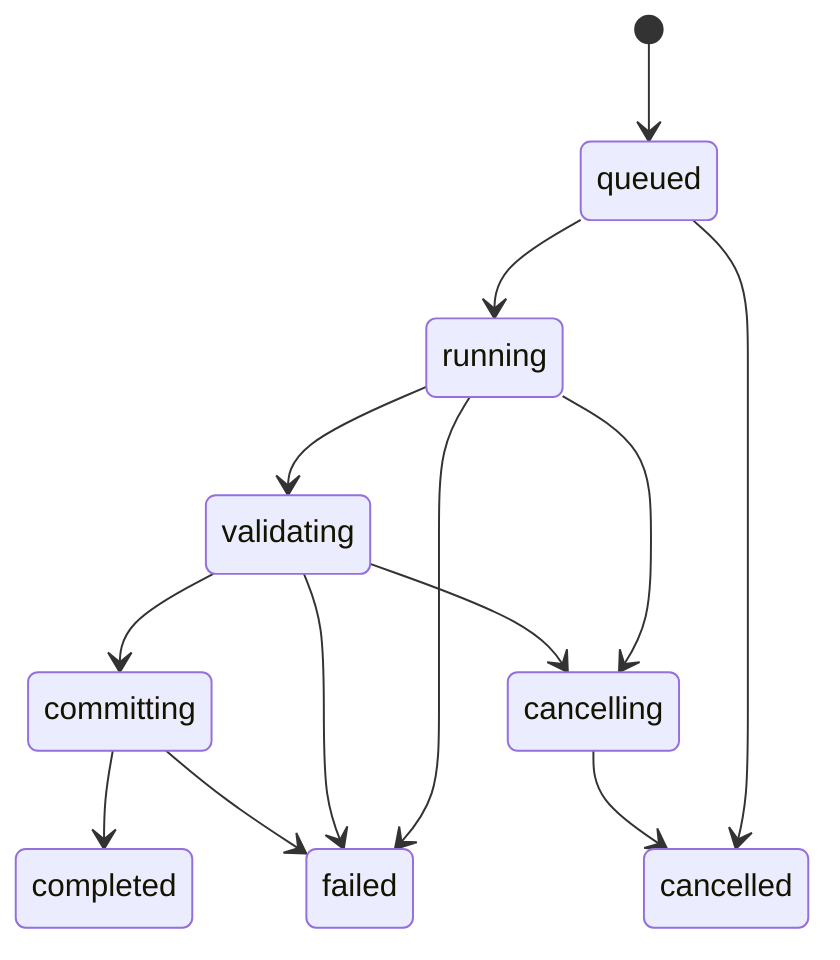

# 原生运行、文件与交互契约

## 2026-10-02 相机状态项目与后端契约补充

schema19新增cameraExposure，严格六字段algorithm／profileID／recordedISO／stopCorrection／source／inputPolicy；算法版本表及计划／批次指纹包含身份。未知、缺失、错配及exposureStops位模式不一致拒绝。schema1–18偷带相机字段或版本拒绝；合法历史读取camera为nil，不回写原文件。真实schema18冻结manifest在Debug／Release读取前后SHA一致。

文稿相机选择／完整状态／ISO／stop编辑要求当前revision；失败原子，保留资产／批次及历史。settings helper保留相机，曝光批次替换source为batchOverride而不改ISO。选择才应用默认，随后显式编辑输入可保持；LogC参数复制保留相机。无控件或UI验收。默认公开27／66、旧兼容18／66；未支持默认不等于研究阻塞。证据见[相机后端验收](native-validation/2026-10-02-camera-state.md)。

日期：2026-09-23。配套：[数值契约](native-swift-numeric-contracts.md)、[实施交接入口](native-swift-handoff.md)。这里给出工程默认方案；不是已经完成的实现。

## 1. 状态和任务身份

每个文档有独立 `DocumentSession`（主线程/主 actor），持有可编辑设置及 `revision: UInt64`。每次已提交的语义修改递增 revision；输入框暂未完成的负号/小数点不是有效设置，不触发生成。

预览请求携带 `documentID, revision, requestID, planVersion`；结果只有四者仍匹配才提交到 UI。取消旧任务是节省计算，**检查身份才是防止旧结果覆盖新结果的正确性保证**。关闭文档使会话失效；旧任务返回也不能更新其他窗口。

导出创建不可变快照，与预览任务分开；修改设置不会改变正在导出的内容。导出报告保存请求时的设置，不读取当前 UI。

### 1.1 导出状态机



状态转换由单个 job coordinator actor 管理。终态只能产生一次。`completed` 必须表示目标文件提交成功；后台计算完成、写到临时文件、进度条 100% 都不足以宣告成功。

`validating→committing` 是取消的明确边界，进入前在 coordinator 内最后检查取消。进入后本次提交操作按完成/失败结束，不再返回“已取消但实际已经替换”。UI 在该短暂阶段标记“正在保存”。不能先 await 其他操作再使用过期的取消检查结果。

Swift 任务取消是协作式：在块开始、每隔固定样本批次、写块之前及提交边界检查；通过 [Task.checkCancellation](https://developer.apple.com/documentation/swift/task/checkcancellation()) 或等价令牌传播。不能仅删除 UI 的进度条。

## 2. 分块、确定性和内存

### 2.1 默认实现

先做标量单线程流式生成，再做有界并发；暂不引入 GPU 导出。初始 `blockNodes=4096`、最多 2 个计算 worker，作为可调整工程起点。文件写入只有一个 owner。

每块为 `[startIndex,endIndex)`，与色彩算法无关。通过全局节点索引反推 r/g/b，处理请求的固定计划。每个 worker 独占缓冲区和求解暂存；共享的曲线/矩阵/参数必须不可变。

保存结果的顺序按 blockIndex。调度器只允许距 `nextWriteIndex` 不超过 `2*workerCount` 的有限窗口启动；不能“某块卡住，后面完成一个就无限补发一个”。这样乱序缓存也有硬上限。

### 2.2 预算模型

```text
单个 RGB Double 体积 = 24*N^3 字节
单个块 = 24*blockNodes 字节
任务总预算 = 活动块 + 有界乱序缓存 + 序列化缓冲
           + 算法暂存 + 用户导入 LUT + 预览缓存 + 固定元数据
```

65³ 原始 RGB Double 为 6,591,000 字节；129³ 为 51,520,536 字节。多个中间整 cube 会成倍增长，文本 `String` 的实际内存还会更多。不得根据原始 cube 字节数宣称整个任务只占这些内存。

对每个任务先计算 checked integer 大小及预算；资源不足降低并发/块尺寸或明确失败，不能自动从 65³ 改成 33³，不能改成 Float。预览缓存优先回收。批量任务逐文件受控提交，不把所有结果攒到内存。

### 2.3 确定性

同一环境内，1/2/4 worker、块尺寸 1/17/4096、逆序完成调度都应产生相同节点和同样序列化内容（报告时间戳除外）。进度按**唯一已完成或已写节点数**计算，重试不重复计数。

误差统计固定按样本全局顺序归并；最大值相等时取最小索引。RMS 等归约采用固定次序，不能直接依赖 TaskGroup 的返回顺序。性能优化必须记录内存/耗时证据，不提前承诺快几倍。

## 3. 文本与二进制格式

### 3.1 CUBE 解析器先单独完成

逐行状态机：`header → samples → end`，保留行号。明确支持的方言：基本单一 1D/3D、相应 domain/input range 指令；后续组合 shaper+3D 作为独立能力，首版遇到混合声明返回 unsupported，不能只认最后一个 SIZE。

- 标题使用完整 quoted string；忽略空行及注释。数值接受 ASCII 小数、科学计数法和正负号，须完整消费 token，接受 `.25`、`+0.5`；拒绝 `0x`、NaN、Infinity、逗号小数与多余通道。
- 每行恰好三个有限通道；合法负值和超 1 值不得被裁剪。
- SIZE 必须为允许的整数且至少为 2；3D 要在 checked multiplication 后获得 `N^3`。验证设备/格式能力和内存预算后才分配。
- 节点行数必须恰等于声明值；缺行/多行/错误行均拒绝，不能补零、截断或跳过错误数字。
- `DOMAIN_MIN/MAX` 各三个有限数且每通道 min<max；冲突/重复关键声明拒绝并报告行号。未知有语义的指令必须明确 unsupported，普通注释除外。
- 参数化资源上限：初始文件读取上限 256 MiB、解码 RGB 数组预算 64 MiB；这是保护默认值，可按已支持格式与设备预算调整。超预算返回 `resourceLimit`，不静默重采样。巨大 SIZE 在缺行之前优先报告资源限制。
- 不使用正则一次吞完整大文件；标题/注释不得执行成代码。

[8 个文件样例和预期](../tests/fixtures/native-contracts/parser-contracts.json)包含有效扩展域、缺行、多行、非有限、非法维度、反向域、超大维度及错误数值。生成器与数值夹具共用；Swift 测试读取文件并断言 error category，不能只用 `throws` 掩盖错误原因。

### 3.2 序列化与 `.labin`

高保真 CUBE 输出选择能正确往返 Double 的十进制表示，固定 `.`、UTF-8、LF；不经过本地化 `NumberFormatter`。负零统一输出 `0`，其他有限值必须往返；目标方言不接受科学计数法时使用专门转换策略并验证读回。NaN/Infinity 直接失败。

固定小数模式只能作为有命名的兼容选项；报告精度损失。整数格式逐个定义有效范围、量化比例、取整规则和端序，禁止依赖 `Int(Double)` 截断。旧 JS `Math.round` 的负半整数行为不等同于所有 Swift rounding rule，应以格式契约明确复现或有版本修正。

旧 `.labin` 样本使用约 `2^30` 比例的 Int32，并在写出时将超出 ±1.99 的值压到有限边界；矩阵比例另有不同。**它不能作为原生项目内部的无损数值容器。** 导出旧格式应在写入前报告超域，默认拒绝有损溢出；若增加兼容裁剪选项，必须显式选择并记录损失。字节读写使用固定 little-endian 安全解码，不能假设 Data 内存对齐。

### 3.3 两种“原子”不要混淆

单文件导出：在目标目录/目标卷允许的位置创建随机、由本任务拥有的临时文件；顺序写出→关闭→核对字节数/内容→平台文件服务提交。已有目标只有在用户已授权覆盖时替换。权限、空间、文件协调或提交失败都保留旧目标，清理仅限该任务临时文件。

iCloud/File Provider 的行为需要真实平台验证，不能把本地 rename 的语义直接当作全平台保证。平台服务提供 `prepare/write/validate/commit/abort` 接口，数值内核不处理 URL 授权。

### 2026-10-04 本地文件 fingerprint 读取一致性补充

`LocalFileCommit.fingerprint` 的设备、inode 和字节 SHA-256 必须来自同一个已打开 regular file；不得先按路径取 inode 再用另一次打开读出不同对象的字节。当前入口使用 `lstat` 识别路径对象，`open` 的 `O_NOFOLLOW` 拒绝末端符号链接，`O_NONBLOCK` 避免晚到 FIFO 阻塞打开，`O_CLOEXEC` 不把描述符遗留给 exec。随后从同一描述符 `fstat`、按原有 1 MiB 块读取，读取后再核对描述符／路径对象的 device、inode、mode、size、mtime、ctime 和实际字节数；可观察变化明确失败。错误路径关闭描述符，不写入或清除竞争方文件。

正常 regular file 保留 `device:inode:sha256` 字符串格式，已有 checkpoint 的正常身份不需要迁移；不再以缺失属性默认为 0。确定性打开前／打开后等字节 inode 替换、晚到 symlink、读中原位写入、读后截断、非 regular 拒绝、异常关闭和独立 `/bin/mv` 进程替换已有阶段证据。详见[文件 fingerprint 稳定性验收](native-validation/2026-10-04-fingerprint-stability.md)。

这只约束本轮可观察的读取一致性，不是路径 compare-and-swap、任意并发写入的数学快照保证或 File Provider 平台验收。哈希返回以后至最终替换的非协作写入、祖先目录变化、提供商特殊时间戳／授权／生命周期、断电和磁盘故障矩阵仍须独立解决和验收。H08/H12/FULL-08 及 Goal 保持 active。

批量导出默认**每个文件独立提交**；取消可能留下此前已完成文件，报告逐项状态。不宣称整批全有或全无，也不在取消时删除此前成功文件。

## 4. 项目、注册表和升级

- 稳定 ID 使用语义名称与版本，例如 `dji.dlog2.v1`，永不保存数组位置作为身份。显示名称可翻译，ID 不翻译。
- 注册项必须区分 `analytic`、`userProvidedLUT`、`blockedResearch`。厂商资料采样表不得作为 `analytic` 登记；无公式/资料冲突项目在研发台账保留，产品不得伪装可用。
- 相机预设只引用已有曲线/色域和有出处的参数；ISO 改变是否重编译按该算法的参数依赖声明，不能所有机型都套 ARRI EI 行为。
- 项目包含 `schemaVersion, engineVersion, algorithmVersions, settings, assetHashes`；内置变换保存 ID/参数，只有用户资源可携带 LUT 文件。
- 原生 `.lutcalc` 当前写出 schema 24，在纯函数边界校验版本、字段、算法 ID 和显式资源角色。原生 schema 1–23 按各版本已验证的明确规则迁移到内存模型（schema 24 批次 flavor 规则见第 9 节）；ASC-CDL 只允许从 schema 4 起出现，SDR Saturation 从 schema 5 起，Multitone 从 schema 6 起，Black Gamma 从 schema 7 起，黑白电平从 schema 8 起，Knee 从 schema 9 起，Highlight Gamut 从 schema 10 起，Gamut Limiter 从 schema 11 起，缺失算子配置仍为 `nil`。批次预设从 schema 16 起，原生 schema 1–15 缺失为 nil，旧 schema 偷带字段／身份拒绝；不保存目录或覆盖授权。Final Output 从 schema 15 起；原生 schema 1–14 缺失为 nil，旧范围语义保留，disabled 仍保存算法版本。严格字段、未知模式／身份及旧 schema 偷带新配置拒绝；文稿输入／输出 gamma 编辑、请求与撤销保留配置。False Colour 从 schema 14 起，usage 显式为 exportLUT；原生 schema 1–13 缺失为 nil，非 UI 配置和算法身份保存。显示转换从 schema 13 起；旧 schema 1–12 缺失时保持 nil，schema 12 的 complete v2 输出单位不退回 partial v1。输出码值策略从 schema 12 起；受影响的旧项目迁移为 `native.output-code-units.partial.v1`，新请求默认 `native.output-code-units.complete.v2`，两者身份和已知精度差异须保留。schema 1/2 的用户 LUT 保留既有单位域 1D 线性语义，schema 3 的后置配置、schema 4 的 CDL 与 schema 5 的 SDR、schema 6 的 Multitone 与 schema 7 的 Black Gamma、schema 8 的黑白电平与 schema 9 的 Knee、schema 10 的 Highlight Gamut 与 schema 11 的 Gamut Limiter 配置原样保留。读取不改写源文件。未知版本、缺失角色和未知字段直接拒绝。
- 旧 App 单文件设置和旧 App 项目不属于原生输入，继续拒绝导入；禁止“找不到 ID 就用列表第一项”、猜测资源角色或恢复内置 LUT。算法注册项版本身份写入原生项目，ASC-CDL／SDR Saturation／Multitone／Black Gamma／黑白电平／Knee／Highlight Gamut／Gamut Limiter／显示转换／False Colour／Final Output 即使 disabled 也记录配置的算法版本。输出码值单位身份在相关 settings 与 algorithmVersions 中一致，缺失或错配拒绝；明确读取旧 schema 的迁移不改写源文件。

## 5. 必须写的集成场景

| 场景 | 可观察的验收结果 |
| --- | --- |
| 慢预览 A，快预览 B，A 最后返回 | 只显示 B；A 的错误也不能覆盖 B 的状态 |
| 导出 A 期间修改为 B | 文件与报告都是 A，编辑界面保留 B |
| 两文档使用相同曲线但参数不同 | 互不污染，包括求解器/插值暂存 |
| 在每个块边界取消 | 终态 cancelled；已存在目标字节不变；无任务临时文件泄漏 |
| 验证后、提交前取消 | 最后一次检查阻止提交；提交已开始则按 committing 语义结束 |
| 第 k 块失败/乱序返回 | 不丢块、不重复、不提前 completed；缓存始终受窗口限制 |
| 磁盘满、覆盖未授权、授权失效 | 明确失败，旧目标哈希不变 |
| 打开有用户 LUT 的项目后移动源文件 | 按自包含资源或重定位规则处理，不能自动套用其他 LUT |
| 去掉 research 和旧内置 LUT 后构建/运行 | 所有已实现内置转换仍可用，发布资源允许列表通过 |
| iOS 后台被挂起/终止后重开 | 恢复已保存设置；未完成导出不标为成功；不承诺后台无限运行 |

先用可注入的文件服务、确定性调度器和故障点验证状态机，再做真机文件集成。不要用真实磁盘故障或不稳定 sleep 测试来代替可重复的失败注入。


## 6. 曝光批量后端契约（2026-10-02）

### 2026-10-03 inputShaper 快照和恢复身份补充

`ExposureBatchRequest` 必须将基础请求的 `inputShaper` 完整复制给每个曝光文件，并以插值身份、节点数、domain 和全部 Double 通道位模式绑定批次指纹。有 shaper 的请求增加明确身份段；同时没有 inputShaper 和输入反求时保留既有字节构造。其他格式不能因批次复制而静默丢失 shaper，仍由 `NativeExportService` 在任何输出创建前拒绝。修改 shaper 样本或 domain 后，显式报告和持久化检查点均必须拒绝恢复；已完成文件保持原身份和字节。

八种现有 `LUTExportFormat` 的本地批次与持久化恢复契约已补充，恢复创建新的 coordinator／checkpoint store；真实 provider、设备进程终止、全部参数和目标软件互操作仍须独立验收。完整记录见[批量格式与 shaper 验收](native-validation/2026-10-03-batch-format-shaper.md)。

### 2026-10-03 输入反求内容与恢复身份补充

输入反求计划必须在严格单值 cubic 验证成功后冻结有效 transfer 的内容身份。`ImportedLUTInversePlan.contentFingerprint` 以 `native.input-transfer-inverse-content.v1`、实际插值身份、UInt64 little-endian 节点数、min/max 六个 Double 位模式和全部 RGB 样本位模式产生 SHA-256。选择 `analysisFile.transferLUT` 时绑定这一有效 transfer，而不是外层 colour LUT；不参与求值的 title／来源文字不改变身份。

`ExposureBatchRequest` 有 `inputTransferInverse` 时把该内容哈希作为长度分隔段纳入批次 fingerprint。不同样本／domain／size 即使使用同一插值名、相同 postLUT 也必须拒绝 report 和 durable checkpoint 恢复。旧的有反求检查点因没有绑定有效内容而不继续接受；没有反求且没有 shaper 的旧请求构造保留。该哈希绑定请求数值，不是签名或任意三维逆能力证明。详见[输入反求恢复身份验收](native-validation/2026-10-03-batch-inverse-identity.md)。

`native.exposure-batch-rational.v1` 用整数 tick 与 subdivisions 构建曝光组，支持旧 subdivisions 1–4，默认 -2…2／三分之一 stop；最多 1024 个文件，超过预算明确拒绝，不减少曝光项或网格。Int 乘减溢出、反向区间、非法文件名／重复名称及非法曝光计划在生成请求时拒绝。曝光值替换基础请求的 exposureStops，不累加，不修改源文稿。所有输出计划与用户 LUT 在任务启动前捕获。

批次同一时刻仅运行一个文件；文件内部仍用既有有界任务与单 writer。每个文件独立提交，默认拒绝覆盖；allowOverwrite 显式传递给既有指纹保护的文件 sink，不先删除目标。NativeExportService 的独立单文件默认仍为不覆盖。

报告逐项保存 pending／running／completed／cancelled／failed、实际曝光、文件名、节点数、文件设备／inode／SHA-256 和失败原因。真实 Task 取消在下一文件边界检查；已经返回提交成功的文件先记录 completed，不能被随后取消抹去。报告不是全批原子事务，后续失败／取消不会删除此前成功文件。

报告 schema 1 可用 Codable 保存和重读。显式恢复需要重建同一请求：比对批量算法、设置／计划／域／网格／worker／块／目录／名称／格式／覆盖政策及用户 LUT 样本和 shaper 的请求指纹；先核对全部已完成文件的身份与字节，任何丢失／替换／修改拒绝恢复。之后跳过已完成项，只重试其他项。一个 coordinator 拒绝并发或重复启动，恢复创建新 coordinator。

此前曝光批量阶段只有调用方显式保存报告后的恢复协议。2026-10-02 后续已新增可选择的自动检查点入口和本地 macOS 真实进程恢复，详见下节；来源项目／用户资源自动重新发现、授权书签或真实 File Provider／iOS 后台终止恢复仍欠。报告不是带签名的可信凭证，不能据 Codable 或 SHA-256 声称任意外部输入不可伪造。曝光批量阶段当时项目为 schema 15；后续 schema 16 已保存批次预设，详见第 9 节。详细测试与边界见[曝光批量验收](native-validation/2026-10-02-exposure-batch.md)。

2026-10-02 后续 1D 服务调度工作包已将四条 NativeExportService 路由的 worker／blockNodes 显式传给实际 coordinator；固定长度 SPI1D 1024、ILUT 16384、OLUT／Assimilate 4096 保留，不使用 cubeSize 代替。32 个真实文件在 worker 1／4、块 1／17／4096／Int.max 的完整字节一致；四条强制乱序窗口峰值 8 与真实 Task 取消清理有定向契约。实际记录见[1D 服务阶段验收](native-validation/2026-10-02-oned-scheduling.md)。此条更新此前曝光批量阶段“单通道默认调度”的当前状态，不改写历史证据；设备资源预算与真实提供商仍欠。


## 8. 批量自动检查点与本地进程恢复（2026-10-02）

`ExposureBatchCheckpointStore` schema 1：先持久化 generating 意图，生成到同目录树的专用 staging；记录 staging 的 device／inode／SHA-256、原目标身份和节点数为 prepared 后，再协调发布，最后记录 completed。自动写入独占临时文件、同步数据、原子替换和目录 fsync；owner UUID、完整请求指纹、递增 revision、严格 key／结构／4 MiB 预算必须核对。整个运行持有非阻塞 flock 租约；不同 actor／不同进程不得并行启动同一检查点。

恢复时先核对所有 completed 目标。prepared 意图若目标已经具有 staging 身份，补记完成；原目标与 staging 都未变时才继续提交。generating 无提交证明，只能用新的 UUID 重新生成；旧孤立文件／半成品不自动发布或删除。prepared 未提交时取消保存 cancelled；提交成功后先保存 completed，取消只能阻止后续项。保存失败保留最后落盘事实，不能将内存进展称为持久化成功。

六个 macOS 真实 SIGKILL／独立重启边界、半成品拒绝、同进程／跨进程租约、目标与检查点写入竞争、严格结构／等字节 inode 替换、取消及完整实际文件均有阶段证据，见[检查点验收](native-validation/2026-10-02-batch-checkpoint.md)。本入口要求调用方显式选择 checkpoint 和 resuming，并重建同一请求；不承诺 App 自动重发现、iOS 后台无限运行、真实提供商故障恢复、突然断电或带签名可信凭证。原生项目批次预设后续已接通，安全书签、孤立文件回收、设备预算和全量发布仍欠。

## 9. 批次项目预设与显式请求重建（2026-10-02）

### 2026-10-03 schema 24 与 3DL flavor 补充

当前项目写出 schema 24。`ExposureBatchPreset.threeDLFlavor`、`ExposureBatchRequest.threeDLFlavor` 和 exporter 扩展入口显式传递 Flame／Lustre／Kodak；直接 coordinator 与 durable checkpoint staging 路径都使用同一不可变选择。非 `.3dl` 请求只允许默认 Flame 占位，其他 flavor 明确拒绝。旧 exporter 的默认适配只接受 Flame；非默认选择必须实现扩展入口，否则在调用旧 exporter 前拒绝，不能静默回退。

默认 Flame 不追加 fingerprint 字节段；已冻结的旧默认检查点身份继续一致。Lustre／Kodak 追加 `native.3dl-batch-flavor.v1:<flavor>` 的长度分隔身份段，变更 grammar 时 report／durable checkpoint 恢复必须拒绝。覆盖授权仍为任务输入，新的 exporter 入口显式传递 allowOverwrite，不写入项目授权。

schema 24 的非 nil 预设必须保存 `threeDLFlavor`；三维 3DL 预设的 `algorithmVersions.exposureBatchFormat` 必须为 `native.3dl-batch-flavor.v1`。原生 schema 16–23 缺失该字段的批次预设迁移为 Flame，并在内存补齐格式算法身份；旧 schema 偷带字段或新身份拒绝。schema 1–15 仍不得携带批次预设。严格重复／未知字段、非法 flavor、null、缺少新版本字段及错误算法身份拒绝。读取迁移不改写源文件。详细范围和实际证据见[3DL 批量 flavor 验收](native-validation/2026-10-03-batch-3dl-flavor.md)。

下文 schema 16 记录保留为原始阶段契约；后续 schema 24 字段以上述补充为准。本子集不证明目标软件解释、其他设备布局、任意位宽组合、真实 provider 或全量发布。

schema 16 的可选 `exposureBatchPreset` 保存 `native.exposure-batch-rational.v1`、整数曝光序列、basename、8 格式身份、blockNodes 和 workerCount。使用共用 ExposureBatchSequence／LUTExportFormat，项目层不依赖任务执行。完整文件名 UTF-8 超过 255 字节拒绝；不截断、改网格或改名掩盖冲突。严格字段及每个曝光的 TransformPlan 准备须通过，禁止储存无法计算的预设。

原生 schema 1–15 迁移后该字段为 nil，旧 schema 偷带字段／身份拒绝；实际 schema 15 项目由 ProjectStore 与 ProjectEditingSession 读取前后原始 manifest 字节不变。预设编辑、清除、后端 gamma／用户 LUT 导入与政策修改、撤销／重做均保留其他字段。

`makeStoredExposureBatchRequest(directory:allowOverwrite:)` 从当前项目、内置算法与项目自包含用户资产构造不可变请求；目录和覆盖授权始终是调用方的显式任务输入，不属于项目授权，不自动运行。保存重开后同一数学请求／同一目标／同一政策的指纹保持一致，可显式选择原 checkpoint／resuming；这不证明目标或来源自动发现、安全书签续期、真实提供商或设备后台恢复。证据、独立 CUBE／SPI1D 全点与未覆盖范围见[批次预设验收](native-validation/2026-10-02-batch-project-preset.md)。

## 2026-10-02 接续：Log C scene 项目与后端契约

原生项目 schema 17 新增 `settings.inputLogC`／`settings.outputLogC`，每份载荷只有必需的 `algorithm` 和 `exposureIndex`；`algorithmVersions` 同时保存两槽算法身份。严格校验重复／未知字段、版本错配、缺参和不支持 EI。schema 1–16 无载荷迁移为 nil，旧 schema 偷带载荷、算法版本或新 transfer ID 拒绝；读取不自动写回原项目。

计划身份包含两槽算法及 EI；请求快照固定当时配置，批次指纹随 EI 变化。值复制 helper 保留两槽载荷；换掉曲线只清除对应槽；输出 EI 变化按已有锁定政策重置未锁定的黑白默认锚点。文稿后端 `applyLogCScene` 校验 revision、设置显式曲线／EI并保留批次预设和用户资产，撤销／重做参与原编辑历史。

旧 UI 的字段重建与控件路径未在本包接入或验收，不能由后端测试声称 UI 参数保留。真实提供商授权撤销／替换竞争、来源自动重发现、安全书签和 iPhone 11 后台恢复仍待验收；UI 暂缓不减少最终范围。


## 2026-10-02 接续：AWG3 项目版本

原生schema18接受`arri.awg3.v1`。schema1–17若输入、输出、Highlight Gamut或Gamut Limiter次级（含disabled）引用该色域均拒绝；合法旧项目迁移不自动写回。上一冻结包真实schema17/EI1600项目原字节复制、读取前／后SHA保持一致。文稿后端EI编辑、revision、资产、批次指纹及撤销快照保留；跨色域SPI1D写前以lossyRepresentation拒绝。

完整8个CUBE及文稿磁盘重开是本地程序化验收；UI、设备后台、提供商与签名不由此证明。详见[AWG3阶段](native-validation/2026-10-02-awg3.md)。


## 2026-10-04 接续：项目输入 shaper 资产

schema 25 的 `inputShaper` 仅声明用户资产路径和 `native.project-input-shaper-linear.v1`；单份独立 `inputShaper` 角色与后置 user LUT 角色分开。原始字节／SHA、自包含包、明确线性插值和 Double 域／样本保留；输入反求同时启用、3D 输入、算法／角色错配和未知／重复字段拒绝。schema 1–24 不得偷带新字段／角色／版本，合法旧项目只在内存迁移且不回写。停用保留资产，激活设置进入撤销／重做和不可变请求快照。

文稿与 EditorSession 后端通过相同重建入口提供单项／曝光批量输入 shaper；程序化磁盘读取使用 `.immediate` FileWrapper。3DL 不可表示的域／通道／节点／码值明确失败，其他七种格式在写出前拒绝输入 shaper；不自动改变网格、位宽或曲线采样。完整三 flavor、17³／33³／65³ 两曝光的独立逐码结果见[项目 inputShaper 资产验收](native-validation/2026-10-04-project-input-shaper.md)。该契约不证明旧 UI、第三方软件、真实 provider、后台恢复、设备性能或发布。
